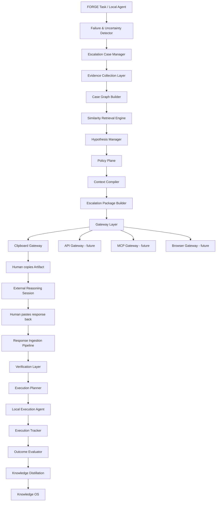
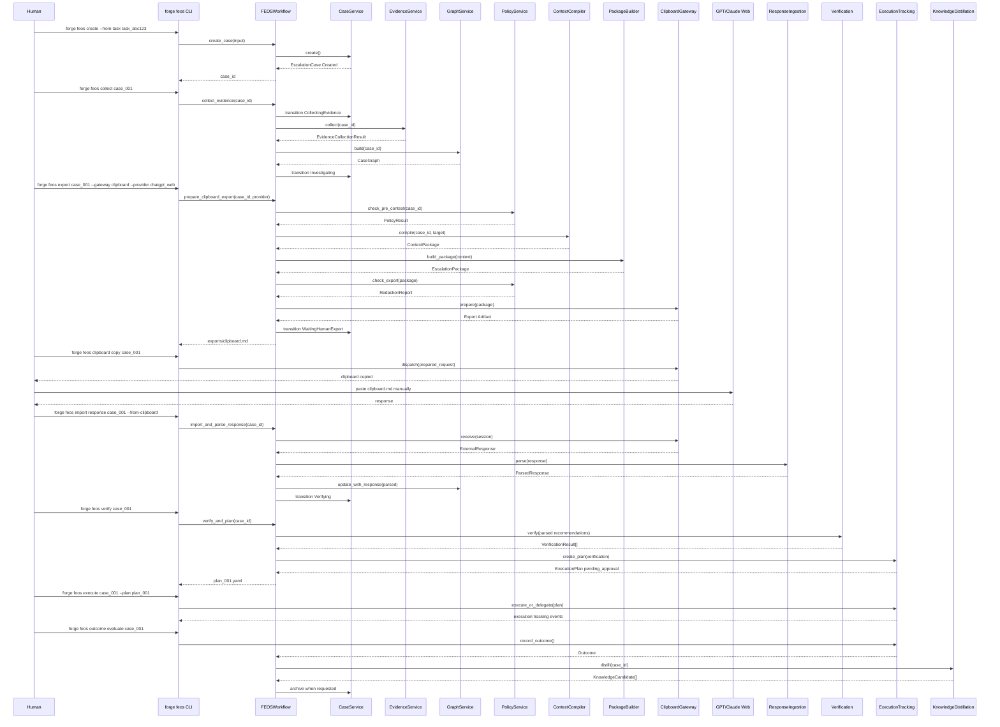
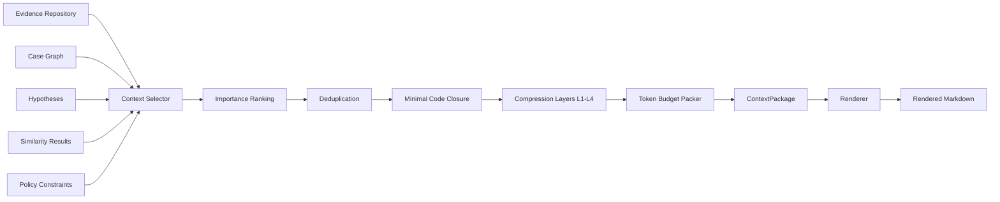
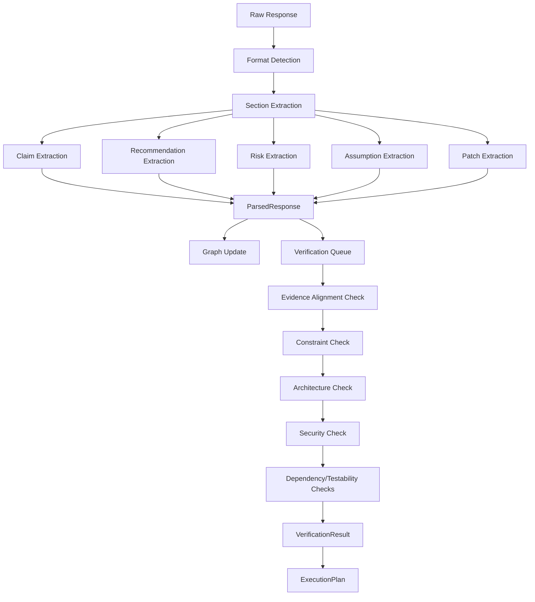
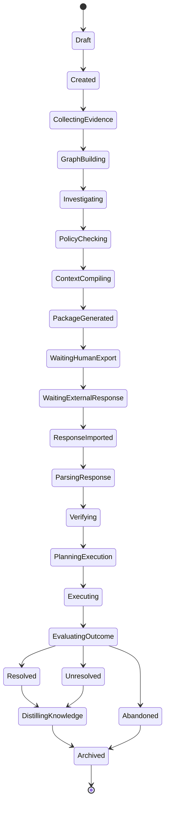

# FEOS_ENGINEERING_DESIGN.md

> 文件定位：FORGE Escalation OS（FEOS）工程实现蓝图  
> 架构事实来源：`FEOS_ARCHITECTURE_FINAL.md`  
> 项目事实来源：`PROJECT_DOSSIER_V4.md`  
> 实施原则：FEOS 作为 FORGE Factory 的增量基础设施模块叠加到现有项目中，优先复用现有 `_infra`、`config`、治理、隐私、RAG、KnowledgeHub、MemoryStore、CLI 与测试能力，不重复建设基础设施。

---

## 0. 工程实现约束

### 0.1 不重新设计架构

本文件只回答工程实现问题：

- 如何组织代码；
- 如何定义模块边界；
- 如何落地数据模型；
- 如何实现接口；
- 如何组织调用链；
- 如何测试与运维。

不得修改以下架构事实：

- FEOS 的核心范式：
  - Case First
  - Evidence First
  - Graph First
  - Context First
  - Verification First
  - Clipboard First, API Ready
  - Human Decision
  - Model Agnostic
  - Knowledge Lifecycle

- FEOS 的 14 个核心子系统；
- Escalation Case 生命周期；
- Clipboard Gateway 是当前正式主流程；
- API / MCP / Browser / Cloud Agent Gateway 是未来备用通道；
- 外部模型建议必须经过本地 Verification 才能进入 Execution Planning；
- FEOS 不直接负责代码编辑、测试运行、强模型推理、Knowledge OS 底层存储和用户最终决策。

### 0.2 工程基线

FEOS 工程实现采用以下成熟模式：

| 模式 | 用途 |
|---|---|
| Ports & Adapters / Hexagonal Architecture | 隔离核心 Case/Graph/Workflow 与 Git、Clipboard、RAG、Privacy、Gateway 等外部能力。 |
| Repository Pattern | 隔离文件系统存储结构与业务逻辑。 |
| Explicit State Machine | 管理 Escalation Case 生命周期和状态转换守卫。 |
| Event Sourcing + Snapshot | `timeline.jsonl` 作为事件审计流，`case.yaml` 作为当前状态快照。 |
| Strategy Pattern | Collector、Renderer、Gateway、Verification Check 可插拔。 |
| Chain of Responsibility | Response Ingestion、Verification Pipeline、Policy Check Pipeline。 |
| Golden File Testing | 验证 `clipboard.md`、`package.json`、解析结果等稳定输出。 |
| Atomic File Write + File Lock | 保证本地文件存储安全、可恢复、可重复执行。 |

### 0.3 技术路线

FEOS 应作为 Python 增量模块实现：

```text
_infra/feos/
```

并与现有项目保持一致：

- 复用 `config/` 作为全局配置 SSOT；
- 复用 `.env` / `_infra/.env` 作为本地密钥文件；
- 复用 `_infra/network/` 中已有 Privacy / RAG / Browser / MCP Guard 能力；
- 复用 `_factory/` 中已有 MemoryStore / KnowledgeHub / patterns / lessons 能力；
- 复用现有 `make docs-check`、`make governance-check`、pytest 测试体系；
- FEOS 运行数据放在项目本地 `.forge/feos/` 下，默认 gitignored；
- 不引入新数据库、新消息队列、新 Web 服务或新框架。

---

# 1. 工程设计概览

## 1.1 FEOS 在现有 FORGE Factory 中的位置

```text
Human / Claude Code / FORGE Task
        │
        ▼
Existing FORGE Workflows / Local Agent / CLI
        │
        ▼
_infra/feos/
        │
        ├── Detector / Case Manager / Evidence / Graph
        ├── Retrieval / Hypothesis / Policy / Context
        ├── Package / Gateway / Response Ingestion
        ├── Verification / Execution Tracking / Distillation
        │
        ▼
.forge/feos/                      # project-local runtime storage
        │
        ├── cases/
        ├── policies/
        ├── renderer_profiles/
        ├── knowledge_index/
        ├── metrics/
        └── cache/
```

FEOS 不替代现有 FORGE 五阶段流程，而是在本地 Agent 遇到失败、不确定性、上下文污染、能力边界时介入。

典型主流程：

```text
FORGE Task / Local Agent
    ↓
FEOS 创建 Escalation Case
    ↓
采集证据、构建 Case Graph
    ↓
编译 Context Package
    ↓
生成 Clipboard Artifact
    ↓
用户手动粘贴到 GPT / Claude
    ↓
用户粘贴外部回复回 FEOS
    ↓
FEOS 解析、验证、计划、跟踪、沉淀知识
```

## 1.2 工程分层

```text
_infra/feos/
├── cli layer
│   └── forge feos / python -m _infra.feos.cli
│
├── workflow layer
│   └── FEOSWorkflow / FEOSFacade
│
├── domain service layer
│   ├── DetectorService
│   ├── CaseService
│   ├── EvidenceService
│   ├── GraphService
│   ├── RetrievalService
│   ├── HypothesisService
│   ├── PolicyService
│   ├── ContextCompilerService
│   ├── PackageBuilderService
│   ├── GatewayService
│   ├── ResponseIngestionService
│   ├── VerificationService
│   ├── ExecutionTrackingService
│   └── KnowledgeDistillationService
│
├── domain model layer
│   └── Case / Evidence / Graph / Package / Response / Verification / Knowledge
│
├── port layer
│   └── Protocol interfaces
│
├── adapter layer
│   ├── git
│   ├── clipboard
│   ├── privacy
│   ├── local_rag
│   ├── knowledge_os
│   ├── command_runner
│   └── forge_task
│
└── repository/storage layer
    └── .forge/feos/ file-backed storage
```

## 1.3 MVP 与未来能力落地方式

FEOS 工程实现应一次性建立完整接口边界，但按架构 Phase 分阶段启用能力。

| 阶段 | 工程实现要求 |
|---|---|
| Phase 1 | 完整实现 Clipboard-first 闭环。API/MCP/Browser/Cloud Gateway 只实现接口骨架和 disabled stub。 |
| Phase 2 | 增强 Hypothesis、Similarity、完整 Policy、Redaction、Observability、Knowledge Lifecycle。 |
| Phase 3 | 在不改核心 Case/Package/Verification 模型的前提下实现 API/MCP/Browser Gateway。 |
| Phase 4 | 扩展多 Agent Investigation、Adaptive Router、Context Compiler 优化等能力。 |

本工程设计重点保证 Phase 1 可稳定落地，同时不阻塞后续 Phase。

---

# 2. 模块划分

FEOS 顶层模块必须对应 `FEOS_ARCHITECTURE_FINAL.md` 中定义的 14 个核心子系统。

## 2.1 核心模块总表

| # | 模块 | 工程包 | 职责 | 输入 | 输出 | 关系 |
|---:|---|---|---|---|---|---|
| 01 | Failure & Uncertainty Detector | `_infra/feos/detector/` | 根据失败、Agent 行为、上下文健康、任务元数据计算 escalation score。 | 执行失败、日志、测试结果、Agent plan、任务元数据。 | `DetectorResult`、建议创建 Case 或自动创建 Case。 | 调用 Case Manager 创建 Draft/Created Case。 |
| 02 | Escalation Case Manager | `_infra/feos/case_manager/` | 管理 Case 创建、状态机、状态转换、Timeline、Audit。 | `CreateCaseInput`、状态转换请求。 | `EscalationCase`、`TimelineEvent`。 | 所有模块围绕 Case 读写。 |
| 03 | Evidence Collection Layer | `_infra/feos/evidence/` | 通过 Collector 插件采集客观证据。 | Case、CollectorRequest、repo/task/log/files。 | `Evidence`、raw/normalized evidence。 | 输出进入 Case Graph、Context Compiler、Policy Plane。 |
| 04 | Case Graph Builder | `_infra/feos/graph/` | 构建 Evidence/Fact/Hypothesis/Decision/Action/Outcome 图。 | Evidence、Hypothesis、Parsed Response、Outcome。 | `CaseGraph`。 | 为 Context、Retrieval、Verification 提供结构化事实。 |
| 05 | Similarity Retrieval Engine | `_infra/feos/retrieval/` | 检索历史相似案例、模式、playbook、ADR、工具已知问题。 | Case Graph、错误签名、文件、依赖、自然语言问题。 | `SimilarityResult[]`、`similar_to` edges。 | 优先复用现有 RAG / KnowledgeHub。 |
| 06 | Hypothesis Manager | `_infra/feos/hypothesis/` | 管理候选假设、证据支持/反驳、置信度和验证计划。 | Evidence、Fact、Similar Cases、Agent input。 | `Hypothesis[]`。 | 写入 Graph，供 Context 和 Verification 使用。 |
| 07 | Policy Plane | `_infra/feos/policy/` | 外发前安全、脱敏、预算、审批、模型策略检查。 | Case、Context、Package、目标 Provider。 | `PolicyResult`、`RedactionReport`。 | 必须在 Gateway 前执行。复用现有 Privacy Gateway。 |
| 08 | Context Compiler | `_infra/feos/context/` | 选择、压缩、排序、打包上下文。 | Case Graph、Evidence、Hypothesis、Policy、Renderer Profile。 | `ContextPackage`、rendered context。 | Package Builder 消费。 |
| 09 | Escalation Package Builder | `_infra/feos/package/` | 生成结构化 Escalation Package。 | ContextPackage、目标 Gateway、Provider、PolicyResult。 | `EscalationPackage`、manifest、attachments。 | Gateway Layer 消费。 |
| 10 | Gateway Layer | `_infra/feos/gateways/` | 统一外部 Reasoning Session 通道。Phase 1 实现 Clipboard。 | EscalationPackage。 | Export Artifact、ExternalSession、ExternalResponse。 | Clipboard 主流程，API/MCP/Browser/Cloud 预留。 |
| 11 | Response Ingestion Pipeline | `_infra/feos/ingestion/` | 导入、保存、解析外部回复。 | Raw response markdown/text。 | `ExternalResponse`、`ParsedResponse`、Claims、Recommendations。 | 更新 Graph，进入 Verification Queue。 |
| 12 | Verification Layer | `_infra/feos/verification/` | 验证外部建议是否证据一致、合规、安全、可测试。 | ParsedResponse、CaseGraph、Policy、Constraints。 | `VerificationResult[]`。 | 通过后才能生成 Execution Plan。 |
| 13 | Execution Tracking Layer | `_infra/feos/execution/` | 生成执行计划、审批、跟踪步骤、记录 Outcome。 | VerificationResult、Recommendations、Local Agent events。 | `ExecutionPlan`、`TimelineEvent`、`Outcome`。 | 不直接编辑代码，委托 Local Execution Agent。 |
| 14 | Knowledge Distillation Layer | `_infra/feos/distillation/` | 从 Case 和 Outcome 蒸馏可复用知识。 | Case、Graph、Response、Verification、Outcome。 | `KnowledgeCandidate[]`、distilled knowledge。 | 写入 Knowledge OS Adapter。 |

## 2.2 支撑模块

| 模块 | 工程包 | 职责 |
|---|---|---|
| Domain Models | `_infra/feos/models/` | 定义 Case、Evidence、Graph、Package、Response、Verification 等数据结构。 |
| Repositories | `_infra/feos/repositories/` | 文件系统读写、索引、查询、原子写、文件锁。 |
| Storage | `_infra/feos/storage/` | `.forge/feos/` 路径管理、Blob 存储、Hash、Atomic Writer。 |
| Adapters | `_infra/feos/adapters/` | 适配 Git、Clipboard、Privacy、RAG、KnowledgeHub、Command Runner、FORGE Task。 |
| Renderers | `_infra/feos/renderers/` | Markdown / JSON / MCP message 渲染策略。 |
| Workflow | `_infra/feos/workflows/` | 编排完整 FEOS 调用链，不包含业务决策。 |
| CLI | `_infra/feos/cli.py` | 暴露 `forge feos ...` 与 `python -m _infra.feos.cli ...` 命令。 |
| Observability | `_infra/feos/observability/` | Logging、Metrics、Tracing、Audit。 |
| Defaults | `_infra/feos/defaults/` | 默认 policy、renderer profile、schema 模板。 |
| Tests | `_infra/feos/tests/` | Unit、Integration、Security、E2E、Golden tests。 |

---

# 3. 推荐目录结构

## 3.1 仓库新增目录结构

FEOS 作为 `_infra` 下的增量模块实现，与现有 `_infra/network/` 并列。

```text
.
├── config/
│   ├── feos.yaml                         # FEOS 全局配置 SSOT
│   ├── privacy_policy.yaml               # 复用现有隐私策略
│   ├── canary_tokens.yaml                 # 复用现有 canary token 策略
│   ├── models.yaml                        # 复用现有模型目录
│   └── routing_plans.yaml                 # 复用现有路由计划
│
├── _infra/
│   ├── network/                           # 现有联网、隐私、RAG、Browser、MCP Guard 能力
│   └── feos/
│       ├── __init__.py
│       ├── cli.py                         # python -m _infra.feos.cli
│       ├── facade.py                      # FEOS public internal API
│       ├── bootstrap.py                   # config、storage、service wiring
│       │
│       ├── models/
│       │   ├── __init__.py
│       │   ├── enums.py
│       │   ├── ids.py
│       │   ├── case.py
│       │   ├── evidence.py
│       │   ├── graph.py
│       │   ├── hypothesis.py
│       │   ├── policy.py
│       │   ├── context.py
│       │   ├── package.py
│       │   ├── gateway.py
│       │   ├── response.py
│       │   ├── verification.py
│       │   ├── execution.py
│       │   ├── knowledge.py
│       │   ├── timeline.py
│       │   └── audit.py
│       │
│       ├── ports/
│       │   ├── __init__.py
│       │   ├── collectors.py
│       │   ├── gateways.py
│       │   ├── renderers.py
│       │   ├── repositories.py
│       │   ├── storage.py
│       │   ├── policy.py
│       │   ├── verification.py
│       │   ├── cache.py
│       │   ├── adapters.py
│       │   └── workflow.py
│       │
│       ├── detector/
│       │   ├── __init__.py
│       │   ├── service.py
│       │   ├── scorer.py
│       │   ├── hard_triggers.py
│       │   └── signals.py
│       │
│       ├── case_manager/
│       │   ├── __init__.py
│       │   ├── service.py
│       │   ├── state_machine.py
│       │   ├── transitions.py
│       │   └── validators.py
│       │
│       ├── evidence/
│       │   ├── __init__.py
│       │   ├── service.py
│       │   ├── registry.py
│       │   ├── normalizer.py
│       │   ├── importance.py
│       │   ├── collectors/
│       │   │   ├── __init__.py
│       │   │   ├── git_collector.py
│       │   │   ├── diff_collector.py
│       │   │   ├── code_collector.py
│       │   │   ├── stacktrace_collector.py
│       │   │   ├── log_collector.py
│       │   │   ├── runtime_collector.py
│       │   │   ├── test_collector.py
│       │   │   ├── dependency_collector.py
│       │   │   ├── config_collector.py
│       │   │   ├── environment_collector.py
│       │   │   ├── tool_call_collector.py
│       │   │   ├── mcp_collector.py
│       │   │   ├── prompt_collector.py
│       │   │   ├── agent_plan_collector.py
│       │   │   ├── memory_collector.py
│       │   │   ├── knowledge_collector.py
│       │   │   ├── architecture_collector.py
│       │   │   ├── adr_collector.py
│       │   │   ├── user_input_collector.py
│       │   │   └── previous_attempt_collector.py
│       │   └── parsers/
│       │       ├── __init__.py
│       │       ├── stacktrace_parser.py
│       │       ├── log_excerpt.py
│       │       └── diff_parser.py
│       │
│       ├── graph/
│       │   ├── __init__.py
│       │   ├── service.py
│       │   ├── builder.py
│       │   ├── relation_extractor.py
│       │   ├── graph_serializer.py
│       │   └── graph_queries.py
│       │
│       ├── retrieval/
│       │   ├── __init__.py
│       │   ├── service.py
│       │   ├── feature_extractor.py
│       │   ├── ranker.py
│       │   ├── lexical_retriever.py
│       │   ├── rag_retriever.py
│       │   └── knowledge_index.py
│       │
│       ├── hypothesis/
│       │   ├── __init__.py
│       │   ├── service.py
│       │   ├── generator.py
│       │   ├── confidence.py
│       │   └── validators.py
│       │
│       ├── policy/
│       │   ├── __init__.py
│       │   ├── service.py
│       │   ├── engine.py
│       │   ├── redaction.py
│       │   ├── approval.py
│       │   ├── budget.py
│       │   ├── model_policy.py
│       │   ├── export_policy.py
│       │   ├── security_policy.py
│       │   └── license_policy.py
│       │
│       ├── context/
│       │   ├── __init__.py
│       │   ├── service.py
│       │   ├── compiler.py
│       │   ├── selector.py
│       │   ├── compressor.py
│       │   ├── packer.py
│       │   ├── token_budget.py
│       │   └── section_builder.py
│       │
│       ├── package/
│       │   ├── __init__.py
│       │   ├── service.py
│       │   ├── builder.py
│       │   ├── manifest.py
│       │   ├── attachment_builder.py
│       │   └── output_contract.py
│       │
│       ├── renderers/
│       │   ├── __init__.py
│       │   ├── registry.py
│       │   ├── markdown_renderer.py
│       │   ├── json_renderer.py
│       │   ├── mcp_message_renderer.py
│       │   └── templates/
│       │       ├── clipboard_debug.md.j2
│       │       ├── clipboard_architecture.md.j2
│       │       └── generic_markdown.md.j2
│       │
│       ├── gateways/
│       │   ├── __init__.py
│       │   ├── service.py
│       │   ├── registry.py
│       │   ├── router.py
│       │   ├── clipboard_gateway.py
│       │   ├── api_gateway.py                # Phase 3 disabled stub
│       │   ├── mcp_gateway.py                # Phase 3 disabled stub
│       │   ├── browser_gateway.py            # Phase 3 disabled stub
│       │   └── cloud_agent_gateway.py         # Phase 3 disabled stub
│       │
│       ├── ingestion/
│       │   ├── __init__.py
│       │   ├── service.py
│       │   ├── format_detector.py
│       │   ├── section_extractor.py
│       │   ├── yaml_block_parser.py
│       │   ├── markdown_parser.py
│       │   ├── claim_extractor.py
│       │   ├── recommendation_extractor.py
│       │   ├── risk_extractor.py
│       │   ├── assumption_extractor.py
│       │   ├── patch_extractor.py
│       │   └── action_extractor.py
│       │
│       ├── verification/
│       │   ├── __init__.py
│       │   ├── service.py
│       │   ├── pipeline.py
│       │   ├── checks/
│       │   │   ├── __init__.py
│       │   │   ├── evidence_alignment_check.py
│       │   │   ├── constraint_check.py
│       │   │   ├── architecture_check.py
│       │   │   ├── security_check.py
│       │   │   ├── compatibility_check.py
│       │   │   ├── dependency_check.py
│       │   │   ├── testability_check.py
│       │   │   ├── knowledge_conflict_check.py
│       │   │   └── sandbox_check.py           # optional / disabled by default
│       │   └── risk.py
│       │
│       ├── execution/
│       │   ├── __init__.py
│       │   ├── service.py
│       │   ├── planner.py
│       │   ├── approval.py
│       │   ├── tracker.py
│       │   ├── outcome_evaluator.py
│       │   └── rollback.py
│       │
│       ├── distillation/
│       │   ├── __init__.py
│       │   ├── service.py
│       │   ├── candidate_extractor.py
│       │   ├── lifecycle.py
│       │   ├── knowledge_writer.py
│       │   └── validators.py
│       │
│       ├── repositories/
│       │   ├── __init__.py
│       │   ├── case_repository.py
│       │   ├── timeline_repository.py
│       │   ├── evidence_repository.py
│       │   ├── graph_repository.py
│       │   ├── context_repository.py
│       │   ├── package_repository.py
│       │   ├── session_repository.py
│       │   ├── response_repository.py
│       │   ├── verification_repository.py
│       │   ├── execution_repository.py
│       │   ├── knowledge_repository.py
│       │   └── index_repository.py
│       │
│       ├── storage/
│       │   ├── __init__.py
│       │   ├── workspace.py
│       │   ├── atomic_writer.py
│       │   ├── file_lock.py
│       │   ├── blob_store.py
│       │   ├── path_guard.py
│       │   ├── json_yaml.py
│       │   └── hashing.py
│       │
│       ├── adapters/
│       │   ├── __init__.py
│       │   ├── git_adapter.py
│       │   ├── clipboard_adapter.py
│       │   ├── command_runner_adapter.py
│       │   ├── privacy_adapter.py             # wraps existing _infra.network privacy
│       │   ├── local_rag_adapter.py            # wraps existing local RAG if available
│       │   ├── knowledge_os_adapter.py         # wraps KnowledgeHub / MemoryStore
│       │   ├── forge_task_adapter.py
│       │   ├── mcp_guard_adapter.py            # future Gateway / Policy integration
│       │   ├── browser_adapter.py              # future Browser Gateway integration
│       │   └── token_estimator_adapter.py
│       │
│       ├── workflows/
│       │   ├── __init__.py
│       │   ├── feos_workflow.py
│       │   ├── clipboard_escalation_workflow.py
│       │   ├── response_processing_workflow.py
│       │   ├── execution_closure_workflow.py
│       │   └── workflow_guards.py
│       │
│       ├── observability/
│       │   ├── __init__.py
│       │   ├── logger.py
│       │   ├── metrics.py
│       │   ├── tracing.py
│       │   ├── audit.py
│       │   └── diagnostics.py
│       │
│       ├── cache/
│       │   ├── __init__.py
│       │   ├── memory_cache.py
│       │   ├── disk_cache.py
│       │   └── keys.py
│       │
│       ├── defaults/
│       │   ├── feos.yaml
│       │   ├── policies/
│       │   │   ├── default.yaml
│       │   │   ├── redaction.yaml
│       │   │   └── gateway.yaml
│       │   └── renderer_profiles/
│       │       ├── gpt_markdown_debug.yaml
│       │       ├── claude_markdown_architecture.yaml
│       │       ├── generic_markdown.yaml
│       │       ├── api_json.yaml
│       │       └── mcp_message.yaml
│       │
│       └── tests/
│           ├── unit/
│           ├── integration/
│           ├── security/
│           ├── e2e/
│           ├── golden/
│           └── fixtures/
│
├── scripts/
│   └── diagnostics/
│       └── feos_case_audit.py              # optional diagnostic helper
│
└── docs/
    └── feos/
        ├── README.md
        ├── CLI_USAGE.md
        └── TROUBLESHOOTING.md
```

## 3.2 项目本地运行数据目录

FEOS 运行数据放在项目本地 `.forge/feos/`。

该目录包含敏感证据、外发副本、审计记录和知识候选，默认不得提交 Git。

```text
.forge/
└── feos/
    ├── cases/
    │   └── case_2026_06_30_001/
    │       ├── case.yaml
    │       ├── timeline.jsonl
    │       ├── graph.json
    │       ├── hypotheses.yaml
    │       ├── retrieval/
    │       │   └── similar_cases.yaml
    │       ├── evidence/
    │       │   ├── index.yaml
    │       │   ├── raw/
    │       │   │   ├── ev_stacktrace_001.txt
    │       │   │   ├── ev_toolcall_001.json
    │       │   │   └── ev_diff_001.patch
    │       │   └── normalized/
    │       │       ├── ev_stacktrace_001.yaml
    │       │       └── ev_toolcall_001.yaml
    │       ├── context/
    │       │   ├── ctxpkg_001.yaml
    │       │   └── ctxpkg_001.rendered.md
    │       ├── exports/
    │       │   ├── clipboard.md
    │       │   ├── package.json
    │       │   ├── manifest.json
    │       │   ├── redaction_report.json
    │       │   ├── evidence_index.md
    │       │   ├── audit.json
    │       │   └── attachments/
    │       │       ├── relevant_diff.patch
    │       │       ├── stacktrace.txt
    │       │       └── logs_excerpt.txt
    │       ├── sessions/
    │       │   └── session_clipboard_gpt_001.yaml
    │       ├── responses/
    │       │   ├── resp_001_raw.md
    │       │   ├── resp_001_parsed.yaml
    │       │   └── patches/
    │       │       └── patch_001.diff
    │       ├── verification/
    │       │   └── ver_001.yaml
    │       ├── execution/
    │       │   ├── plan_001.yaml
    │       │   └── outcome.yaml
    │       └── knowledge/
    │           ├── candidates.yaml
    │           └── distilled.yaml
    │
    ├── policies/
    │   ├── default.yaml
    │   ├── redaction.yaml
    │   └── gateway.yaml
    │
    ├── renderer_profiles/
    │   ├── gpt_markdown_debug.yaml
    │   ├── claude_markdown_architecture.yaml
    │   └── generic_markdown.yaml
    │
    ├── knowledge_index/
    │   ├── cases_index.json
    │   ├── failure_patterns.json
    │   └── embeddings/
    │
    ├── metrics/
    │   ├── counters.json
    │   └── events.jsonl
    │
    └── cache/
        ├── token_estimates/
        ├── redaction/
        ├── evidence_hashes/
        └── retrieval/
```

## 3.3 Git 忽略策略

建议在 `.gitignore` 中加入：

```gitignore
# FEOS local runtime data
.forge/feos/cases/
.forge/feos/metrics/
.forge/feos/cache/
.forge/feos/knowledge_index/

# Optional local effective policies/profiles if materialized from defaults
.forge/feos/policies/
.forge/feos/renderer_profiles/
```

全局默认配置应放在：

```text
config/feos.yaml
_infra/feos/defaults/
```

而不是提交 `.forge/feos/cases/`。

---

# 4. 服务边界设计

FEOS 内部服务为本地进程内服务，不是独立微服务。每个服务只能负责本架构定义范围内的职责。

## 4.1 服务边界总表

| 服务 | 负责 | 不负责 | 交互方式 |
|---|---|---|---|
| `DetectorService` | 计算 escalation score，识别 hard triggers。 | 不直接外发，不直接调用外部模型。 | 输入失败信号，输出 `DetectorResult`。 |
| `CaseService` | 创建 Case、状态转换、生命周期守卫、Timeline。 | 不采集证据，不生成 Prompt，不执行代码。 | 通过 Repository 读写 `case.yaml`、`timeline.jsonl`。 |
| `EvidenceService` | 调用 Collector 采集、归一化、打分证据。 | 不主观总结，不生成外发材料。 | 写入 Evidence Repository，返回 evidence ids。 |
| `GraphService` | 从 Evidence/Hypothesis/Response/Outcome 构建 Case Graph。 | 不做向量检索，不做上下文压缩。 | 读 Evidence，写 `graph.json`。 |
| `RetrievalService` | 检索历史相似 Case、模式、ADR、playbook。 | 不创建新知识，不替代 Verification。 | 通过 RAG/KnowledgeHub Adapter 或本地 lexical fallback。 |
| `HypothesisService` | 维护假设状态、置信度、支持/反驳证据。 | 不直接修改代码，不把假设当事实。 | 写 `hypotheses.yaml` 和 Graph 节点。 |
| `PolicyService` | 安全、脱敏、预算、模型、审批、审计策略。 | 不决定业务修复方案，不调用外部模型。 | 复用 Privacy Adapter；输出 PolicyResult。 |
| `ContextCompilerService` | 选择、压缩、排序证据，生成 Context Package。 | 不写最终 Clipboard Artifact，不绕过 Policy。 | 输入 Graph/Evidence/Policy，输出 `ContextPackage`。 |
| `PackageBuilderService` | 生成 Escalation Package、manifest、attachments、output contract。 | 不 dispatch，不复制剪贴板。 | 输入 ContextPackage，输出 Package。 |
| `GatewayService` | 管理 Gateway prepare/dispatch/receive 和 ExternalSession。 | 不解析外部回复，不验证建议。 | 调用具体 Gateway。 |
| `ClipboardGateway` | 生成 clipboard artifact，复制/读取剪贴板，记录人工动作。 | 不自动登录网页，不自动提交外部 AI。 | 使用 `pbcopy`/`pbpaste` 或 Clipboard Adapter。 |
| `ResponseIngestionService` | 保存 raw response，解析为结构化响应。 | 不相信外部建议，不生成执行计划。 | 输入 raw markdown/text，输出 ParsedResponse。 |
| `VerificationService` | 执行 evidence/constraint/security/dependency/testability 检查。 | 不执行代码修改，不自动接受高风险建议。 | 输出 VerificationResult。 |
| `ExecutionTrackingService` | 生成 ExecutionPlan，记录审批、步骤、Outcome。 | 不直接实现代码编辑或测试运行。 | 通过 LocalExecutionAdapter 委托现有 Local Agent/Test Runner。 |
| `KnowledgeDistillationService` | 从已验证 Case 和 Outcome 中抽取知识候选。 | 不直接保存 GPT 原文为知识，不实现 Knowledge OS 存储底层。 | 通过 KnowledgeOSAdapter 写入标准化知识对象。 |
| `ObservabilityService` | Logging、Metrics、Tracing、Audit。 | 不改变业务结果。 | 被所有服务调用，写 metrics/audit/timeline。 |

## 4.2 明确禁止的职责重叠

1. `ContextCompilerService` 不允许直接调用 Gateway；
2. `GatewayService` 不允许跳过 Policy；
3. `ResponseIngestionService` 不允许直接生成已批准的 ExecutionPlan；
4. `ExecutionTrackingService` 不允许绕过 Verification；
5. `KnowledgeDistillationService` 不允许把未验证外部回复直接写入正式 Knowledge OS；
6. `DetectorService` 不允许自动外发；
7. `ClipboardGateway` 不允许自动浏览 GPT/Claude 网页。

---

# 5. 核心抽象与接口设计

FEOS 内部使用 Python `Protocol` + dataclass/enum 模型实现稳定抽象，避免引入新框架。

如现有项目已经有统一配置加载、YAML 工具、日志工具，应优先复用；否则 FEOS 在 `_infra/feos/storage/json_yaml.py` 中提供薄封装。

## 5.1 通用设计约定

### 5.1.1 ID 约定

```text
case_YYYY_MM_DD_NNN
graph_<case_short_id>
ev_<type>_<NNN>
ctxpkg_<NNN>
pkg_<NNN>
session_<gateway>_<provider>_<NNN>
resp_<NNN>
parsed_resp_<NNN>
ver_<NNN>
plan_<NNN>
kc_<NNN>
evt_<NNN>
```

ID 生成由 `models/ids.py` 统一管理，禁止各模块自行拼接。

### 5.1.2 时间与 Hash

- 时间统一使用 UTC ISO-8601；
- 所有外发内容、raw response、raw evidence 必须计算 `sha256`；
- Hash 工具位于 `storage/hashing.py`；
- 内容 Hash 用于审计、缓存失效和重复检测。

### 5.1.3 Result 对象

所有服务方法应返回显式 Result，而不是只抛异常。

```python
@dataclass
class ServiceResult[T]:
    ok: bool
    value: T | None = None
    warnings: list[str] = field(default_factory=list)
    errors: list[str] = field(default_factory=list)
```

异常用于不可恢复错误；业务失败用 Result 表达。

---

## 5.2 Provider / Profile 抽象

FEOS 不绑定具体模型。GPT、Claude、Gemini、Qwen 等均作为 Provider Profile 配置。

```python
@dataclass
class ProviderProfile:
    provider_id: str                 # chatgpt_web / claude_web / openai_api / ...
    gateway: str                     # clipboard / api / mcp / browser / cloud_agent
    renderer_profile: str            # gpt_markdown_debug / claude_markdown_architecture
    risk_level: str                  # low / medium / high
    supports_attachments: bool
    supports_structured_output: bool
    default_token_budget: int
    requires_human_review: bool
```

生命周期：

```text
load from config/defaults
    ↓
validate by PolicyService
    ↓
used by ContextCompiler and GatewayRouter
    ↓
recorded in EscalationPackage and ExternalSession
```

扩展方式：

1. 新增 provider profile YAML；
2. 指定 gateway；
3. 指定 renderer profile；
4. 补充 policy 风险等级；
5. 添加 tests/golden 输出。

---

## 5.3 Adapter 抽象

Adapter 用于接入现有项目能力和系统能力。

```python
class GitAdapter(Protocol):
    def current_commit(self) -> str | None: ...
    def current_branch(self) -> str | None: ...
    def diff(self, paths: list[str] | None = None) -> str: ...
    def status(self) -> str: ...

class ClipboardAdapter(Protocol):
    def copy_text(self, text: str) -> None: ...
    def paste_text(self) -> str: ...

class PrivacyAdapter(Protocol):
    def scan(self, text: str, policy_profile: str) -> PrivacyScanResult: ...
    def redact(self, text: str, policy_profile: str) -> RedactionResult: ...

class KnowledgeOSAdapter(Protocol):
    def search(self, query: str, filters: dict) -> list[KnowledgeHit]: ...
    def write_candidate(self, candidate: KnowledgeCandidate) -> None: ...

class LocalRAGAdapter(Protocol):
    def search_similar(self, query: str, limit: int) -> list[SimilarityResult]: ...
    def index_case(self, case_id: str, documents: list[str]) -> None: ...
```

实现要求：

- `privacy_adapter.py` 必须优先复用 `_infra/network/` 已有 Privacy Gateway / InputSanitizer / redaction 能力；
- `local_rag_adapter.py` 必须优先复用现有 Local RAG；
- `knowledge_os_adapter.py` 必须优先复用 `_factory/` 中已有 KnowledgeHub / MemoryStore；
- 如果某现有能力未启用，Adapter 提供 deterministic fallback，但不得引入新基础设施。

---

## 5.4 Router 抽象

FEOS 不新增架构级 Router，但工程上需要在既有 Gateway Layer / Evidence Layer 内部使用路由器完成策略选择。

### 5.4.1 GatewayRouter

```python
class GatewayRouter:
    def select_gateway(
        self,
        provider_profile: ProviderProfile,
        requested_gateway: str | None,
    ) -> str:
        ...
```

职责：

- 根据 provider profile 选择 Gateway；
- Phase 1 默认只允许 `clipboard`；
- API/MCP/Browser/Cloud Gateway 未启用时返回 disabled 错误；
- 不修改 Package 内容；
- 不绕过 Policy。

### 5.4.2 CollectorRouter

```python
class CollectorRouter:
    def select_collectors(
        self,
        case: EscalationCase,
        request: EvidenceCollectionRequest,
    ) -> list[EvidenceCollector]:
        ...
```

职责：

- 根据 case category、task type、available inputs 选择 Collector；
- 过滤未启用或不适用 Collector；
- 不执行 Collector 本身。

---

## 5.5 Workflow 抽象

Workflow 只编排，不承载业务逻辑。

```python
class FEOSWorkflow(Protocol):
    def create_case(self, input: CreateCaseInput) -> EscalationCase: ...
    def collect_evidence(self, case_id: str) -> EvidenceCollectionResult: ...
    def prepare_clipboard_export(self, case_id: str, target_provider: str) -> ExportResult: ...
    def import_and_parse_response(self, case_id: str, raw_response: str) -> ParsedResponse: ...
    def verify_and_plan(self, case_id: str) -> ExecutionPlan: ...
    def record_outcome_and_distill(self, case_id: str, outcome: OutcomeInput) -> list[KnowledgeCandidate]: ...
```

核心规则：

- Workflow 必须调用 `CaseStateMachine`；
- Workflow 必须写 Timeline；
- Workflow 不得直接操作文件系统，必须通过 Repository；
- Workflow 不得绕过 Policy、Verification、Approval。

---

## 5.6 Service 抽象

每个架构子系统对应一个 Service。

示例：

```python
class ContextCompilerService:
    def compile(self, input: CompileContextInput) -> ContextPackage:
        ...
```

Service 生命周期：

```text
bootstrap config
    ↓
construct repositories/adapters
    ↓
execute command/workflow method
    ↓
persist outputs
    ↓
emit timeline/metrics/audit
```

扩展方式：

- 新能力优先以 Strategy 插件加入现有 Service；
- 不新增顶层架构服务；
- 如果新增顶层职责，必须先补 ADR。

---

## 5.7 Repository 抽象

Repository 负责读写 `.forge/feos/` 文件，不承载业务判断。

```python
class CaseRepository(Protocol):
    def create(self, case: EscalationCase) -> None: ...
    def get(self, case_id: str) -> EscalationCase: ...
    def save(self, case: EscalationCase) -> None: ...
    def list(self, filters: dict | None = None) -> list[EscalationCase]: ...

class TimelineRepository(Protocol):
    def append(self, event: TimelineEvent) -> None: ...
    def list_events(self, case_id: str) -> list[TimelineEvent]: ...

class EvidenceRepository(Protocol):
    def put_raw(self, case_id: str, evidence_id: str, content: bytes, suffix: str) -> str: ...
    def put_normalized(self, evidence: Evidence) -> None: ...
    def list_by_case(self, case_id: str) -> list[Evidence]: ...
```

实现要求：

- 所有写入使用 `AtomicWriter`；
- 所有 Case 级写入使用 `case.lock`；
- 读取路径必须经过 `PathGuard`，防止 path traversal；
- Repository 不应吞掉数据损坏异常；
- `timeline.jsonl` append 失败时，关联业务写入必须失败或回滚。

---

## 5.8 Cache 抽象

Cache 是性能优化，不是事实来源。

```python
class Cache(Protocol):
    def get(self, key: str) -> Any | None: ...
    def set(self, key: str, value: Any, ttl_seconds: int | None = None) -> None: ...
    def invalidate(self, prefix: str) -> None: ...
```

使用场景：

- token estimation；
- evidence content hash；
- redaction result；
- rendered context；
- similarity retrieval result。

缓存失效由内容 hash、policy profile、renderer profile、graph hash 共同决定。

---

## 5.9 Storage 抽象

```python
class FEOSWorkspace:
    repo_root: Path
    feos_root: Path

    def case_dir(self, case_id: str) -> Path: ...
    def ensure_initialized(self) -> None: ...
    def validate_case_path(self, path: Path) -> Path: ...
```

实现规则：

- 默认 `feos_root = <repo_root>/.forge/feos`；
- 支持 `FEOS_HOME` 覆盖；
- 文件权限尽量使用 `0700` / `0600`；
- raw evidence、responses、exports 默认本地保存；
- 不自动清理任何 Case，归档只改变状态和索引。

---

## 5.10 Gateway 抽象

对应架构中的 Gateway Layer。

```python
class EscalationGateway(Protocol):
    def prepare(self, package: EscalationPackage) -> GatewayPreparedRequest: ...
    def dispatch(self, request: GatewayPreparedRequest) -> GatewayDispatchResult: ...
    def receive(self, session: ExternalSession) -> ExternalResponse: ...
    def capabilities(self) -> GatewayCapabilities: ...
```

### ClipboardGateway

Phase 1 必须完整实现。

职责：

- 渲染 `clipboard.md`；
- 写 `package.json`、`manifest.json`、`redaction_report.json`、`evidence_index.md`、`audit.json`；
- 可调用 `ClipboardAdapter.copy_text()`；
- 从剪贴板或 stdin 接收外部回复；
- 创建 ExternalSession；
- 记录 human action。

不负责：

- 自动打开网页；
- 自动登录；
- 自动点击；
- 自动提交；
- 自动执行外部建议。

### Future Gateways

`ApiGateway`、`MCPGateway`、`BrowserAutomationGateway`、`CloudAgentGateway` 在 Phase 1 只提供：

- class skeleton；
- capabilities；
- disabled error；
- tests 确认默认不可用。

---

## 5.11 Collector 抽象

```python
class EvidenceCollector(Protocol):
    collector_id: str
    evidence_types: list[str]

    def can_collect(self, case: EscalationCase, request: EvidenceCollectionRequest) -> bool: ...
    def collect(self, case: EscalationCase, request: EvidenceCollectionRequest) -> list[CollectedEvidence]: ...
```

Collector 实现规则：

- 采集事实，不写总结；
- 每条 evidence 必须有 source、hash、timestamp、quality、security；
- Collector 失败不能默认中断整个 EvidenceService，除非是被配置为 required；
- Collector 不得读取 `.env`、私钥、浏览器 cookie 等敏感文件；
- ConfigCollector 必须使用 allowlist；
- DiffCollector 必须应用大小限制和脱敏前置扫描。

---

## 5.12 Renderer 抽象

```python
class Renderer(Protocol):
    profile_id: str

    def render_context(self, context: ContextPackage) -> str: ...
    def render_package(self, package: EscalationPackage) -> str: ...
```

Phase 1 必须支持：

- `gpt_markdown_debug`
- `claude_markdown_architecture`
- `generic_markdown`

未来支持：

- `api_json`
- `mcp_message`

Renderer 不应自己选择证据；选择由 Context Compiler 完成。

---

## 5.13 Verification Check 抽象

```python
class VerificationCheck(Protocol):
    check_id: str

    def run(
        self,
        case: EscalationCase,
        graph: CaseGraph,
        parsed_response: ParsedResponse,
        recommendation: Recommendation,
    ) -> VerificationCheckResult:
        ...
```

Verification Pipeline 默认顺序：

```text
evidence_alignment
  → constraint_check
  → architecture_check
  → security_check
  → compatibility_check
  → dependency_check
  → testability_check
  → knowledge_conflict_check
  → optional sandbox_check
```

---

# 6. 数据模型设计

## 6.1 核心实体总览

| 实体 | 文件 | 生命周期 |
|---|---|---|
| `EscalationCase` | `case.yaml` | Draft → Archived |
| `TimelineEvent` | `timeline.jsonl` | append-only |
| `Evidence` | `evidence/index.yaml` + `normalized/*.yaml` + `raw/*` | captured → normalized → linked → exported/redacted |
| `CaseGraph` | `graph.json` | rebuilt or incrementally updated |
| `Hypothesis` | `hypotheses.yaml` + graph nodes | Proposed → Confirmed/Rejected |
| `SimilarityResult` | `retrieval/similar_cases.yaml` + graph edges | generated → used/ignored |
| `PolicyResult` | `exports/redaction_report.json` / package metadata | checked → audited |
| `ContextPackage` | `context/ctxpkg_*.yaml` | compiled → rendered → packaged |
| `EscalationPackage` | `exports/package.json` | generated → exported |
| `ExternalSession` | `sessions/session_*.yaml` | started → waiting_response → completed |
| `ExternalResponse` | `responses/resp_*_raw.md` | imported → parsed |
| `ParsedResponse` | `responses/resp_*_parsed.yaml` | parsed → verified |
| `VerificationResult` | `verification/ver_*.yaml` | pending → passed/failed/review |
| `ExecutionPlan` | `execution/plan_*.yaml` | pending_approval → approved/executing/completed |
| `Outcome` | `execution/outcome.yaml` | evaluating → resolved/unresolved/abandoned |
| `KnowledgeCandidate` | `knowledge/candidates.yaml` | captured → verified → indexed → reused/deprecated/archived |

---

## 6.2 EscalationCase

实现字段必须覆盖架构 Schema。

```yaml
id: "case_2026_06_30_001"
title: "MCP tool call fails with schema validation error"
project_id: "forge_factory"
repo_id: "forge-core"
task_id: "task_abc123"

status: "Investigating"
severity: "high"
category: "mcp_issue"
created_at: "2026-06-30T10:30:00Z"
updated_at: "2026-06-30T11:10:00Z"

owner:
  user_id: "local_user"
  agent_id: "local_coding_agent"

problem:
  user_goal: "让 MCP tool call 正常返回结构化结果"
  expected_behavior: "tool call 应通过 schema validation"
  actual_behavior: "调用失败，返回 schema validation error"
  failure_signature: "ValidationError: required field 'result' missing"
  reproduction: "运行 forge agent run mcp-test"

trigger:
  type: "repeated_failure"
  attempts: 3
  local_confidence: 0.42
  escalation_score: 0.81
  reason: "相同异常连续出现，本地 Agent 已尝试三种修复仍失败"

links:
  evidence_graph_id: "graph_case_001"
  package_ids:
    - "pkg_001"
  external_session_ids:
    - "session_clipboard_gpt_001"
  response_ids:
    - "resp_001"

policy:
  sensitivity_level: "internal"
  export_allowed: true
  requires_human_review: true
  redaction_profile: "default_strict"

outcome:
  status: null
  resolution_summary: null
  root_cause: null
  fixed_by: null

audit:
  created_by: "feos.detector"
  last_transition_by: "human"
  external_exports:
    - "export_001"
```

工程约定：

- `case.yaml` 是当前状态快照；
- 状态变化必须同时 append `timeline.jsonl`；
- 如果 `case.yaml` 与 `timeline.jsonl` 冲突，诊断工具应提示人工修复，不能静默覆盖；
- Case ID 目录名必须等于 `case.id`。

---

## 6.3 Case 状态机

状态枚举必须与架构一致，不新增状态：

```text
Draft
Created
CollectingEvidence
GraphBuilding
Investigating
PolicyChecking
ContextCompiling
PackageGenerated
WaitingHumanExport
WaitingExternalResponse
ResponseImported
ParsingResponse
Verifying
PlanningExecution
Executing
EvaluatingOutcome
Resolved
Unresolved
Abandoned
DistillingKnowledge
Archived
```

状态转换由 `CaseStateMachine` 统一管理。

典型守卫：

| 转换 | 守卫 |
|---|---|
| `Created → CollectingEvidence` | Case 存在且未 archived。 |
| `CollectingEvidence → GraphBuilding` | 至少一个 evidence 成功或用户允许低证据升级。 |
| `GraphBuilding → Investigating` | `graph.json` 写入成功。 |
| `Investigating → PolicyChecking` | 已完成本地假设/相似案例检索或被配置为跳过。 |
| `PolicyChecking → ContextCompiling` | Policy 未 block。 |
| `ContextCompiling → PackageGenerated` | ContextPackage 已保存。 |
| `PackageGenerated → WaitingHumanExport` | Export artifact 已生成。 |
| `WaitingHumanExport → WaitingExternalResponse` | 用户确认已复制/外发。 |
| `WaitingExternalResponse → ResponseImported` | Raw response 已保存。 |
| `ResponseImported → ParsingResponse` | response hash 有效。 |
| `ParsingResponse → Verifying` | ParsedResponse 存在，或人工允许低结构化解析。 |
| `Verifying → PlanningExecution` | 至少一个 recommendation 通过或需要人工审查。 |
| `PlanningExecution → Executing` | ExecutionPlan 已审批。 |
| `Executing → EvaluatingOutcome` | 执行动作完成或人工记录结果。 |
| `EvaluatingOutcome → Resolved/Unresolved/Abandoned` | Outcome 已记录。 |
| `Resolved/Unresolved → DistillingKnowledge` | 可蒸馏知识候选。 |
| `DistillingKnowledge → Archived` | Knowledge candidate 已保存或人工跳过。 |

---

## 6.4 Evidence

Evidence 必须区分 raw 和 normalized。

```yaml
id: "ev_stacktrace_001"
case_id: "case_2026_06_30_001"

type: "stack_trace"
subtype: "python_validation_error"

source:
  collector: "StackTraceCollector"
  origin: "runtime_log"
  file: "logs/agent-run.log"
  line_start: 120
  line_end: 158

content:
  raw_ref: "evidence/raw/ev_stacktrace_001.txt"
  text_preview: "ValidationError: required field 'result' missing"
  normalized: {}

metadata:
  timestamp: "2026-06-30T10:31:00Z"
  hash: "sha256:abc..."
  provenance: "captured_from_runtime"
  replayable: true

quality:
  confidence: 0.98
  importance: 0.95
  freshness: 1.0
  completeness: 0.90

security:
  sensitivity: "internal"
  contains_secret: false
  contains_pii: false
  redaction_status: "not_needed"

relations:
  supports:
    - "hyp_schema_mismatch"
  refutes: []
  relates:
    - "ev_toolcall_001"
    - "ev_diff_003"
```

Evidence 生命周期：

```text
collector output
    ↓
raw saved
    ↓
hash calculated
    ↓
normalized YAML saved
    ↓
indexed
    ↓
linked into graph
    ↓
selected/compressed by context compiler
    ↓
redacted copy exported if allowed
```

---

## 6.5 CaseGraph

存储为 JSON，便于后续工具读取。

```json
{
  "id": "graph_case_001",
  "case_id": "case_2026_06_30_001",
  "nodes": [
    {
      "id": "ev_stacktrace_001",
      "type": "Evidence",
      "label": "ValidationError stack trace"
    },
    {
      "id": "fact_missing_result_field",
      "type": "Fact",
      "label": "MCP response lacks required field result"
    },
    {
      "id": "hyp_schema_mismatch",
      "type": "Hypothesis",
      "label": "Tool response schema mismatches MCP contract"
    }
  ],
  "edges": [
    {
      "from": "ev_stacktrace_001",
      "to": "fact_missing_result_field",
      "type": "supports",
      "confidence": 0.98
    },
    {
      "from": "fact_missing_result_field",
      "to": "hyp_schema_mismatch",
      "type": "supports",
      "confidence": 0.85
    }
  ]
}
```

Graph 构建规则：

- Evidence 节点必须引用已有 Evidence ID；
- Fact 节点必须有至少一个 Evidence 支持；
- Hypothesis 可以初始无证据，但必须标记 `Proposed`；
- 外部回复中的 claim/recommendation 进入 Graph 时必须标记来源 response；
- Similarity Retrieval 结果以 `similar_to` 边进入 Graph；
- Outcome 进入 Graph 后可生成 KnowledgeCandidate。

---

## 6.6 ContextPackage

```yaml
id: "ctxpkg_001"
case_id: "case_2026_06_30_001"
token_budget: 24000
estimated_tokens: 18200

target:
  gateway: "clipboard"
  provider: "chatgpt_web"
  renderer_profile: "gpt_markdown_debug"

sections:
  - id: "problem_summary"
    title: "Problem Summary"
    evidence_refs: []
    content_ref: null
    text: "..."
    estimated_tokens: 500

  - id: "top_evidence"
    title: "Top Evidence"
    evidence_refs:
      - "ev_stacktrace_001"
      - "ev_toolcall_001"
    text: "..."
    estimated_tokens: 3000

omitted:
  - evidence_id: "ev_readme_001"
    reason: "low_importance"

policy:
  profile: "default_strict"
  redacted: true
  redaction_report_id: "redaction_report_001"
```

ContextPackage 不是 Prompt。Prompt 只是 Renderer 对 ContextPackage 的一种视图。

---

## 6.7 EscalationPackage

```yaml
id: "pkg_001"
case_id: "case_2026_06_30_001"
created_at: "2026-06-30T11:00:00Z"

target:
  gateway: "clipboard"
  provider: "chatgpt_web"
  renderer_profile: "gpt_markdown_debug"

manifest:
  title: "MCP schema validation failure"
  task_type: "debug"
  severity: "high"
  project: "FORGE Factory"
  repository: "forge-core"

problem:
  user_goal: "Fix MCP tool call schema validation error"
  expected_behavior: "Tool call returns valid MCP response"
  actual_behavior: "ValidationError: required field result missing"
  exact_questions:
    - "What is the most likely root cause?"
    - "Which file or adapter should be changed?"
    - "What minimal fix should be applied?"
    - "What tests should be added?"
    - "What risks should be checked before applying?"

context:
  package_id: "ctxpkg_001"

policy:
  redacted: true
  export_allowed: true
  external_execution_allowed: false

attachments:
  - "attachments/relevant_diff.patch"
  - "attachments/stacktrace.txt"

output_contract:
  expected_format:
    - root_cause_analysis
    - evidence_based_reasoning
    - recommended_fix
    - patch_or_pseudocode
    - validation_steps
    - risks
    - assumptions
    - follow_up_questions
```

---

## 6.8 ExternalSession 与 ExternalResponse

### ExternalSession

```yaml
id: "session_clipboard_gpt_001"
case_id: "case_2026_06_30_001"

gateway: "clipboard"
provider: "chatgpt_web"
model_label: "user_selected_or_unknown"

status: "waiting_response"

package_id: "pkg_001"
export_id: "export_001"
response_ids: []

started_at: "2026-06-30T11:05:00Z"
completed_at: null

human_actions:
  - type: "copied_to_clipboard"
    timestamp: "2026-06-30T11:06:00Z"
  - type: "pasted_to_external_ai"
    timestamp: null
  - type: "pasted_response_back"
    timestamp: null
```

### ExternalResponse

```yaml
id: "resp_001"
case_id: "case_2026_06_30_001"
session_id: "session_clipboard_gpt_001"

source:
  gateway: "clipboard"
  provider: "chatgpt_web"
  model_label: "user_selected_or_unknown"
  pasted_by: "human"
  pasted_at: "2026-06-30T11:30:00Z"

content:
  raw_ref: "responses/resp_001_raw.md"
  hash: "sha256:xyz..."

parse_status: "pending"
```

---

## 6.9 ParsedResponse

ParsedResponse 必须尽量结构化，但允许 parse confidence 低并要求人工复核。

```yaml
id: "parsed_resp_001"
response_id: "resp_001"
case_id: "case_2026_06_30_001"

parse:
  format_detected: "yaml_block_in_markdown"
  confidence: 0.86
  warnings: []

summary:
  text: "The MCP adapter likely returns a raw object instead of the required MCP response wrapper."

root_cause:
  claim: "MCP response adapter misses required result field"
  confidence: 0.86
  supporting_evidence_refs:
    - "ev_stacktrace_001"
    - "ev_toolcall_001"

recommendations:
  - id: "rec_001"
    type: "code_change"
    description: "Wrap tool result into { result: ... } before returning"
    target_files:
      - "src/mcp/adapter.ts"
    confidence: 0.82
    risk_level: "medium"

patches:
  - id: "patch_001"
    format: "diff_or_pseudocode"
    content_ref: "responses/patches/patch_001.diff"

validation_plan:
  commands:
    - "npm test"
    - "npm run test:mcp"
  expected_result: "Schema validation passes"

risks:
  - id: "risk_001"
    description: "Changing response wrapper may break existing callers"
    mitigation: "Add compatibility test"

assumptions:
  - id: "asm_001"
    description: "The MCP SDK expects result field at top level"
    needs_verification: true

follow_up_questions:
  - "Can you show the MCP adapter code?"
```

---

## 6.10 VerificationResult

```yaml
id: "ver_001"
case_id: "case_2026_06_30_001"
recommendation_id: "rec_001"

status: "passed_with_warnings"

checks:
  evidence_alignment:
    status: "passed"
    notes: "Recommendation matches stack trace and tool call evidence."

  constraint_check:
    status: "passed"

  architecture_check:
    status: "passed_with_warnings"
    notes: "Need ensure adapter boundary remains clean."

  security_check:
    status: "passed"

  compatibility_check:
    status: "needs_test"
    notes: "Existing callers may rely on raw object."

risk_level: "medium"

required_human_approval: true

suggested_next_step: "generate_execution_plan"
```

---

## 6.11 ExecutionPlan 与 Outcome

### ExecutionPlan

```yaml
id: "plan_001"
case_id: "case_2026_06_30_001"

source:
  response_id: "resp_001"
  recommendation_ids:
    - "rec_001"

status: "pending_approval"

objective: "Fix MCP response schema validation error"

steps:
  - id: "step_001"
    type: "inspect"
    description: "Inspect MCP adapter return shape"
    target_files:
      - "src/mcp/adapter.ts"

  - id: "step_002"
    type: "edit"
    description: "Wrap returned payload with result field"
    target_files:
      - "src/mcp/adapter.ts"

  - id: "step_003"
    type: "test"
    description: "Run MCP schema validation tests"
    commands:
      - "npm run test:mcp"

rollback:
  strategy: "git_checkout_or_reverse_patch"
  files:
    - "src/mcp/adapter.ts"

approval:
  required: true
  approved_by: null
```

### Outcome

```yaml
case_id: "case_2026_06_30_001"
status: "resolved"

resolution:
  root_cause: "MCP adapter returned unwrapped tool result"
  fix_summary: "Wrapped tool response in { result: payload }"
  files_changed:
    - "src/mcp/adapter.ts"
    - "tests/mcp/adapter.test.ts"

validation:
  commands_run:
    - command: "npm run test:mcp"
      status: "passed"
    - command: "npm test"
      status: "passed"

confidence: 0.93

external_contribution:
  response_id: "resp_001"
  useful: true
  adopted_recommendations:
    - "rec_001"
```

---

# 7. 调用链设计

## 7.1 总体控制流



## 7.2 Clipboard 主流程时序图



## 7.3 Context Compiler 数据流



## 7.4 Response Ingestion 与 Verification 数据流



## 7.5 Case 状态机图



---

# 8. 配置体系设计

## 8.1 配置来源优先级

FEOS 配置加载顺序：

```text
_infra/feos/defaults/feos.yaml
    ↓
config/feos.yaml
    ↓
.forge/feos/policies/*.yaml / renderer_profiles/*.yaml
    ↓
.env / _infra/.env
    ↓
environment variables
    ↓
CLI flags
```

后者覆盖前者。

## 8.2 `config/feos.yaml`

建议新增全局配置文件：

```yaml
feos:
  enabled: true
  home: ".forge/feos"

  defaults:
    gateway: "clipboard"
    provider: "chatgpt_web"
    policy_profile: "default_strict"
    renderer_profile: "generic_markdown"
    token_budget: 24000

  detector:
    auto_create_case_if_score_above: 0.70
    suggest_case_if_score_above: 0.50
    continue_local_if_score_below: 0.50
    hard_triggers:
      - same_error_repeated_2_times
      - tool_call_loop_detected
      - local_agent_declares_no_new_strategy
      - context_window_exceeded
      - security_sensitive_failure
      - architecture_decision_deadlock

  evidence:
    enabled_collectors:
      - git
      - diff
      - stack_trace
      - log
      - runtime
      - test
      - dependency
      - config
      - environment
      - tool_call
      - mcp
      - agent_plan
      - architecture
      - adr
      - user_input
      - previous_attempt
    required_collectors:
      - user_input
    max_raw_evidence_bytes: 1048576
    max_diff_bytes: 262144
    allow_config_files:
      - "config/*.yaml"
      - "pyproject.toml"
      - "package.json"
      - "requirements*.txt"
      - "Makefile"
    deny_files:
      - ".env"
      - "_infra/.env"
      - "*.pem"
      - "*.key"
      - "id_rsa"
      - "cookies*"

  context:
    token_estimator: "heuristic"
    default_budget: 24000
    min_evidence_coverage_rate: 0.70
    compression_order:
      - duplicate_logs
      - old_logs
      - low_importance_evidence
      - background
      - long_code_snippets

  policy:
    privacy_policy_file: "config/privacy_policy.yaml"
    canary_tokens_file: "config/canary_tokens.yaml"
    default_requires_human_review: true
    external_execution_allowed: false
    keep_original_local_only: true
    keep_redacted_copy: true

  gateways:
    clipboard:
      enabled: true
      copy_command: "pbcopy"
      paste_command: "pbpaste"
      audit_level: "full"

    api:
      enabled: false

    mcp:
      enabled: false

    browser:
      enabled: false

    cloud_agent:
      enabled: false

  retrieval:
    enabled: true
    prefer_existing_local_rag: true
    fallback: "lexical"
    max_results: 5

  knowledge:
    write_candidates: true
    write_to_knowledge_os: true
    fallback_local_files: true

  observability:
    log_level: "INFO"
    metrics_enabled: true
    audit_enabled: true
```

## 8.3 Policy 配置

默认 Policy 来自：

```text
_infra/feos/defaults/policies/
```

运行时可 materialize 到：

```text
.forge/feos/policies/
```

核心文件：

```text
default.yaml
redaction.yaml
gateway.yaml
```

`default.yaml` 示例：

```yaml
profile: "default_strict"

security:
  secret_detection: true
  pii_detection: true
  internal_url_redaction: true
  credential_redaction: true
  proprietary_code_policy: "allow_minimal_relevant_snippets"

export:
  export_allowed: true
  attachment_allowed: true
  max_file_size: 262144
  allowed_evidence_types:
    - stack_trace
    - failing_test
    - git_diff
    - tool_call_trace
    - mcp_call_trace
    - config
    - dependency_lock
    - runtime_env
    - architecture_doc
    - agent_prompt
    - previous_attempt

model:
  allowed_providers:
    - chatgpt_web
    - claude_web
    - generic_external_ai
  preferred_provider: "chatgpt_web"

budget:
  max_tokens: 24000
  max_rounds: 3
  max_external_sessions: 3

approval:
  require_user_review: true
  require_security_review: false
  require_architect_review: false

audit:
  record_export_content_hash: true
  keep_redacted_copy: true
  keep_original_local_only: true
```

## 8.4 Renderer Profile 配置

默认 profiles：

```text
_infra/feos/defaults/renderer_profiles/
```

示例 `gpt_markdown_debug.yaml`：

```yaml
id: "gpt_markdown_debug"
gateway: "clipboard"
provider: "chatgpt_web"
style: "concise_structured"
output_format: "markdown_sections"

sections:
  - role
  - task
  - project_context
  - problem
  - exact_questions
  - relevant_facts
  - evidence
  - failed_attempts
  - constraints
  - required_response_format

required_response_format: "yaml"
```

## 8.5 环境变量

| 环境变量 | 用途 | 默认值 |
|---|---|---|
| `FEOS_HOME` | 覆盖 `.forge/feos` 目录 | `.forge/feos` |
| `FEOS_CONFIG` | 覆盖 `config/feos.yaml` 路径 | `config/feos.yaml` |
| `FEOS_LOG_LEVEL` | 日志级别 | `INFO` |
| `FEOS_DEFAULT_PROVIDER` | 默认 provider | `chatgpt_web` |
| `FEOS_DEFAULT_GATEWAY` | 默认 gateway | `clipboard` |
| `FEOS_CLIPBOARD_COPY_CMD` | copy 命令 | `pbcopy` |
| `FEOS_CLIPBOARD_PASTE_CMD` | paste 命令 | `pbpaste` |
| `FEOS_ENABLE_API_GATEWAY` | 是否启用 API Gateway | `false` |
| `FEOS_ENABLE_BROWSER_GATEWAY` | 是否启用 Browser Gateway | `false` |

未来 API Gateway 的密钥只允许放在 `.env` 或 `_infra/.env`，禁止提交：

```env
FEOS_OPENAI_API_KEY=
FEOS_ANTHROPIC_API_KEY=
FEOS_GEMINI_API_KEY=
```

Phase 1 不需要任何外部 API key。

## 8.6 多环境支持

| 环境 | 配置 |
|---|---|
| Local | 默认 `.forge/feos`，启用 Clipboard Gateway。 |
| Test | 使用临时目录 `tmp_path/.forge/feos`，禁用真实 clipboard，使用 FakeClipboardAdapter。 |
| CI | 不调用外部模型，不访问真实剪贴板，运行 unit/integration/security/golden tests。 |
| Future API | 显式启用 API Gateway，配置密钥、预算、熔断策略。 |

---

# 9. 错误处理体系

## 9.1 异常分类

```python
class FEOSError(Exception): ...

class ConfigError(FEOSError): ...
class ValidationError(FEOSError): ...
class StateTransitionError(FEOSError): ...
class RepositoryError(FEOSError): ...
class StorageError(FEOSError): ...
class EvidenceCollectionError(FEOSError): ...
class PolicyViolationError(FEOSError): ...
class RedactionError(FEOSError): ...
class ContextCompilationError(FEOSError): ...
class PackageBuildError(FEOSError): ...
class GatewayError(FEOSError): ...
class ClipboardUnavailableError(GatewayError): ...
class UnsupportedGatewayError(GatewayError): ...
class ResponseIngestionError(FEOSError): ...
class ResponseParseError(FEOSError): ...
class VerificationError(FEOSError): ...
class ExecutionApprovalError(FEOSError): ...
class KnowledgeDistillationError(FEOSError): ...
```

## 9.2 错误处理原则

| 场景 | 处理 |
|---|---|
| 配置缺失 | 使用 defaults；关键配置缺失则 fail fast。 |
| Case 状态非法 | 抛 `StateTransitionError`，不写业务文件。 |
| 单个非 required Collector 失败 | 记录 warning，继续采集其他证据。 |
| required Collector 失败 | EvidenceService 返回失败，Case 保持当前状态。 |
| Policy block | 不生成外发 artifact；记录 audit；Case 停在 `PolicyChecking`。 |
| Redaction 失败 | 禁止 export。 |
| Clipboard copy 失败 | 保留 `clipboard.md`，提示用户手动复制。 |
| Response parse 失败 | 保存 raw response，parse_status=failed，要求人工处理。 |
| Verification failed | 不生成可执行计划或生成 rejected plan。 |
| Human approval missing | 不进入 Executing。 |
| Knowledge write 失败 | 不影响 Case resolution，但记录 warning 和 retry hint。 |

## 9.3 重试策略

| 操作 | 重试 |
|---|---|
| Git/status/diff collector | 1 次重试，短 backoff。 |
| 文件读取 | 不盲目重试；路径或权限错误直接失败。 |
| Atomic write | 临时文件写失败不重试；rename 失败可重试 1 次。 |
| Clipboard copy/paste | 不自动重试，提示人工操作。 |
| Local RAG search | 失败后 fallback lexical retrieval。 |
| Knowledge OS write | 失败后保存本地 candidate，后续可手动重试。 |
| Future API Gateway | 指数退避 + 熔断，默认 disabled。 |

## 9.4 超时策略

| 模块 | 默认超时 |
|---|---:|
| 单个 Collector | 10s |
| Git diff | 15s |
| Log parsing | 10s |
| Context compile | 30s |
| Redaction scan | 30s |
| Similarity retrieval | 10s |
| Clipboard operation | 5s |
| Response parse | 20s |
| Verification static checks | 30s |
| Optional sandbox check | 配置控制，默认关闭 |

所有 timeout 必须记录到 Timeline 和 Metrics。

## 9.5 降级策略

| 模块 | 降级 |
|---|---|
| Token estimator | 优先现有 tokenizer；不可用时使用 heuristic。 |
| Privacy Adapter | 优先现有 Privacy Gateway；不可用时使用严格 regex redaction fallback。 |
| Local RAG | 不可用时 lexical retrieval。 |
| Knowledge OS write | 不可用时写本地 `knowledge/candidates.yaml`。 |
| Clipboard copy | 不可用时输出文件路径，让用户手动复制。 |
| Structured response parse | 解析失败时保留 raw response，人工复核。 |

## 9.6 熔断策略

Phase 1 Clipboard Gateway 不需要网络熔断。

未来 Gateway 统一使用 Gateway Layer 熔断策略：

```yaml
circuit_breaker:
  failure_threshold: 3
  recovery_after_seconds: 300
  half_open_max_attempts: 1
```

优先复用 `_infra/network/` 中已有 Circuit Breaker 模式。

---

# 10. 日志与可观测性设计

## 10.1 Logging

使用现有 Python logging 风格，输出结构化字段。

必备字段：

```yaml
timestamp:
level:
component:
case_id:
trace_id:
operation:
status:
duration_ms:
actor:
message:
```

示例：

```json
{
  "timestamp": "2026-06-30T11:06:00Z",
  "level": "INFO",
  "component": "feos.gateway.clipboard",
  "case_id": "case_2026_06_30_001",
  "trace_id": "case_2026_06_30_001/export_001",
  "operation": "clipboard_export",
  "status": "success",
  "duration_ms": 142,
  "actor": "human",
  "message": "Clipboard artifact generated"
}
```

不得在日志中输出：

- raw secret；
- raw `.env`；
- browser cookie；
- private key；
- 未脱敏外发内容全文。

## 10.2 Metrics

写入：

```text
.forge/feos/metrics/counters.json
.forge/feos/metrics/events.jsonl
```

必须记录架构定义的指标：

```yaml
case:
  - cases_created_total
  - cases_resolved_total
  - cases_unresolved_total
  - average_case_duration
  - average_time_to_external_response
  - average_time_to_resolution

escalation:
  - escalation_trigger_count
  - false_escalation_rate
  - avoided_escalation_by_similarity_retrieval
  - external_rounds_per_case

context:
  - context_tokens_estimated
  - compression_ratio
  - evidence_coverage_rate
  - omitted_high_value_evidence_count

gateway:
  - clipboard_exports_total
  - clipboard_imports_total
  - api_exports_total
  - mcp_exports_total
  - provider_success_rate

verification:
  - recommendations_parsed_total
  - recommendations_passed_verification
  - recommendations_rejected
  - high_risk_recommendations

knowledge:
  - knowledge_candidates_created
  - knowledge_items_verified
  - knowledge_reuse_count
  - knowledge_deprecated_count
```

实现要求：

- Metrics 更新是 best-effort；
- Metrics 失败不得影响主流程；
- label 保持低基数，不记录完整路径和 raw text。

## 10.3 Tracing

FEOS 不引入新 tracing 基础设施，但所有 TimelineEvent 和日志必须带 `trace_id`。

推荐 trace_id：

```text
<trace_scope>/<case_id>/<operation_id>
```

示例：

```text
feos/case_2026_06_30_001/export_001
feos/case_2026_06_30_001/resp_001_parse
feos/case_2026_06_30_001/ver_001
```

## 10.4 Audit

必须审计：

| 事件 | 文件 |
|---|---|
| Case 创建 | `timeline.jsonl` |
| 状态转换 | `timeline.jsonl` |
| Evidence 采集 | `timeline.jsonl` |
| Policy check | `timeline.jsonl` + `redaction_report.json` |
| Export | `exports/audit.json` |
| Clipboard copy | `timeline.jsonl` |
| Response import | `timeline.jsonl` |
| Verification result | `verification/ver_*.yaml` |
| Human approval | `timeline.jsonl` + `execution/plan_*.yaml` |
| Outcome | `execution/outcome.yaml` |
| Knowledge distillation | `knowledge/candidates.yaml` |

Export audit 示例：

```yaml
export_id: "export_001"
case_id: "case_2026_06_30_001"
gateway: "clipboard"
provider: "chatgpt_web"

exported_at: "2026-06-30T11:06:00Z"
exported_by: "human"

content_hash: "sha256:exported..."
redacted: true

redaction_report:
  secrets_removed: 2
  pii_removed: 0
  internal_paths_redacted: 4

user_confirmed: true
```

## 10.5 排查流程

标准排查顺序：

```text
1. 查看 case.yaml 当前状态
2. 查看 timeline.jsonl 最近事件
3. 查看 exports/audit.json 或 redaction_report.json
4. 查看 responses/*_parsed.yaml 的 parse warnings
5. 查看 verification/ver_*.yaml
6. 查看 metrics/events.jsonl
7. 如需要，运行 scripts/diagnostics/feos_case_audit.py
```

---

# 11. 缓存设计

## 11.1 缓存层级

| 层级 | 位置 | 内容 | 事实来源 |
|---|---|---|---|
| In-memory cache | 当前进程 | 配置、renderer profile、token estimate | 否 |
| Disk cache | `.forge/feos/cache/` | token、redaction、retrieval、evidence hash | 否 |
| Knowledge index | `.forge/feos/knowledge_index/` | 历史 case/pattern 索引 | 否，原始知识仍在 Case/Knowledge OS |
| Existing Local RAG | 现有 `_infra/network/` RAG | similarity retrieval | 否 |

## 11.2 缓存 Key

| 缓存 | Key |
|---|---|
| Token estimate | `sha256(text) + renderer_profile + provider` |
| Redaction result | `sha256(text) + policy_profile + policy_version` |
| Context package | `graph_hash + policy_hash + renderer_profile + token_budget` |
| Similarity result | `case_signature_hash + knowledge_index_version` |
| Evidence hash | `source_path + mtime + size + git_commit` |

## 11.3 失效策略

| 事件 | 失效 |
|---|---|
| Evidence 新增/修改 | context、graph、token、retrieval cache |
| Policy 修改 | redaction、context、export cache |
| Renderer Profile 修改 | rendered context、clipboard artifact |
| Knowledge index 更新 | retrieval cache |
| Case 状态进入 Archived | 保留缓存直到手动清理 |
| raw evidence 删除或不可读 | 相关缓存必须视为 invalid |

## 11.4 更新策略

- Cache 写入失败不影响主流程；
- Cache 读取失败视为 miss；
- Cache 不保存未脱敏 secrets 的跨 case 可复用副本；
- redaction cache 只保存本地结果，不作为外发依据；
- Export artifact 每次生成必须重新计算 audit hash。

---

# 12. 测试策略

## 12.1 Unit Test

目录：

```text
_infra/feos/tests/unit/
```

覆盖范围：

| 模块 | 测试点 |
|---|---|
| `models` | enum、schema validation、ID generation、serialization。 |
| `case_manager` | 状态机合法/非法转换、timeline append。 |
| `detector` | score calculation、hard trigger detection。 |
| `evidence` | collector registry、importance scoring、normalization。 |
| `graph` | node/edge 构建、重复边处理、graph queries。 |
| `policy` | redaction、budget、provider policy、approval rules。 |
| `context` | selection、compression、token budget packing。 |
| `package` | manifest、attachments、output contract。 |
| `renderers` | markdown rendering golden snapshots。 |
| `gateways` | Clipboard prepare/dispatch/receive，future gateway disabled。 |
| `ingestion` | YAML block parse、markdown section extraction、patch extraction。 |
| `verification` | each check pass/fail/warning。 |
| `execution` | plan generation、approval guard、outcome validation。 |
| `distillation` | candidate extraction、lifecycle validation。 |
| `repositories` | atomic writes、file locks、path guard。 |

## 12.2 Integration Test

目录：

```text
_infra/feos/tests/integration/
```

核心场景：

1. 创建 Case；
2. 采集 fixture repo 证据；
3. 构建 Graph；
4. 编译 Context；
5. 生成 Clipboard Export；
6. 使用 FakeClipboardAdapter 导入 fixture response；
7. 解析 ParsedResponse；
8. Verification；
9. 生成 ExecutionPlan；
10. 记录 Outcome；
11. 生成 KnowledgeCandidate。

必须验证生成文件：

```text
case.yaml
timeline.jsonl
graph.json
evidence/index.yaml
context/ctxpkg_001.yaml
exports/clipboard.md
exports/package.json
exports/redaction_report.json
sessions/session_*.yaml
responses/resp_001_raw.md
responses/resp_001_parsed.yaml
verification/ver_001.yaml
execution/plan_001.yaml
knowledge/candidates.yaml
```

## 12.3 End-to-End Test

目录：

```text
_infra/feos/tests/e2e/
```

默认不调用真实外部模型。

使用命令：

```bash
python3 -m _infra.feos.cli create --title "fixture case" --problem-file tests/fixtures/problem.md
python3 -m _infra.feos.cli collect case_...
python3 -m _infra.feos.cli graph build case_...
python3 -m _infra.feos.cli context compile case_... --target chatgpt_web --budget 24000
python3 -m _infra.feos.cli export case_... --gateway clipboard --provider chatgpt_web
python3 -m _infra.feos.cli import response case_... --response-file tests/fixtures/external_response.md
python3 -m _infra.feos.cli response parse case_...
python3 -m _infra.feos.cli verify case_...
python3 -m _infra.feos.cli plan case_...
python3 -m _infra.feos.cli outcome evaluate case_... --outcome-file tests/fixtures/outcome.yaml
python3 -m _infra.feos.cli distill case_...
```

如果现有 `forge` CLI 支持子命令注册，应提供等价命令：

```bash
forge feos create ...
forge feos collect ...
forge feos export ...
```

## 12.4 Security Test

目录：

```text
_infra/feos/tests/security/
```

必须覆盖：

| 测试 | 期望 |
|---|---|
| `.env` 文件不会被 ConfigCollector 读取 | pass |
| API key / token / password 被 redacted | pass |
| internal path redaction | pass |
| PII redaction | pass |
| raw evidence 不直接进入 `clipboard.md` | pass |
| path traversal 被拒绝 | pass |
| symlink 指向 repo 外部被拒绝或显式标记 | pass |
| canary token 不允许外发 | pass |
| high-risk recommendation 需要 human approval | pass |
| future API Gateway 默认 disabled | pass |

## 12.5 Golden Test

目录：

```text
_infra/feos/tests/golden/
```

Golden 文件：

```text
golden/clipboard/gpt_markdown_debug.md
golden/clipboard/claude_markdown_architecture.md
golden/package/package.json
golden/response/parsed_response.yaml
golden/verification/ver_001.yaml
```

要求：

- Renderer 输出稳定；
- section 顺序稳定；
- token 估算允许小范围误差；
- redaction placeholder 稳定。

## 12.6 Mock Strategy

| 依赖 | Mock |
|---|---|
| Clipboard | `FakeClipboardAdapter` |
| Git | fixture repo 或 `FakeGitAdapter` |
| Privacy Gateway | `FakePrivacyAdapter` + real regex tests |
| Local RAG | `FakeLocalRAGAdapter` |
| KnowledgeHub | `FakeKnowledgeOSAdapter` |
| Command Runner | `FakeCommandRunnerAdapter` |
| External AI | fixture markdown response |
| File system | pytest `tmp_path` |
| Time | fixed clock |
| ID generation | deterministic ID generator |

## 12.7 推荐测试命令

```bash
python3 -m pytest _infra/feos/tests/unit -q
python3 -m pytest _infra/feos/tests/integration -q
python3 -m pytest _infra/feos/tests/security -q
python3 -m pytest _infra/feos/tests/e2e -q
python3 -m pytest _infra/feos/tests/golden -q

make docs-check
make governance-check
```

可选新增 Makefile target：

```makefile
feos-test:
	python3 -m pytest _infra/feos/tests/unit _infra/feos/tests/security -q
```

---

# 13. 扩展点设计

## 13.1 新增 Gateway / Provider

适用于未来 API / MCP / Browser / Cloud Agent。

步骤：

1. 新增 provider profile；
2. 新增或启用 Gateway 实现；
3. 实现 `EscalationGateway` 接口；
4. 新增 renderer profile 或复用已有 profile；
5. 在 Policy 中配置 allowed provider、risk level、budget；
6. 添加 Gateway capabilities；
7. 添加 unit tests；
8. 添加 integration tests；
9. 确认所有外发仍经过 Policy Plane；
10. 确认 Response 仍走 Response Ingestion Pipeline；
11. 确认建议仍走 Verification Layer。

禁止：

- Gateway 直接调用 Execution；
- Gateway 绕过 Context Package；
- Gateway 直接保存知识；
- Gateway 默认启用外部 API；
- Gateway 自动外发敏感内容。

## 13.2 新增 Evidence Collector

步骤：

1. 在 `_infra/feos/evidence/collectors/` 新增 Collector；
2. 实现 `EvidenceCollector`；
3. 在 `registry.py` 注册；
4. 在 `config/feos.yaml` 增加可配置开关；
5. 定义 evidence type/subtype；
6. 补充 importance weight；
7. 补充 security scan；
8. 添加 unit/integration/security tests；
9. 确认 raw evidence 不直接外发。

Collector 只能采集事实，不能生成结论。

## 13.3 新增 Verification Check

步骤：

1. 在 `_infra/feos/verification/checks/` 新增 check；
2. 实现 `VerificationCheck`；
3. 在 Verification Pipeline 注册；
4. 定义 status 输出；
5. 补充风险等级映射；
6. 添加测试；
7. 确认失败时不会生成 approved plan。

## 13.4 新增 Renderer Profile

步骤：

1. 新增 YAML profile；
2. 如需要新增 Renderer Strategy；
3. 添加 golden test；
4. 确认 output contract 可被 Response Parser 解析；
5. 确认 token budget 生效；
6. 确认 Policy redaction 后再渲染或导出。

## 13.5 新增工具接入

这里的“工具”指 FEOS 内部可调用的本地能力，例如：

- 新的日志解析器；
- 新的测试结果读取器；
- 新的静态检查器；
- 新的知识检索器；
- 新的安全扫描器。

接入方式：

| 工具类型 | 接入点 |
|---|---|
| 采集工具 | Evidence Collector |
| 检索工具 | Retrieval Adapter |
| 脱敏工具 | Privacy Adapter / Policy Check |
| 验证工具 | Verification Check |
| 执行委托工具 | LocalExecutionAdapter |
| 知识写入工具 | KnowledgeOSAdapter |

禁止工具直接跨层访问 Gateway、Execution 或 Knowledge OS。

## 13.6 新增工作流

新增 Workflow 必须：

1. 只编排已有 Service；
2. 使用 CaseStateMachine；
3. 写 Timeline；
4. 不绕过 Policy；
5. 不绕过 Verification；
6. 不直接读写文件；
7. 不新增架构组件。

示例：

```text
Multi-provider Clipboard Review Workflow
    = build same EscalationPackage
    + export to chatgpt_web
    + export to claude_web
    + import two responses
    + parse both
    + compare recommendations
    + verify
    + plan
```

该 Workflow 仍属于 Gateway Layer / Response Ingestion / Verification 的组合，不改变架构。

## 13.7 新增 Knowledge Sink

步骤：

1. 实现 `KnowledgeOSAdapter`；
2. 确认写入对象包含：
   - 来源 Case；
   - 证据引用；
   - 适用条件；
   - 反例；
   - 成功状态；
   - 版本范围；
   - 置信度；
   - 失效条件；
   - 最近验证时间；
3. 不保存外部 GPT 回复全文作为正式知识；
4. 保留本地 fallback 文件写入；
5. 添加 tests。

## 13.8 新增 Similarity Backend

步骤：

1. 实现 retrieval adapter；
2. 接收标准 `SimilarityQuery`；
3. 输出标准 `SimilarityResult`；
4. 不改变 CaseGraph Schema；
5. 将相似关系写为 `similar_to` edge；
6. 添加 fallback；
7. 添加缓存失效规则；
8. 添加 tests。

---

# 14. CLI 命令映射

FEOS 架构定义的 CLI 命令应落地到 `_infra/feos/cli.py`，并在可行时挂载到现有 `forge feos` 命令。

## 14.1 必须支持的命令

```bash
forge feos create --from-task task_abc123
forge feos collect case_001
forge feos graph build case_001
forge feos retrieve similar case_001
forge feos hypothesis generate case_001
forge feos context compile case_001 --target chatgpt_web --budget 24000
forge feos export case_001 --gateway clipboard --provider chatgpt_web
forge feos clipboard copy case_001
forge feos import response case_001 --from-clipboard
forge feos response parse case_001 --response resp_001
forge feos verify case_001
forge feos plan case_001
forge feos execute case_001 --plan plan_001
forge feos outcome evaluate case_001
forge feos distill case_001
forge feos archive case_001
```

## 14.2 Python module 等价命令

为保持与现有 `_infra/network/cli.py` 风格一致，应提供：

```bash
python3 -m _infra.feos.cli create --from-task task_abc123
python3 -m _infra.feos.cli collect case_001
python3 -m _infra.feos.cli export case_001 --gateway clipboard --provider chatgpt_web
python3 -m _infra.feos.cli import response case_001 --from-clipboard
python3 -m _infra.feos.cli verify case_001
```

## 14.3 CLI 实现原则

- CLI 只解析参数和输出结果；
- CLI 不承载业务逻辑；
- CLI 调用 `FEOSFacade` 或 `FEOSWorkflow`；
- CLI 输出必须包含生成文件路径；
- 错误输出必须包含 case_id、operation、hint；
- `--json` 可输出机器可读结果；
- 默认不调用外部 API；
- 默认不自动执行高风险操作。

---

# 15. 开发 Agent 实施顺序建议

为降低风险，建议按以下顺序实现：

```text
1. storage + repositories + models + state_machine
2. cli skeleton + bootstrap + config loading
3. CaseService + Timeline
4. EvidenceService + basic collectors
5. GraphService simplified graph
6. PolicyService basic redaction via existing privacy adapter
7. ContextCompiler basic selector/packer
8. Markdown Renderer + PackageBuilder
9. ClipboardGateway export/copy/import
10. ResponseIngestion basic parser
11. Verification basic checks
12. ExecutionPlan generation + Outcome record
13. KnowledgeCandidate local write
14. Tests: unit → integration → security → golden → e2e
15. Hook into existing forge CLI if available
16. Run docs/governance checks
```

Phase 1 完成标准：

```text
可以稳定完成：
发现问题
  → 创建 Case
  → 采集证据
  → 构建 Case Graph
  → 生成可粘贴 GPT/Claude 的 Clipboard Artifact
  → 导入外部回复
  → 解析建议
  → 本地验证
  → 生成执行计划
  → 记录结果
  → 蒸馏知识候选
```

且满足：

```bash
python3 -m pytest _infra/feos/tests/unit _infra/feos/tests/security -q
python3 -m pytest _infra/feos/tests/integration -q
make docs-check
make governance-check
```

---

# 16. 最终工程结论

FEOS 应以 `_infra/feos/` 作为 FORGE Factory 的新增一级基础设施模块实现。

它不引入新基础设施，不替代现有 FORGE 流程，而是在本地 Agent 触达能力边界时提供：

```text
Event-sourced Escalation Case
    +
Evidence-backed Case Graph
    +
Token-aware Context Compiler
    +
Clipboard-first Gateway Layer
    +
Verification-gated Execution
    +
Knowledge Distillation Loop
```

当前主通道必须稳定支持：

```text
Artifact 导出
  → 人工粘贴给 GPT/Claude
  → 粘贴回复回来
  → FEOS 解析、验证、计划、跟踪、沉淀
```

未来 API / MCP / Browser / Cloud Agent Gateway 只能通过既有 Gateway 抽象接入，不得改变核心 Case、Evidence、Graph、Context、Verification、Knowledge 生命周期。