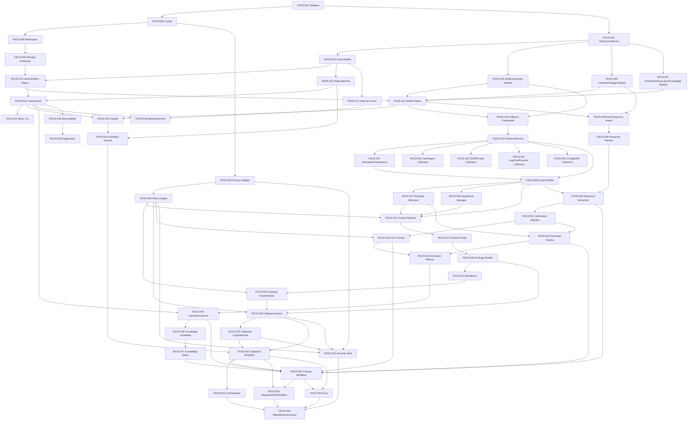

<!--
创建/修改该文件的LLM大模型：Arena.ai Agent Mode - Execution Lead Engineer
创建时间（北京时间）：2026-07-01 00:00:00
-->

# FEOS_TASK_BACKLOG.md

> 文件定位：FORGE Escalation OS（FEOS）开发任务 Backlog  
> 主要实施依据：`FEOS_ENGINEERING_DESIGN.md`  
> 架构事实来源：`FEOS_ARCHITECTURE_FINAL.md`  
> 项目事实来源：`PROJECT_DOSSIER_V4.md`  
> 目标：将 FEOS 工程设计拆解为 Claude Code、Codex 等 AI Agent 可直接执行的开发任务体系。

---

## 0. Backlog 使用原则

### 0.1 开发原则

FEOS 任务拆解遵循：

- AI Native Development；
- Capability-Based Planning；
- Incremental Delivery；
- Vertical Slice；
- Testable Unit Design；
- 低耦合、高内聚；
- 优先交付可运行闭环；
- 每个 Task 应可在一次独立开发会话内完成。

### 0.2 严格工程约束

实现过程中不得：

- 修改 `FEOS_ARCHITECTURE_FINAL.md` 的架构决策；
- 改变 FEOS 14 个核心子系统职责；
- 改变 Clipboard-first 当前主流程；
- 绕过 Policy Plane；
- 绕过 Verification Layer；
- 让 Gateway 直接执行外部建议；
- 引入新数据库、新消息队列、新 Web 服务或新框架；
- 重复建设现有 `_infra/network/`、KnowledgeHub、MemoryStore、治理脚本等已有能力。

### 0.3 全局 Definition of Done（G-DoD）

每个 Task 的 DoD 默认包含以下内容：

1. 功能完成，符合该 Task 的目标与实现要求；
2. 单元测试通过；
3. 集成测试通过，如该 Task 涉及跨模块流程；
4. 静态检查通过：
   - 至少运行 `python3 -m compileall _infra/feos`；
   - 如项目已有 lint/type check，则遵循现有规则；
5. 相关文档、配置或示例更新完成，如该 Task 涉及用户可见行为；
6. 任务验收标准全部满足；
7. 不破坏既有：
   - `make docs-check`
   - `make governance-check`
   - 现有 `_infra/network/` 测试基线。

---

# 1. Epic / Capability / Story 总览

## Epic E1：FEOS Foundation & Persistence

建立 FEOS 模块骨架、配置体系、领域模型、本地文件存储和 Repository 基础。

| Capability | Story |
|---|---|
| C1.1 模块骨架与配置加载 | S1.1.1 FEOS 包结构可导入；S1.1.2 配置可加载、覆盖、校验 |
| C1.2 领域模型 | S1.2.1 ID、枚举、错误与 Result；S1.2.2 核心 Schema 模型 |
| C1.3 本地存储与 Repository | S1.3.1 Workspace、PathGuard、Atomic Write；S1.3.2 各类 Repository 持久化 |

---

## Epic E2：Case Lifecycle, Detector & Workflow

实现 Escalation Case 生命周期、状态机、CaseService、基础 CLI、Facade、Detector 和 Workflow Guard。

| Capability | Story |
|---|---|
| C2.1 Case 状态机 | S2.1.1 状态转换守卫；S2.1.2 CaseService 与 Timeline |
| C2.2 CLI 与 Facade | S2.2.1 基础 CLI；S2.2.2 Facade 与 Workflow Wiring |
| C2.3 Failure Detector | S2.3.1 Escalation Score；S2.3.2 Hard Trigger 与 Case 创建建议 |

---

## Epic E3：Evidence, Graph & Investigation

实现证据采集框架、基础 Collector、Case Graph、Similarity Retrieval 和 Hypothesis Manager。

| Capability | Story |
|---|---|
| C3.1 Evidence Framework | S3.1.1 Collector 插件框架；S3.1.2 Evidence 保存、归一化、索引 |
| C3.2 Basic Collectors | S3.2.1 用户/Agent 证据；S3.2.2 Git/Diff/Code；S3.2.3 Log/Test/Runtime；S3.2.4 Config/Env/ADR |
| C3.3 Case Graph / Retrieval / Hypothesis | S3.3.1 Graph 构建；S3.3.2 Similarity Retrieval；S3.3.3 Hypothesis 管理 |

---

## Epic E4：Policy, Context, Package & Clipboard Gateway

实现外发前策略、脱敏、上下文编译、Escalation Package、Markdown Renderer 和 Clipboard Gateway。

| Capability | Story |
|---|---|
| C4.1 Policy Plane | S4.1.1 Privacy Adapter；S4.1.2 Policy Engine 与 Redaction Report |
| C4.2 Context Compiler | S4.2.1 Section Selection；S4.2.2 Compression 与 Token Budget Packing |
| C4.3 Package & Renderer | S4.3.1 Escalation Package；S4.3.2 Markdown Renderer Profiles |
| C4.4 Gateway Layer | S4.4.1 Gateway 抽象与 Router；S4.4.2 Clipboard Export；S4.4.3 Clipboard Copy / Import |

---

## Epic E5：Response, Verification, Execution & Knowledge Closure

实现外部回复导入、结构化解析、本地验证、执行计划、Outcome 和知识蒸馏。

| Capability | Story |
|---|---|
| C5.1 Response Ingestion | S5.1.1 Raw Response 保存；S5.1.2 回复格式与段落解析；S5.1.3 Claim / Recommendation / Patch 提取 |
| C5.2 Verification Layer | S5.2.1 Verification Pipeline；S5.2.2 Core Checks；S5.2.3 Extended Checks |
| C5.3 Execution Tracking | S5.3.1 Execution Plan；S5.3.2 Approval、Tracking、Outcome |
| C5.4 Knowledge Distillation | S5.4.1 Knowledge Candidate；S5.4.2 Knowledge OS 写入适配 |

---

## Epic E6：Observability, QA, Ops & Documentation

实现日志、指标、审计、诊断、E2E 工作流、测试体系、文档和 Makefile / CLI 集成。

| Capability | Story |
|---|---|
| C6.1 Observability | S6.1.1 Logging / Metrics / Audit；S6.1.2 Diagnostics |
| C6.2 E2E Workflows | S6.2.1 Clipboard Escalation Workflow；S6.2.2 Response Closure Workflow |
| C6.3 Test Suite | S6.3.1 Unit Baseline；S6.3.2 Integration / E2E / Golden；S6.3.3 Security Tests |
| C6.4 Docs & Governance | S6.4.1 用户文档；S6.4.2 Makefile / Governance / Optional forge CLI Hook |

---

# 2. Task 详细清单

---

## FEOS-001 — 创建 FEOS 模块骨架与默认配置

- **状态**：DONE
- **完成日期**：2026-07-01
- **负责 Agent**：Arena.ai Agent Mode - Execution Lead Engineer
- **Task ID**：FEOS-001
- **所属 Epic**：E1 Foundation & Persistence
- **所属 Capability**：C1.1 模块骨架与配置加载
- **所属 Story**：S1.1.1 FEOS 包结构可导入
- **目标**：创建 `_infra/feos/` 基础包结构、默认配置目录、默认 policy/profile 文件和 `.forge/feos` gitignore 规则。
- **前置依赖**：无
- **输入**：
  - `FEOS_ENGINEERING_DESIGN.md` §3 推荐目录结构
  - `FEOS_ENGINEERING_DESIGN.md` §8 配置体系设计
- **输出**：
  - 可导入的 `_infra.feos` Python 包
  - 默认 FEOS 配置与 profile 模板
  - `.forge/feos/` 本地运行目录 gitignore 规则
- **涉及模块**：
  - `_infra/feos`
  - `config`
  - `.gitignore`
- **涉及文件**：
  - 新建：
    - `_infra/feos/__init__.py`
    - `_infra/feos/defaults/feos.yaml`
    - `_infra/feos/defaults/policies/default.yaml`
    - `_infra/feos/defaults/policies/redaction.yaml`
    - `_infra/feos/defaults/policies/gateway.yaml`
    - `_infra/feos/defaults/renderer_profiles/gpt_markdown_debug.yaml`
    - `_infra/feos/defaults/renderer_profiles/claude_markdown_architecture.yaml`
    - `_infra/feos/defaults/renderer_profiles/generic_markdown.yaml`
    - `_infra/feos/defaults/renderer_profiles/api_json.yaml`
    - `_infra/feos/defaults/renderer_profiles/mcp_message.yaml`
    - `config/feos.yaml`
  - 修改：
    - `.gitignore`
- **实现要求**：
  - 不实现业务逻辑；
  - 默认 Gateway 必须为 `clipboard`；
  - API / MCP / Browser / Cloud Agent Gateway 默认 disabled；
  - `.forge/feos/cases/`、`metrics/`、`cache/`、`knowledge_index/` 必须 gitignored。
- **测试要求**：
  - 新增 `_infra/feos/tests/unit/test_package_import.py`
  - 校验 `_infra.feos` 可 import；
  - 校验 YAML 默认文件可被解析。
- **验收标准**：
  - `python3 -c "import _infra.feos"` 成功；
  - `config/feos.yaml` 存在；
  - `.gitignore` 包含 FEOS runtime data；
  - 默认配置中 `clipboard.enabled=true`，其它 future gateways disabled。
- **Definition of Done**：
  - [x] 满足 G-DoD；
  - [x] FEOS 包结构创建完成；
  - [x] 默认配置和 renderer profile 文件可解析；
  - [x] 单元测试通过：`_infra/feos/tests/unit/test_package_import.py`；
  - [x] 静态检查通过：`python3 -m compileall -q _infra/feos`。

---

## FEOS-002 — 实现配置加载、环境变量覆盖与 Bootstrap 基础

- **Task ID**：FEOS-002
- **所属 Epic**：E1 Foundation & Persistence
- **所属 Capability**：C1.1 模块骨架与配置加载
- **所属 Story**：S1.1.2 配置可加载、覆盖、校验
- **目标**：实现 FEOS 配置加载器，支持 defaults → `config/feos.yaml` → env → CLI 参数覆盖。
- **前置依赖**：
  - FEOS-001
- **输入**：
  - 默认配置文件
  - `FEOS_HOME`
  - `FEOS_CONFIG`
  - `FEOS_LOG_LEVEL`
  - `FEOS_DEFAULT_PROVIDER`
  - `FEOS_DEFAULT_GATEWAY`
- **输出**：
  - `FEOSConfig`
  - `load_config()`
  - `bootstrap_feos()`
- **涉及模块**：
  - `_infra/feos/bootstrap.py`
  - `_infra/feos/config_loader.py`
- **涉及文件**：
  - 新建：
    - `_infra/feos/config_loader.py`
    - `_infra/feos/bootstrap.py`
    - `_infra/feos/tests/unit/test_config_loader.py`
  - 修改：
    - `_infra/feos/__init__.py`
- **实现要求**：
  - 不引入新配置框架；
  - 使用标准 YAML 读取能力，如项目已有 YAML helper，应优先复用；
  - 配置加载失败必须给出明确错误；
  - future gateway env 开关默认 false。
- **测试要求**：
  - 测试默认配置加载；
  - 测试 `FEOS_HOME` 覆盖；
  - 测试 env provider/gateway 覆盖；
  - 测试缺失配置时 fallback 到 defaults。
- **验收标准**：
  - `load_config()` 返回完整 FEOS 配置；
  - env 覆盖顺序正确；
  - 非法 YAML 抛出配置错误；
  - 不访问任何外部服务。
- **Definition of Done**：
  - 满足 G-DoD；
  - 配置加载与覆盖逻辑有单元测试覆盖。

---

## FEOS-003 — 实现 ID、枚举、错误类型与 ServiceResult

- **Task ID**：FEOS-003
- **所属 Epic**：E1 Foundation & Persistence
- **所属 Capability**：C1.2 领域模型
- **所属 Story**：S1.2.1 ID、枚举、错误与 Result
- **目标**：实现 FEOS 全局 ID 生成、枚举、错误类型和通用 Result 对象。
- **前置依赖**：
  - FEOS-001
- **输入**：
  - Case 生命周期状态
  - Evidence / Gateway / Verification 等枚举定义
  - 工程设计中的异常分类
- **输出**：
  - 稳定 ID 生成器
  - 全局枚举
  - FEOS 错误基类与分类错误
  - `ServiceResult`
- **涉及模块**：
  - `_infra/feos/models`
  - `_infra/feos/errors.py`
- **涉及文件**：
  - 新建：
    - `_infra/feos/models/enums.py`
    - `_infra/feos/models/ids.py`
    - `_infra/feos/models/result.py`
    - `_infra/feos/errors.py`
    - `_infra/feos/tests/unit/test_ids_enums_errors.py`
  - 修改：
    - `_infra/feos/models/__init__.py`
- **实现要求**：
  - Case 状态枚举不得增删架构定义状态；
  - ID 格式必须符合工程设计约定；
  - 测试中支持 deterministic ID generator；
  - 业务失败优先使用 Result，非恢复错误使用异常。
- **测试要求**：
  - ID 格式测试；
  - deterministic ID 测试；
  - Case 状态枚举完整性测试；
  - 错误类型继承关系测试。
- **验收标准**：
  - 所有架构状态均存在；
  - `case_YYYY_MM_DD_NNN` 格式可生成；
  - 错误类型可被精确捕获；
  - Result 可表达 ok / warnings / errors。
- **Definition of Done**：
  - 满足 G-DoD；
  - ID / enum / error 基础设施可供后续模型复用。

---

## FEOS-004 — 实现 Case、Timeline 与 Audit 模型

- **Task ID**：FEOS-004
- **所属 Epic**：E1 Foundation & Persistence
- **所属 Capability**：C1.2 领域模型
- **所属 Story**：S1.2.2 核心 Schema 模型
- **目标**：实现 EscalationCase、TimelineEvent、AuditRecord 数据模型及 YAML/JSON 序列化。
- **前置依赖**：
  - FEOS-003
- **输入**：
  - FEOS 架构中的 Escalation Case Schema
  - Timeline Event Schema
  - Export Audit Schema
- **输出**：
  - Case 模型
  - Timeline 模型
  - Audit 模型
- **涉及模块**：
  - `_infra/feos/models`
- **涉及文件**：
  - 新建：
    - `_infra/feos/models/case.py`
    - `_infra/feos/models/timeline.py`
    - `_infra/feos/models/audit.py`
    - `_infra/feos/tests/unit/test_case_models.py`
  - 修改：
    - `_infra/feos/models/__init__.py`
- **实现要求**：
  - 字段覆盖架构 Schema；
  - 时间统一 UTC ISO-8601；
  - 模型应能 round-trip YAML/JSON；
  - Case status 必须使用枚举。
- **测试要求**：
  - Case YAML round-trip；
  - Timeline JSONL event serialization；
  - 缺失必填字段时 validation 失败；
  - UTC timestamp 格式测试。
- **验收标准**：
  - 示例 Case YAML 可加载为对象；
  - 对象可保存回 YAML 且字段不丢失；
  - TimelineEvent 可 JSON line 序列化。
- **Definition of Done**：
  - 满足 G-DoD；
  - Case / Timeline / Audit 模型可供 Repository 使用。

---

## FEOS-005 — 实现 Evidence、Graph 与 Hypothesis 模型

- **Task ID**：FEOS-005
- **所属 Epic**：E1 Foundation & Persistence
- **所属 Capability**：C1.2 领域模型
- **所属 Story**：S1.2.2 核心 Schema 模型
- **目标**：实现 Evidence、CaseGraph、GraphNode、GraphEdge、Hypothesis 模型。
- **前置依赖**：
  - FEOS-003
- **输入**：
  - Evidence Schema
  - Case Graph node/edge types
  - Hypothesis Schema
- **输出**：
  - Evidence 数据结构
  - CaseGraph 数据结构
  - Hypothesis 数据结构
- **涉及模块**：
  - `_infra/feos/models`
- **涉及文件**：
  - 新建：
    - `_infra/feos/models/evidence.py`
    - `_infra/feos/models/graph.py`
    - `_infra/feos/models/hypothesis.py`
    - `_infra/feos/tests/unit/test_evidence_graph_models.py`
  - 修改：
    - `_infra/feos/models/__init__.py`
- **实现要求**：
  - Evidence 必须区分 raw_ref 与 normalized；
  - quality/security/source/relations 必须建模；
  - Graph node/edge type 不得偏离架构定义；
  - Hypothesis status 必须支持 Proposed/Testing/Supported/Rejected/Confirmed。
- **测试要求**：
  - Evidence YAML round-trip；
  - Graph JSON round-trip；
  - Graph edge confidence 范围校验；
  - Hypothesis 支持/反驳证据字段测试。
- **验收标准**：
  - Evidence 示例可加载；
  - Graph 示例可保存；
  - Hypothesis 可序列化并可引用 evidence id。
- **Definition of Done**：
  - 满足 G-DoD；
  - Evidence / Graph / Hypothesis 模型可供后续服务复用。

---

## FEOS-006 — 实现 Context、Package、Gateway 与 Response 模型

- **Task ID**：FEOS-006
- **所属 Epic**：E1 Foundation & Persistence
- **所属 Capability**：C1.2 领域模型
- **所属 Story**：S1.2.2 核心 Schema 模型
- **目标**：实现 ContextPackage、EscalationPackage、ExternalSession、ExternalResponse、GatewayCapabilities 等模型。
- **前置依赖**：
  - FEOS-003
- **输入**：
  - Context Package Schema
  - Escalation Package Schema
  - External Session Schema
  - External Response Schema
- **输出**：
  - Context / Package / Gateway / Response 领域模型
- **涉及模块**：
  - `_infra/feos/models`
- **涉及文件**：
  - 新建：
    - `_infra/feos/models/context.py`
    - `_infra/feos/models/package.py`
    - `_infra/feos/models/gateway.py`
    - `_infra/feos/models/response.py`
    - `_infra/feos/tests/unit/test_context_package_gateway_models.py`
  - 修改：
    - `_infra/feos/models/__init__.py`
- **实现要求**：
  - ContextPackage 不等于 Prompt；
  - Gateway 必须支持 capabilities；
  - ExternalSession 必须记录 human_actions；
  - ExternalResponse 必须记录 hash 与 raw_ref。
- **测试要求**：
  - ContextPackage YAML round-trip；
  - Package JSON round-trip；
  - Session human_actions 序列化；
  - Response hash 字段校验。
- **验收标准**：
  - 所有模型可实例化；
  - 可保存为设计要求的文件格式；
  - 无外部依赖。
- **Definition of Done**：
  - 满足 G-DoD；
  - Context / Package / Gateway / Response 模型可供 Compiler、Gateway、Ingestion 使用。

---

## FEOS-007 — 实现 Verification、Execution 与 Knowledge 模型

- **Task ID**：FEOS-007
- **所属 Epic**：E1 Foundation & Persistence
- **所属 Capability**：C1.2 领域模型
- **所属 Story**：S1.2.2 核心 Schema 模型
- **目标**：实现 ParsedResponse、VerificationResult、ExecutionPlan、Outcome、KnowledgeCandidate 等模型。
- **前置依赖**：
  - FEOS-003
- **输入**：
  - Parsed Response Schema
  - Verification Result Schema
  - Execution Plan Schema
  - Outcome Schema
  - Knowledge Candidate Schema
- **输出**：
  - Verification / Execution / Knowledge 闭环模型
- **涉及模块**：
  - `_infra/feos/models`
- **涉及文件**：
  - 新建：
    - `_infra/feos/models/verification.py`
    - `_infra/feos/models/execution.py`
    - `_infra/feos/models/knowledge.py`
    - `_infra/feos/tests/unit/test_verification_execution_knowledge_models.py`
  - 修改：
    - `_infra/feos/models/response.py`
    - `_infra/feos/models/__init__.py`
- **实现要求**：
  - Verification status 必须支持 passed / failed / passed_with_warnings / needs_human_review；
  - ExecutionPlan 默认 pending_approval；
  - KnowledgeCandidate lifecycle 必须包含 captured / verified / indexed 等状态；
  - 不允许把 raw GPT response 当作 KnowledgeCandidate。
- **测试要求**：
  - ParsedResponse YAML round-trip；
  - VerificationResult checks 序列化；
  - ExecutionPlan approval 字段测试；
  - KnowledgeCandidate lifecycle 字段测试。
- **验收标准**：
  - 所有闭环对象可保存/读取；
  - 字段覆盖架构 Schema；
  - 风险等级与审批字段可表达。
- **Definition of Done**：
  - 满足 G-DoD；
  - Response → Verification → Execution → Knowledge 模型链路具备基础数据结构。

---

## FEOS-008 — 实现 Workspace、PathGuard 与目录初始化

- **Task ID**：FEOS-008
- **所属 Epic**：E1 Foundation & Persistence
- **所属 Capability**：C1.3 本地存储与 Repository
- **所属 Story**：S1.3.1 Workspace、PathGuard、Atomic Write
- **目标**：实现 `.forge/feos/` Workspace 管理、Case 路径解析与 Path Traversal 防护。
- **前置依赖**：
  - FEOS-001
  - FEOS-002
- **输入**：
  - `FEOS_HOME`
  - repo root
  - case id
- **输出**：
  - `FEOSWorkspace`
  - `PathGuard`
  - 初始化目录结构
- **涉及模块**：
  - `_infra/feos/storage`
- **涉及文件**：
  - 新建：
    - `_infra/feos/storage/workspace.py`
    - `_infra/feos/storage/path_guard.py`
    - `_infra/feos/tests/unit/test_workspace_path_guard.py`
  - 修改：
    - `_infra/feos/bootstrap.py`
- **实现要求**：
  - 默认 root 为 `<repo_root>/.forge/feos`；
  - 支持 `FEOS_HOME` 覆盖；
  - 禁止 `../`、绝对路径逃逸；
  - 创建目录权限尽量使用安全默认值。
- **测试要求**：
  - 默认 workspace 路径测试；
  - FEOS_HOME 覆盖测试；
  - path traversal 拒绝测试；
  - case_dir 生成测试。
- **验收标准**：
  - `workspace.ensure_initialized()` 创建设计目录；
  - 非法路径被拒绝；
  - 测试中可使用 `tmp_path` 隔离。
- **Definition of Done**：
  - 满足 G-DoD；
  - Workspace 可被 Repository 复用。

---

## FEOS-009 — 实现 AtomicWriter、FileLock、Hashing 与 JSON/YAML 工具

- **Task ID**：FEOS-009
- **所属 Epic**：E1 Foundation & Persistence
- **所属 Capability**：C1.3 本地存储与 Repository
- **所属 Story**：S1.3.1 Workspace、PathGuard、Atomic Write
- **目标**：实现本地文件安全写入、hash 计算、JSON/YAML 读写和 Case 级文件锁。
- **前置依赖**：
  - FEOS-008
- **输入**：
  - bytes/text content
  - YAML/JSON 数据结构
  - target path
- **输出**：
  - `AtomicWriter`
  - `FileLock`
  - `sha256` 工具
  - JSON/YAML helper
- **涉及模块**：
  - `_infra/feos/storage`
- **涉及文件**：
  - 新建：
    - `_infra/feos/storage/atomic_writer.py`
    - `_infra/feos/storage/file_lock.py`
    - `_infra/feos/storage/blob_store.py`
    - `_infra/feos/storage/hashing.py`
    - `_infra/feos/storage/json_yaml.py`
    - `_infra/feos/tests/unit/test_storage_primitives.py`
- **实现要求**：
  - 写入必须采用临时文件 + rename；
  - hash 统一 `sha256:<hex>` 格式；
  - `timeline.jsonl` append 需要锁保护；
  - JSON/YAML helper 不吞异常。
- **测试要求**：
  - atomic write 成功测试；
  - 写入失败不留下半文件；
  - hash 稳定性测试；
  - JSON/YAML round-trip；
  - lock 基础行为测试。
- **验收标准**：
  - 多次写入结果稳定；
  - 文件内容 hash 与预期一致；
  - 异常时不会产生损坏文件。
- **Definition of Done**：
  - 满足 G-DoD；
  - 后续 Repository 可直接依赖 storage primitives。

---

## FEOS-010 — 实现 CaseRepository 与 TimelineRepository

- **Task ID**：FEOS-010
- **所属 Epic**：E1 Foundation & Persistence
- **所属 Capability**：C1.3 本地存储与 Repository
- **所属 Story**：S1.3.2 各类 Repository 持久化
- **目标**：实现 Case 与 Timeline 的文件系统 Repository。
- **前置依赖**：
  - FEOS-004
  - FEOS-009
- **输入**：
  - EscalationCase
  - TimelineEvent
- **输出**：
  - `case.yaml`
  - `timeline.jsonl`
  - Case list/get/save API
- **涉及模块**：
  - `_infra/feos/repositories`
- **涉及文件**：
  - 新建：
    - `_infra/feos/repositories/case_repository.py`
    - `_infra/feos/repositories/timeline_repository.py`
    - `_infra/feos/tests/unit/test_case_timeline_repository.py`
  - 修改：
    - `_infra/feos/repositories/__init__.py`
- **实现要求**：
  - Case 目录名必须等于 case id；
  - Timeline append-only；
  - Case save 使用 atomic write；
  - Repository 不做业务状态判断。
- **测试要求**：
  - create/get/save/list；
  - timeline append/list；
  - case id 与目录不一致时失败；
  - corrupt YAML 报错。
- **验收标准**：
  - Case 可持久化到 `.forge/feos/cases/<case_id>/case.yaml`；
  - Timeline 可追加事件；
  - Repository 测试通过。
- **Definition of Done**：
  - 满足 G-DoD；
  - Case 持久化基础可用。

---

## FEOS-011 — 实现 Artifact 相关 Repository

- **Task ID**：FEOS-011
- **所属 Epic**：E1 Foundation & Persistence
- **所属 Capability**：C1.3 本地存储与 Repository
- **所属 Story**：S1.3.2 各类 Repository 持久化
- **目标**：实现 Evidence、Graph、Context、Package、Session、Response、Verification、Execution、Knowledge、Index Repository。
- **前置依赖**：
  - FEOS-005
  - FEOS-006
  - FEOS-007
  - FEOS-009
  - FEOS-010
- **输入**：
  - 各类领域模型
  - raw artifact bytes/text
- **输出**：
  - 设计目录下的各类 YAML/JSON/Markdown/Patch 文件
- **涉及模块**：
  - `_infra/feos/repositories`
- **涉及文件**：
  - 新建：
    - `_infra/feos/repositories/evidence_repository.py`
    - `_infra/feos/repositories/graph_repository.py`
    - `_infra/feos/repositories/context_repository.py`
    - `_infra/feos/repositories/package_repository.py`
    - `_infra/feos/repositories/session_repository.py`
    - `_infra/feos/repositories/response_repository.py`
    - `_infra/feos/repositories/verification_repository.py`
    - `_infra/feos/repositories/execution_repository.py`
    - `_infra/feos/repositories/knowledge_repository.py`
    - `_infra/feos/repositories/index_repository.py`
    - `_infra/feos/tests/unit/test_artifact_repositories.py`
  - 修改：
    - `_infra/feos/repositories/__init__.py`
- **实现要求**：
  - 不包含业务判断；
  - raw evidence/response 必须计算 hash；
  - 保存路径必须经过 PathGuard；
  - 文件布局必须符合工程设计 §3.2。
- **测试要求**：
  - 每个 Repository 的 put/get/list；
  - raw file hash 测试；
  - path traversal 测试；
  - artifact 文件路径快照测试。
- **验收标准**：
  - 能生成完整 Case artifact 目录结构；
  - 所有 Repository 可在 `tmp_path` 中运行；
  - 不访问真实外部系统。
- **Definition of Done**：
  - 满足 G-DoD；
  - FEOS 文件持久化层完整可用。

---

## FEOS-012 — 实现 Case 状态机与 Transition Guard

- **Task ID**：FEOS-012
- **所属 Epic**：E2 Case Lifecycle, Detector & Workflow
- **所属 Capability**：C2.1 Case 状态机
- **所属 Story**：S2.1.1 状态转换守卫
- **目标**：实现 Escalation Case 生命周期状态机，限制非法状态转换。
- **前置依赖**：
  - FEOS-004
- **输入**：
  - 当前 Case status
  - 目标 status
  - transition context
- **输出**：
  - `CaseStateMachine`
  - transition validation result
- **涉及模块**：
  - `_infra/feos/case_manager`
- **涉及文件**：
  - 新建：
    - `_infra/feos/case_manager/state_machine.py`
    - `_infra/feos/case_manager/transitions.py`
    - `_infra/feos/case_manager/validators.py`
    - `_infra/feos/tests/unit/test_case_state_machine.py`
- **实现要求**：
  - 状态列表必须与架构完全一致；
  - 非法转换抛 `StateTransitionError`；
  - Guard 可接收上下文，如 evidence_count、policy_allowed；
  - 不做文件写入。
- **测试要求**：
  - 合法主流程转换测试；
  - 非法跳转测试；
  - Archived 后不可继续转换测试；
  - Guard 条件失败测试。
- **验收标准**：
  - Mermaid 状态机主路径全部可通过；
  - 非法转换被阻止；
  - 状态枚举无遗漏。
- **Definition of Done**：
  - 满足 G-DoD；
  - 状态机可供 CaseService 和 Workflow 调用。

---

## FEOS-013 — 实现 CaseService 与 Timeline 写入

- **Task ID**：FEOS-013
- **所属 Epic**：E2 Case Lifecycle, Detector & Workflow
- **所属 Capability**：C2.1 Case 状态机
- **所属 Story**：S2.1.2 CaseService 与 Timeline
- **目标**：实现 Case 创建、读取、列表、状态转换、TimelineEvent 记录。
- **前置依赖**：
  - FEOS-010
  - FEOS-012
- **输入**：
  - `CreateCaseInput`
  - transition request
  - actor
- **输出**：
  - `EscalationCase`
  - `timeline.jsonl`
- **涉及模块**：
  - `_infra/feos/case_manager`
- **涉及文件**：
  - 新建：
    - `_infra/feos/case_manager/service.py`
    - `_infra/feos/tests/unit/test_case_service.py`
  - 修改：
    - `_infra/feos/case_manager/__init__.py`
- **实现要求**：
  - 创建 Case 时写 `case.yaml` 与第一条 timeline event；
  - 状态转换必须经过 `CaseStateMachine`；
  - `updated_at` 必须更新；
  - 失败时不能留下不一致状态。
- **测试要求**：
  - create case；
  - transition case；
  - timeline event 顺序；
  - 非法 transition 不写 case；
  - list case。
- **验收标准**：
  - `case.yaml` 与 `timeline.jsonl` 同步；
  - Timeline 包含 created_by / actor；
  - 状态非法时明确报错。
- **Definition of Done**：
  - 满足 G-DoD；
  - Case 生命周期基础服务可用。

---

## FEOS-014 — 实现基础 CLI：create / status / list / archive

- **Task ID**：FEOS-014
- **所属 Epic**：E2 Case Lifecycle, Detector & Workflow
- **所属 Capability**：C2.2 CLI 与 Facade
- **所属 Story**：S2.2.1 基础 CLI
- **目标**：实现 `python3 -m _infra.feos.cli` 的基础 Case 管理命令。
- **前置依赖**：
  - FEOS-002
  - FEOS-013
- **输入**：
  - CLI 参数
  - problem/title/task_id
- **输出**：
  - CLI 可读输出
  - 可选 `--json` 输出
- **涉及模块**：
  - `_infra/feos/cli.py`
- **涉及文件**：
  - 新建：
    - `_infra/feos/cli.py`
    - `_infra/feos/tests/unit/test_cli_basic.py`
  - 修改：
    - `_infra/feos/__init__.py`
- **实现要求**：
  - CLI 只解析参数，不承载业务逻辑；
  - 支持 `create`、`status`、`list`、`archive`；
  - 默认使用 `.forge/feos`；
  - 错误输出包含 operation 和 hint。
- **测试要求**：
  - 使用 pytest capsys 或 subprocess 测试；
  - `create --title` 创建 Case；
  - `status <case_id>` 输出状态；
  - `--json` 输出可解析。
- **验收标准**：
  - 可运行：
    - `python3 -m _infra.feos.cli create --title "test" --user-goal "debug"`
    - `python3 -m _infra.feos.cli list`
  - 生成 Case 文件；
  - CLI 测试通过。
- **Definition of Done**：
  - 满足 G-DoD；
  - 本地用户可通过 CLI 创建和查看 Case。

---

## FEOS-015 — 实现 FEOSFacade 与 Bootstrap Wiring

- **Task ID**：FEOS-015
- **所属 Epic**：E2 Case Lifecycle, Detector & Workflow
- **所属 Capability**：C2.2 CLI 与 Facade
- **所属 Story**：S2.2.2 Facade 与 Workflow Wiring
- **目标**：实现 `FEOSFacade`，集中暴露架构定义的内部 API，完成 config / repositories / services wiring。
- **前置依赖**：
  - FEOS-002
  - FEOS-010
  - FEOS-011
  - FEOS-013
- **输入**：
  - FEOSConfig
  - FEOSWorkspace
- **输出**：
  - `FEOSFacade`
  - service registry / dependency wiring
- **涉及模块**：
  - `_infra/feos/facade.py`
  - `_infra/feos/bootstrap.py`
- **涉及文件**：
  - 新建：
    - `_infra/feos/facade.py`
    - `_infra/feos/tests/unit/test_facade_bootstrap.py`
  - 修改：
    - `_infra/feos/bootstrap.py`
    - `_infra/feos/cli.py`
- **实现要求**：
  - Facade 方法名对齐工程设计内部 API；
  - 未实现能力可返回明确 `NotImplemented` 或 disabled；
  - CLI 应逐步通过 Facade 调用服务；
  - 不绕过 Repository。
- **测试要求**：
  - bootstrap 成功；
  - facade createCase 调用；
  - 未实现方法返回明确错误；
  - CLI 可使用 facade。
- **验收标准**：
  - `bootstrap_feos()` 返回可用 facade；
  - facade 可创建 Case；
  - 依赖 wiring 不访问外部服务。
- **Definition of Done**：
  - 满足 G-DoD；
  - 后续 Workflow 可基于 Facade 组织调用链。

---

## FEOS-016 — 实现 Workflow Guards 基础

- **Task ID**：FEOS-016
- **所属 Epic**：E2 Case Lifecycle, Detector & Workflow
- **所属 Capability**：C2.2 CLI 与 Facade
- **所属 Story**：S2.2.2 Facade 与 Workflow Wiring
- **目标**：实现 workflow 层基础 guard，确保后续流程必须经过状态机、Policy、Verification 等关口。
- **前置依赖**：
  - FEOS-012
  - FEOS-015
- **输入**：
  - Case status
  - workflow operation
- **输出**：
  - workflow guard result
- **涉及模块**：
  - `_infra/feos/workflows`
- **涉及文件**：
  - 新建：
    - `_infra/feos/workflows/__init__.py`
    - `_infra/feos/workflows/workflow_guards.py`
    - `_infra/feos/workflows/feos_workflow.py`
    - `_infra/feos/tests/unit/test_workflow_guards.py`
- **实现要求**：
  - Workflow 只编排，不承载业务逻辑；
  - Guard 必须阻止跳过 Policy / Verification 的路径；
  - 初期可实现空 workflow shell，但 guard 必须可测试。
- **测试要求**：
  - export 前必须经过 PackageGenerated 或对应前序状态；
  - execute 前必须有 approved plan；
  - archived case 不允许继续 workflow。
- **验收标准**：
  - Guard 能阻止非法工作流调用；
  - FEOSWorkflow shell 可初始化。
- **Definition of Done**：
  - 满足 G-DoD；
  - 后续 E2E Workflow 有统一 Guard 基础。

---

## FEOS-017 — 实现 Detector Signals 与 Escalation Score

- **Task ID**：FEOS-017
- **所属 Epic**：E2 Case Lifecycle, Detector & Workflow
- **所属 Capability**：C2.3 Failure Detector
- **所属 Story**：S2.3.1 Escalation Score
- **目标**：实现 Failure & Uncertainty Detector 的输入信号模型和 score 计算。
- **前置依赖**：
  - FEOS-003
  - FEOS-004
- **输入**：
  - execution failures
  - agent behavior
  - context health
  - task metadata
- **输出**：
  - `DetectorSignals`
  - `EscalationScore`
  - `DetectorResult`
- **涉及模块**：
  - `_infra/feos/detector`
- **涉及文件**：
  - 新建：
    - `_infra/feos/detector/signals.py`
    - `_infra/feos/detector/scorer.py`
    - `_infra/feos/tests/unit/test_detector_scorer.py`
- **实现要求**：
  - 默认权重对齐架构：
    - repeated_failure 0.25
    - uncertainty 0.20
    - error_stability 0.15
    - task_complexity 0.15
    - context_pollution 0.10
    - missing_knowledge 0.10
    - user_priority 0.05
  - score 范围 0~1；
  - 计算过程可解释。
- **测试要求**：
  - 权重总和测试；
  - 高失败重复场景 score > 0.70；
  - 低风险场景 score < 0.50；
  - explanation 字段测试。
- **验收标准**：
  - score 与 trigger policy 阈值可比较；
  - 输出包含 reason / explanation；
  - 不创建 Case。
- **Definition of Done**：
  - 满足 G-DoD；
  - Detector scoring 可被 DetectorService 使用。

---

## FEOS-018 — 实现 DetectorService 与 Hard Trigger 集成

- **Task ID**：FEOS-018
- **所属 Epic**：E2 Case Lifecycle, Detector & Workflow
- **所属 Capability**：C2.3 Failure Detector
- **所属 Story**：S2.3.2 Hard Trigger 与 Case 创建建议
- **目标**：实现 DetectorService，基于 score 和 hard triggers 给出 continue / suggest / auto_create 决策。
- **前置依赖**：
  - FEOS-013
  - FEOS-017
- **输入**：
  - DetectorSignals
  - trigger policy config
- **输出**：
  - DetectorResult
  - optional Created Case
- **涉及模块**：
  - `_infra/feos/detector`
- **涉及文件**：
  - 新建：
    - `_infra/feos/detector/hard_triggers.py`
    - `_infra/feos/detector/service.py`
    - `_infra/feos/tests/unit/test_detector_service.py`
  - 修改：
    - `_infra/feos/facade.py`
    - `_infra/feos/cli.py`
- **实现要求**：
  - 支持 hard triggers：
    - same_error_repeated_2_times
    - tool_call_loop_detected
    - local_agent_declares_no_new_strategy
    - context_window_exceeded
    - security_sensitive_failure
    - architecture_decision_deadlock
  - auto-create Case 必须仍写 Timeline；
  - 默认不外发。
- **测试要求**：
  - hard trigger 命中测试；
  - suggest threshold 测试；
  - auto-create threshold 测试；
  - Case 创建后 trigger 信息正确写入。
- **验收标准**：
  - Detector 可返回 `continue_local` / `suggest_case` / `auto_create_case`；
  - auto-created Case 的 trigger 字段完整；
  - 无 Gateway 调用。
- **Definition of Done**：
  - 满足 G-DoD；
  - Detector 与 CaseService 形成基础联动。

---

## FEOS-019 — 实现 Evidence Collector 协议、Registry 与 Request/Result

- **Task ID**：FEOS-019
- **所属 Epic**：E3 Evidence, Graph & Investigation
- **所属 Capability**：C3.1 Evidence Framework
- **所属 Story**：S3.1.1 Collector 插件框架
- **目标**：实现 EvidenceCollector Protocol、CollectorRegistry、EvidenceCollectionRequest、CollectedEvidence。
- **前置依赖**：
  - FEOS-005
  - FEOS-011
- **输入**：
  - EscalationCase
  - collector config
- **输出**：
  - 可注册、选择、执行的 Collector 框架
- **涉及模块**：
  - `_infra/feos/evidence`
  - `_infra/feos/ports`
- **涉及文件**：
  - 新建：
    - `_infra/feos/ports/collectors.py`
    - `_infra/feos/evidence/registry.py`
    - `_infra/feos/evidence/service.py`
    - `_infra/feos/tests/unit/test_evidence_registry.py`
  - 修改：
    - `_infra/feos/ports/__init__.py`
    - `_infra/feos/evidence/__init__.py`
- **实现要求**：
  - Collector 只采集事实，不总结；
  - 支持 required / optional collector；
  - 单个 optional collector 失败不阻断整体；
  - request 支持 paths、logs、commands、task metadata。
- **测试要求**：
  - Collector 注册与选择；
  - optional collector 失败继续；
  - required collector 失败返回失败；
  - duplicate collector id 被拒绝。
- **验收标准**：
  - Registry 可返回 enabled collectors；
  - EvidenceService shell 可调用 collector；
  - 不写入外发 artifact。
- **Definition of Done**：
  - 满足 G-DoD；
  - Evidence 插件框架可扩展。

---

## FEOS-020 — 实现 EvidenceService 保存 raw / normalized / index

- **Task ID**：FEOS-020
- **所属 Epic**：E3 Evidence, Graph & Investigation
- **所属 Capability**：C3.1 Evidence Framework
- **所属 Story**：S3.1.2 Evidence 保存、归一化、索引
- **目标**：实现 EvidenceService 的采集结果保存、raw content 写入、normalized YAML 写入和 index 更新。
- **前置依赖**：
  - FEOS-019
  - FEOS-011
- **输入**：
  - CollectedEvidence
  - case_id
- **输出**：
  - `evidence/raw/*`
  - `evidence/normalized/*.yaml`
  - `evidence/index.yaml`
- **涉及模块**：
  - `_infra/feos/evidence`
  - `_infra/feos/repositories`
- **涉及文件**：
  - 修改：
    - `_infra/feos/evidence/service.py`
    - `_infra/feos/repositories/evidence_repository.py`
  - 新建：
    - `_infra/feos/tests/unit/test_evidence_service.py`
- **实现要求**：
  - raw evidence 必须计算 hash；
  - Evidence metadata/source/security/quality 必须填充基础字段；
  - evidence id 使用统一 ID 生成；
  - 采集完成写 timeline event。
- **测试要求**：
  - raw evidence 保存；
  - normalized evidence 保存；
  - evidence index 更新；
  - hash 与 raw content 一致；
  - optional failure warning 写入。
- **验收标准**：
  - 执行 EvidenceService 后生成完整 evidence 目录；
  - index 可列出所有 evidence；
  - required collector 失败时无不完整写入。
- **Definition of Done**：
  - 满足 G-DoD；
  - Evidence 可被 Graph 和 Context 后续消费。

---

## FEOS-021 — 实现 Evidence Normalizer、Importance Scoring 与基础 Parser

- **Task ID**：FEOS-021
- **所属 Epic**：E3 Evidence, Graph & Investigation
- **所属 Capability**：C3.1 Evidence Framework
- **所属 Story**：S3.1.2 Evidence 保存、归一化、索引
- **目标**：实现 evidence normalization、importance weight 和 stacktrace/log/diff 基础 parser。
- **前置依赖**：
  - FEOS-020
- **输入**：
  - raw evidence
  - evidence type
- **输出**：
  - normalized evidence
  - quality.importance
  - text_preview
- **涉及模块**：
  - `_infra/feos/evidence`
- **涉及文件**：
  - 新建：
    - `_infra/feos/evidence/normalizer.py`
    - `_infra/feos/evidence/importance.py`
    - `_infra/feos/evidence/parsers/stacktrace_parser.py`
    - `_infra/feos/evidence/parsers/log_excerpt.py`
    - `_infra/feos/evidence/parsers/diff_parser.py`
    - `_infra/feos/tests/unit/test_evidence_normalizer_importance.py`
  - 修改：
    - `_infra/feos/evidence/service.py`
- **实现要求**：
  - importance weights 对齐架构 §8.4；
  - text_preview 长度受控；
  - parser 不抛出未处理异常；
  - normalization 不删除 raw evidence。
- **测试要求**：
  - stacktrace preview；
  - diff 文件路径提取；
  - log excerpt 去重；
  - evidence type importance 测试。
- **验收标准**：
  - stack_trace importance 默认 0.95；
  - git_diff importance 默认 0.90；
  - unknown type 有安全默认值。
- **Definition of Done**：
  - 满足 G-DoD；
  - Evidence 具备 Context Compiler 可用的质量信息。

---

## FEOS-022 — 实现 User Input / Previous Attempt / Agent Plan Collectors

- **Task ID**：FEOS-022
- **所属 Epic**：E3 Evidence, Graph & Investigation
- **所属 Capability**：C3.2 Basic Collectors
- **所属 Story**：S3.2.1 用户/Agent 证据
- **目标**：实现用户目标、历史尝试、Agent plan 相关基础 Collector。
- **前置依赖**：
  - FEOS-020
- **输入**：
  - Case problem 字段
  - previous attempts 文本
  - agent plan 文本或文件
- **输出**：
  - user_input evidence
  - previous_attempt evidence
  - agent_plan evidence
- **涉及模块**：
  - `_infra/feos/evidence/collectors`
- **涉及文件**：
  - 新建：
    - `_infra/feos/evidence/collectors/user_input_collector.py`
    - `_infra/feos/evidence/collectors/previous_attempt_collector.py`
    - `_infra/feos/evidence/collectors/agent_plan_collector.py`
    - `_infra/feos/tests/unit/test_collectors_user_agent.py`
  - 修改：
    - `_infra/feos/evidence/registry.py`
- **实现要求**：
  - 不生成主观结论；
  - 只把输入材料转为 evidence；
  - previous attempt 必须记录时间或来源，如可用；
  - agent plan 必须标记为 agent_behavior 相关来源。
- **测试要求**：
  - 每个 collector can_collect；
  - collect 输出 evidence type 正确；
  - 空输入时安全跳过；
  - evidence source.collector 正确。
- **验收标准**：
  - Case problem 可转为 user_input evidence；
  - previous attempts 可被索引；
  - Collector 注册成功。
- **Definition of Done**：
  - 满足 G-DoD；
  - 基础人工/Agent 证据采集可用。

---

## FEOS-023 — 实现 Git / Diff / Code Collectors

- **Task ID**：FEOS-023
- **所属 Epic**：E3 Evidence, Graph & Investigation
- **所属 Capability**：C3.2 Basic Collectors
- **所属 Story**：S3.2.2 Git/Diff/Code
- **目标**：实现 Git 状态、Git diff、相关代码片段 Collector。
- **前置依赖**：
  - FEOS-020
- **输入**：
  - repo root
  - target files
  - git status/diff
- **输出**：
  - git evidence
  - diff evidence
  - code evidence
- **涉及模块**：
  - `_infra/feos/evidence/collectors`
  - `_infra/feos/adapters`
- **涉及文件**：
  - 新建：
    - `_infra/feos/adapters/git_adapter.py`
    - `_infra/feos/evidence/collectors/git_collector.py`
    - `_infra/feos/evidence/collectors/diff_collector.py`
    - `_infra/feos/evidence/collectors/code_collector.py`
    - `_infra/feos/tests/unit/test_collectors_git_diff_code.py`
  - 修改：
    - `_infra/feos/evidence/registry.py`
- **实现要求**：
  - 使用本地 git 命令，不访问网络；
  - diff 大小受 `max_diff_bytes` 控制；
  - CodeCollector 只能读取 allowlisted / explicitly provided files；
  - 不读取 `.env`、key、cookie 等敏感文件。
- **测试要求**：
  - FakeGitAdapter 测试；
  - diff 超限截断测试；
  - deny file 拒绝测试；
  - git 不可用时 optional warning。
- **验收标准**：
  - 可生成 `ev_diff_*.patch`；
  - git status 可保存；
  - 敏感文件不会被读取。
- **Definition of Done**：
  - 满足 G-DoD；
  - Git/Diff/Code 证据采集可用且安全。

---

## FEOS-024 — 实现 StackTrace / Log / Runtime / Test Collectors

- **Task ID**：FEOS-024
- **所属 Epic**：E3 Evidence, Graph & Investigation
- **所属 Capability**：C3.2 Basic Collectors
- **所属 Story**：S3.2.3 Log/Test/Runtime
- **目标**：实现异常栈、日志片段、运行环境、测试结果 Collector。
- **前置依赖**：
  - FEOS-020
- **输入**：
  - stack trace text/file
  - log file
  - failed command/test
  - runtime metadata
- **输出**：
  - stack_trace evidence
  - log evidence
  - runtime evidence
  - test evidence
- **涉及模块**：
  - `_infra/feos/evidence/collectors`
- **涉及文件**：
  - 新建：
    - `_infra/feos/evidence/collectors/stacktrace_collector.py`
    - `_infra/feos/evidence/collectors/log_collector.py`
    - `_infra/feos/evidence/collectors/runtime_collector.py`
    - `_infra/feos/evidence/collectors/test_collector.py`
    - `_infra/feos/tests/unit/test_collectors_runtime_log_test.py`
  - 修改：
    - `_infra/feos/evidence/registry.py`
- **实现要求**：
  - 日志读取必须限制大小；
  - runtime collector 不导出敏感 env values；
  - test collector 记录 command、status、excerpt；
  - stack trace importance 高于普通 log。
- **测试要求**：
  - stack trace 识别；
  - log excerpt 截断；
  - env denylist 测试；
  - failed test evidence 结构测试。
- **验收标准**：
  - 栈和测试失败可被保存为高重要性 evidence；
  - runtime 不包含 secret；
  - Collector 均可独立测试。
- **Definition of Done**：
  - 满足 G-DoD；
  - Debug 类 Case 的关键证据采集可用。

---

## FEOS-025 — 实现 Config / Environment / Dependency / ADR / Architecture Collectors

- **Task ID**：FEOS-025
- **所属 Epic**：E3 Evidence, Graph & Investigation
- **所属 Capability**：C3.2 Basic Collectors
- **所属 Story**：S3.2.4 Config/Env/ADR
- **目标**：实现配置、依赖、环境摘要、ADR 和架构文档 Collector。
- **前置依赖**：
  - FEOS-020
- **输入**：
  - config allowlist
  - dependency files
  - `docs/adr`
  - architecture docs
- **输出**：
  - config evidence
  - dependency evidence
  - environment evidence
  - ADR evidence
  - architecture evidence
- **涉及模块**：
  - `_infra/feos/evidence/collectors`
- **涉及文件**：
  - 新建：
    - `_infra/feos/evidence/collectors/config_collector.py`
    - `_infra/feos/evidence/collectors/environment_collector.py`
    - `_infra/feos/evidence/collectors/dependency_collector.py`
    - `_infra/feos/evidence/collectors/adr_collector.py`
    - `_infra/feos/evidence/collectors/architecture_collector.py`
    - `_infra/feos/tests/unit/test_collectors_config_adr_arch.py`
  - 修改：
    - `_infra/feos/evidence/registry.py`
- **实现要求**：
  - ConfigCollector 必须使用 allowlist；
  - EnvironmentCollector 只记录安全摘要；
  - ADRCollector 只读取 `docs/adr` 下 markdown；
  - ArchitectureCollector 不重新解释架构，只采集引用。
- **测试要求**：
  - allowlist 命中；
  - denylist 阻止 `.env`；
  - ADR 文件摘要；
  - dependency lock 文件采集。
- **验收标准**：
  - 项目约束和配置可进入 evidence；
  - 敏感配置不被采集；
  - Collector 注册成功。
- **Definition of Done**：
  - 满足 G-DoD；
  - Context Compiler 可获取项目约束类证据。

---

## FEOS-026 — 实现 Case Graph Builder、Serializer 与 Query

- **Task ID**：FEOS-026
- **所属 Epic**：E3 Evidence, Graph & Investigation
- **所属 Capability**：C3.3 Case Graph / Retrieval / Hypothesis
- **所属 Story**：S3.3.1 Graph 构建
- **目标**：从 Evidence 构建简化 Case Graph，并支持保存、加载和基础查询。
- **前置依赖**：
  - FEOS-005
  - FEOS-011
  - FEOS-020
  - FEOS-021
- **输入**：
  - Evidence list
  - Case metadata
- **输出**：
  - `graph.json`
  - Evidence / Fact 基础节点
  - supports / relates 基础边
- **涉及模块**：
  - `_infra/feos/graph`
- **涉及文件**：
  - 新建：
    - `_infra/feos/graph/service.py`
    - `_infra/feos/graph/builder.py`
    - `_infra/feos/graph/relation_extractor.py`
    - `_infra/feos/graph/graph_serializer.py`
    - `_infra/feos/graph/graph_queries.py`
    - `_infra/feos/tests/unit/test_graph_builder.py`
  - 修改：
    - `_infra/feos/facade.py`
- **实现要求**：
  - Graph 节点类型必须来自架构定义；
  - Evidence 节点必须引用真实 evidence id；
  - Fact 节点必须至少有一个 Evidence 支持；
  - 可重复构建且结果稳定。
- **测试要求**：
  - evidence → graph；
  - duplicate edge 去重；
  - missing evidence id 报错；
  - graph query by type。
- **验收标准**：
  - `graph.json` 可生成；
  - 包含 Evidence 和 Fact 节点；
  - GraphRepository 可保存/读取。
- **Definition of Done**：
  - 满足 G-DoD；
  - Case Graph 基础能力可供 Context Compiler 使用。

---

## FEOS-027 — 实现 Similarity Retrieval Lexical Fallback 与 RAG Adapter

- **Task ID**：FEOS-027
- **所属 Epic**：E3 Evidence, Graph & Investigation
- **所属 Capability**：C3.3 Case Graph / Retrieval / Hypothesis
- **所属 Story**：S3.3.2 Similarity Retrieval
- **目标**：实现历史相似案例检索基础能力，优先复用现有 Local RAG，失败时使用 lexical fallback。
- **前置依赖**：
  - FEOS-026
  - FEOS-011
- **输入**：
  - CaseGraph
  - failure_signature
  - previous cases index
- **输出**：
  - `retrieval/similar_cases.yaml`
  - SimilarityResult list
  - optional `similar_to` graph edges
- **涉及模块**：
  - `_infra/feos/retrieval`
  - `_infra/feos/adapters`
- **涉及文件**：
  - 新建：
    - `_infra/feos/adapters/local_rag_adapter.py`
    - `_infra/feos/retrieval/service.py`
    - `_infra/feos/retrieval/feature_extractor.py`
    - `_infra/feos/retrieval/ranker.py`
    - `_infra/feos/retrieval/lexical_retriever.py`
    - `_infra/feos/retrieval/rag_retriever.py`
    - `_infra/feos/retrieval/knowledge_index.py`
    - `_infra/feos/tests/unit/test_similarity_retrieval.py`
- **实现要求**：
  - 不新建数据库；
  - Local RAG 不可用时 fallback；
  - similarity feature 权重对齐架构；
  - 检索结果可缓存但缓存非事实来源。
- **测试要求**：
  - lexical retrieval；
  - fake RAG adapter；
  - RAG failure fallback；
  - similarity score 排序。
- **验收标准**：
  - 相似案例结果可保存；
  - 无历史案例时返回空列表不失败；
  - 可写入 graph similar_to edge。
- **Definition of Done**：
  - 满足 G-DoD；
  - FEOS 可避免重复升级的基础检索能力可用。

---

## FEOS-028 — 实现 Hypothesis Manager

- **Task ID**：FEOS-028
- **所属 Epic**：E3 Evidence, Graph & Investigation
- **所属 Capability**：C3.3 Case Graph / Retrieval / Hypothesis
- **所属 Story**：S3.3.3 Hypothesis 管理
- **目标**：实现 Hypothesis 创建、更新、置信度计算、证据关联和 Graph 同步。
- **前置依赖**：
  - FEOS-005
  - FEOS-011
  - FEOS-026
- **输入**：
  - Evidence
  - Fact nodes
  - SimilarityResult
- **输出**：
  - `hypotheses.yaml`
  - Hypothesis graph nodes
- **涉及模块**：
  - `_infra/feos/hypothesis`
- **涉及文件**：
  - 新建：
    - `_infra/feos/hypothesis/service.py`
    - `_infra/feos/hypothesis/generator.py`
    - `_infra/feos/hypothesis/confidence.py`
    - `_infra/feos/hypothesis/validators.py`
    - `_infra/feos/tests/unit/test_hypothesis_manager.py`
  - 修改：
    - `_infra/feos/facade.py`
- **实现要求**：
  - Hypothesis 不能被当作 Fact；
  - 支持 Proposed / Supported / Rejected / Confirmed；
  - confidence 必须基于 supporting/counter evidence；
  - Graph 更新必须保留来源。
- **测试要求**：
  - create hypothesis；
  - add supporting evidence；
  - reject hypothesis；
  - graph node 同步。
- **验收标准**：
  - hypotheses.yaml 可生成；
  - Hypothesis 可被 Context Compiler 引用；
  - 状态转换可测试。
- **Definition of Done**：
  - 满足 G-DoD；
  - 本地调查假设管理能力可用。

---

## FEOS-029 — 实现 PrivacyAdapter 与 Regex Redaction Fallback

- **Task ID**：FEOS-029
- **所属 Epic**：E4 Policy, Context, Package & Clipboard Gateway
- **所属 Capability**：C4.1 Policy Plane
- **所属 Story**：S4.1.1 Privacy Adapter
- **目标**：实现 PrivacyAdapter，优先复用 `_infra/network/` 隐私能力，不可用时使用严格 regex fallback。
- **前置依赖**：
  - FEOS-002
  - FEOS-003
- **输入**：
  - raw text
  - policy profile
- **输出**：
  - PrivacyScanResult
  - RedactionResult
- **涉及模块**：
  - `_infra/feos/adapters`
  - `_infra/feos/policy`
- **涉及文件**：
  - 新建：
    - `_infra/feos/ports/policy.py`
    - `_infra/feos/adapters/privacy_adapter.py`
    - `_infra/feos/policy/redaction.py`
    - `_infra/feos/tests/unit/test_privacy_adapter.py`
    - `_infra/feos/tests/security/test_redaction_fallback.py`
- **实现要求**：
  - 不重复建设完整 Privacy Gateway；
  - fallback 至少识别 api_key、secret、token、password、private_key；
  - 输出 replacement placeholder 稳定；
  - 检测到 canary token 时必须 block。
- **测试要求**：
  - secret redaction；
  - internal path redaction；
  - PII placeholder；
  - canary token block；
  - existing privacy adapter unavailable fallback。
- **验收标准**：
  - secrets 不出现在 redacted text；
  - redaction report 包含计数；
  - 无 `_infra/network` 时仍可运行基础 redaction。
- **Definition of Done**：
  - 满足 G-DoD；
  - Policy Plane 可复用 PrivacyAdapter。

---

## FEOS-030 — 实现 Policy Engine、Budget、Approval 与 Redaction Report

- **Task ID**：FEOS-030
- **所属 Epic**：E4 Policy, Context, Package & Clipboard Gateway
- **所属 Capability**：C4.1 Policy Plane
- **所属 Story**：S4.1.2 Policy Engine 与 Redaction Report
- **目标**：实现安全、外发、模型、预算、审批、审计策略检查，并生成 RedactionReport。
- **前置依赖**：
  - FEOS-011
  - FEOS-029
- **输入**：
  - Case
  - Context / Package text
  - target provider/gateway
  - policy profile
- **输出**：
  - PolicyResult
  - RedactionReport
- **涉及模块**：
  - `_infra/feos/policy`
- **涉及文件**：
  - 新建：
    - `_infra/feos/policy/service.py`
    - `_infra/feos/policy/engine.py`
    - `_infra/feos/policy/security_policy.py`
    - `_infra/feos/policy/export_policy.py`
    - `_infra/feos/policy/model_policy.py`
    - `_infra/feos/policy/budget.py`
    - `_infra/feos/policy/approval.py`
    - `_infra/feos/policy/license_policy.py`
    - `_infra/feos/tests/unit/test_policy_engine.py`
    - `_infra/feos/tests/security/test_policy_export_block.py`
- **实现要求**：
  - Gateway 外发前必须调用；
  - Policy block 时不得生成 export；
  - human_review 默认 required；
  - export_hash 必须可计算；
  - API/MCP/Browser provider 默认 disabled。
- **测试要求**：
  - allowed export；
  - blocked secret/canary；
  - token budget exceeded warning/block；
  - disabled provider block；
  - redaction report 保存。
- **验收标准**：
  - PolicyResult allowed/blocked 正确；
  - redaction_report.json 可生成；
  - Clipboard export 需要 human review 标记。
- **Definition of Done**：
  - 满足 G-DoD；
  - FEOS 外发安全关口基础可用。

---

## FEOS-031 — 实现 Context Section Builder 与 Selector

- **Task ID**：FEOS-031
- **所属 Epic**：E4 Policy, Context, Package & Clipboard Gateway
- **所属 Capability**：C4.2 Context Compiler
- **所属 Story**：S4.2.1 Section Selection
- **目标**：实现 Context Compiler 的 section 构建与 evidence selection。
- **前置依赖**：
  - FEOS-026
  - FEOS-027
  - FEOS-028
  - FEOS-030
- **输入**：
  - Case
  - CaseGraph
  - Evidence
  - Hypotheses
  - SimilarityResult
  - Policy constraints
- **输出**：
  - Context sections
  - omitted evidence list
- **涉及模块**：
  - `_infra/feos/context`
- **涉及文件**：
  - 新建：
    - `_infra/feos/context/service.py`
    - `_infra/feos/context/compiler.py`
    - `_infra/feos/context/selector.py`
    - `_infra/feos/context/section_builder.py`
    - `_infra/feos/tests/unit/test_context_selector.py`
- **实现要求**：
  - selection priority 对齐工程设计 §13.4；
  - 不直接渲染 Prompt；
  - 不绕过 Policy；
  - omitted 必须记录 reason。
- **测试要求**：
  - stacktrace 优先；
  - low importance evidence omitted；
  - failed attempts 被选中；
  - constraints section 存在。
- **验收标准**：
  - ContextPackage sections 可生成；
  - section 顺序稳定；
  - omitted 列表可解释。
- **Definition of Done**：
  - 满足 G-DoD；
  - Context selection 基础可用。

---

## FEOS-032 — 实现 Context Compression、Token Budget 与 Packer

- **Task ID**：FEOS-032
- **所属 Epic**：E4 Policy, Context, Package & Clipboard Gateway
- **所属 Capability**：C4.2 Context Compiler
- **所属 Story**：S4.2.2 Compression 与 Token Budget Packing
- **目标**：实现上下文压缩层级、token 估算和预算打包。
- **前置依赖**：
  - FEOS-031
- **输入**：
  - selected sections
  - token budget
  - renderer profile
- **输出**：
  - ContextPackage
  - estimated_tokens
  - compression_ratio
- **涉及模块**：
  - `_infra/feos/context`
  - `_infra/feos/adapters`
- **涉及文件**：
  - 新建：
    - `_infra/feos/context/compressor.py`
    - `_infra/feos/context/packer.py`
    - `_infra/feos/context/token_budget.py`
    - `_infra/feos/adapters/token_estimator_adapter.py`
    - `_infra/feos/tests/unit/test_context_packer.py`
  - 修改：
    - `_infra/feos/context/compiler.py`
- **实现要求**：
  - Token estimator 不可用时使用 heuristic；
  - 超预算时按 salience 逐层压缩；
  - 高价值 evidence 不应被无记录丢弃；
  - 保存 ContextPackage 到 repository。
- **测试要求**：
  - token estimate；
  - 超预算压缩；
  - omitted_high_value_evidence warning；
  - ContextPackage 保存。
- **验收标准**：
  - `ctxpkg_001.yaml` 可生成；
  - estimated_tokens <= budget 或给出明确 warning；
  - compression_ratio 可计算。
- **Definition of Done**：
  - 满足 G-DoD；
  - Context Compiler 具备可用输出。

---

## FEOS-033 — 实现 Escalation Package Builder

- **Task ID**：FEOS-033
- **所属 Epic**：E4 Policy, Context, Package & Clipboard Gateway
- **所属 Capability**：C4.3 Package & Renderer
- **所属 Story**：S4.3.1 Escalation Package
- **目标**：基于 ContextPackage 构建结构化 EscalationPackage、manifest、attachments 和 output contract。
- **前置依赖**：
  - FEOS-006
  - FEOS-011
  - FEOS-032
- **输入**：
  - ContextPackage
  - target gateway/provider/profile
  - Case problem
- **输出**：
  - EscalationPackage
  - package manifest
  - attachments
- **涉及模块**：
  - `_infra/feos/package`
- **涉及文件**：
  - 新建：
    - `_infra/feos/package/service.py`
    - `_infra/feos/package/builder.py`
    - `_infra/feos/package/manifest.py`
    - `_infra/feos/package/attachment_builder.py`
    - `_infra/feos/package/output_contract.py`
    - `_infra/feos/tests/unit/test_package_builder.py`
- **实现要求**：
  - Package 是结构化对象，不是单 Prompt；
  - output_contract 必须包含架构要求字段；
  - attachment 只使用 policy allowed evidence；
  - external_execution_allowed 默认 false。
- **测试要求**：
  - package.json 生成；
  - manifest 字段测试；
  - attachments 生成路径测试；
  - output contract 稳定测试。
- **验收标准**：
  - `package.json` 可保存；
  - `manifest.json` 信息完整；
  - attachments 不包含禁止 evidence。
- **Definition of Done**：
  - 满足 G-DoD；
  - Escalation Package 可供 Renderer / Gateway 使用。

---

## FEOS-034 — 实现 Renderer Registry 与 Markdown Renderer Profiles

- **Task ID**：FEOS-034
- **所属 Epic**：E4 Policy, Context, Package & Clipboard Gateway
- **所属 Capability**：C4.3 Package & Renderer
- **所属 Story**：S4.3.2 Markdown Renderer Profiles
- **目标**：实现 Renderer 抽象、Registry 和 Clipboard Markdown Renderer。
- **前置依赖**：
  - FEOS-006
  - FEOS-033
- **输入**：
  - EscalationPackage
  - renderer_profile YAML
- **输出**：
  - rendered markdown
  - golden-stable clipboard text
- **涉及模块**：
  - `_infra/feos/renderers`
- **涉及文件**：
  - 新建：
    - `_infra/feos/ports/renderers.py`
    - `_infra/feos/renderers/registry.py`
    - `_infra/feos/renderers/markdown_renderer.py`
    - `_infra/feos/renderers/json_renderer.py`
    - `_infra/feos/renderers/mcp_message_renderer.py`
    - `_infra/feos/renderers/templates/clipboard_debug.md.j2`
    - `_infra/feos/renderers/templates/clipboard_architecture.md.j2`
    - `_infra/feos/renderers/templates/generic_markdown.md.j2`
    - `_infra/feos/tests/unit/test_markdown_renderer.py`
    - `_infra/feos/tests/golden/test_clipboard_renderer_golden.py`
- **实现要求**：
  - Phase 1 必须支持：
    - `gpt_markdown_debug`
    - `claude_markdown_architecture`
    - `generic_markdown`
  - 不写死 provider 到业务逻辑；
  - Renderer 不选择 evidence；
  - Markdown section 顺序稳定。
- **测试要求**：
  - renderer registry；
  - gpt markdown golden；
  - claude markdown golden；
  - unknown profile fallback 或明确错误。
- **验收标准**：
  - rendered markdown 包含 Required Response Format；
  - golden test 稳定；
  - JSON/MCP renderer 可为 disabled/future skeleton。
- **Definition of Done**：
  - 满足 G-DoD；
  - Clipboard artifact 渲染基础可用。

---

## FEOS-035 — 实现 Gateway Protocol、Registry、Router 与 Future Gateway Stubs

- **Task ID**：FEOS-035
- **所属 Epic**：E4 Policy, Context, Package & Clipboard Gateway
- **所属 Capability**：C4.4 Gateway Layer
- **所属 Story**：S4.4.1 Gateway 抽象与 Router
- **目标**：实现 EscalationGateway 协议、GatewayRegistry、GatewayRouter，以及 API/MCP/Browser/Cloud Gateway disabled stubs。
- **前置依赖**：
  - FEOS-006
  - FEOS-030
  - FEOS-034
- **输入**：
  - ProviderProfile
  - requested_gateway
  - config gateways.enabled
- **输出**：
  - selected gateway
  - GatewayCapabilities
  - disabled future gateway errors
- **涉及模块**：
  - `_infra/feos/gateways`
  - `_infra/feos/ports`
- **涉及文件**：
  - 新建：
    - `_infra/feos/ports/gateways.py`
    - `_infra/feos/gateways/service.py`
    - `_infra/feos/gateways/registry.py`
    - `_infra/feos/gateways/router.py`
    - `_infra/feos/gateways/api_gateway.py`
    - `_infra/feos/gateways/mcp_gateway.py`
    - `_infra/feos/gateways/browser_gateway.py`
    - `_infra/feos/gateways/cloud_agent_gateway.py`
    - `_infra/feos/tests/unit/test_gateway_router.py`
- **实现要求**：
  - Clipboard 为唯一默认 enabled gateway；
  - Future gateways 返回明确 disabled error；
  - Gateway 不绕过 Policy；
  - capabilities 对齐架构。
- **测试要求**：
  - clipboard selected by default；
  - API gateway disabled；
  - MCP gateway disabled；
  - unsupported provider error；
  - capabilities 测试。
- **验收标准**：
  - GatewayRouter 可选择 Clipboard；
  - future gateways 不会误外发；
  - Gateway interface 方法完整。
- **Definition of Done**：
  - 满足 G-DoD；
  - Gateway Layer 抽象具备扩展基础。

---

## FEOS-036 — 实现 Clipboard Export Artifact 生成

- **Task ID**：FEOS-036
- **所属 Epic**：E4 Policy, Context, Package & Clipboard Gateway
- **所属 Capability**：C4.4 Gateway Layer
- **所属 Story**：S4.4.2 Clipboard Export
- **目标**：实现 ClipboardGateway.prepare，生成架构要求的 export artifact 文件。
- **前置依赖**：
  - FEOS-035
  - FEOS-033
  - FEOS-030
- **输入**：
  - EscalationPackage
  - rendered markdown
  - PolicyResult
- **输出**：
  - `exports/clipboard.md`
  - `exports/package.json`
  - `exports/manifest.json`
  - `exports/redaction_report.json`
  - `exports/evidence_index.md`
  - `exports/attachments/*`
  - `exports/audit.json`
- **涉及模块**：
  - `_infra/feos/gateways`
- **涉及文件**：
  - 新建：
    - `_infra/feos/gateways/clipboard_gateway.py`
    - `_infra/feos/tests/unit/test_clipboard_export.py`
    - `_infra/feos/tests/golden/test_clipboard_export_files.py`
  - 修改：
    - `_infra/feos/gateways/registry.py`
    - `_infra/feos/repositories/package_repository.py`
- **实现要求**：
  - Export 前必须已有 PolicyResult allowed；
  - audit hash 必须计算；
  - clipboard.md 必须是 redacted copy；
  - original local evidence 不直接外发。
- **测试要求**：
  - export files all exist；
  - clipboard.md 不含 secret；
  - audit content_hash 稳定；
  - policy blocked 时不生成 export。
- **验收标准**：
  - Export 目录结构与架构一致；
  - `clipboard.md` 可直接复制给外部模型；
  - `audit.json` 记录完整。
- **Definition of Done**：
  - 满足 G-DoD；
  - Clipboard 主流程的 artifact export 可用。

---

## FEOS-037 — 实现 Clipboard Copy、Receive 与 ExternalSession Human Actions

- **Task ID**：FEOS-037
- **所属 Epic**：E4 Policy, Context, Package & Clipboard Gateway
- **所属 Capability**：C4.4 Gateway Layer
- **所属 Story**：S4.4.3 Clipboard Copy / Import
- **目标**：实现 ClipboardGateway.dispatch/receive、ClipboardAdapter、ExternalSession 创建和 human_actions 记录。
- **前置依赖**：
  - FEOS-036
- **输入**：
  - prepared clipboard request
  - clipboard.md
  - pasted response text
- **输出**：
  - ExternalSession YAML
  - copied_to_clipboard action
  - ExternalResponse raw shell
- **涉及模块**：
  - `_infra/feos/gateways`
  - `_infra/feos/adapters`
- **涉及文件**：
  - 新建：
    - `_infra/feos/adapters/clipboard_adapter.py`
    - `_infra/feos/tests/unit/test_clipboard_gateway_dispatch_receive.py`
  - 修改：
    - `_infra/feos/gateways/clipboard_gateway.py`
    - `_infra/feos/repositories/session_repository.py`
    - `_infra/feos/cli.py`
- **实现要求**：
  - macOS 默认使用 `pbcopy` / `pbpaste`；
  - 测试中使用 FakeClipboardAdapter；
  - copy 失败时保留文件路径提示人工复制；
  - 不自动访问 GPT/Claude 网页。
- **测试要求**：
  - fake copy；
  - fake paste receive；
  - session status waiting_response；
  - human_actions timestamps；
  - pbcopy unavailable fallback。
- **验收标准**：
  - `python3 -m _infra.feos.cli clipboard copy <case_id>` 可复制或提示路径；
  - session YAML 记录人工动作；
  - 导入 raw response 可创建 ExternalResponse。
- **Definition of Done**：
  - 满足 G-DoD；
  - Clipboard Gateway 手工闭环入口可用。

---

## FEOS-038 — 实现 Raw External Response Repository 与 Import 命令基础

- **Task ID**：FEOS-038
- **所属 Epic**：E5 Response, Verification, Execution & Knowledge Closure
- **所属 Capability**：C5.1 Response Ingestion
- **所属 Story**：S5.1.1 Raw Response 保存
- **目标**：实现外部回复 raw markdown/text 的导入、hash 计算、保存与 response metadata 更新。
- **前置依赖**：
  - FEOS-006
  - FEOS-011
- **输入**：
  - raw response text
  - case_id
  - session_id
  - provider metadata
- **输出**：
  - `responses/resp_001_raw.md`
  - ExternalResponse YAML/metadata
- **涉及模块**：
  - `_infra/feos/ingestion`
  - `_infra/feos/repositories`
- **涉及文件**：
  - 新建：
    - `_infra/feos/ingestion/service.py`
    - `_infra/feos/tests/unit/test_response_import.py`
  - 修改：
    - `_infra/feos/repositories/response_repository.py`
    - `_infra/feos/cli.py`
    - `_infra/feos/facade.py`
- **实现要求**：
  - raw response 必须本地保存；
  - hash 必须计算；
  - parse_status 初始为 pending；
  - 支持 `--from-clipboard` 和 `--response-file`。
- **测试要求**：
  - import from text；
  - import from file；
  - hash 稳定；
  - missing session 处理。
- **验收标准**：
  - Raw response 文件存在；
  - ExternalResponse metadata 可读取；
  - CLI 可导入 fixture response。
- **Definition of Done**：
  - 满足 G-DoD；
  - 外部回复保存基础可用。

---

## FEOS-039 — 实现 Response Format Detection、Section Extraction 与 YAML/Markdown Parser

- **Task ID**：FEOS-039
- **所属 Epic**：E5 Response, Verification, Execution & Knowledge Closure
- **所属 Capability**：C5.1 Response Ingestion
- **所属 Story**：S5.1.2 回复格式与段落解析
- **目标**：实现外部回复格式识别、Markdown section 提取和 YAML block 解析。
- **前置依赖**：
  - FEOS-038
- **输入**：
  - raw response markdown
- **输出**：
  - parsed sections
  - yaml blocks
  - parse warnings
- **涉及模块**：
  - `_infra/feos/ingestion`
- **涉及文件**：
  - 新建：
    - `_infra/feos/ingestion/format_detector.py`
    - `_infra/feos/ingestion/section_extractor.py`
    - `_infra/feos/ingestion/yaml_block_parser.py`
    - `_infra/feos/ingestion/markdown_parser.py`
    - `_infra/feos/tests/unit/test_response_parsers.py`
  - 修改：
    - `_infra/feos/ingestion/service.py`
- **实现要求**：
  - 解析失败不得丢 raw response；
  - 支持架构要求的 Required Response Format；
  - YAML 无法解析时 fallback Markdown sections；
  - parse confidence 可表达。
- **测试要求**：
  - YAML block parse；
  - markdown headings parse；
  - malformed YAML warning；
  - empty response error。
- **验收标准**：
  - fixture external response 可解析出 root_cause / recommended_fix sections；
  - parse warnings 可保存；
  - raw response 保持不变。
- **Definition of Done**：
  - 满足 G-DoD；
  - Response 基础解析可用。

---

## FEOS-040 — 实现 Claim / Recommendation / Risk / Assumption / Patch / Action 提取与 Graph 更新

- **Task ID**：FEOS-040
- **所属 Epic**：E5 Response, Verification, Execution & Knowledge Closure
- **所属 Capability**：C5.1 Response Ingestion
- **所属 Story**：S5.1.3 Claim / Recommendation / Patch 提取
- **目标**：将外部回复解析为 ParsedResponse，并将 claim/recommendation/action 更新到 Case Graph。
- **前置依赖**：
  - FEOS-039
  - FEOS-026
- **输入**：
  - parsed sections
  - raw response
  - CaseGraph
- **输出**：
  - `responses/resp_001_parsed.yaml`
  - optional patches
  - Graph update
- **涉及模块**：
  - `_infra/feos/ingestion`
  - `_infra/feos/graph`
- **涉及文件**：
  - 新建：
    - `_infra/feos/ingestion/claim_extractor.py`
    - `_infra/feos/ingestion/recommendation_extractor.py`
    - `_infra/feos/ingestion/risk_extractor.py`
    - `_infra/feos/ingestion/assumption_extractor.py`
    - `_infra/feos/ingestion/patch_extractor.py`
    - `_infra/feos/ingestion/action_extractor.py`
    - `_infra/feos/tests/unit/test_response_extraction.py`
  - 修改：
    - `_infra/feos/ingestion/service.py`
    - `_infra/feos/graph/service.py`
- **实现要求**：
  - 不信任外部建议；
  - recommendation 必须等待 Verification；
  - patch 保存为文件引用；
  - Graph 节点必须记录来源 response id。
- **测试要求**：
  - root cause claim 提取；
  - recommendation list 提取；
  - risk/assumption 提取；
  - diff fenced block 保存；
  - graph update source refs。
- **验收标准**：
  - ParsedResponse YAML 字段完整；
  - patch 文件可保存；
  - Graph 包含 response-derived nodes。
- **Definition of Done**：
  - 满足 G-DoD；
  - Response Ingestion Pipeline 结构化输出可用。

---

## FEOS-041 — 实现 Verification Pipeline 与 Repository 写入

- **Task ID**：FEOS-041
- **所属 Epic**：E5 Response, Verification, Execution & Knowledge Closure
- **所属 Capability**：C5.2 Verification Layer
- **所属 Story**：S5.2.1 Verification Pipeline
- **目标**：实现 VerificationCheck 协议、Pipeline 执行、VerificationResult 聚合和保存。
- **前置依赖**：
  - FEOS-007
  - FEOS-011
  - FEOS-040
- **输入**：
  - ParsedResponse
  - Recommendation
  - CaseGraph
- **输出**：
  - VerificationResult
  - `verification/ver_001.yaml`
- **涉及模块**：
  - `_infra/feos/verification`
  - `_infra/feos/ports`
- **涉及文件**：
  - 新建：
    - `_infra/feos/ports/verification.py`
    - `_infra/feos/verification/service.py`
    - `_infra/feos/verification/pipeline.py`
    - `_infra/feos/verification/risk.py`
    - `_infra/feos/tests/unit/test_verification_pipeline.py`
- **实现要求**：
  - 默认 pipeline 顺序对齐工程设计；
  - check 失败不得中断其它可执行 check，除非配置为 fatal；
  - risk_level 聚合明确；
  - VerificationResult 必须写入 repository。
- **测试要求**：
  - fake check pass；
  - fake check failed；
  - warnings 聚合；
  - result 保存。
- **验收标准**：
  - recommendations 可进入 verification queue；
  - verification YAML 可生成；
  - failed recommendation 不会生成 approved plan。
- **Definition of Done**：
  - 满足 G-DoD；
  - Verification Layer 基础可用。

---

## FEOS-042 — 实现 Evidence / Constraint / Architecture / Security Checks

- **Task ID**：FEOS-042
- **所属 Epic**：E5 Response, Verification, Execution & Knowledge Closure
- **所属 Capability**：C5.2 Verification Layer
- **所属 Story**：S5.2.2 Core Checks
- **目标**：实现四个核心验证检查：证据一致性、约束、架构、安全。
- **前置依赖**：
  - FEOS-041
  - FEOS-030
  - FEOS-026
- **输入**：
  - Recommendation
  - Evidence refs
  - CaseGraph
  - Policy constraints
- **输出**：
  - VerificationCheckResult
- **涉及模块**：
  - `_infra/feos/verification/checks`
- **涉及文件**：
  - 新建：
    - `_infra/feos/verification/checks/evidence_alignment_check.py`
    - `_infra/feos/verification/checks/constraint_check.py`
    - `_infra/feos/verification/checks/architecture_check.py`
    - `_infra/feos/verification/checks/security_check.py`
    - `_infra/feos/tests/unit/test_verification_core_checks.py`
  - 修改：
    - `_infra/feos/verification/pipeline.py`
- **实现要求**：
  - evidence_alignment 不要求完全自动判断，但必须检查 evidence refs；
  - architecture_check 以项目约束/ADR evidence 为依据；
  - security_check 复用 Policy/Privacy 结果；
  - 不执行代码。
- **测试要求**：
  - recommendation 有证据支持 passed；
  - 无证据 needs_human_review；
  - 架构约束冲突 warning/failed；
  - secret 引入 failed。
- **验收标准**：
  - 核心 checks 可独立运行；
  - check notes 可解释；
  - high-risk security issue 被阻止。
- **Definition of Done**：
  - 满足 G-DoD；
  - 外部建议进入执行前有基础本地验证。

---

## FEOS-043 — 实现 Compatibility / Dependency / Testability / Knowledge Conflict / Sandbox-disabled Checks

- **Task ID**：FEOS-043
- **所属 Epic**：E5 Response, Verification, Execution & Knowledge Closure
- **所属 Capability**：C5.2 Verification Layer
- **所属 Story**：S5.2.3 Extended Checks
- **目标**：实现兼容性、依赖、可测试性、知识冲突检查和默认 disabled 的 sandbox check。
- **前置依赖**：
  - FEOS-041
  - FEOS-027
- **输入**：
  - Recommendation
  - dependency evidence
  - test plan
  - knowledge hits
- **输出**：
  - VerificationCheckResult
- **涉及模块**：
  - `_infra/feos/verification/checks`
- **涉及文件**：
  - 新建：
    - `_infra/feos/verification/checks/compatibility_check.py`
    - `_infra/feos/verification/checks/dependency_check.py`
    - `_infra/feos/verification/checks/testability_check.py`
    - `_infra/feos/verification/checks/knowledge_conflict_check.py`
    - `_infra/feos/verification/checks/sandbox_check.py`
    - `_infra/feos/tests/unit/test_verification_extended_checks.py`
  - 修改：
    - `_infra/feos/verification/pipeline.py`
- **实现要求**：
  - dependency_check 阻止未允许的新依赖；
  - testability_check 要求 validation_plan 或测试建议；
  - sandbox_check 默认 disabled；
  - knowledge_conflict_check 可使用 retrieval fallback。
- **测试要求**：
  - 新依赖 warning/failed；
  - 无测试计划 needs_human_review；
  - sandbox disabled 返回 skipped；
  - knowledge conflict warning。
- **验收标准**：
  - extended checks 可加入 pipeline；
  - sandbox 不会自动执行；
  - VerificationResult 包含所有 check 状态。
- **Definition of Done**：
  - 满足 G-DoD；
  - Verification 覆盖架构定义检查类型。

---

## FEOS-044 — 实现 Execution Planner 与 Plan Repository

- **Task ID**：FEOS-044
- **所属 Epic**：E5 Response, Verification, Execution & Knowledge Closure
- **所属 Capability**：C5.3 Execution Tracking
- **所属 Story**：S5.3.1 Execution Plan
- **目标**：从通过验证的 recommendation 生成 pending_approval ExecutionPlan。
- **前置依赖**：
  - FEOS-007
  - FEOS-011
  - FEOS-042
  - FEOS-043
- **输入**：
  - VerificationResult
  - ParsedResponse recommendations
- **输出**：
  - `execution/plan_001.yaml`
- **涉及模块**：
  - `_infra/feos/execution`
- **涉及文件**：
  - 新建：
    - `_infra/feos/execution/service.py`
    - `_infra/feos/execution/planner.py`
    - `_infra/feos/execution/rollback.py`
    - `_infra/feos/tests/unit/test_execution_planner.py`
  - 修改：
    - `_infra/feos/repositories/execution_repository.py`
- **实现要求**：
  - Plan 默认 pending_approval；
  - high/medium risk 默认 required human approval；
  - 不执行代码编辑；
  - rollback strategy 必须存在。
- **测试要求**：
  - passed recommendation 生成 plan；
  - failed recommendation 不生成 plan；
  - warning recommendation 需要 approval；
  - rollback 文件列表测试。
- **验收标准**：
  - ExecutionPlan YAML 可生成；
  - Plan source 引用 response/recommendations；
  - 未验证建议无法进入 plan。
- **Definition of Done**：
  - 满足 G-DoD；
  - Verification-gated Execution Planning 可用。

---

## FEOS-045 — 实现 Approval、Execution Tracking、Outcome Evaluator 与 CLI

- **Task ID**：FEOS-045
- **所属 Epic**：E5 Response, Verification, Execution & Knowledge Closure
- **所属 Capability**：C5.3 Execution Tracking
- **所属 Story**：S5.3.2 Approval、Tracking、Outcome
- **目标**：实现执行计划审批、执行步骤事件记录、Outcome 保存和 CLI 命令。
- **前置依赖**：
  - FEOS-013
  - FEOS-014
  - FEOS-044
- **输入**：
  - plan_id
  - approval actor
  - execution step result
  - outcome input
- **输出**：
  - approved plan
  - timeline events
  - `execution/outcome.yaml`
- **涉及模块**：
  - `_infra/feos/execution`
- **涉及文件**：
  - 新建：
    - `_infra/feos/execution/approval.py`
    - `_infra/feos/execution/tracker.py`
    - `_infra/feos/execution/outcome_evaluator.py`
    - `_infra/feos/tests/unit/test_execution_tracking_outcome.py`
  - 修改：
    - `_infra/feos/execution/service.py`
    - `_infra/feos/cli.py`
- **实现要求**：
  - FEOS 不直接编辑代码；
  - execute 命令初期可记录/委托，不做自动修改；
  - Outcome 必须包含 resolved/unresolved/abandoned；
  - 所有 step 变更写 Timeline。
- **测试要求**：
  - approve plan；
  - record step completed；
  - record outcome resolved；
  - unapproved plan cannot execute。
- **验收标准**：
  - `plan`、`execute`、`outcome evaluate` CLI 可用；
  - Outcome 文件可保存；
  - 执行事件进入 timeline。
- **Definition of Done**：
  - 满足 G-DoD；
  - 执行追踪闭环基础可用。

---

## FEOS-046 — 实现 Knowledge Candidate Extractor 与 Lifecycle

- **Task ID**：FEOS-046
- **所属 Epic**：E5 Response, Verification, Execution & Knowledge Closure
- **所属 Capability**：C5.4 Knowledge Distillation
- **所属 Story**：S5.4.1 Knowledge Candidate
- **目标**：从 Case、Graph、Verification、Outcome 中提取 KnowledgeCandidate，并管理 lifecycle。
- **前置依赖**：
  - FEOS-007
  - FEOS-011
  - FEOS-045
- **输入**：
  - Case
  - Outcome
  - supporting evidence
  - adopted recommendations
- **输出**：
  - `knowledge/candidates.yaml`
- **涉及模块**：
  - `_infra/feos/distillation`
- **涉及文件**：
  - 新建：
    - `_infra/feos/distillation/service.py`
    - `_infra/feos/distillation/candidate_extractor.py`
    - `_infra/feos/distillation/lifecycle.py`
    - `_infra/feos/distillation/validators.py`
    - `_infra/feos/tests/unit/test_knowledge_candidate_extractor.py`
- **实现要求**：
  - 不直接保存 GPT 回复全文为知识；
  - Candidate 必须包含 source_case、evidence、applicability、confidence；
  - unresolved case 可生成低置信度候选或跳过；
  - lifecycle 初始 captured。
- **测试要求**：
  - resolved outcome 提取 failure_pattern；
  - adopted recommendation 进入 evidence；
  - missing evidence 时 validation warning；
  - lifecycle captured。
- **验收标准**：
  - candidates.yaml 可生成；
  - Candidate 引用 Case 与 Evidence；
  - 不包含 raw external response 全文。
- **Definition of Done**：
  - 满足 G-DoD；
  - Knowledge Distillation 基础候选生成可用。

---

## FEOS-047 — 实现 KnowledgeOSAdapter 与 Local Fallback Writer

- **Task ID**：FEOS-047
- **所属 Epic**：E5 Response, Verification, Execution & Knowledge Closure
- **所属 Capability**：C5.4 Knowledge Distillation
- **所属 Story**：S5.4.2 Knowledge OS 写入适配
- **目标**：实现 KnowledgeOSAdapter，优先复用 KnowledgeHub / MemoryStore，不可用时写本地 distilled 文件。
- **前置依赖**：
  - FEOS-046
  - FEOS-011
- **输入**：
  - KnowledgeCandidate
  - Knowledge OS config
- **输出**：
  - Knowledge OS write result
  - `knowledge/distilled.yaml`
- **涉及模块**：
  - `_infra/feos/adapters`
  - `_infra/feos/distillation`
- **涉及文件**：
  - 新建：
    - `_infra/feos/adapters/knowledge_os_adapter.py`
    - `_infra/feos/distillation/knowledge_writer.py`
    - `_infra/feos/tests/unit/test_knowledge_writer.py`
  - 修改：
    - `_infra/feos/distillation/service.py`
- **实现要求**：
  - 不新建 Knowledge OS 存储；
  - 写入对象必须包含来源、证据、适用条件、反例、版本范围、置信度、失效条件；
  - KnowledgeHub 不可用时 fallback local file；
  - 写入失败不影响 Case resolution。
- **测试要求**：
  - fake KnowledgeHub write；
  - fallback local write；
  - write failure warning；
  - distilled schema validation。
- **验收标准**：
  - KnowledgeCandidate 可写入标准 sink；
  - fallback 文件存在；
  - 不保存 raw GPT response。
- **Definition of Done**：
  - 满足 G-DoD；
  - FEOS 知识闭环基础可用。

---

## FEOS-048 — 实现 Logging、Metrics、Tracing 与 Audit Instrumentation

- **Task ID**：FEOS-048
- **所属 Epic**：E6 Observability, QA, Ops & Documentation
- **所属 Capability**：C6.1 Observability
- **所属 Story**：S6.1.1 Logging / Metrics / Audit
- **目标**：实现 FEOS logging、metrics、trace_id 和 audit 工具，并接入关键服务。
- **前置依赖**：
  - FEOS-002
  - FEOS-013
- **输入**：
  - operation context
  - case_id
  - event data
- **输出**：
  - structured logs
  - `metrics/counters.json`
  - `metrics/events.jsonl`
  - audit helper
- **涉及模块**：
  - `_infra/feos/observability`
- **涉及文件**：
  - 新建：
    - `_infra/feos/observability/logger.py`
    - `_infra/feos/observability/metrics.py`
    - `_infra/feos/observability/tracing.py`
    - `_infra/feos/observability/audit.py`
    - `_infra/feos/tests/unit/test_observability.py`
  - 修改：
    - `_infra/feos/case_manager/service.py`
    - `_infra/feos/gateways/clipboard_gateway.py`
    - `_infra/feos/policy/service.py`
- **实现要求**：
  - 日志不得输出 raw secret；
  - Metrics best-effort，不影响主流程；
  - trace_id 格式稳定；
  - audit 与 Timeline 互补。
- **测试要求**：
  - log context 字段；
  - metrics counter increment；
  - events jsonl append；
  - audit hash 记录。
- **验收标准**：
  - Case 创建、Export、Import、Verify 可记录 metrics；
  - 日志包含 component/case_id/operation；
  - 敏感内容不进入日志。
- **Definition of Done**：
  - 满足 G-DoD；
  - 可观测性基础可用于排查 FEOS case。

---

## FEOS-049 — 实现 FEOS Case Audit Diagnostics Script

- **Task ID**：FEOS-049
- **所属 Epic**：E6 Observability, QA, Ops & Documentation
- **所属 Capability**：C6.1 Observability
- **所属 Story**：S6.1.2 Diagnostics
- **目标**：实现诊断脚本，检查 Case 目录完整性、timeline/case 状态一致性、export/response/verification 文件完整性。
- **前置依赖**：
  - FEOS-048
  - FEOS-011
- **输入**：
  - case_id
  - `.forge/feos/cases/<case_id>`
- **输出**：
  - diagnostic report
  - exit code
- **涉及模块**：
  - `scripts/diagnostics`
  - `_infra/feos/observability`
- **涉及文件**：
  - 新建：
    - `scripts/diagnostics/feos_case_audit.py`
    - `_infra/feos/observability/diagnostics.py`
    - `_infra/feos/tests/unit/test_feos_diagnostics.py`
- **实现要求**：
  - 不修改 Case 文件；
  - 只读诊断；
  - 输出人类可读，也支持 `--json`；
  - 可发现 missing artifact / hash mismatch。
- **测试要求**：
  - healthy case pass；
  - missing case.yaml fail；
  - missing response raw warning；
  - json 输出可解析。
- **验收标准**：
  - `python3 scripts/diagnostics/feos_case_audit.py <case_id>` 可运行；
  - 异常 case 给出明确修复提示；
  - 不泄露 raw evidence 内容。
- **Definition of Done**：
  - 满足 G-DoD；
  - FEOS Case 可诊断。

---

## FEOS-050 — 实现 Clipboard Escalation Workflow 端到端命令链

- **Task ID**：FEOS-050
- **所属 Epic**：E6 Observability, QA, Ops & Documentation
- **所属 Capability**：C6.2 E2E Workflows
- **所属 Story**：S6.2.1 Clipboard Escalation Workflow
- **目标**：实现 create → collect → graph build → context compile → package build → export → clipboard copy 的端到端 workflow。
- **前置依赖**：
  - FEOS-015
  - FEOS-016
  - FEOS-036
  - FEOS-037
- **输入**：
  - case_id
  - provider
  - gateway
  - token budget
- **输出**：
  - Complete export artifact
  - CLI workflow commands
- **涉及模块**：
  - `_infra/feos/workflows`
  - `_infra/feos/cli.py`
- **涉及文件**：
  - 新建：
    - `_infra/feos/workflows/clipboard_escalation_workflow.py`
    - `_infra/feos/tests/integration/test_clipboard_escalation_workflow.py`
  - 修改：
    - `_infra/feos/facade.py`
    - `_infra/feos/cli.py`
- **实现要求**：
  - Workflow 只编排服务；
  - 每一步状态转换必须合法；
  - Policy 必须在 export 前执行；
  - Export 后 Case 进入 WaitingHumanExport / WaitingExternalResponse。
- **测试要求**：
  - fixture case E2E export；
  - generated files exist；
  - state transitions correct；
  - fake clipboard copy。
- **验收标准**：
  - 可运行：
    - `python3 -m _infra.feos.cli collect <case_id>`
    - `python3 -m _infra.feos.cli graph build <case_id>`
    - `python3 -m _infra.feos.cli context compile <case_id> --target chatgpt_web`
    - `python3 -m _infra.feos.cli export <case_id> --gateway clipboard --provider chatgpt_web`
  - 生成 `exports/clipboard.md`。
- **Definition of Done**：
  - 满足 G-DoD；
  - FEOS 可以完成外发前完整主流程。

---

## FEOS-051 — 实现 Response Processing & Closure Workflow

- **Task ID**：FEOS-051
- **所属 Epic**：E6 Observability, QA, Ops & Documentation
- **所属 Capability**：C6.2 E2E Workflows
- **所属 Story**：S6.2.2 Response Closure Workflow
- **目标**：实现 import response → parse → verify → plan → outcome → distill → archive 的闭环 workflow。
- **前置依赖**：
  - FEOS-040
  - FEOS-042
  - FEOS-043
  - FEOS-045
  - FEOS-047
  - FEOS-050
- **输入**：
  - raw external response
  - outcome input
- **输出**：
  - ParsedResponse
  - VerificationResult
  - ExecutionPlan
  - Outcome
  - KnowledgeCandidate
- **涉及模块**：
  - `_infra/feos/workflows`
  - `_infra/feos/cli.py`
- **涉及文件**：
  - 新建：
    - `_infra/feos/workflows/response_processing_workflow.py`
    - `_infra/feos/workflows/execution_closure_workflow.py`
    - `_infra/feos/tests/integration/test_response_closure_workflow.py`
  - 修改：
    - `_infra/feos/facade.py`
    - `_infra/feos/cli.py`
- **实现要求**：
  - 不允许 import 后直接 execute；
  - Verification failed 时 plan 不可 approved；
  - Outcome 后才能 distill；
  - Archive 不删除 Case 数据。
- **测试要求**：
  - fixture response parse；
  - verify and plan；
  - outcome resolved；
  - distill candidates；
  - archive state。
- **验收标准**：
  - 可运行：
    - `import response`
    - `response parse`
    - `verify`
    - `plan`
    - `outcome evaluate`
    - `distill`
    - `archive`
  - 所有输出文件存在。
- **Definition of Done**：
  - 满足 G-DoD；
  - FEOS 人工求助闭环完整可运行。

---

## FEOS-052 — 补齐 Unit Test Baseline

- **Task ID**：FEOS-052
- **所属 Epic**：E6 Observability, QA, Ops & Documentation
- **所属 Capability**：C6.3 Test Suite
- **所属 Story**：S6.3.1 Unit Baseline
- **目标**：整理并补齐 `_infra/feos/tests/unit/` 单元测试基线，保证核心模块均有覆盖。
- **前置依赖**：
  - FEOS-050
- **输入**：
  - 已实现模块
  - unit test gaps
- **输出**：
  - 单元测试覆盖核心模型、service、repository、policy、context、gateway、verification
- **涉及模块**：
  - `_infra/feos/tests/unit`
- **涉及文件**：
  - 新建或修改：
    - `_infra/feos/tests/unit/*`
- **实现要求**：
  - 不写 flaky 测试；
  - 不访问真实 clipboard；
  - 不访问外部网络；
  - 使用 tmp_path、fake adapters、deterministic clock/id。
- **测试要求**：
  - 运行：
    - `python3 -m pytest _infra/feos/tests/unit -q`
- **验收标准**：
  - 单元测试全部通过；
  - 无真实外部依赖；
  - 关键异常路径有测试。
- **Definition of Done**：
  - 满足 G-DoD；
  - Unit baseline 稳定可作为后续开发保护网。

---

## FEOS-053 — 实现 Integration / E2E / Golden Test Suite

- **Task ID**：FEOS-053
- **所属 Epic**：E6 Observability, QA, Ops & Documentation
- **所属 Capability**：C6.3 Test Suite
- **所属 Story**：S6.3.2 Integration / E2E / Golden
- **目标**：实现 FEOS 端到端、集成和 golden 文件测试。
- **前置依赖**：
  - FEOS-050
  - FEOS-051
- **输入**：
  - fixture case
  - fixture evidence
  - fixture external response
- **输出**：
  - integration tests
  - e2e tests
  - golden snapshots
- **涉及模块**：
  - `_infra/feos/tests/integration`
  - `_infra/feos/tests/e2e`
  - `_infra/feos/tests/golden`
  - `_infra/feos/tests/fixtures`
- **涉及文件**：
  - 新建：
    - `_infra/feos/tests/fixtures/problem.md`
    - `_infra/feos/tests/fixtures/external_response.md`
    - `_infra/feos/tests/fixtures/outcome.yaml`
    - `_infra/feos/tests/integration/test_full_clipboard_loop.py`
    - `_infra/feos/tests/e2e/test_cli_full_loop.py`
    - `_infra/feos/tests/golden/test_rendered_artifacts.py`
- **实现要求**：
  - 不调用真实 GPT/Claude；
  - 使用 FakeClipboardAdapter；
  - golden 输出稳定；
  - E2E 覆盖核心 artifact 文件存在。
- **测试要求**：
  - 运行：
    - `python3 -m pytest _infra/feos/tests/integration -q`
    - `python3 -m pytest _infra/feos/tests/e2e -q`
    - `python3 -m pytest _infra/feos/tests/golden -q`
- **验收标准**：
  - 完整闭环测试通过；
  - `clipboard.md` golden 匹配；
  - 所有关键文件生成。
- **Definition of Done**：
  - 满足 G-DoD；
  - FEOS MVP 闭环有自动化验证。

---

## FEOS-054 — 实现 Security Test Suite

- **Task ID**：FEOS-054
- **所属 Epic**：E6 Observability, QA, Ops & Documentation
- **所属 Capability**：C6.3 Test Suite
- **所属 Story**：S6.3.3 Security Tests
- **目标**：实现 FEOS 安全测试，覆盖敏感文件、脱敏、path traversal、future gateway disabled、高风险审批等。
- **前置依赖**：
  - FEOS-029
  - FEOS-030
  - FEOS-036
  - FEOS-037
  - FEOS-040
- **输入**：
  - malicious fixture
  - secret fixture
  - path traversal fixture
- **输出**：
  - security tests
- **涉及模块**：
  - `_infra/feos/tests/security`
- **涉及文件**：
  - 新建：
    - `_infra/feos/tests/security/test_sensitive_file_denied.py`
    - `_infra/feos/tests/security/test_export_redaction.py`
    - `_infra/feos/tests/security/test_path_traversal.py`
    - `_infra/feos/tests/security/test_future_gateways_disabled.py`
    - `_infra/feos/tests/security/test_high_risk_approval.py`
- **实现要求**：
  - `.env` 不得被采集；
  - secrets 不得进入 `clipboard.md`；
  - canary token block；
  - API/MCP/Browser/Cloud Gateway 默认 disabled；
  - high-risk recommendation 必须 human approval。
- **测试要求**：
  - 运行：
    - `python3 -m pytest _infra/feos/tests/security -q`
- **验收标准**：
  - 所有 security tests 通过；
  - 发现敏感内容时 export 被阻止或脱敏；
  - path traversal 被拒绝。
- **Definition of Done**：
  - 满足 G-DoD；
  - FEOS 外发与本地文件安全基线可验证。

---

## FEOS-055 — 编写 FEOS 用户文档、CLI 用法与 Troubleshooting

- **Task ID**：FEOS-055
- **所属 Epic**：E6 Observability, QA, Ops & Documentation
- **所属 Capability**：C6.4 Docs & Governance
- **所属 Story**：S6.4.1 用户文档
- **目标**：补充 FEOS 文档，包括 README、CLI_USAGE、TROUBLESHOOTING。
- **前置依赖**：
  - FEOS-050
  - FEOS-051
- **输入**：
  - 已实现 CLI
  - workflow examples
- **输出**：
  - FEOS 使用文档
- **涉及模块**：
  - `docs/feos`
- **涉及文件**：
  - 新建：
    - `docs/feos/README.md`
    - `docs/feos/CLI_USAGE.md`
    - `docs/feos/TROUBLESHOOTING.md`
  - 修改：
    - `docs/DOCUMENT_INDEX.md`，如文档索引由脚本生成则不手工改
- **实现要求**：
  - 文档必须说明 Clipboard-first 是正式主流程；
  - 明确 API/MCP/Browser Gateway 当前 disabled；
  - 明确 FEOS 不自动执行外部建议；
  - 包含最小闭环命令示例。
- **测试要求**：
  - 文档链接检查，如现有 docs-check 支持；
  - 命令示例应与实际 CLI 一致。
- **验收标准**：
  - 新 Agent 可通过 docs/feos 理解如何运行 MVP；
  - Troubleshooting 覆盖 export/import/parse/verify 常见问题；
  - `make docs-check` 不因新增文档失败。
- **Definition of Done**：
  - 满足 G-DoD；
  - FEOS 使用文档可交接。

---

## FEOS-056 — 集成 Makefile、Governance 与 Optional forge CLI Hook

- **Task ID**：FEOS-056
- **所属 Epic**：E6 Observability, QA, Ops & Documentation
- **所属 Capability**：C6.4 Docs & Governance
- **所属 Story**：S6.4.2 Makefile / Governance / Optional forge CLI Hook
- **目标**：添加 FEOS 测试命令入口，必要时将 `forge feos` 挂载到现有 CLI；确保治理检查通过。
- **前置依赖**：
  - FEOS-014
  - FEOS-052
  - FEOS-053
  - FEOS-054
  - FEOS-055
- **输入**：
  - existing Makefile
  - existing CLI structure
  - governance scripts
- **输出**：
  - `make feos-test`
  - optional `forge feos ...`
  - governance-compatible docs/code changes
- **涉及模块**：
  - `Makefile`
  - existing forge CLI，如存在
  - governance docs
- **涉及文件**：
  - 修改：
    - `Makefile`
    - existing forge CLI entrypoint，如项目已有
    - `TASK_BACKLOG.md` 或 `docs/DEV_LOG.md` / `docs/CHANGELOG.md`，按现有治理要求
- **实现要求**：
  - 若现有 forge CLI 不清晰，不强行改造；保留 `python3 -m _infra.feos.cli` 为主入口；
  - Make target 不调用外部模型；
  - governance 变更遵循项目现有规则；
  - 不破坏 network-test。
- **测试要求**：
  - `make feos-test`
  - `make docs-check`
  - `make governance-check`
  - CLI smoke test
- **验收标准**：
  - FEOS 测试可一键运行；
  - governance-check 无 blocker；
  - 可选 `forge feos` 与 module CLI 行为一致。
- **Definition of Done**：
  - 满足 G-DoD；
  - FEOS MVP 具备项目级开发与治理入口。

---

# 3. MVP 路径

## 3.1 MVP 目标

MVP 必须稳定完成：

```text
创建 Case
  → 采集基础证据
  → 构建 Case Graph
  → 编译 Context Package
  → 生成 Clipboard Artifact
  → 人工粘贴给 GPT/Claude
  → 导入外部回复
  → 解析建议
  → 本地验证
  → 生成执行计划
  → 记录 Outcome
  → 蒸馏 Knowledge Candidate
```

## 3.2 MVP 必做任务

MVP 必做：

```text
FEOS-001 ~ FEOS-016
FEOS-019 ~ FEOS-026
FEOS-029 ~ FEOS-047
FEOS-048
FEOS-050
FEOS-051
FEOS-052
FEOS-053
FEOS-054
FEOS-055
FEOS-056
```

MVP 推荐但可后置：

```text
FEOS-017 Detector scoring
FEOS-018 DetectorService
FEOS-027 Similarity Retrieval
FEOS-028 Hypothesis Manager
FEOS-049 Diagnostics Script
```

## 3.3 MVP 最小验收命令

```bash
python3 -m _infra.feos.cli create --title "fixture case" --user-goal "debug issue"
python3 -m _infra.feos.cli collect <case_id>
python3 -m _infra.feos.cli graph build <case_id>
python3 -m _infra.feos.cli context compile <case_id> --target chatgpt_web --budget 24000
python3 -m _infra.feos.cli export <case_id> --gateway clipboard --provider chatgpt_web
python3 -m _infra.feos.cli import response <case_id> --response-file _infra/feos/tests/fixtures/external_response.md
python3 -m _infra.feos.cli response parse <case_id>
python3 -m _infra.feos.cli verify <case_id>
python3 -m _infra.feos.cli plan <case_id>
python3 -m _infra.feos.cli outcome evaluate <case_id> --outcome-file _infra/feos/tests/fixtures/outcome.yaml
python3 -m _infra.feos.cli distill <case_id>
```

MVP 测试：

```bash
python3 -m pytest _infra/feos/tests/unit -q
python3 -m pytest _infra/feos/tests/integration -q
python3 -m pytest _infra/feos/tests/e2e -q
python3 -m pytest _infra/feos/tests/golden -q
python3 -m pytest _infra/feos/tests/security -q
python3 -m compileall _infra/feos
make docs-check
make governance-check
```

---

# 4. 推荐开发顺序

## Wave 1：Foundation

```text
FEOS-001
FEOS-002
FEOS-003
FEOS-004
FEOS-005
FEOS-006
FEOS-007
FEOS-008
FEOS-009
FEOS-010
FEOS-011
```

目标：

- 包可导入；
- 配置可加载；
- 领域模型完整；
- 本地文件存储和 Repository 可用。

---

## Wave 2：Case Lifecycle & CLI

```text
FEOS-012
FEOS-013
FEOS-014
FEOS-015
FEOS-016
FEOS-017
FEOS-018
```

目标：

- Case 状态机可用；
- CaseService 可写 Timeline；
- CLI 可创建/查看 Case；
- Detector 基础可用。

---

## Wave 3：Evidence & Graph

```text
FEOS-019
FEOS-020
FEOS-021
FEOS-022
FEOS-023
FEOS-024
FEOS-025
FEOS-026
FEOS-027
FEOS-028
```

目标：

- Evidence Collector 框架可用；
- 基础证据可采集；
- Case Graph 可生成；
- Similarity 和 Hypothesis 可接入。

---

## Wave 4：Policy → Context → Package → Clipboard

```text
FEOS-029
FEOS-030
FEOS-031
FEOS-032
FEOS-033
FEOS-034
FEOS-035
FEOS-036
FEOS-037
```

目标：

- 外发前策略可检查；
- Context Package 可编译；
- Escalation Package 可生成；
- Clipboard Artifact 可导出、复制、导入。

---

## Wave 5：Response → Verification → Execution → Knowledge

```text
FEOS-038
FEOS-039
FEOS-040
FEOS-041
FEOS-042
FEOS-043
FEOS-044
FEOS-045
FEOS-046
FEOS-047
```

目标：

- 外部回复可保存；
- 回复可结构化解析；
- 建议可验证；
- 计划可生成；
- Outcome 与 Knowledge Candidate 可记录。

---

## Wave 6：Observability, E2E, Security, Docs

```text
FEOS-048
FEOS-049
FEOS-050
FEOS-051
FEOS-052
FEOS-053
FEOS-054
FEOS-055
FEOS-056
```

目标：

- 可观测性可用；
- E2E 闭环测试通过；
- Security baseline 通过；
- 文档与治理入口完成。

---

# 5. 任务依赖关系图



---

# 6. 可并行开发部分

## 6.1 可并行开发的 Capability

在 FEOS-001 ~ FEOS-003 完成后，可并行：

| Capability | 可并行条件 |
|---|---|
| C1.2 领域模型 | FEOS-004 / FEOS-005 / FEOS-006 / FEOS-007 可并行 |
| C1.3 Storage | FEOS-008 / FEOS-009 可与部分模型工作并行 |
| C2.3 Detector | FEOS-017 可在 Case 模型完成后独立开发 |
| C4.1 PrivacyAdapter | FEOS-029 可在 config 和 errors 完成后独立开发 |

在 FEOS-020 完成后，可并行：

| Capability | 可并行 Story |
|---|---|
| C3.2 Basic Collectors | FEOS-022、FEOS-023、FEOS-024、FEOS-025 |
| C3.3 Graph/Investigation | FEOS-026 可在基础 evidence service 完成后开始 |

在 FEOS-041 完成后，可并行：

| Capability | 可并行 Story |
|---|---|
| C5.2 Verification Checks | FEOS-042、FEOS-043 |

在 FEOS-050 / FEOS-051 完成后，可并行：

| Capability | 可并行 Story |
|---|---|
| C6.3 Tests | FEOS-052、FEOS-053、FEOS-054 |
| C6.4 Docs | FEOS-055 |

## 6.2 可并行开发的 Story

| Story | 可并行任务 |
|---|---|
| S1.2.2 核心 Schema 模型 | FEOS-004、005、006、007 |
| S3.2 Basic Collectors | FEOS-022、023、024、025 |
| S5.2 Verification Checks | FEOS-042、043 |
| S6.3 Test Suite | FEOS-052、053、054 |
| S6.4 Docs & Governance | FEOS-055 可与 FEOS-052/053/054 后期并行 |

---

# 7. 里程碑规划

## Milestone 1：Foundation Ready

### 覆盖任务

```text
FEOS-001 ~ FEOS-016
```

### 完成能力

- FEOS 包结构；
- 配置加载；
- 领域模型；
- 本地文件存储；
- Repository；
- Case 状态机；
- CaseService；
- 基础 CLI；
- Facade；
- Workflow guard。

### 验收目标

```bash
python3 -c "import _infra.feos"
python3 -m _infra.feos.cli create --title "M1 smoke" --user-goal "verify foundation"
python3 -m _infra.feos.cli list
python3 -m pytest _infra/feos/tests/unit -q
python3 -m compileall _infra/feos
```

---

## Milestone 2：Evidence & Graph Ready

### 覆盖任务

```text
FEOS-017 ~ FEOS-028
```

### 完成能力

- Detector 基础能力；
- Evidence Collector 框架；
- 基础证据采集；
- Evidence normalization；
- Case Graph；
- Similarity Retrieval；
- Hypothesis Manager。

### 验收目标

```bash
python3 -m _infra.feos.cli collect <case_id>
python3 -m _infra.feos.cli graph build <case_id>
python3 -m _infra.feos.cli retrieve similar <case_id>
python3 -m _infra.feos.cli hypothesis generate <case_id>
python3 -m pytest _infra/feos/tests/unit -q
```

至少生成：

```text
case.yaml
timeline.jsonl
evidence/index.yaml
evidence/raw/*
evidence/normalized/*
graph.json
hypotheses.yaml
retrieval/similar_cases.yaml
```

---

## Milestone 3：Clipboard Export Ready

### 覆盖任务

```text
FEOS-029 ~ FEOS-037
```

### 完成能力

- Privacy Adapter；
- Policy Plane；
- Context Compiler；
- Escalation Package；
- Markdown Renderer；
- Gateway Layer；
- Clipboard Export；
- Clipboard Copy / Receive。

### 验收目标

```bash
python3 -m _infra.feos.cli context compile <case_id> --target chatgpt_web --budget 24000
python3 -m _infra.feos.cli export <case_id> --gateway clipboard --provider chatgpt_web
python3 -m _infra.feos.cli clipboard copy <case_id>
python3 -m pytest _infra/feos/tests/golden -q
python3 -m pytest _infra/feos/tests/security -q
```

至少生成：

```text
context/ctxpkg_001.yaml
context/ctxpkg_001.rendered.md
exports/clipboard.md
exports/package.json
exports/manifest.json
exports/redaction_report.json
exports/evidence_index.md
exports/audit.json
sessions/session_*.yaml
```

---

## Milestone 4：Response Closure Ready

### 覆盖任务

```text
FEOS-038 ~ FEOS-047
```

### 完成能力

- 外部回复保存；
- Response parsing；
- Recommendation extraction；
- Verification pipeline；
- Execution plan；
- Approval / tracking / outcome；
- Knowledge candidate；
- Knowledge OS adapter fallback。

### 验收目标

```bash
python3 -m _infra.feos.cli import response <case_id> --response-file _infra/feos/tests/fixtures/external_response.md
python3 -m _infra.feos.cli response parse <case_id>
python3 -m _infra.feos.cli verify <case_id>
python3 -m _infra.feos.cli plan <case_id>
python3 -m _infra.feos.cli outcome evaluate <case_id> --outcome-file _infra/feos/tests/fixtures/outcome.yaml
python3 -m _infra.feos.cli distill <case_id>
```

至少生成：

```text
responses/resp_001_raw.md
responses/resp_001_parsed.yaml
verification/ver_001.yaml
execution/plan_001.yaml
execution/outcome.yaml
knowledge/candidates.yaml
knowledge/distilled.yaml
```

---

## Milestone 5：MVP Release Candidate

### 覆盖任务

```text
FEOS-048 ~ FEOS-056
```

### 完成能力

- Logging / Metrics / Audit；
- Diagnostics；
- Clipboard E2E workflow；
- Response closure workflow；
- Unit / Integration / E2E / Golden / Security tests；
- Docs；
- Makefile / governance integration。

### 验收目标

```bash
python3 -m pytest _infra/feos/tests/unit -q
python3 -m pytest _infra/feos/tests/integration -q
python3 -m pytest _infra/feos/tests/e2e -q
python3 -m pytest _infra/feos/tests/golden -q
python3 -m pytest _infra/feos/tests/security -q
python3 -m compileall _infra/feos
make docs-check
make governance-check
```

MVP Release Candidate 必须证明：

```text
FEOS 可以稳定完成：
Case 创建
  → Evidence 采集
  → Graph 构建
  → Context 编译
  → Clipboard Artifact 导出
  → 外部回复导入
  → Response 解析
  → Verification
  → Execution Plan
  → Outcome
  → Knowledge Candidate
```

并且：

- 不调用真实外部模型；
- 不自动执行外部建议；
- 不泄露 secret；
- future gateways 默认 disabled；
- Case artifact 可审计、可诊断、可复现。
