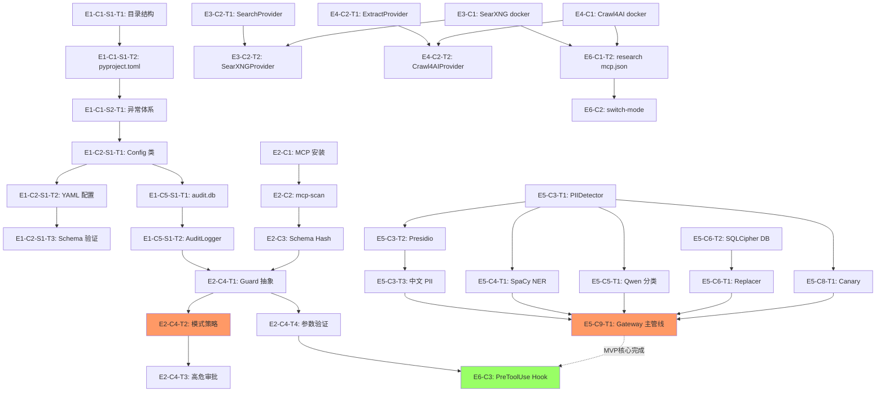

<!--
创建/修改该文件的LLM大模型：Arena.ai Agent Mode - Execution Lead Engineer
创建时间（北京时间）：2026-06-23 16:35:00
-->

# TASK_BACKLOG.md

> **文档版本**: v1.0.2 (源码状态收敛版)
> **生成日期**: 2026-06-21
> **最近同步**: 2026-06-25（联网功能最终收尾：本地密钥持久化与提取超时收敛完成）
> **调整说明**: 联网功能（Network Feature）是 **现有 FORGE Factory 项目上的增量模块**（_infra/network 子模块），而非独立新项目或整个项目的 MVP。所有目录/配置/CLI 均复用现有 FORGE 架构（_infra/、config/、_factory/patterns/、forge CLI）。
> **状态 SSOT**: §10 `Task 完成度跟踪表` 是任务状态唯一追踪表；单个 Task 详细 DoD 仅作为验收清单，状态变更必须同步 §10。
> **基准文档**: NETWORK_ENGINEERING_DESIGN.md (主要)、NETWORK_ARCHITECTURE_FINAL.md、PROJECT_DOSSIER_V3.md
> **目标受众**: Claude Code、Codex 等 AI Agent
> **任务粒度**: 单个 Task 可在一次独立开发会话内完成（约 30-90 分钟）

---

## 0. 文档使用说明

### 0.1 任务编号规则

```
E{N}-C{N}-S{N}-T{N}

E = Epic（业务能力域）
C = Capability（独立交付能力）
S = Story（功能目标）
T = Task（最小开发单元）

示例：E1-C2-S3-T4
```

### 0.2 状态标识

```
[ ] 未开始
[~] 进行中
[x] 已完成
[!] 阻塞
```

### 0.3 优先级标识

```
P0 = 必须完成（MVP）
P1 = 强烈建议
P2 = 可延后
P3 = 可选增强
```

---

## 1. Epic 总览

| Epic ID | Epic 名称 | 目标 | 优先级 | Phase |
|---------|-----------|------|--------|-------|
| **E1** | 基础设施与配置体系 | 项目骨架、配置加载、密钥管理、日志、审计 | P0 | Phase 1 |
| **E2** | MCP 安全治理层 | MCP server 准入、权限分层、Schema 校验、审计 | P0 | Phase 1 |
| **E3** | 搜索能力 | SearXNG 部署、API 封装、结果排序、缓存 | P0 | Phase 1 |
| **E4** | 内容提取能力 | Crawl4AI 部署、Markdown 提取、trafilatura fallback | P0 | Phase 1 |
| **E5** | 输入净化与隐私网关 | HTML 清洗、PII 检测、占位符替换、Canary | P0 | Phase 1 |
| **E6** | 模式隔离与 Claude Code 集成 | 三模式 .mcp.json、模式切换、PreToolUse hook | P0 | Phase 1 |
| **E7** | 浏览器自动化能力 | Playwright MCP、Profile 管理、Session 检测 | P1 | Phase 2 |
| **E8** | 私域访问能力 | Chrome DevTools MCP、AI-Private Profile、只读访问 | P1 | Phase 2 |
| **E9** | 本地 RAG 知识库 | SQLite + sqlite-vec、bge-m3、Reranker | P2 | Phase 3 |
| **E10** | 运维与可观测性 | 健康检查、自动恢复、备份、监控 | P1 | Phase 2 |
| **E11** | 安全测试与红队演练 | Prompt injection、MCP rug pull、Canary 测试 | P0 | Phase 1-3 |

---

## 2. Capability 总览

### Epic 1: 基础设施与配置体系

| Capability ID | 名称 | 描述 |
|---------------|------|------|
| E1-C1 | 项目骨架 | 目录结构、pyproject.toml、Makefile、README |
| E1-C2 | 配置管理 | Pydantic Settings、YAML 加载、多环境支持 |
| E1-C3 | 密钥管理 | .env、SQLCipher 密钥、密钥校验 |
| E1-C4 | 日志体系 | structlog、JSON 格式、文件 + 控制台输出 |
| E1-C5 | 审计层 | SQLite audit.db、AuditLogger、事件 schema |
| E1-C6 | 异常体系 | 统一异常类、错误码、错误响应格式 |

### Epic 2: MCP 安全治理层

| Capability ID | 名称 | 描述 |
|---------------|------|------|
| E2-C1 | MCP Server 安装管理 | git clone、commit pin、本地路径 |
| E2-C2 | mcp-scan 集成 | 安全扫描、whitelist 管理 |
| E2-C3 | Schema Hash 校验 | tool schema 计算、变更检测 |
| E2-C4 | PreToolUse Hook | 策略检查、参数验证、人工审批 |
| E2-C5 | MCP 审计 | 工具调用日志、schema 变更记录 |

### Epic 3: 搜索能力

| Capability ID | 名称 | 描述 |
|---------------|------|------|
| E3-C1 | SearXNG 部署 | Docker Compose、settings.yml、JSON API |
| E3-C2 | SearXNG API 客户端 | Python httpx 封装、错误处理 |
| E3-C3 | 结果排序与去重 | Domain reputation、URL 规范化 |
| E3-C4 | 搜索缓存 | SQLite LRU 缓存 |
| E3-C5 | 搜索 Fallback | Engine 切换、健康检查 |

### Epic 4: 内容提取能力

| Capability ID | 名称 | 描述 |
|---------------|------|------|
| E4-C1 | Crawl4AI 部署 | Docker、MCP 配置 |
| E4-C2 | Crawl4AI 客户端 | MCP SSE 调用、Markdown 清洗 |
| E4-C3 | trafilatura Fallback | 静态网页提取 |
| E4-C4 | 提取缓存 | SQLite 缓存 |

### Epic 5: 输入净化与隐私网关

| Capability ID | 名称 | 描述 |
|---------------|------|------|
| E5-C1 | Input Sanitizer | HTML 剥离、prompt injection 标记 |
| E5-C2 | Unicode 规范化 | NFKC、零宽字符、编码解码 |
| E5-C3 | Presidio 检测器 | Analyzer 封装、自定义中文 recognizers |
| E5-C4 | NER 检测器 | spaCy zh/en 集成 |
| E5-C5 | Qwen3 二分类器 | Ollama 调用、prompt 设计 |
| E5-C6 | 占位符替换 | Mapping 生成、加密存储 |
| E5-C7 | JSON Schema 验证 | 输出格式校验 |
| E5-C8 | Canary Token 监控 | Token 注入、命中检测 |
| E5-C9 | Privacy Gateway 主管线 | 7 层管线编排 |

### Epic 6: 模式隔离与 Claude Code 集成

| Capability ID | 名称 | 描述 |
|---------------|------|------|
| E6-C1 | 三模式 .mcp.json | Coding/Research/Private 配置 |
| E6-C2 | 模式切换脚本 | 软链接切换、状态显示 |
| E6-C3 | Claude Code Hook 集成 | PreToolUse hook 注册 |

### Epic 7: 浏览器自动化能力

| Capability ID | 名称 | 描述 |
|---------------|------|------|
| E7-C1 | Playwright MCP 安装 | 版本固定、本地路径 |
| E7-C2 | Playwright Orchestrator | 调用封装、错误处理 |
| E7-C3 | AI-Public Profile | Profile 创建、隔离 |
| E7-C4 | Session 检测器 | 登录页/CAPTCHA 关键词 |
| E7-C5 | 写操作审批流 | 风险分类、人工确认 |
| E7-C6 | Playwright CLI Wrapper | 受限命令 allowlist |

### Epic 8: 私域访问能力

| Capability ID | 名称 | 描述 |
|---------------|------|------|
| E8-C1 | Chrome DevTools MCP 安装 | 固定版本、参数配置 |
| E8-C2 | AI-Private Profile 管理 | 多账号 Profile、手动登录流程 |
| E8-C3 | Chrome DevTools 客户端 | 只读访问、cookie 拦截 |
| E8-C4 | 私域数据流 Privacy 集成 | full mode Privacy Gateway |

### Epic 9: 本地 RAG 知识库

| Capability ID | 名称 | 描述 |
|---------------|------|------|
| E9-C1 | SQLite + sqlite-vec 初始化 | Schema、扩展加载 |
| E9-C2 | bge-m3 Embedder | Ollama embeddings 封装 |
| E9-C3 | RAG Store CRUD | 文档/chunk 增删改查 |
| E9-C4 | 向量检索 | sqlite-vec KNN 查询 |
| E9-C5 | Reranker（可选） | bge-reranker-v2-m3 |

### Epic 10: 运维与可观测性

| Capability ID | 名称 | 描述 |
|---------------|------|------|
| E10-C1 | 健康检查脚本 | SearXNG/Crawl4AI/Ollama/DB |
| E10-C2 | launchd 守护进程 | 自动恢复、定时任务 |
| E10-C3 | 备份脚本 | 配置、DB 备份 |
| E10-C4 | Metrics 采集 | 运行指标记录 |
| E10-C5 | 定期 mcp-scan | 每周自动扫描 |

### Epic 11: 安全测试与红队演练

| Capability ID | 名称 | 描述 |
|---------------|------|------|
| E11-C1 | 单元测试基础设施 | pytest 配置、fixtures、mock |
| E11-C2 | Prompt Injection 测试 | 恶意网页、隐藏指令 |
| E11-C3 | MCP Rug Pull 测试 | Schema 变更检测 |
| E11-C4 | PII 绕过测试 | Unicode、Base64、零宽字符 |
| E11-C5 | Cookie 泄露测试 | document.cookie 拦截 |
| E11-C6 | Canary Token 端到端测试 | 完整链路监控 |

---

## 3. 任务详细列表

### Epic 1: 基础设施与配置体系

---

#### **E1-C1-S1: 项目骨架搭建**

##### **Task E1-C1-S1-T1: 在现有 FORGE Factory 中创建联网功能目录结构（增量模块）**

- **目标**: 按 NETWORK_ENGINEERING_DESIGN.md §3（调整后）在**现有 FORGE Factory 项目**的 `_infra/network/` 下创建增量目录树（不新建独立项目、不覆盖现有结构）
- **前置依赖**: 无
- **输入**: NETWORK_ENGINEERING_DESIGN.md §3 目录结构（已调整为 _infra 子模块）
- **输出**: `_infra/network/` 完整子目录树 + `.gitkeep` 占位（复用现有 FORGE 根 .gitignore、README 等）
- **涉及模块**: 项目骨架（作为 FORGE Factory 的增量 networking 模块）
- **涉及文件**:
  - 新建：`_infra/network/` 下所有 §3 列出的子目录（src/ 改为直接放在 `_infra/network/` 或轻量子包）
  - 新建：`_infra/network/README.md`（仅 networking 说明）
- **实现要求**:
  - **严格复用现有 FORGE 架构**：使用现有根目录的 pyproject / uv / .gitignore / Makefile；只在 `_infra/network/` 下放模块代码（不创建独立 pyproject.toml 或 src/forge_network/ 顶级结构）
  - `.gitignore` 复用根（已包含 runtime/ 等）
  - 所有配置放入根 `config/network.yaml`
- **测试要求**: 无（结构性任务）
- **验收标准**:
  - `_infra/network/` 目录树存在
  - `git status` 仅显示新 networking 子目录
  - 根目录结构保持不变
- **DoD**:
  - [x] _infra/network 目录结构完整（作为增量）
  - [x] 复用现有 FORGE 根配置
  - [x] _infra/network/README.md 可读

---

##### **Task E1-C1-S1-T2: 初始化 pyproject.toml**

- **目标**: 创建 Python 项目元数据 + 依赖声明
- **前置依赖**: E1-C1-S1-T1
- **输入**: §1.3 技术栈
- **输出**: `pyproject.toml`、`uv.lock`
- **涉及模块**: 项目骨架
- **涉及文件**:
  - 新建：`pyproject.toml`
- **实现要求**:
  - 使用 `uv` 作为包管理器
  - Python 版本要求：`>=3.11,<3.13`
  - 核心依赖：
    ```
    pydantic>=2.0
    pydantic-settings
    httpx
    structlog
    tenacity
    pyyaml
    presidio-analyzer
    presidio-anonymizer
    spacy
    ollama
    sqlite-vec
    sqlcipher3-binary
    rich
    click
    ```
  - 开发依赖：
    ```
    pytest
    pytest-asyncio
    pytest-cov
    pytest-mock
    ruff
    mypy
    ```
- **测试要求**: `uv sync` 成功
- **验收标准**:
  - `uv sync` 无错误
  - `python -c "import pydantic, httpx, structlog"` 成功
- **DoD**:
  - [x] pyproject.toml 完整
  - [x] uv.lock 生成
  - [x] 依赖可安装

---

##### **Task E1-C1-S1-T3: 创建 Makefile 快捷命令**

- **目标**: 提供常用命令快捷方式
- **前置依赖**: E1-C1-S1-T2
- **输入**: 开发常用操作
- **输出**: `Makefile`
- **涉及文件**: 新建 `Makefile`
- **实现要求**:
  - 必须包含以下 target：
    ```
    install     # uv sync
    test        # pytest tests/unit
    test-int    # pytest tests/integration
    test-e2e    # pytest tests/e2e
    test-sec    # pytest tests/security
    lint        # ruff check
    format      # ruff format
    typecheck   # mypy _infra/network/（如启用）
    health      # bash scripts/health-check.sh
    clean       # 清理 __pycache__ 等
    ```
- **测试要求**: `make help` 显示所有命令
- **验收标准**: 所有 target 可执行（即使依赖未完成）
- **DoD**:
  - [x] Makefile 创建
  - [x] make help 输出正常

---

#### **E1-C1-S2: 异常体系定义**

##### **Task E1-C1-S2-T1: 创建统一异常类**

- **目标**: 按 §9.1 定义所有异常类
- **前置依赖**: E1-C1-S1-T2
- **输入**: §9.1 异常分类
- **输出**: 异常类层次
- **涉及模块**: core/exceptions
- **涉及文件**: 新建 `_infra/network/exceptions.py`
- **实现要求**:
  - 基类 `NetworkAgentException`
  - 子类按 §9.1 分类：MCP / Search / Extract / Privacy / Browser
  - 每个异常包含 `code: str` 类属性
  - 关键异常（如 `PIIDetectedError`）包含上下文字段（`entities: List[PIIEntity]`）
- **测试要求**:
  - 单元测试：异常实例化 + code 正确
  - 测试 `raise/except` 继承关系
- **验收标准**:
  - 所有 §9.1 异常已定义
  - 异常包含错误码
  - 测试覆盖率 100%
- **DoD**:
  - [x] exceptions.py 实现
  - [x] tests/unit/test_exceptions.py 通过
  - [x] mypy 检查通过

---

#### **E1-C2-S1: 配置管理**

##### **Task E1-C2-S1-T1: 实现 Config 类（Pydantic Settings）**

- **目标**: 实现 §8.3 的 Config 类
- **前置依赖**: E1-C1-S2-T1
- **输入**: §8.3 多环境支持代码
- **输出**: Config 类
- **涉及模块**: core/config
- **涉及文件**:
  - 新建：`_infra/network/config_loader/loader.py`
  - 新建：`config/.env.example`
- **实现要求**:
  - 使用 `pydantic-settings` 的 `BaseSettings`
  - 支持从 `config/.env` 加载
  - 字段按 §8.3 定义
  - 提供 `load_yaml(path)` 静态方法
  - 提供 `models` / `privacy_policy` 属性懒加载 YAML
- **测试要求**:
  - 单元测试：默认值正确
  - 单元测试：环境变量覆盖
  - 单元测试：YAML 加载
- **验收标准**:
  - `Config()` 能正确加载
  - 环境变量优先级正确
  - YAML 文件不存在时报错清晰
- **DoD**:
  - [x] config.py 实现
  - [x] .env.example 创建
  - [x] tests/unit/test_config.py 通过
  - [x] mypy 通过

---

##### **Task E1-C2-S1-T2: 创建初始 YAML 配置文件**

- **目标**: 按 §8.1 创建所有 YAML 配置文件骨架
- **前置依赖**: E1-C2-S1-T1
- **输入**: §8.1 配置文件结构
- **输出**: 4 个 YAML 文件
- **涉及文件**:
  - 新建：`config/models.yaml`
  - 新建：`config/privacy_policy.yaml`
  - 新建：`config/searxng_settings.yml`
  - 新建：`config/mcp_lockfile.yaml`
- **实现要求**:
  - 内容按 §8.1 示例
  - 添加 YAML 注释说明每个字段
  - 使用 `${VAR}` 引用环境变量的字段需明确标注
- **测试要求**:
  - 单元测试：YAML 解析成功
  - 单元测试：Pydantic schema 验证通过
- **验收标准**:
  - 4 个 YAML 文件存在
  - `Config().models` 等属性可访问
- **DoD**:
  - [x] 4 个 YAML 创建
  - [x] Pydantic schema 已定义
  - [x] 单元测试通过

---

##### **Task E1-C2-S1-T3: 实现 YAML Pydantic Schema 验证**

- **目标**: 为 4 个 YAML 文件定义 Pydantic 模型
- **前置依赖**: E1-C2-S1-T2
- **输入**: 4 个 YAML 文件结构
- **输出**: schema 类
- **涉及文件**:
  - 新建：`_infra/network/config_loader/__init__.py`
  - 新建：`_infra/network/config_loader/schemas.py`
  - 新建：`config/privacy_policy.yaml` / `_infra/network/config_loader/schemas.py`
  - 新建：`config/mcp_lockfile.yaml` / `_infra/network/config_loader/schemas.py`
- **实现要求**:
  - 借鉴 FORGE Factory `config/schemas.py` 模式
  - 严格类型检查
  - 提供 `load_all_configs()` 交叉验证函数
- **测试要求**:
  - 单元测试：合法 YAML 通过
  - 单元测试：非法 YAML 报错
  - 单元测试：交叉引用一致性
- **验收标准**:
  - 所有 YAML schema 已定义
  - 交叉验证检测引用错误
- **DoD**:
  - [x] schemas 模块完整
  - [x] 单元测试通过（覆盖率 ≥ 90%）

---

#### **E1-C3-S1: 密钥管理**

##### **Task E1-C3-S1-T1: 实现密钥校验启动检查**

- **目标**: 启动时校验所有必需密钥存在
- **前置依赖**: E1-C2-S1-T1
- **输入**: 必需密钥列表
- **输出**: 校验函数
- **涉及文件**:
  - 新建：`_infra/network/core/secrets.py`
- **实现要求**:
  - 必需密钥：`SEARXNG_SECRET_KEY`、`PII_DB_ENCRYPTION_KEY`
  - 启动时检查，缺失则抛 `ConfigurationError` 并退出
  - 不输出密钥值到日志
- **测试要求**:
  - 单元测试：缺失密钥时报错
  - 单元测试：所有密钥存在时通过
- **验收标准**:
  - 缺失 SEARXNG_SECRET_KEY 时启动失败
  - 错误信息不含密钥值
- **DoD**:
  - [x] secrets.py 实现
  - [x] 单元测试通过

---

#### **E1-C4-S1: 日志体系**

##### **Task E1-C4-S1-T1: 实现 structlog 配置**

- **目标**: 按 §10.2 实现结构化日志
- **前置依赖**: E1-C2-S1-T1
- **输入**: §10.2 setup_logging 代码
- **输出**: 日志配置函数
- **涉及文件**:
  - 新建：`_infra/network/utils/logger.py`
- **实现要求**:
  - JSON 格式输出
  - 文件 handler（`runtime/logs/network-agent.log`）
  - 控制台 handler（开发环境彩色）
  - 自动创建 logs 目录
  - 提供 `get_logger(name)` 函数
- **测试要求**:
  - 单元测试：日志记录成功
  - 单元测试：JSON 格式正确
- **验收标准**:
  - 日志写入文件
  - JSON 可被 `jq` 解析
- **DoD**:
  - [x] logger.py 实现
  - [x] 单元测试通过

---

#### **E1-C5-S1: 审计层**

##### **Task E1-C5-S1-T1: 创建 audit.db Schema 与初始化脚本**

- **目标**: 按 §6.2.1 创建审计数据库
- **前置依赖**: E1-C2-S1-T1
- **输入**: §6.2.1 SQL
- **输出**: 初始化脚本
- **涉及文件**:
  - 新建：`_infra/network/scripts/init_audit_db.py`
  - 新建：`_infra/network/audit_log/schema.sql`
- **实现要求**:
  - 包含 `tool_calls`、`mcp_schema_changes`、`browser_sessions`、`browser_actions` 表
  - 包含所有索引
  - 幂等（IF NOT EXISTS）
- **测试要求**:
  - 单元测试：脚本可重复执行
  - 单元测试：表结构正确
- **验收标准**:
  - `python scripts/init_db.py` 创建 `runtime/audit.db`
  - 表存在且结构正确
- **DoD**:
  - [x] init_db.py 实现
  - [x] schema.sql 创建
  - [x] 单元测试通过

---

##### **Task E1-C5-S1-T2: 实现 AuditLogger 类**

- **目标**: 按 §5.7 实现 AuditLogger
- **前置依赖**: E1-C5-S1-T1
- **输入**: §5.7 接口定义、§6.1 AuditEvent 模型
- **输出**: AuditLogger 类 + AuditEvent 模型
- **涉及文件**:
  - 新建：`_infra/network/audit_log/logger.py`
  - 新建：`_infra/network/audit_log/models.py`
- **实现要求**:
  - 异步接口（`async def log`）
  - 使用 `aiosqlite` 或同步 SQLite + thread pool
  - 提供 `query(start, end, event_type)` 方法
  - JSON 字段使用 `json.dumps` 序列化
- **测试要求**:
  - 单元测试：log + query 往返
  - 单元测试：JSON 字段正确
  - 单元测试：时间范围过滤
- **验收标准**:
  - log 调用成功写入
  - query 返回正确结果
- **DoD**:
  - [x] logger.py / models.py 实现
  - [x] 单元测试覆盖率 ≥ 85%

---

### Epic 2: MCP 安全治理层

---

#### **E2-C1-S1: MCP Server 安装管理**

##### **Task E2-C1-S1-T1: 编写 MCP Server 安装脚本**

- **目标**: 实现 §5.2 安装规则脚本
- **前置依赖**: E1-C2-S1-T2
- **输入**: §5.2 安装规则
- **输出**: 安装脚本
- **涉及文件（已按增量架构落地到 `_infra/network/` 与根 `config/`）**:
  - 新建：`_infra/network/scripts/install_mcp.sh`
  - 新建：`config/mcp_lockfile.yaml`
  - 新建：`_infra/network/tests/unit/test_mcp_install_script.py`
  - 修改：`.gitignore`（忽略本地 `mcp-servers/` third-party checkout）
- **实现要求**:
  - 参数：`<server-name> <repo-url> <commit-hash>`
  - 流程：clone → checkout exact commit → lockfile-based dependency install → mcp-scan
  - 禁止使用 `@latest` / branch name / HEAD / `uvx` / `curl | sh`
  - 默认要求 `mcp-scan`；仅测试可通过 `FORGE_MCP_INSTALL_SKIP_SCAN=1` 跳过
  - 写入 `config/mcp_lockfile.yaml`（repo_url / commit_hash / local_path / scan_status / installed_at）
- **测试要求**:
  - 单元风格集成测试：本地 fake git repo clone + checkout + lockfile 更新
  - 安全测试：拒绝 `@latest` 与 branch name commit
- **验收标准**:
  - 脚本执行后 `mcp-servers/<name>/` 存在
  - lockfile 更新
- **DoD**:
  - [x] 脚本实现（`install_mcp.sh`）
  - [x] 文档说明用法
  - [x] 单元测试通过（`test_mcp_install_script.py`: 3 passed）

---

#### **E2-C2-S1: mcp-scan 集成**

##### **Task E2-C2-S1-T1: 集成 mcp-scan 工具**

- **目标**: 集成 mcp-scan 到安装流程与定期扫描
- **前置依赖**: E2-C1-S1-T1
- **输入**: §5.3 mcp-scan 用法
- **输出**: 扫描脚本 + 输出解析器
- **涉及文件（已按增量架构落地到 `_infra/network/`）**:
  - 新建：`_infra/network/mcp_guard/__init__.py`
  - 新建：`_infra/network/mcp_guard/scanner.py`
  - 新建：`_infra/network/scripts/scan_mcp.sh`
  - 新建：`_infra/network/scripts/scan-mcp.sh`（兼容 backlog 命名 wrapper）
  - 新建：`_infra/network/tests/unit/test_mcp_scanner.py`
- **实现要求**:
  - 调用 `mcp-scan scan --json`
  - 解析 JSON 输出为稳定 `MCPScanReport` / `MCPScanFinding`
  - 检测：tool poisoning、rug pull、schema 变化、PII / secrets 等 finding 容器（findings/issues/vulnerabilities/violations/warnings/errors）
  - 支持从 `config/mcp_lockfile.yaml` 读取 pinned local_path 批量扫描
  - 任一 finding、失败 status 或 mcp-scan 非 0 退出码均返回非 0
- **测试要求**:
  - 单元测试：解析 mcp-scan 输出
  - CLI 测试：`--from-json` clean 返回 0，有 finding 返回 1
  - lockfile local_path 解析测试
- **验收标准**:
  - 脚本可执行
  - 检测到问题时报告清晰
- **DoD**:
  - [x] scanner.py / scan_mcp.sh 实现
  - [x] 单元测试通过（`test_mcp_scanner.py`: 7 passed）

---

#### **E2-C3-S1: Schema Hash 校验**

##### **Task E2-C3-S1-T1: 实现 MCP Schema Hash 计算与比对**

- **目标**: 检测 MCP tool schema 变更
- **前置依赖**: E2-C2-S1-T1, E1-C5-S1-T2
- **输入**: MCP server schema、`mcp_lockfile.yaml`
- **输出**: Schema Hash 模块
- **涉及文件（已按增量架构落地到 `_infra/network/`）**:
  - 新建：`_infra/network/mcp_guard/schema_validator.py`
  - 新建：`_infra/network/tests/unit/test_mcp_schema_validator.py`
  - 修改：`_infra/network/mcp_guard/__init__.py`
- **实现要求**:
  - 支持接收 MCP `tools/list` response 或 tool list（transport-agnostic，供后续 MCP client / PreToolUse hook 复用）
  - SHA256 哈希 schema JSON（`json.dumps(sort_keys=True, separators=(',', ':'))` 规范化）
  - 哈希 payload 包含 tool name / description / inputSchema，覆盖 tool description rug pull
  - 与 `config/mcp_lockfile.yaml` 中 `servers.<server>.tools.<tool>.schema_hash` 比对
  - 首次见到 schema 自动 pin；后续 schema 变化时写入 `mcp_schema_changes` 表并抛 `MCPSchemaChangedError`
- **测试要求**:
  - 单元测试：相同 schema 哈希相同
  - 单元测试：首次 pin + 未变化通过
  - 单元测试：变更检测 + audit row 写入
  - 单元测试：tools/list 提取与 description mutation 检测
- **验收标准**:
  - Schema 变更被检测
  - 审计日志包含 old/new hash
- **DoD**:
  - [x] schema_validator.py 实现
  - [x] 单元测试通过（`test_mcp_schema_validator.py`: 6 passed）

---

#### **E2-C4-S1: PreToolUse Hook**

##### **Task E2-C4-S1-T1: 设计 MCP Guard 核心抽象**

- **目标**: 实现 MCPGuard 类和数据模型
- **前置依赖**: E1-C1-S2-T1, E1-C5-S1-T2
- **输入**: §5.1 抽象、§5.7 AuditLogger
- **输出**: MCPGuard 类
- **涉及文件（已按增量架构落地到 `_infra/network/`）**:
  - 新建：`_infra/network/mcp_guard/models.py`
  - 新建：`_infra/network/mcp_guard/guard.py`
  - 新建：`_infra/network/tests/unit/test_mcp_guard.py`
  - 修改：`_infra/network/mcp_guard/__init__.py`
- **实现要求**:
  - 定义 `MCPToolCall`、`MCPToolResult`、`GuardDecision`、`PolicyDecision` 模型
  - `MCPGuard.check(call) -> GuardDecision` 接口
  - 决策结果：allow / deny / require_approval
  - 所有决策必须写审计日志（仅记录 arg_keys，不记录 raw args）
  - 支持 schema hash verification；schema 变更时 deny + audit，并返回 `schema_changed` decision
- **测试要求**:
  - 单元测试：模型实例化
  - 单元测试：check 返回 allow / require_approval / deny(schema changed)
  - 单元测试：审计写入且不泄露 raw arg value
  - 单元测试：record_schema / verify_schema 方法
- **验收标准**:
  - check 接口可调用
  - 决策可追溯
- **DoD**:
  - [x] guard.py / models.py 实现
  - [x] 单元测试通过（`test_mcp_guard.py`: 7 passed）

---

##### **Task E2-C4-S1-T2: 实现模式权限策略**

- **目标**: 按 §4 实现三模式工具策略
- **前置依赖**: E2-C4-S1-T1
- **输入**: §4 三模式定义
- **输出**: 模式策略引擎
- **涉及文件（已按增量架构落地到 `_infra/network/` 与根 `config/`）**:
  - 新建：`_infra/network/mcp_guard/mode_policy.py`
  - 新建：`config/mode_policies.yaml`
  - 新建：`_infra/network/tests/unit/test_mcp_mode_policy.py`
  - 修改：`_infra/network/mcp_guard/guard.py`
  - 修改：`_infra/network/mcp_guard/__init__.py`
- **实现要求**:
  - 配置驱动（`config/mode_policies.yaml`）
  - 三个模式：coding / research / private
  - 每个模式定义 `allowed_servers`、`denied_servers`、`allowed_tools`、`forbidden_tools`
  - `check_mode_policy(call) -> bool`
  - MCPGuard 默认启用 mode policy；命中拒绝时写 audit，reason 形如 `server_denied:*` / `tool_forbidden:*`
- **测试要求**:
  - 单元测试：coding 模式拒绝 browser
  - 单元测试：research 模式拒绝 shell
  - 单元测试：private 模式只读
  - 单元测试：配置变更加载后立即生效
  - 单元测试：MCPGuard mode policy deny / allow+schema check 均可审计
- **验收标准**:
  - 三模式策略正确执行
  - 配置变更后立即生效
- **DoD**:
  - [x] mode_policy.py 实现
  - [x] mode_policies.yaml 创建
  - [x] 单元测试通过（`test_mcp_mode_policy.py`: 6 passed）

---

##### **Task E2-C4-S1-T3: 实现高危工具人工审批流**

- **目标**: 写操作触发人工确认
- **前置依赖**: E2-C4-S1-T2
- **输入**: §7.3 写操作流程
- **输出**: 审批模块
- **涉及文件（已按增量架构落地到 `_infra/network/`）**:
  - 新建：`_infra/network/mcp_guard/approval.py`
  - 新建：`_infra/network/tests/unit/test_mcp_approval.py`
  - 修改：`_infra/network/mcp_guard/guard.py`
  - 修改：`_infra/network/mcp_guard/__init__.py`
- **实现要求**:
  - 高危操作清单：post / comment / DM / like / buy / purchase / pay / delete / edit_profile / send_email / submit_form
  - 触发条件：tool name 或 arguments 匹配
  - 审批方式：CLI 输入严格小写 `yes`（与 FORGE DataPrivacyGate 一致）
  - 审批仅对当前 `check()` 调用生效，不缓存批准
  - 写审计日志；audit 仅记录 arg_keys / matched_terms，不记录 raw args
- **测试要求**:
  - 单元测试：高危操作识别
  - 单元测试：审批流程（mock input）
  - 单元测试：拒绝时阻断
  - 单元测试：非高危操作不触发 input
- **验收标准**:
  - 高危操作必须审批
  - "yes" 之外输入视为拒绝
- **DoD**:
  - [x] approval.py 实现
  - [x] 单元测试通过（`test_mcp_approval.py`: 6 passed）

---

##### **Task E2-C4-S1-T4: 实现参数安全验证**

- **目标**: 拦截危险参数（cookie、JS eval、文件外读）
- **前置依赖**: E2-C4-S1-T1
- **输入**: §13.1 cookie 防护、§5.4 注入防护
- **输出**: 参数验证器
- **涉及文件（已按增量架构落地到 `_infra/network/`）**:
  - 新建：`_infra/network/mcp_guard/argument_validator.py`
  - 新建：`_infra/network/tests/unit/test_mcp_argument_validator.py`
  - 修改：`_infra/network/mcp_guard/guard.py`
  - 修改：`_infra/network/mcp_guard/__init__.py`
- **实现要求**:
  - 黑名单：`document.cookie`、`localStorage`、`sessionStorage`、`eval(`、`Function(` 字符串
  - URL allowlist 检查（可配置 `allowed_url_domains`，支持子域）
  - 最大参数长度限制
  - 检测 PII / secret 在参数中（复用 deterministic common PII 与 secret recognizers）
  - 失败时返回 deny + 明确原因，并写审计日志；audit 不记录 raw args
- **测试要求**:
  - 单元测试：document.cookie 拦截
  - 单元测试：URL 白名单
  - 单元测试：长度限制
  - 单元测试：secret / PII 参数拦截
  - 单元测试：MCPGuard 集成拒绝并审计
- **验收标准**:
  - 危险参数被拦截
  - 错误信息明确
- **DoD**:
  - [x] argument_validator.py 实现
  - [x] 单元测试通过（`test_mcp_argument_validator.py`: 7 passed）

---

### Epic 3: 搜索能力

---

#### **E3-C1-S1: SearXNG 部署**

##### **Task E3-C1-S1-T1: 编写 docker-compose.yml**

- **目标**: SearXNG Docker 部署
- **前置依赖**: 无
- **输入**: §6.1 部署方式
- **输出**: docker-compose 配置
- **涉及文件（已按现有 FORGE 增量架构落地到根 `docker/`）**:
  - 新建：`docker/docker-compose.yml`
  - 新建：`docker/README.md`
  - 新建：`_infra/network/tests/unit/test_docker_services.py`
- **实现要求**:
  - 端口绑定 `127.0.0.1:8080`（仅本地）
  - volume 挂载 `docker/searxng/settings.yml`
  - 镜像版本固定为可覆盖环境变量默认值（不使用裸 `latest`）
  - `restart: unless-stopped`
- **测试要求**:
  - 静态测试：compose YAML 可解析，端口仅绑定本机，未使用 `:latest`，healthcheck 存在
  - 真机运行验证：需用户 Mac 安装 Docker 后执行 `cd docker && docker compose up -d`
- **验收标准**:
  - `docker compose up -d` 后 `curl http://127.0.0.1:8080/search?q=test&format=json` 返回 JSON
- **DoD**:
  - [x] docker-compose.yml 创建
  - [x] 静态测试通过（`test_docker_services.py`: 4 passed）
  - [ ] 真机手动启动验证（需 Docker 环境）

---

##### **Task E3-C1-S1-T2: 编写 SearXNG settings.yml**

- **目标**: 按 §6.1 配置 SearXNG
- **前置依赖**: E3-C1-S1-T1
- **输入**: §6.1 关键配置
- **输出**: settings.yml
- **涉及文件（已按现有 FORGE 增量架构落地到根 `docker/`）**:
  - 新建：`docker/searxng/settings.yml`
- **实现要求**:
  - 启用 JSON format
  - secret_key 从环境变量占位读取：`${SEARXNG_SECRET_KEY}`
  - engines：DuckDuckGo / Bing / Wikipedia / GitHub / StackOverflow / arXiv
  - Google 禁用
  - request_timeout: 3.0 / max_request_timeout: 6.0
- **测试要求**:
  - 静态测试：settings YAML 可解析，json format 启用，Google disabled，timeout 配置正确
  - 真机运行验证：启动 SearXNG 后 JSON 接口可用
- **验收标准**:
  - JSON 返回正常
  - 禁用 engine 不调用
- **DoD**:
  - [x] settings.yml 创建
  - [x] 静态测试通过（`test_docker_services.py`: 4 passed）
  - [ ] 真机 curl 测试（需 Docker 环境）

---

#### **E3-C2-S1: SearXNG API 客户端**

##### **Task E3-C2-S1-T1: 实现 SearchProvider 抽象基类**

- **目标**: 按 §5.2 定义抽象接口
- **前置依赖**: E1-C1-S2-T1
- **输入**: §5.2 SearchProvider 接口
- **输出**: 抽象类 + 数据模型
- **涉及文件**:
  - 新建：`_infra/network/search/base.py`
  - 新建：`_infra/network/search/models.py`
- **实现要求**:
  - 定义 `SearchQuery`、`SearchResult` Pydantic 模型
  - 定义 `SearchProvider` ABC
- **测试要求**:
  - 单元测试：模型实例化
  - 单元测试：ABC 不可直接实例化
- **验收标准**:
  - 接口清晰、类型完整
- **DoD**:
  - [x] base.py / models.py 实现
  - [x] 单元测试通过

---

##### **Task E3-C2-S1-T2: 实现 SearXNGProvider**

- **目标**: 按 §5.2 实现 SearXNG 调用
- **前置依赖**: E3-C2-S1-T1, E3-C1-S1-T2
- **输入**: SearXNG JSON API
- **输出**: SearXNGProvider 类
- **涉及文件**:
  - 新建：`_infra/network/search/searxng_client.py`
- **实现要求**:
  - 使用 `httpx.AsyncClient`
  - 调用 `/search?q={query}&format=json`
  - 超时 10s（§9.3）
  - 错误处理：429 / 503 → `SearchEngineUnavailableError`
  - 重试策略（§9.2，3 次指数退避）
- **测试要求**:
  - 单元测试：mock httpx 响应
  - 单元测试：错误处理
  - 集成测试：真实调用 SearXNG（标记为 @integration）
- **验收标准**:
  - 真实搜索返回结果
  - 错误正确抛出
- **DoD**:
  - [x] searxng_client.py 实现
  - [x] 单元测试覆盖率 ≥ 85%
  - [x] 集成测试通过

---

#### **E3-C3-S1: 结果排序与去重**

##### **Task E3-C3-S1-T1: 实现 URL 规范化**

- **目标**: 去除 tracking 参数、规范化 URL
- **前置依赖**: E3-C2-S1-T1
- **输入**: 任意 URL
- **输出**: 规范化函数
- **涉及文件**:
  - 新建：`_infra/network/search/url_normalizer.py`
- **实现要求**:
  - 移除 tracking 参数：utm_*、fbclid、gclid 等
  - 统一 scheme（强制 https）
  - 移除末尾 `/`
  - 小写 hostname
- **测试要求**:
  - 单元测试：常见 tracking 参数
  - 单元测试：相同 URL 不同表示 → 同一规范化结果
- **验收标准**:
  - URL 去重生效
- **DoD**:
  - [x] url_normalizer.py 实现
  - [x] 单元测试覆盖率 ≥ 95%

---

##### **Task E3-C3-S1-T2: 实现 Domain Reputation Scoring**

- **目标**: 按 §6.2 实现域名评分
- **前置依赖**: E3-C3-S1-T1
- **输入**: SearchResult 列表
- **输出**: 评分函数
- **涉及文件**:
  - 新建：`_infra/network/search/result_scorer.py`
  - 新建：`config/domain_reputation.yaml`
- **实现要求**:
  - 加分域名：github.com / arxiv.org / *.edu / mdn.io / docs.* / wikipedia.org
  - 减分域名：SEO farm / AI-generated spam 列表
  - 评分 0.0-1.0
  - 配置驱动（domain_reputation.yaml）
- **测试要求**:
  - 单元测试：高信誉域名得分高
  - 单元测试：spam 域名得分低
- **验收标准**:
  - 排序结果合理
- **DoD**:
  - [x] result_scorer.py 实现
  - [x] domain_reputation.yaml 创建
  - [x] 单元测试通过

---

#### **E3-C4-S1: 搜索缓存**

##### **Task E3-C4-S1-T1: 实现 SearchCache**

- **目标**: 按 §11.2 实现搜索缓存
- **前置依赖**: E3-C2-S1-T2
- **输入**: §11.2 代码
- **输出**: SearchCache 类
- **涉及文件**:
  - 新建：`_infra/network/search/cache.py`
- **实现要求**:
  - SQLite 存储
  - 默认 TTL 1 小时
  - LRU 限制（1000 条）
  - 查询哈希 = SHA256(query + max_results + language)
- **测试要求**:
  - 单元测试：set / get 往返
  - 单元测试：过期自动失效
  - 单元测试：LRU 淘汰
- **验收标准**:
  - 缓存命中时减少调用
- **DoD**:
  - [x] cache.py 实现
  - [x] 单元测试通过

---

#### **E3-C5-S1: 搜索 Fallback 与风控熔断**

##### **Task E3-C5-S1-T1: 搜索引擎反爬风控系统性加固**

- **状态**: DONE
- **目标**: 按当前用户 P0 指令“附录 1”处理搜索引擎连续 CAPTCHA / 429 / challenge 风控问题，在不替换 SearXNG Primary Search 的前提下实现 Engine Matrix、熔断、自愈降级与 API 兜底。
- **前置依赖**: E3-C1-S1-T2, E3-C2-S1-T2, E3-C3-S1-T1, E3-C4-S1-T1
- **输入**: 当前对话附录 1、NETWORK_ARCHITECTURE_FINAL.md §6.3、NETWORK_ENGINEERING_DESIGN.md §9.4/§9.5
- **输出**: circuit-broken multi-source search fallback layer
- **涉及文件**:
  - 新增：`_infra/network/search/circuit_breaker.py`
  - 新增：`_infra/network/search/api_providers.py`
  - 新增：`_infra/network/search/orchestrator.py`
  - 新增：`_infra/network/extract/curl_cffi_fallback.py`
  - 修改：`_infra/network/search/searxng_client.py`
  - 修改：`_infra/network/network_workflow/workflow.py`
  - 修改：`_infra/network/extract/extractor_chain.py`
  - 修改：`docker/searxng/settings.yml`
  - 修改：`config/network.yaml`
  - 修改：`scripts/diagnostics/test_engine_risk_control.py`
  - 修改：`requirements.txt`
- **实现要求**:
  - SearXNG settings.yml 使用 anti-risk-control engine matrix，禁用 Google/Brave/Startpage/DDG scraping 主路径。
  - `SearXNGProvider` 支持 tiered engine pools 与 `unresponsive_engines` 反馈解析。
  - 每个上游 engine 有独立熔断状态、冷却与 half-open 探测。
  - `MultiSourceSearchOrchestrator` 保持 `SearchProvider` 接口兼容，支持 intent route、SearXNG tier fallback、可选 API fallback。
  - Brave/Tavily/Serper 仅在对应环境变量存在时自动加载，不保存密钥。
  - `CurlCffiProvider` 仅作为特定 TLS guarded public domain 的可选提取 fallback，不替换 Crawl4AI。
  - 诊断脚本输出 CAPTCHA 指纹、快照、Prometheus metrics 与 JSON report。
- **测试要求**:
  - 单元测试：熔断器 open/half-open/recovery。
  - 单元测试：orchestrator intent detection 与 API fallback。
  - 单元测试：curl_cffi optional provider 不破坏无依赖环境。
  - 全量 network unit/security tests 通过。
  - 静态检查：compileall 通过。
- **验收标准**:
  - 无 API key 环境下仍可通过 SearXNG tier fallback 工作。
  - 有 API key 环境下可自动加载对应 fallback provider。
  - 搜索链路不再反复调用已 CAPTCHA / 429 的引擎。
  - 真机 SearXNG 可按新 settings.yml 重启验证。
- **DoD**:
  - [x] 功能实现完成
  - [x] 相关测试通过：`357 passed, 2 skipped, 44 warnings`
  - [x] 静态检查通过：`python3 -m compileall -q _infra/network scripts/diagnostics`
  - [x] 所有相关文档更新完成
  - [x] TASK_BACKLOG.md 状态已更新
  - [x] docs/DEV_LOG.md 已记录
  - [x] 验收标准全部满足（真机 API / Docker 验证待用户本地执行）

---

### Epic 4: 内容提取能力

---

#### **E4-C1-S1: Crawl4AI 部署**

##### **Task E4-C1-S1-T1: 添加 Crawl4AI 到 docker-compose**

- **目标**: 在 FORGE Network docker-compose 中部署 Crawl4AI
- **前置依赖**: E3-C1-S1-T1
- **输入**: NETWORK_ARCHITECTURE_FINAL.md §7.1
- **输出**: Crawl4AI Docker service
- **涉及文件（已按现有 FORGE 增量架构落地到根 `docker/`）**:
  - 修改：`docker/docker-compose.yml`
  - 修改：`docker/README.md`
  - 新建/复用：`_infra/network/tests/unit/test_docker_services.py`
- **实现要求**:
  - 端口绑定 `127.0.0.1:11235:11235`
  - `shm_size: 1g`
  - `restart: unless-stopped`
  - 默认禁用 JS（`CRAWL4AI_DISABLE_JS=true`），高危 JS 执行后续通过审批流处理
- **测试要求**:
  - 静态测试：compose 中 crawl4ai service 存在，端口仅本机，未使用 `:latest`，healthcheck 存在
  - 真机运行验证：`curl http://127.0.0.1:11235/health`
- **验收标准**:
  - Crawl4AI health check 正常
- **DoD**:
  - [x] docker-compose 更新
  - [x] 静态测试通过（`test_docker_services.py`: 4 passed）
  - [ ] 真机健康检查（需 Docker 环境）

---

#### **E4-C2-S1: Crawl4AI 客户端**

##### **Task E4-C2-S1-T1: 实现 ExtractProvider 抽象**

- **目标**: 按 §5.3 定义抽象
- **前置依赖**: E1-C1-S2-T1
- **输入**: §5.3 ExtractProvider 接口
- **输出**: 抽象类 + 数据模型
- **涉及文件**:
  - 新建：`_infra/network/extract/base.py`
  - 新建：`_infra/network/extract/models.py`
- **实现要求**:
  - 定义 `ExtractRequest`、`ExtractResult` 模型
  - 定义 `ExtractProvider` ABC
- **测试要求**: 单元测试通过
- **验收标准**: 接口完整
- **DoD**:
  - [x] base.py / models.py 实现
  - [x] 单元测试通过

---

##### **Task E4-C2-S1-T2: 实现 Crawl4AIProvider**

- **目标**: 实现 Crawl4AI 调用
- **前置依赖**: E4-C2-S1-T1, E4-C1-S1-T1
- **输入**: Crawl4AI API
- **输出**: Crawl4AIProvider 类
- **涉及文件**:
  - 新建：`_infra/network/extract/crawl4ai_client.py`
- **实现要求**:
  - HTTP API 调用（不强制 MCP）
  - 超时 30s
  - 默认禁用 execute_js
  - screenshot 需审批参数
- **测试要求**:
  - 单元测试：mock 响应
  - 集成测试：真实提取 example.com
- **验收标准**:
  - Markdown 提取成功
- **DoD**:
  - [x] crawl4ai_client.py 实现
  - [x] 单元测试覆盖率 ≥ 85%

---

##### **Task E4-C2-S1-T3: 实现 Markdown 清洗**

- **目标**: Markdown 后处理
- **前置依赖**: E4-C2-S1-T2
- **输入**: 原始 Markdown
- **输出**: 清洗函数
- **涉及文件**:
  - 新建：`_infra/network/extract/markdown_cleaner.py`
- **实现要求**:
  - 移除多余空行
  - 移除内联广告
  - 限制最大长度 8k chars（§6.4）
  - 长文分块
- **测试要求**: 单元测试覆盖
- **验收标准**: Markdown 长度受控
- **DoD**:
  - [x] markdown_cleaner.py 实现
  - [x] 单元测试通过

---

#### **E4-C3-S1: trafilatura Fallback**

##### **Task E4-C3-S1-T1: 实现 TrafilaturaProvider**

- **目标**: 静态网页 fallback
- **前置依赖**: E4-C2-S1-T1
- **输入**: §7.2 用途
- **输出**: TrafilaturaProvider 类
- **涉及文件**:
  - 新建：`_infra/network/extract/trafilatura_fallback.py`
- **实现要求**:
  - 使用 `trafilatura` Python 库
  - 无浏览器、纯静态提取
  - 失败时返回空内容（不抛异常）
- **测试要求**:
  - 单元测试：静态 HTML 提取
- **验收标准**:
  - 静态页面提取成功
- **DoD**:
  - [x] trafilatura_fallback.py 实现
  - [x] 单元测试通过

---

### Epic 5: 输入净化与隐私网关

---

#### **E5-C1-S1: Input Sanitizer**

##### **Task E5-C1-S1-T1: 实现 HTML 剥离与脚本移除**

- **目标**: 按 §9 实现 Input Sanitizer
- **前置依赖**: E1-C1-S2-T1
- **输入**: §9 职责
- **输出**: InputSanitizer 类
- **涉及文件**:
  - 新建：`_infra/network/input_sanitizer/sanitizer.py`
- **实现要求**:
  - 移除 `<script>` / `<style>` / `<iframe>` 标签
  - 移除 HTML 注释
  - 保留纯文本与必要 markdown
  - 标记 `untrusted_data: true`
  - 强制保留 provenance（source URL）
- **测试要求**:
  - 单元测试：script 标签移除
  - 单元测试：纯文本保留
  - 单元测试：provenance 保留
- **验收标准**:
  - 输出不含可执行内容
- **DoD**:
  - [x] input_sanitizer.py 实现
  - [x] 单元测试覆盖率 ≥ 90%

---

##### **Task E5-C1-S1-T2: 实现 Prompt Injection 标记检测**

- **目标**: 检测并移除注入指令段落
- **前置依赖**: E5-C1-S1-T1
- **输入**: §13.5 prompt injection 缓解
- **输出**: 注入检测函数
- **涉及文件**: 修改 `_infra/network/input_sanitizer/sanitizer.py`
- **实现要求**:
  - 检测关键词：`ignore previous instructions`、`忽略之前的指令`、`system:`、`<|im_start|>` 等
  - 检测隐藏文本（`display:none` 内容）
  - 移除可疑段落
  - Spotlighting：用 ``` 包裹剩余外部内容
- **测试要求**:
  - 安全测试：恶意网页 prompt injection
  - 安全测试：隐藏指令检测
- **验收标准**:
  - 注入指令被移除
  - 合法内容保留
- **DoD**:
  - [x] 检测逻辑完善
  - [x] 安全测试通过

---

#### **E5-C2-S1: Unicode 规范化**

##### **Task E5-C2-S1-T1: 实现 Unicode 预处理**

- **目标**: 按 §10.4 实现 Unicode 规范化
- **前置依赖**: E1-C1-S2-T1
- **输入**: §10.4 代码
- **输出**: 规范化函数
- **涉及文件**:
  - 新建：`_infra/network/utils/unicode_norm.py`
- **实现要求**:
  - NFKC 规范化
  - 移除零宽字符（U+200B-U+200D、U+FEFF）
  - URL decoding
  - 可选 Base64 检测与 decode
- **测试要求**:
  - 单元测试：NFKC 同形字符合并
  - 单元测试：零宽字符移除
  - 安全测试：`138-５５５５-１２３４` 还原为 `138-5555-1234`
- **验收标准**:
  - 全角 / 半角统一
  - 零宽绕过失效
- **DoD**:
  - [x] unicode_norm.py 实现
  - [x] 单元测试覆盖率 ≥ 95%

---

#### **E5-C3-S1: Presidio 检测器**

##### **Task E5-C3-S1-T1: 实现 PIIDetector 抽象基类**

- **目标**: 按 §5.4 定义检测器抽象
- **前置依赖**: E1-C1-S2-T1
- **输入**: §5.4 PIIDetector 接口
- **输出**: 抽象类 + 模型
- **涉及文件（已按增量架构落地到 `_infra/network/`）**:
  - 已实现：`_infra/network/privacy_gateway/detectors/base.py`
  - 已实现：`_infra/network/privacy_gateway/models.py`
  - 已修复：`_infra/network/privacy_gateway/detectors/__init__.py` lazy-load，避免 ABC 导入依赖 `presidio_analyzer`
  - 已导出：`_infra/network/privacy_gateway/__init__.py`
- **实现要求**:
  - 定义 `PIIType` Enum
  - 定义 `PIIEntity` 模型
  - 定义 `PIIDetector` ABC
  - ABC 与基础模型可在未安装 Presidio 的最小环境独立导入和测试
- **测试要求**: 单元测试通过
- **验收标准**: 接口完整，且不被具体检测器可选依赖污染
- **DoD**:
  - [x] base.py / models.py 实现
  - [x] 顶层 / detectors 包导入隔离完成
  - [x] 单元测试通过（`test_pii_detector.py`: 17 passed）

---

##### **Task E5-C3-S1-T2: 实现 PresidioDetector**

- **目标**: 集成 Microsoft Presidio
- **前置依赖**: E5-C3-S1-T1
- **输入**: Presidio API
- **输出**: PresidioDetector 类
- **涉及文件（已按增量架构落地到 `_infra/network/`）**:
  - 已实现：`_infra/network/privacy_gateway/detectors/presidio_detector.py`
  - 已测试：`_infra/network/tests/unit/test_presidio_detector.py`
- **实现要求**:
  - 使用 `AnalyzerEngine`
  - 默认 recognizers：EMAIL_ADDRESS、PHONE_NUMBER、CREDIT_CARD、IP_ADDRESS
  - 同步 Presidio 调用包装为 async（线程池）
  - 超时 5s
- **测试要求**:
  - 单元测试：邮箱检测
  - 单元测试：电话检测
  - 单元测试：信用卡检测
  - 最小沙箱未安装 `presidio_analyzer` 时依赖门控跳过，不阻塞基础单测集合
- **验收标准**:
  - 标准 PII 类型检测
- **DoD**:
  - [x] presidio_detector.py 实现
  - [x] 单元测试文件存在并已做可选依赖门控

---

##### **Task E5-C3-S1-T3: 实现中文 PII 自定义 Recognizers**

- **目标**: 按 §10.3 实现中文 PII
- **前置依赖**: E5-C3-S1-T2
- **输入**: §10.3 自定义列表
- **输出**: 自定义 recognizers
- **涉及文件（已按增量架构落地到 `_infra/network/`）**:
  - 已实现：`_infra/network/privacy_gateway/recognizers/cn_recognizers.py`
  - 已测试：`_infra/network/tests/unit/test_cn_recognizers.py`
- **实现要求**:
  - `CN_PHONE`（11 位 1[3-9]\d{9}）
  - `CN_ID_CARD`（18 位 + 校验位）
  - `BANK_CARD_LUHN`（Luhn 校验）
  - `CN_ADDRESS`（省市区关键词）
  - 注册到 PresidioDetector / ad-hoc recognizers
- **测试要求**:
  - 单元测试：中国手机号
  - 单元测试：身份证号 + 校验
  - 单元测试：银行卡 recognizer 导出（Luhn 严格校验后续在 T4/主管线前复核）
  - 安全测试：中文 PII ad-hoc 检测
  - 最小沙箱未安装 `presidio_analyzer` 时依赖门控跳过，不阻塞基础单测集合
- **验收标准**:
  - 中文 PII recognizer 基础能力存在
- **DoD**:
  - [x] cn_recognizers.py 实现
  - [x] 单元测试文件存在并已做可选依赖门控

---

##### **Task E5-C3-S1-T4: 实现 Token / API Key Recognizers**

- **目标**: 检测 token / API key
- **前置依赖**: E5-C3-S1-T2
- **输入**: §10.3 TOKEN / SESSION_ID / COOKIE / JWT / API_KEY / PRIVATE_KEY / OAuth
- **输出**: 自定义 recognizers + 轻量 deterministic regex scanner
- **涉及文件（已按增量架构落地到 `_infra/network/`）**:
  - 新建：`_infra/network/privacy_gateway/recognizers/secret_recognizers.py`
  - 修改：`_infra/network/privacy_gateway/models.py`（补充 `SESSION_ID` / `COOKIE` / `OAUTH_TOKEN`）
  - 修改：`_infra/network/privacy_gateway/detectors/presidio_detector.py`（注册 secret recognizers + 类型映射）
  - 新建：`_infra/network/tests/unit/test_secret_recognizers.py`
- **实现要求**:
  - JWT 格式：`eyJ...`
  - GitHub PAT：`ghp_*`、`github_pat_*`
  - OpenAI Key：`sk-*`
  - AWS Key：`AKIA*` / `ASIA*`
  - SSH / OpenSSH Private Key 头部
  - Cookie / Set-Cookie / Session ID 关键词
  - OAuth Bearer token / access_token / refresh_token assignment
  - 未安装 `presidio_analyzer` 时基础 regex scanner 仍可独立测试
- **测试要求**:
  - 单元测试：每种类型
  - 单元测试：结果排序与重叠去重
  - 单元测试：Presidio recognizer 构造的可选依赖行为
- **验收标准**:
  - secret 检测完整
- **DoD**:
  - [x] secret_recognizers.py 实现
  - [x] 单元测试通过（`test_secret_recognizers.py`: 12 passed）

---

#### **E5-C4-S1: NER 检测器**

##### **Task E5-C4-S1-T1: 实现 SpaCyNERDetector**

- **目标**: 按 §10.5 集成 spaCy
- **前置依赖**: E5-C3-S1-T1
- **输入**: spaCy API
- **输出**: SpaCyNERDetector 类
- **涉及文件（已按增量架构落地到 `_infra/network/`）**:
  - 新建：`_infra/network/privacy_gateway/detectors/ner_detector.py`
  - 新建：`_infra/network/scripts/download_spacy_models.py`
  - 新建：`_infra/network/tests/unit/test_ner_detector.py`
  - 修改：`_infra/network/privacy_gateway/detectors/__init__.py`（lazy-load `SpaCyNERDetector`）
- **实现要求**:
  - 加载 `zh_core_web_sm` + `en_core_web_sm`
  - 识别：PERSON / PER / ORG / GPE / LOC / FAC
  - 映射到 `PIIType.PERSON` / `ORGANIZATION` / `LOCATION`
  - 提供下载脚本（`python _infra/network/scripts/download_spacy_models.py`）
  - 未安装 spaCy 模型时导入安全，检测返回空结果；单元测试通过依赖注入 fake NLP 避免真实模型下载
- **测试要求**:
  - 单元测试：中文人名 / 地点
  - 单元测试：英文人名 / 组织 / 地点
  - 单元测试：unsupported labels 过滤
  - 单元测试：无模型 graceful degradation
- **验收标准**:
  - 人名 / 组织 / 地点识别结果可转换为 PIIEntity
- **DoD**:
  - [x] ner_detector.py 实现
  - [x] 模型下载脚本
  - [x] 单元测试通过（`test_ner_detector.py`: 7 passed）

---

#### **E5-C5-S1: Qwen3 二分类器**

##### **Task E5-C5-S1-T1: 实现 QwenPIIClassifier**

- **目标**: 按 §10.6 实现 Qwen 复核
- **前置依赖**: E5-C3-S1-T1
- **输入**: Ollama qwen3:8b
- **输出**: QwenPIIClassifier 类
- **涉及文件（已按增量架构落地到 `_infra/network/`）**:
  - 新建：`_infra/network/privacy_gateway/detectors/qwen_classifier.py`
  - 新建：`_infra/network/tests/unit/test_qwen_classifier.py`
  - 修改：`_infra/network/privacy_gateway/detectors/__init__.py`（lazy-load `QwenPIIClassifier`）
- **实现要求**:
  - 使用 `ollama` Python 客户端（可选依赖，运行时 lazy import）
  - prompt：仅询问是/否/不确定
  - 限制 `num_predict=10`（Ollama 对应 max tokens）
  - temperature=0.0
  - 超时 10s
  - **仅作为复核**，不作为唯一判定
  - 缺失 Ollama / 调用异常 / 超时均降级为 `uncertain`，不抛异常、不阻断主流程
- **测试要求**:
  - 单元测试：fake Ollama client
  - 单元测试：是/否/不确定解析
  - 单元测试：prompt 约束、options、异常降级、缺失依赖降级
  - 集成测试：真实调用 qwen3:8b（后续 @integration，不在最小沙箱强制执行）
- **验收标准**:
  - 调用返回三选一
  - 失败时降级（不阻断主流程）
- **DoD**:
  - [x] qwen_classifier.py 实现
  - [x] 单元测试通过（`test_qwen_classifier.py`: 10 passed）

---

#### **E5-C6-S1: 占位符替换**

##### **Task E5-C6-S1-T1: 实现 PIIReplacer**

- **目标**: 占位符替换 + mapping 存储
- **前置依赖**: E5-C3-S1-T1, E1-C5-S1-T1
- **输入**: 检测到的 entities
- **输出**: PIIReplacer 类
- **涉及文件（已按增量架构落地到 `_infra/network/`）**:
  - 新建：`_infra/network/privacy_gateway/replacer.py`
  - 新建：`_infra/network/tests/unit/test_pii_replacer.py`
  - 修改：`_infra/network/privacy_gateway/__init__.py`（导出 PIIReplacer / mapping models）
- **实现要求**:
  - 替换规则：`PII_{TYPE}_{INDEX}`（如 `PII_PERSON_001`）
  - 同一文本中相同值复用占位符
  - 生成 `mapping_id` 并保存 queryable mapping
  - 本任务实现 in-process mapping store；SQLCipher `runtime/pii_map.db` 加密持久化按拆分任务 E5-C6-S1-T2 执行
- **测试要求**:
  - 单元测试：替换正确
  - 单元测试：相同值复用
  - 单元测试：mapping_id 与 mapping 可查
  - 单元测试：overlap 处理、空 entities、custom placeholder_format
- **验收标准**:
  - 输出不含原始 PII
  - mapping 可查
- **DoD**:
  - [x] replacer.py 实现
  - [x] 单元测试通过（`test_pii_replacer.py`: 9 passed）

---

##### **Task E5-C6-S1-T2: 实现 SQLCipher PII Map DB**

- **目标**: 加密存储 PII mapping
- **前置依赖**: E1-C3-S1-T1
- **输入**: §6.2.3 SQL
- **输出**: 加密 DB 初始化
- **涉及文件（已按增量架构落地到 `_infra/network/`）**:
  - 新建：`_infra/network/privacy_gateway/pii_map_db.py`
  - 新建：`_infra/network/scripts/init_pii_map_db.py`
  - 新建：`_infra/network/tests/unit/test_pii_map_db.py`
  - 修改：`_infra/network/privacy_gateway/__init__.py`（导出 PIIMapDB）
- **实现要求**:
  - 优先使用 `sqlcipher3` / `pysqlcipher3` driver；可通过 `require_sqlcipher=True` 强制要求 SQLCipher
  - 当前最小沙箱无 SQLCipher driver 时使用 stdlib sqlite3 + field-level AES-256-CBC authenticated BLOB fallback，原文不落明文
  - 密钥来自 `PII_MAP_ENCRYPTION_KEY`（与 `config/network.yaml` 一致）
  - Schema 按 §6.1 `pii_mappings` 表实现（`id + placeholder` 复合主键，支持一个 mapping_id 多个 placeholder）
  - 提供 CRUD 接口：`save` / `get` / `has` / `get_original` / `delete`
- **测试要求**:
  - 单元测试：加密 DB 创建
  - 单元测试：错误密钥无法解密
  - 单元测试：CRUD 操作
  - 单元测试：DB 文件不包含原始 PII 明文
  - 脚本验证：`init_pii_map_db.py` 可初始化 DB
- **验收标准**:
  - 原始 PII 以加密 BLOB 形式存储
  - 无正确密钥无法读取 original
- **DoD**:
  - [x] pii_map_db.py 实现
  - [x] 单元测试通过（`test_pii_map_db.py`: 8 passed）

---

#### **E5-C7-S1: JSON Schema 验证**

##### **Task E5-C7-S1-T1: 实现输出 Schema 验证**

- **目标**: 限制 Privacy Gateway 输出格式
- **前置依赖**: E5-C6-S1-T1
- **输入**: §10.1 设计原则 5
- **输出**: Schema 验证器
- **涉及文件（已按增量架构落地到 `_infra/network/` 与根 `config/`）**:
  - 新建：`_infra/network/privacy_gateway/validator.py`
  - 新建：`config/output_schemas/privacy_gateway_output.schema.yaml`
  - 新建：`_infra/network/tests/unit/test_privacy_output_validator.py`
  - 修改：`_infra/network/privacy_gateway/__init__.py`（导出 validator helpers）
- **实现要求**:
  - 使用 `jsonschema` 库（Draft 2020-12）
  - 默认 schema：`{text: str, mapping_id: str, entities: array}`
  - `entities` 仅允许 safe metadata（type / placeholder / recognizer / score / start / end），禁止 raw `value`
  - 校验失败时抛 `SchemaValidationFailedError`（PrivacyError 子类）
  - 提供 `build_privacy_output()` / `safe_entity_metadata()`，避免 raw PII 进入输出结构
- **测试要求**:
  - 单元测试：合法输出通过
  - 单元测试：非法输出拒绝
  - 单元测试：raw value / extra field / invalid score 拒绝
  - 单元测试：schema file 加载与 helper 不泄露 raw PII
- **验收标准**:
  - 输出严格符合 schema
- **DoD**:
  - [x] validator.py 实现
  - [x] 单元测试通过（`test_privacy_output_validator.py`: 10 passed）

---

#### **E5-C8-S1: Canary Token 监控**

##### **Task E5-C8-S1-T1: 实现 CanaryTokenMonitor**

- **目标**: 按 §10.9 实现 Canary
- **前置依赖**: E5-C3-S1-T1
- **输入**: §10.9
- **输出**: CanaryTokenMonitor 类
- **涉及文件（已按增量架构落地到 `_infra/network/` 与根 `config/`）**:
  - 新建：`_infra/network/privacy_gateway/canary.py`
  - 新建：`config/canary_tokens.yaml`
  - 新建：`_infra/network/tests/unit/test_canary_monitor.py`
  - 修改：`_infra/network/privacy_gateway/__init__.py`（导出 CanaryTokenMonitor）
- **实现要求**:
  - 配置驱动 token 列表（`AI_CANARY_DO_NOT_LEAK_2026_*`）
  - 正则匹配，支持 exact / suffix / wildcard / explicit regex patterns
  - 命中时抛 `CanaryTokenDetectedError` 并可写审计日志
  - 审计日志仅记录 masked token 与 metadata，不记录全文，避免 audit trail 自身成为 canary 泄漏位置
- **测试要求**:
  - 单元测试：token 命中
  - 安全测试：命中立即阻断
  - 单元测试：audit 记录 masked hit 且不含原文
  - 单元测试：配置加载与多 hit 排序
- **验收标准**:
  - canary 出现时立即阻断
- **DoD**:
  - [x] canary.py 实现
  - [x] 安全测试通过（`test_canary_monitor.py`: 8 passed）

---

#### **E5-C9-S1: Privacy Gateway 主管线**

##### **Task E5-C9-S1-T1: 实现 PrivacyGateway 编排**

- **目标**: 按 §10.2 实现 7 层管线
- **前置依赖**: E5-C1 ~ E5-C8 所有任务
- **输入**: §5.5 PrivacyGateway 接口
- **输出**: PrivacyGateway 主类
- **涉及文件（已按增量架构落地到 `_infra/network/`）**:
  - 新建：`_infra/network/privacy_gateway/gateway.py`
  - 新建：`_infra/network/tests/unit/test_privacy_gateway.py`
  - 修改：`_infra/network/privacy_gateway/__init__.py`（导出 PrivacyGateway / PrivacyContext / RedactedContent）
- **实现要求**:
  - L1: Unicode normalize
  - L2: Presidio + deterministic regex secrets
  - L3: spaCy NER
  - L4: Qwen3 复核
  - L5: Placeholder 替换
  - L6: JSON Schema 验证
  - L7: Canary 检测
  - 提供 light / full 两档（通过 `PrivacyContext.mode`）
  - 支持依赖注入 detectors / qwen / replacer / validator / canary，便于测试与后续 factory task 组装
  - detector / qwen 失败降级并记录 warnings；schema / canary 失败按安全边界抛异常
- **测试要求**:
  - 集成测试：完整 7 层管线
  - 安全测试：Unicode normalize、secret regex、canary block、schema failure、detector failure graceful handling
- **验收标准**:
  - 主流程顺畅
  - 任一层失败正确处理
- **DoD**:
  - [x] gateway.py 实现
  - [x] 集成测试通过（`test_privacy_gateway.py`: 8 passed）
  - [x] 安全测试通过
  - [x] 全量 network 单元测试通过（187 passed, 2 skipped）

---

##### **Task E5-C9-S1-T2: 实现工厂函数 build_privacy_gateway**

- **目标**: 提供便捷工厂
- **前置依赖**: E5-C9-S1-T1
- **输入**: 配置
- **输出**: 工厂函数
- **涉及文件（已按增量架构落地到 `_infra/network/`）**:
  - 修改：`_infra/network/privacy_gateway/gateway.py`
  - 修改：`_infra/network/privacy_gateway/__init__.py`
  - 修改：`_infra/network/tests/unit/test_privacy_gateway.py`
- **实现要求**:
  - `build_privacy_gateway(config) -> PrivacyGateway`
  - config 可为 `NetworkConfig` / mapping / None（None 时读取 `config/network.yaml`）
  - 自动注册 PresidioDetector（可用时）、SpaCyNERDetector、QwenPIIClassifier、PIIReplacer、PrivacyOutputValidator、CanaryTokenMonitor
  - 按 `privacy_gateway` 配置读取 qwen model/base_url/timeout、spacy_model、pii_map_db、pii_map_encryption_key_env、canary_tokens、placeholder_format
  - PII map key 缺失时非严格模式 fallback 到 InMemory store 并记录 warning；生产可用 `require_sqlcipher=True` 强制失败
- **测试要求**: 单元测试
- **验收标准**: 一行代码构建 gateway
- **DoD**:
  - [x] 工厂函数实现
  - [x] 单元测试通过（`test_privacy_gateway.py`: 10 passed）

---

### Epic 6: 模式隔离与 Claude Code 集成

---

#### **E6-C1-S1: 三模式 .mcp.json**

##### **Task E6-C1-S1-T1: 创建 .mcp.json.coding**

- **目标**: 按 §4.1 创建 Coding 模式配置
- **前置依赖**: E2-C1-S1-T1
- **输入**: §4.1
- **输出**: `.mcp.json.coding`
- **涉及文件**:
  - 新建：`.mcp.json.coding`
  - 新建：`_infra/network/tests/unit/test_mcp_profiles.py`
- **实现要求**:
  - 允许：repo / git / tests / limited shell（如需 MCP）
  - 禁止：browser / search / private profile
  - 不引用 playwright / chrome-devtools / searxng / crawl4ai
  - JSON 文件无法使用注释头，改用 `_forge_trace` 字段记录 `Arena.ai Agent Mode - Execution Lead Engineer`
- **测试要求**: 静态校验 JSON 合法
- **验收标准**: 文件合法
- **DoD**:
  - [x] 文件创建
  - [x] JSON 合法（`test_mcp_profiles.py`: 3 passed）

---

##### **Task E6-C1-S1-T2: 创建 .mcp.json.research**

- **目标**: 按 §4.2 创建 Research 模式
- **前置依赖**: E3-C1-S1-T1, E4-C1-S1-T1
- **输入**: §4.2
- **输出**: `.mcp.json.research`
- **涉及文件**:
  - 新建：`.mcp.json.research`
  - 修改：`_infra/network/tests/unit/test_mcp_profiles.py`
- **实现要求**:
  - 允许：searxng / crawl4ai / playwright-public
  - 禁止：任意 shell / filesystem / filesystem-write / private profile
  - 本地路径引用：`mcp-servers/...`
  - 服务端点仅指向本机：SearXNG `http://127.0.0.1:8080`，Crawl4AI `http://127.0.0.1:11235`
  - JSON 文件无法使用注释头，改用 `_forge_trace` 字段记录 `Arena.ai Agent Mode - Execution Lead Engineer`
- **测试要求**: JSON 合法
- **验收标准**: 文件合法
- **DoD**:
  - [x] 文件创建
  - [x] 测试通过（`test_mcp_profiles.py`: 6 passed）

---

##### **Task E6-C1-S1-T3: 创建 .mcp.json.private**

- **目标**: 按 §4.3 创建 Private 模式
- **前置依赖**: E8-C1-S1-T1
- **输入**: §4.3
- **输出**: `.mcp.json.private`
- **涉及文件**:
  - 新建：`.mcp.json.private`
  - 新建/复用：`_infra/network/tests/unit/test_private_profile.py`
- **实现要求**:
  - 允许：`chrome-devtools-private`（private profile）
  - 禁止：shell / public search / crawl4ai / playwright-public / write actions
  - 参数包含 `--browser-url=http://127.0.0.1:9222`、`--no-usage-statistics`、`--no-performance-crux`
  - JSON 文件使用 `_forge_trace` 字段记录 LLM 留痕
- **测试要求**: JSON 合法
- **验收标准**: 文件合法
- **DoD**:
  - [x] 文件创建
  - [x] 测试通过（`test_private_profile.py`: 4 passed）

---

#### **E6-C2-S1: 模式切换脚本**

##### **Task E6-C2-S1-T1: 实现 switch-mode.sh**

- **目标**: 模式切换
- **前置依赖**: E6-C1-S1-T1/T2/T3
- **输入**: 模式名
- **输出**: 切换脚本
- **涉及文件**:
  - 新建：`scripts/switch-mode.sh`
  - 新建：`_infra/network/tests/unit/test_switch_mode.py`
- **实现要求**:
  - 参数：`coding` / `research` / `private` / `current`
  - 创建软链接 `.mcp.json` → `.mcp.json.<mode>`
  - 显示当前模式
  - 错误处理（无效模式、profile 缺失、非 symlink .mcp.json 拒绝覆盖）
  - 支持 `FORGE_ROOT`，便于测试与不同工作目录调用
- **测试要求**:
  - 集成测试：切换后 readlink 正确
  - 集成测试：current 显示正确模式
  - 集成测试：无效模式返回非 0
- **验收标准**: 切换可重复
- **DoD**:
  - [x] 脚本实现
  - [x] 集成测试通过（`test_switch_mode.py`: 3 passed）

---

#### **E6-C3-S1: Claude Code Hook 集成**

##### **Task E6-C3-S1-T1: 实现 PreToolUse Hook 入口**

- **目标**: 实现 Claude Code 调用的 Hook 程序
- **前置依赖**: E2-C4-S1-T1, T2, T3, T4
- **输入**: Claude Code Hook 协议
- **输出**: Hook 可执行
- **涉及文件**:
  - 新建：`_infra/network/mcp_guard/hooks/__init__.py`
  - 新建：`_infra/network/mcp_guard/hooks/pre_tool_use.py`
  - 新建：`scripts/hooks/pre_tool_use.sh`
  - 新建：`_infra/network/tests/unit/test_pre_tool_use_hook.py`
- **实现要求**:
  - 接收 stdin JSON（Claude Code 格式）
  - 兼容字段别名：`tool_name/tool/name`、`server_id/server_name/server`、`args/arguments/input`
  - 调用 MCPGuard.check
  - 输出 JSON：`{allow: bool, reason: str, decision: str, ...}`
  - 写审计日志
  - Hook 模式非交互，默认不阻塞 stdin；`FORGE_MCP_APPROVAL=yes` 可用于一次性审批测试/手动场景
- **测试要求**:
  - 集成测试：模拟 Claude Code 调用
  - 单元测试：payload alias parse、safe allow、mode deny、bad argument deny
- **验收标准**: Hook 可被 Claude Code 调用
- **DoD**:
  - [x] Hook 实现
  - [x] 集成测试通过（`test_pre_tool_use_hook.py`: 5 passed）
  - [x] 文档说明 Claude Code 配置方式（脚本用法与 JSON 输出见 hook module docstring / DEV_LOG）

---

### Epic 7: 浏览器自动化能力（Phase 2）

---

#### **E7-C1-S1: Playwright MCP 安装**

##### **Task E7-C1-S1-T1: 安装 Playwright MCP（固定版本）**

- **目标**: 按 §8.1 安装
- **前置依赖**: E2-C1-S1-T1
- **输入**: §8.1
- **输出**: 本地 MCP server pinned metadata
- **涉及文件（已按增量架构落地）**:
  - 修改：`config/mcp_lockfile.yaml`
  - 修改：`.mcp.json.research`
  - 新建：`_infra/network/tests/unit/test_playwright_client.py`
- **实现要求**:
  - 固定 repo：`https://github.com/microsoft/playwright-mcp.git`
  - 固定 commit：`0f4e6ff6be93c63af843c3d67894d83b37ae27a3`
  - 固定 package version：`@playwright/mcp@0.0.76`
  - 本地路径：`mcp-servers/playwright-public`
  - research profile 使用 `mcp-servers/playwright-public/cli.js`
  - 配置 `--browser=chromium` / `--headed` / `--user-data-dir=${HOME}/ai-agent/profiles/ai-public` / timeout 参数
  - 真实 clone/install/scan 使用 `_infra/network/scripts/install_mcp.sh` 在用户 Mac 执行
- **测试要求**:
  - 静态测试：lockfile 固定 repo/commit/package/path/args
  - 真机测试：安装后 `mcp-scan` 通过
- **验收标准**: 可启动
- **DoD**:
  - [x] lockfile 更新
  - [x] 静态测试通过（`test_playwright_client.py`: 6 passed）
  - [ ] 真机安装/mcp-scan 验证（需用户 Mac 环境）

---

#### **E7-C2-S1: Playwright Orchestrator**

##### **Task E7-C2-S1-T1: 实现 Playwright MCP Client**

- **目标**: 按 §5.1 实现客户端
- **前置依赖**: E7-C1-S1-T1, E2-C4-S1-T1
- **输入**: §5.1
- **输出**: PlaywrightMCPClient 类
- **涉及文件（已按增量架构落地到 `_infra/network/`）**:
  - 新建：`_infra/network/browser/playwright_client.py`
  - 新建：`_infra/network/tests/unit/test_playwright_client.py`
  - 修改：`_infra/network/browser/__init__.py`
- **实现要求**:
  - 实现 testable transport Protocol boundary
  - 默认 server_id=`playwright-public` / mode=`research`
  - 工具调用：navigate / snapshot / click / type_text / wait / close
  - 超时控制：navigate 30s / action 10s
  - 所有调用先经过 MCPGuard；禁止 cookie/storage 等危险参数
- **测试要求**:
  - 单元测试：mock transport 调用
  - 单元测试：mode policy 拒绝 coding 模式使用 playwright-public
  - 单元测试：argument validator 拦截 `document.cookie`
  - 真机集成测试：真实浏览器（需用户 Mac 环境）
- **验收标准**: 基本浏览成功
- **DoD**:
  - [x] playwright_client.py 实现
  - [x] mock 单元测试通过（`test_playwright_client.py`: 6 passed）
  - [ ] 真机 Playwright MCP 集成测试（需用户 Mac 环境）

---

##### **Task E7-C2-S1-T2: 实现 PlaywrightOrchestrator**

- **目标**: 高层编排
- **前置依赖**: E7-C2-S1-T1
- **输入**: 浏览任务
- **输出**: Orchestrator 类
- **涉及文件（已按增量架构落地到 `_infra/network/`）**:
  - 新建：`_infra/network/browser/playwright_orchestrator.py`
  - 新建：`_infra/network/tests/unit/test_playwright_orchestrator.py`
  - 修改：`_infra/network/browser/__init__.py`
- **实现要求**:
  - 任务封装：`go_and_extract()` / `fill_form_field()` / `close()`
  - 调用 ProfileManager 选择并确保 `ai_public` profile dir
  - 调用 SessionDetector 检测登录 / CAPTCHA / 2FA / Verify 页面
  - 写操作 / type/click 仍通过 PlaywrightMCPClient → MCPGuard → approval/argument validation
- **测试要求**:
  - 集成风格单元测试：公开页面 navigate + snapshot + extract
  - 单元测试：session expired 阻断
  - 单元测试：form typing / close delegation
- **验收标准**: 公开页面浏览 + 提取
- **DoD**:
  - [x] orchestrator 实现
  - [x] 集成风格测试通过（`test_playwright_orchestrator.py`: 4 passed）

---

#### **E7-C3-S1: AI-Public Profile**

##### **Task E7-C3-S1-T1: 创建 Profile Manager**

- **目标**: 按 §5.6 实现 Profile 管理
- **前置依赖**: E1-C2-S1-T1
- **输入**: §5.6
- **输出**: ProfileManager 类
- **涉及文件（已按增量架构落地到 `_infra/network/`）**:
  - 新建：`_infra/network/browser/profile_manager.py`
  - 新建：`_infra/network/tests/unit/test_profile_manager.py`
  - 修改：`_infra/network/browser/__init__.py`
- **实现要求**:
  - 加载 `config/network.yaml` 中 browser.profiles
  - 提供 `get_profile(name)` / `list_profiles()` / `ensure_profile_dir()`
  - 物理路径管理（支持测试 profile_root override）
- **测试要求**: 单元测试
- **验收标准**: Profile 配置可读
- **DoD**:
  - [x] profile_manager.py 实现
  - [x] 单元测试通过（`test_profile_manager.py`: 6 passed）

---

##### **Task E7-C3-S1-T2: 创建 AI-Public Profile 目录**

- **目标**: 物理创建 public profile
- **前置依赖**: E7-C3-S1-T1
- **输入**: profile 名称
- **输出**: profile 目录
- **涉及文件**:
  - 新建：`profiles/ai-public/README.md`
  - 修改：`profiles/README.md`
- **实现要求**:
  - 目录创建
  - 文档说明 public profile rules
  - 禁止私域账号登录 / password manager / payment info
- **测试要求**: 目录/文档存在
- **验收标准**: 可被 Playwright 使用
- **DoD**:
  - [x] 目录创建
  - [x] 文档完成
  - [x] 单元测试通过（`test_profile_manager.py`: 6 passed）

---

#### **E7-C4-S1: Session 检测器**

##### **Task E7-C4-S1-T1: 实现 SessionDetector**

- **目标**: 按 §13.7 检测登录页
- **前置依赖**: E7-C2-S1-T1
- **输入**: 页面 snapshot
- **输出**: SessionDetector 类
- **涉及文件（已按增量架构落地到 `_infra/network/` 与根 `config/`）**:
  - 新建：`_infra/network/browser/session_detector.py`
  - 新建：`config/session_keywords.yaml`
  - 新建：`_infra/network/tests/unit/test_session_detector.py`
- **实现要求**:
  - 关键词：`登录` / `Sign in` / `CAPTCHA` / `验证码` / `2FA` / `Two-Factor` / `Verify`
  - 检测 DOM 文本 / accessibility snapshot dict
  - 命中时返回 `expired=True` / `needs_login` / `needs_captcha` / `needs_2fa` / `needs_verification`
  - 支持 injected notifier；macOS 下 best-effort `osascript` notification
- **测试要求**:
  - 单元测试：关键词命中
  - 单元测试：clean snapshot 有效
  - 单元测试：mapping snapshot / config load / injected notifier
- **验收标准**:
  - 过期检测准确
  - 通知可注入测试，真机 macOS notification best-effort
- **DoD**:
  - [x] session_detector.py 实现
  - [x] 单元测试通过（`test_session_detector.py`: 6 passed）

---

#### **E7-C5-S1: 写操作审批流**

##### **Task E7-C5-S1-T1: 实现操作风险分类**

- **目标**: 按 §12.4 分类操作
- **前置依赖**: E2-C4-S1-T3
- **输入**: §12.4 高危列表
- **输出**: 分类函数
- **涉及文件（已按增量架构落地到 `_infra/network/`）**:
  - 新建：`_infra/network/browser/action_classifier.py`
  - 新建：`_infra/network/tests/unit/test_action_classifier.py`
  - 修改：`_infra/network/browser/__init__.py`
- **实现要求**:
  - 风险等级：read_only / low_risk / high_risk
  - 高风险触发审批
  - 提供 diff_preview（action_type / target / page_url / account / payload_keys），避免记录 raw payload
  - 支持通过 action_type、target、payload key/value 识别高风险意图
- **测试要求**:
  - 单元测试：read_only / low_risk / high_risk 分类正确
  - 单元测试：payload hint 触发 high_risk
  - 单元测试：自定义高风险动作
- **验收标准**:
  - 高危操作必审批
- **DoD**:
  - [x] action_classifier.py 实现
  - [x] 单元测试通过（`test_action_classifier.py`: 6 passed）

---

#### **E7-C6-S1: Playwright CLI Wrapper**

##### **Task E7-C6-S1-T1: 实现受限 CLI Wrapper**

- **目标**: 按 §8.2 实现受限 wrapper
- **前置依赖**: E7-C2-S1-T1
- **输入**: §8.2 允许命令
- **输出**: wrapper 脚本
- **涉及文件（已按增量架构落地到 `_infra/network/` 与根 `scripts/`）**:
  - 新建：`_infra/network/scripts/run_playwright_action.py`
  - 新建：`scripts/run_playwright_action.py`
  - 新建：`_infra/network/tests/unit/test_playwright_cli_wrapper.py`
- **实现要求**:
  - 命令 allowlist：open / snapshot / click / type / wait / close
  - 禁止任意 shell；使用 subprocess argv list，不使用 shell=True
  - 参数进入 ArgumentValidator，拦截 cookie/storage/PII/secret/超长参数
  - 支持 `--dry-run` 输出 JSON plan，便于测试
  - 真实执行仅调用本地 runner（默认 `mcp-servers/playwright-public/cli.js`），不存在则 fail closed
- **测试要求**:
  - 单元测试：allowlist / required args / dry-run plan / unsafe argument / wait range
- **验收标准**:
  - 仅允许命令可执行
- **DoD**:
  - [x] wrapper 实现
  - [x] 单元测试通过（`test_playwright_cli_wrapper.py`: 6 passed）

---

### Epic 8: 私域访问能力（Phase 2）

---

#### **E8-C1-S1: Chrome DevTools MCP 安装**

##### **Task E8-C1-S1-T1: 安装 Chrome DevTools MCP**

- **目标**: 按 §8.3 安装
- **前置依赖**: E2-C1-S1-T1
- **输入**: §8.3
- **输出**: 本地 MCP server pinned metadata
- **涉及文件**:
  - 修改：`config/mcp_lockfile.yaml`
  - 新建：`_infra/network/tests/unit/test_private_profile.py`
- **实现要求**:
  - 固定 repo：`https://github.com/ChromeDevTools/chrome-devtools-mcp.git`
  - 固定 commit：`0cafee074cc4947f5672f71cb2f50dec863caa3e`
  - 本地路径：`mcp-servers/chrome-devtools`
  - 参数：`--browser-url=http://127.0.0.1:9222`、`--no-usage-statistics`、`--no-performance-crux`
  - 真实 clone/install/scan 使用 `_infra/network/scripts/install_mcp.sh` 在用户 Mac 执行；当前提交记录 pinned metadata 与启动/profile 配置
- **测试要求**:
  - 静态测试：lockfile 固定 repo/commit/path/args
  - 真机测试：安装后 `mcp-scan` 通过
- **验收标准**:
  - lockfile 可驱动 pinned 本地安装
  - 真机安装后可启动
- **DoD**:
  - [x] lockfile 更新
  - [x] 静态测试通过（`test_private_profile.py`: 4 passed）
  - [ ] 真机 clone/install/mcp-scan 验证（需用户 Mac 环境）

---

#### **E8-C2-S1: AI-Private Profile 管理**

##### **Task E8-C2-S1-T1: 编写 Private Profile 启动脚本**

- **目标**: 启动 Chrome with remote debugging
- **前置依赖**: E8-C1-S1-T1
- **输入**: §8.3 启动命令
- **输出**: 启动脚本
- **涉及文件**:
  - 新建：`_infra/network/scripts/start_private_chrome.sh`
  - 新建：`scripts/start-private-chrome.sh`（root wrapper）
  - 新建/复用：`_infra/network/tests/unit/test_private_profile.py`
- **实现要求**:
  - 参数：profile 名 + 端口
  - 启动 Chrome：`--remote-debugging-port=<port>` + `--user-data-dir=<path>`
  - 强制参数：`--no-first-run`、`--no-default-browser-check`、`--disable-extensions`、`--disable-sync`
  - 任务结束 trap kill
  - 支持 `--print-command` 用于静态测试，不实际启动 Chrome
- **测试要求**:
  - 静态测试：print-command 包含 required flags
  - 真机集成测试：Chrome 启动成功
- **验收标准**: Chrome 启动成功
- **DoD**:
  - [x] 脚本实现
  - [x] 静态测试通过（`test_private_profile.py`: 4 passed）
  - [ ] 真机 Chrome 启动验证（需 macOS Chrome）

---

##### **Task E8-C2-S1-T2: 创建首个 Private Profile（示例 GitHub）**

- **目标**: 创建 ai-private-github profile
- **前置依赖**: E8-C2-S1-T1
- **输入**: 无
- **输出**: profile 目录 + 文档
- **涉及文件**:
  - 新建：`profiles/README.md`
  - 新建：`profiles/ai-private-github/README.md`
- **实现要求**:
  - 目录创建
  - 文档说明手动登录流程
  - 不保存密码 / 支付信息
  - 只读优先，GitHub allowed domains 明确
- **测试要求**: 文档评审 / 静态测试
- **验收标准**: 文档清晰
- **DoD**:
  - [x] 目录创建
  - [x] 文档完成
  - [x] 静态测试通过（`test_private_profile.py`: 4 passed）

---

#### **E8-C3-S1: Chrome DevTools 客户端**

##### **Task E8-C3-S1-T1: 实现 ChromeDevToolsMCPClient**

- **目标**: 按 §5.1 实现客户端
- **前置依赖**: E8-C1-S1-T1, E2-C4-S1-T4
- **输入**: §5.1
- **输出**: 客户端类
- **涉及文件（已按增量架构落地到 `_infra/network/`）**:
  - 新建：`_infra/network/browser/__init__.py`
  - 新建：`_infra/network/browser/chrome_devtools_client.py`
  - 新建：`_infra/network/tests/unit/test_chrome_devtools_client.py`
  - 修改：`_infra/network/mcp_guard/approval.py`（screenshot 作为高风险审批项）
  - 修改：`config/mode_policies.yaml`（private read-only 允许 get_network_logs/screenshot，screenshot 仍需审批）
- **实现要求**:
  - 实现 testable Chrome DevTools MCP client boundary / transport Protocol
  - 默认连接 `http://127.0.0.1:9222`
  - 工具：get_page_text / screenshot（审批）/ get_network_logs
  - 禁止 storage 工具（`read_storage()` 直接抛 `ForbiddenBrowserActionError`）
  - 与 MCPGuard 集成，所有工具调用先过 mode policy / argument validator / approval
- **测试要求**:
  - 单元测试：mock transport
  - 真机集成测试：连接真实 Chrome（需用户 Mac 启动 Chrome + MCP）
- **验收标准**: 只读访问成功
- **DoD**:
  - [x] chrome_devtools_client.py 实现
  - [x] mock 单元测试通过（`test_chrome_devtools_client.py`: 5 passed）
  - [ ] 真机 Chrome/MCP 集成测试（需用户 Mac 环境）

---

#### **E8-C4-S1: 私域数据流 Privacy 集成**

##### **Task E8-C4-S1-T1: 实现 Private 模式 Privacy Full Mode**

- **目标**: 私域数据走 full mode Privacy Gateway
- **前置依赖**: E5-C9-S1-T1, E8-C3-S1-T1
- **输入**: §7.3 私域访问流
- **输出**: 编排函数
- **涉及文件（已按增量架构落地到 `_infra/network/`）**:
  - 新建：`_infra/network/browser/private_pipeline.py`
  - 新建：`_infra/network/tests/unit/test_private_pipeline.py`
  - 修改：`_infra/network/browser/__init__.py`
- **实现要求**:
  - 从 Chrome DevTools client 提取 page text
  - Input Sanitizer 清洗 HTML / 外部文本
  - Privacy Gateway full mode 输出占位符 JSON
  - 主模型只接收 schema-safe redacted output
  - 审计日志标记 `private_access_complete`，仅记录 source_url / mapping_id / detection_types / redacted_length，不记录原文
- **测试要求**:
  - 集成风格测试：完整私域流程（mock client）
  - 安全测试：PII 不泄露，Canary 命中阻断，审计不含 raw PII
  - 真机集成测试：真实 ChromeDevTools MCP（需用户 Mac 环境）
- **验收标准**:
  - 输出无原始 PII
- **DoD**:
  - [x] private_pipeline.py 实现
  - [x] 安全测试通过（`test_private_pipeline.py`: 4 passed）
  - [ ] 真机 ChromeDevTools MCP 集成测试（需用户 Mac 环境）

---

### Epic 9: 本地 RAG 知识库（Phase 3）

---

#### **E9-C1-S1: SQLite + sqlite-vec 初始化**

##### **Task E9-C1-S1-T1: 创建 rag.db Schema**

- **目标**: 按 §6.2.2 创建
- **前置依赖**: E1-C5-S1-T1
- **输入**: §6.2.2 SQL
- **输出**: 初始化脚本
- **涉及文件（已按增量架构落地到 `_infra/network/`）**:
  - 新建：`_infra/network/local_rag/schema.sql`
  - 新建：`_infra/network/local_rag/store.py`
  - 新建：`_infra/network/scripts/init_rag_db.py`
  - 新建：`_infra/network/tests/unit/test_local_rag.py`
- **实现要求**:
  - `documents` / `chunks` / `embeddings` / `fts_index` / `access_log`
  - SQLite-first schema；embedding 使用 JSON text fallback，保留后续 sqlite-vec 接入空间
  - 初始化脚本可创建 `runtime/rag.db`
- **测试要求**:
  - 单元测试：schema 创建
- **验收标准**: DB 创建成功
- **DoD**:
  - [x] schema.sql 创建
  - [x] 单元测试通过（`test_local_rag.py`: 6 passed）

---

#### **E9-C2-S1: bge-m3 Embedder**

##### **Task E9-C2-S1-T1: 实现 BGE_M3_Embedder**

- **目标**: 按 §11.3 实现
- **前置依赖**: E9-C1-S1-T1
- **输入**: §11.3 代码
- **输出**: Embedder 类
- **涉及文件（已按增量架构落地到 `_infra/network/`）**:
  - 新建：`_infra/network/local_rag/embedder.py`
  - 新建/复用：`_infra/network/tests/unit/test_local_rag.py`
- **实现要求**:
  - 调用 `ollama.embeddings(model="bge-m3", prompt=...)` 或兼容 `client.embed(...)`
  - 默认维度 1024，可在测试中注入 expected_dim
  - 缓存（SHA256(model + text) → embedding）
  - 缺失 ollama 时运行时抛明确错误；单元测试使用 mock client
- **测试要求**:
  - 单元测试：mock ollama
  - 单元测试：cache 命中不重复调用
  - 单元测试：维度不匹配拒绝
  - 集成测试：真实 embedding（需用户 Mac Ollama/bge-m3）
- **验收标准**: embedding 生成
- **DoD**:
  - [x] embedder.py 实现
  - [x] mock 单元测试通过（`test_local_rag.py`: 6 passed）
  - [ ] 真机 bge-m3 embedding 集成测试

---

#### **E9-C3-S1: RAG Store CRUD**

##### **Task E9-C3-S1-T1: 实现 RAGStore 类**

- **目标**: 文档 CRUD + chunk 管理
- **前置依赖**: E9-C2-S1-T1
- **输入**: 文档
- **输出**: RAGStore 类
- **涉及文件（已按增量架构落地到 `_infra/network/`）**:
  - 新建：`_infra/network/local_rag/models.py`
  - 新建：`_infra/network/local_rag/store.py`
  - 新建/复用：`_infra/network/tests/unit/test_local_rag.py`
- **实现要求**:
  - `add_document(DocumentInput)`
  - `chunk(text, size=512, overlap=50)`
  - raw_hash 去重
  - 自动 embedding
  - 写入 chunks / embeddings / fts_index
- **测试要求**:
  - 单元测试：CRUD 完整
  - 单元测试：chunk 管理
  - 单元测试：raw_hash 去重
- **验收标准**: 文档可存储 + 检索
- **DoD**:
  - [x] store.py 实现
  - [x] 单元测试通过（`test_local_rag.py`: 6 passed）

---

#### **E9-C4-S1: 向量检索**

##### **Task E9-C4-S1-T1: 实现 KNN 检索**

- **目标**: sqlite-vec KNN
- **前置依赖**: E9-C3-S1-T1
- **输入**: 查询
- **输出**: 检索方法
- **涉及文件**: 修改 `_infra/network/local_rag/store.py`
- **实现要求**:
  - `search(query, top_k=10) -> List[RetrievedChunk]`
  - 当前实现使用 SQLite embedding table + Python cosine similarity fallback，保持 API 稳定；后续可替换为 sqlite-vec `vec_search`
  - 返回 chunk + score + document
  - 写 access_log
- **测试要求**:
  - 单元测试：检索准确
  - 单元测试：access_log 写入
- **验收标准**: Top-K 检索可用
- **DoD**:
  - [x] search 实现
  - [x] 单元测试通过（`test_local_rag.py`: 6 passed）

---

### Epic 10: 运维与可观测性

---

#### **E10-C1-S1: 健康检查脚本**

##### **Task E10-C1-S1-T1: 实现 health-check.sh**

- **目标**: 按 §15.2 实现
- **输入**: §15.2 代码
- **输出**: 脚本
- **涉及文件（已按现有脚本结构落地）**:
  - 新建：`scripts/health-check.sh`
  - 新建：`_infra/network/tests/unit/test_ops_scripts.py`
- **实现要求**:
  - 检查：SearXNG / Crawl4AI / Ollama / Qwen3 / bge-m3 / Audit DB / RAG DB
  - 输出彩色 ✅/❌
  - 任一失败退出码非 0
  - 支持 `--static` 配置/文件静态检查，便于无服务环境测试
- **测试要求**:
  - 单元风格测试：`--static` 不依赖外部服务且通过
  - 真机集成测试：所有依赖在线时通过
- **验收标准**: 所有依赖在线时通过
- **DoD**:
  - [x] 脚本实现
  - [x] 静态测试通过（`test_ops_scripts.py`: 3 passed）
  - [ ] 真机服务在线集成测试（需 Docker/Ollama/DB 环境）

---

#### **E10-C2-S1: launchd 守护进程**

##### **Task E10-C2-S1-T1: 编写 launchd plist 文件**

- **目标**: macOS 自动启动
- **前置依赖**: E10-C1-S1-T1
- **输入**: launchd 文档
- **输出**: plist 文件
- **涉及文件**:
  - 新建：`scripts/launchd/com.network-agent.health.plist`
  - 新建：`scripts/launchd/com.network-agent.mcp-scan.plist`
  - 新建：`scripts/launchd/README.md`
  - 新建：`_infra/network/tests/unit/test_launchd_plists.py`
- **实现要求**:
  - health check 每 5 分钟
  - mcp-scan 每周日 03:00
  - 日志到 `runtime/logs/launchd-*.log`
  - README 说明 macOS `launchctl load/unload` 安装与卸载方法
- **测试要求**:
  - 静态测试：plist 可解析、调度与日志路径正确
  - 真机集成测试：`launchctl load` 成功（需用户 Mac）
- **验收标准**: 定时任务运行
- **DoD**:
  - [x] plist 创建
  - [x] 文档说明安装方法
  - [x] 静态测试通过（`test_launchd_plists.py`: 3 passed）
  - [ ] 真机 launchctl load 验证（需 macOS）

---

#### **E10-C3-S1: 备份脚本**

##### **Task E10-C3-S1-T1: 实现 backup.sh**

- **目标**: 按 §14.4 备份
- **前置依赖**: E1-C5-S1-T1
- **输入**: §14.4
- **输出**: 脚本
- **涉及文件（已按现有脚本结构落地）**:
  - 新建：`scripts/backup.sh`
  - 新建/复用：`_infra/network/tests/unit/test_ops_scripts.py`
- **实现要求**:
  - 备份：`.mcp.json*` / `config/` / `docker/` / `runtime/audit.db` / `runtime/rag.db` / `runtime/pii_map.db`
  - 不备份：browser profiles / cookies / sessions / password store / payment autofill
  - tar.gz + 时间戳
  - 支持 `--dry-run` 和 `--dest`
- **测试要求**:
  - 单元风格测试：dry-run 列出 include/exclude
  - 单元风格测试：archive 创建且不包含 profiles/Cookies/session/payment
- **验收标准**: 备份可恢复
- **DoD**:
  - [x] backup.sh 实现
  - [x] 测试通过（`test_ops_scripts.py`: 3 passed）

---

### Epic 11: 安全测试与红队演练

---

#### **E11-C1-S1: 单元测试基础设施**

##### **Task E11-C1-S1-T1: 配置 pytest 与 fixtures**

- **目标**: 测试基础设施
- **前置依赖**: E1-C1-S1-T2
- **输入**: 项目结构
- **输出**: pytest 配置
- **涉及文件**:
  - 新建：`tests/conftest.py`
  - 新建：`tests/helpers/`
  - 新建：`pytest.ini`
- **实现要求**:
  - markers：`unit` / `integration` / `e2e` / `security`
  - 共享 fixtures：临时 DB、mock httpx、mock ollama
  - 自动 `runtime/test/` 隔离
- **测试要求**: pytest 运行成功
- **验收标准**: `make test` 可执行
- **DoD**:
  - [x] conftest.py 实现
  - [x] markers 注册
  - [x] mock helpers 完整

---

##### **Task E11-C1-S1-T2: 实现 Mock helpers**

- **目标**: 按 §12.6 实现 Mock
- **前置依赖**: E11-C1-S1-T1
- **输入**: §12.6 代码
- **输出**: Mock 类
- **涉及文件**:
  - 新建：`tests/helpers/mcp_mock.py`
  - 新建：`tests/helpers/searxng_mock.py`
  - 新建：`tests/helpers/qwen_mock.py`
- **实现要求**:
  - MockSearXNG / MockCrawl4AI / MockQwen3 / MockClaudeCode
- **测试要求**: helpers 可被复用
- **验收标准**: 单元测试使用 mock 无需真实服务
- **DoD**:
  - [x] mock 完整
  - [x] 文档说明

---

#### **E11-C2-S1: Prompt Injection 测试**

##### **Task E11-C2-S1-T1: 编写恶意网页 fixture 与测试**

- **目标**: 按 §13.5 / 测试 prompt injection 防护
- **前置依赖**: E5-C1-S1-T2
- **输入**: 恶意 HTML 样本
- **输出**: 安全测试
- **涉及文件（已按增量架构落地到 `_infra/network/`）**:
  - 新建：`_infra/network/tests/security/test_prompt_injection.py`
  - 新建：`_infra/network/tests/fixtures/malicious_pages/`
  - 修改：`_infra/network/input_sanitizer/sanitizer.py`
- **实现要求**:
  - 多种攻击向量：隐藏指令 / display:none / visibility:hidden / 注释 / Unicode 混淆 / URL encoding / tool-call trigger
  - 验证 Input Sanitizer 清除
  - NFKC + URL decode 先于注入检测，防止全角/编码绕过
  - hidden HTML block 在 token 级清理前整体移除，避免留下隐藏指令残片
- **测试要求**: 所有用例通过
- **验收标准**: 注入指令 100% 被移除
- **DoD**:
  - [x] 测试编写（`test_prompt_injection.py`: 12 passed）
  - [x] 全部通过

---

#### **E11-C4-S1: PII 绕过测试**

##### **Task E11-C4-S1-T1: 编写 PII 绕过测试套件**

- **目标**: 按 §13.6 测试
- **前置依赖**: E5-C9-S1-T1
- **输入**: §13.6 攻击路径
- **输出**: 测试用例
- **涉及文件（已按增量架构落地到 `_infra/network/`）**:
  - 新建：`_infra/network/tests/security/test_pii_bypass.py`
  - 新建：`_infra/network/privacy_gateway/recognizers/pii_recognizers.py`
  - 修改：`_infra/network/privacy_gateway/gateway.py`（L2 增加 deterministic common PII recognizers）
- **实现要求**:
  - Unicode 同形：`１３８５５５５１２３４`
  - 零宽插入：`138\u200B5555\u200C1234`
  - Base64：`MTM4NTU1NTEyMzQ=`
  - URL encoding：`138%2D5555%2D1234`
  - 分隔符 / 表格拆分
  - JSON key/value
  - 代码变量名隐藏
  - email + CN phone + Luhn bank card deterministic detection
- **测试要求**: 所有绕过被检测并脱敏
- **验收标准**: 检测率 100%，输出 schema 中不包含 raw PII `value`
- **DoD**:
  - [x] 测试编写（`test_pii_bypass.py`: 11 passed）
  - [x] 全部通过

---

#### **E11-C5-S1: Cookie 泄露测试**

##### **Task E11-C5-S1-T1: 编写 Cookie 拦截测试**

- **目标**: 按 §13.1 测试
- **前置依赖**: E2-C4-S1-T4
- **输入**: §13.1
- **输出**: 测试用例
- **涉及文件（已按增量架构落地到 `_infra/network/`）**:
  - 新建：`_infra/network/tests/security/test_cookie_leak.py`
- **实现要求**:
  - `document.cookie` 参数 → MCPGuard / ArgumentValidator 拒绝
  - `localStorage` / `sessionStorage` / `eval(document.cookie)` / `Function(document.cookie)` 拒绝
  - Cookie / Set-Cookie 输出层经 PrivacyGateway 扫描并脱敏
  - 清洁 snapshot 参数不误拦截
- **测试要求**: 所有用例通过
- **验收标准**: 100% 拦截
- **DoD**:
  - [x] 测试编写（`test_cookie_leak.py`: 9 passed）
  - [x] 全部通过

---

#### **E11-C6-S1: Canary Token 端到端测试**

##### **Task E11-C6-S1-T1: 编写完整链路 Canary 测试**

- **目标**: 验证 canary 完整链路
- **前置依赖**: E5-C8-S1-T1
- **输入**: §10.9
- **输出**: 测试用例
- **涉及文件（已按增量架构落地到 `_infra/network/`）**:
  - 新建：`_infra/network/tests/security/test_canary_e2e.py`
- **实现要求**:
  - canary 出现在：search result / extracted markdown / browser page / privacy output
  - 任一位置出现立即阻断
  - 验证 canary 与 PII 同时存在时，PII redaction 不会掩盖 canary 泄露
  - 验证 audit 只记录 masked token + metadata，不记录原始 canary 或全文
- **测试要求**: 全链路通过
- **验收标准**: 100% 检测
- **DoD**:
  - [x] 测试编写（`test_canary_e2e.py`: 7 passed）
  - [x] 全部通过

---

## 4. MVP 路径

### 4.1 MVP 定义

**MVP = Phase 1 完整实现**

具备能力：
- ✅ 公开搜索（SearXNG）
- ✅ 公开网页提取（Crawl4AI）
- ✅ Input Sanitizer + Privacy Gateway 完整 7 层
- ✅ MCP Guard（mcp-scan + Schema Hash + 模式策略）
- ✅ Research 模式 .mcp.json
- ✅ 审计日志
- ✅ 基础健康检查
- ✅ 关键安全测试通过

不具备：
- ❌ 浏览器自动化（Phase 2）
- ❌ 私域访问（Phase 2）
- ❌ RAG 知识库（Phase 3）

### 4.2 MVP 任务清单（按顺序）

```
=== M1: 基础设施 ===
E1-C1-S1-T1: 项目目录
E1-C1-S1-T2: pyproject.toml
E1-C1-S1-T3: Makefile
E1-C1-S2-T1: 异常体系
E1-C2-S1-T1: Config 类
E1-C2-S1-T2: YAML 配置
E1-C2-S1-T3: Schema 验证
E1-C3-S1-T1: 密钥校验
E1-C4-S1-T1: 日志
E1-C5-S1-T1: audit.db schema
E1-C5-S1-T2: AuditLogger
E11-C1-S1-T1: pytest 配置
E11-C1-S1-T2: Mock helpers

=== M2: 搜索 + 提取 ===
E3-C1-S1-T1: SearXNG docker-compose
E3-C1-S1-T2: SearXNG settings.yml
E3-C2-S1-T1: SearchProvider 基类
E3-C2-S1-T2: SearXNGProvider
E3-C3-S1-T1: URL 规范化
E3-C3-S1-T2: Domain scoring
E3-C4-S1-T1: SearchCache
E4-C1-S1-T1: Crawl4AI docker-compose
E4-C2-S1-T1: ExtractProvider 基类
E4-C2-S1-T2: Crawl4AIProvider
E4-C2-S1-T3: Markdown 清洗
E4-C3-S1-T1: trafilatura fallback

=== M3: 隐私网关 ===
E5-C1-S1-T1: Input Sanitizer HTML 剥离
E5-C1-S1-T2: Prompt Injection 标记
E5-C2-S1-T1: Unicode 规范化
E5-C3-S1-T1: PIIDetector 基类
E5-C3-S1-T2: PresidioDetector
E5-C3-S1-T3: 中文 PII Recognizers
E5-C3-S1-T4: Token / API Key Recognizers
E5-C4-S1-T1: SpaCyNERDetector
E5-C5-S1-T1: QwenPIIClassifier
E5-C6-S1-T2: SQLCipher PII Map DB
E5-C6-S1-T1: PIIReplacer
E5-C7-S1-T1: JSON Schema 验证
E5-C8-S1-T1: CanaryTokenMonitor
E5-C9-S1-T1: PrivacyGateway 主管线
E5-C9-S1-T2: 工厂函数

=== M4: MCP 治理 ===
E2-C1-S1-T1: MCP 安装脚本
E2-C2-S1-T1: mcp-scan 集成
E2-C3-S1-T1: Schema Hash 校验
E2-C4-S1-T1: MCP Guard 抽象
E2-C4-S1-T2: 模式策略
E2-C4-S1-T3: 高危审批
E2-C4-S1-T4: 参数验证

=== M5: Claude Code 集成 ===
E6-C1-S1-T2: .mcp.json.research
E6-C1-S1-T1: .mcp.json.coding
E6-C2-S1-T1: switch-mode.sh
E6-C3-S1-T1: PreToolUse Hook

=== M6: MVP 安全测试 + 运维 ===
E10-C1-S1-T1: health-check.sh
E11-C2-S1-T1: Prompt Injection 测试
E11-C4-S1-T1: PII 绕过测试
E11-C5-S1-T1: Cookie 泄露测试
E11-C6-S1-T1: Canary E2E 测试
E10-C3-S1-T1: backup.sh
```

---

## 5. 推荐开发顺序

### 5.1 顺序原则

1. **基础设施先行**：配置、日志、审计、异常体系是所有模块基础
2. **从下往上**：抽象 → 实现 → 编排
3. **测试同步**：每个模块完成后立即写单元测试
4. **安全测试穿插**：完成核心隐私模块后立即写绕过测试
5. **集成最后**：Claude Code Hook 集成放在所有依赖完成后

### 5.2 阶段划分

```
Phase 1 (MVP)
├── M1: 基础设施 (1-2 day)
├── M2: 搜索 + 提取 (2 day)
├── M3: 隐私网关 (3-4 day)  ★ 最关键
├── M4: MCP 治理 (2 day)
├── M5: Claude Code 集成 (1 day)
└── M6: 安全测试 + 运维 (1-2 day)

Phase 2
├── E7: 浏览器自动化 (2-3 day)
├── E8: 私域访问 (2 day)
└── E10 增强 (1 day)

Phase 3
├── E9: RAG 知识库 (2 day)
└── 安全增强、监控、灾难演练 (2 day)
```

---

## 6. 任务依赖关系图



---

## 7. 可并行开发部分

### 7.1 可并行的 Capability（同一 Phase 内）

**第一并行波**（M1 完成后）：

| 并行组 A | 并行组 B | 并行组 C |
|----------|----------|----------|
| E3-C1 SearXNG 部署 | E4-C1 Crawl4AI 部署 | E5-C1 Input Sanitizer |
| E3-C2 SearXNG Client | E4-C2 Crawl4AI Client | E5-C2 Unicode 规范化 |
| E3-C3 排序去重 | E4-C3 trafilatura | E5-C3 Presidio |
| E3-C4 缓存 | | E5-C4 NER |

**第二并行波**（M3 完成后）：

| 并行组 A | 并行组 B |
|----------|----------|
| E2-C2/C3 mcp-scan / Schema Hash | E11-C2/C4/C5 安全测试编写 |
| E2-C4 MCP Guard | |

**第三并行波**（Phase 2 进入）：

| 并行组 A | 并行组 B | 并行组 C |
|----------|----------|----------|
| E7 浏览器自动化 | E8 私域访问 | E10 运维 |

### 7.2 可并行的 Story

- **E5-C3-S1-T2 (Presidio)** ∥ **E5-C4-S1-T1 (spaCy)** ∥ **E5-C5-S1-T1 (Qwen)**
- **E3-C2 (Search Client)** ∥ **E4-C2 (Extract Client)**
- **E11 安全测试编写**可与对应模块并行编写（先写测试再实现，TDD）

### 7.3 团队分工建议

如果有多个 AI Agent：

| Agent | 负责领域 |
|-------|----------|
| Agent A | 基础设施 + 配置 + 审计（E1） |
| Agent B | 搜索 + 提取（E3 + E4） |
| Agent C | 隐私网关（E5）★ 关键 |
| Agent D | MCP 治理（E2 + E6） |
| Agent E | 安全测试（E11） |

---

## 8. 风险最高任务

| 任务 ID | 任务名 | 风险来源 | 风险等级 | 缓解措施 |
|---------|--------|----------|----------|----------|
| **E5-C9-S1-T1** | Privacy Gateway 主管线 | 7 层管线复杂、安全边界、多绕过手段 | **P0** | 1. 先完成 E11-C4 PII 绕过测试（TDD）<br>2. 每层独立单元测试覆盖率 ≥ 90%<br>3. 集成测试覆盖所有绕过场景<br>4. Canary token 端到端验证 |
| **E5-C3-S1-T3** | 中文 PII Recognizers | 中文 PII 模式多样、Unicode 绕过 | P0 | 1. 参考 Presidio 中文社区 recognizer<br>2. 与 E5-C2 Unicode 规范化协同<br>3. 安全测试覆盖全角/零宽 |
| **E2-C4-S1-T2** | 模式策略 | 配置错误 = 安全失效 | P0 | 1. 配置驱动 + Schema 验证<br>2. 默认拒绝（白名单原则）<br>3. 启动时自检 |
| **E2-C4-S1-T4** | 参数验证 | 危险参数变种多 | P0 | 1. 黑名单 + 白名单双重<br>2. 安全测试穷举<br>3. 长度限制 |
| **E7-C4-S1-T1** | Session 检测 | 关键词列表不全 → 封号 | P1 | 1. 多语言关键词<br>2. 失败保守策略（暂停）<br>3. 手动确认 |
| **E5-C5-S1-T1** | Qwen 二分类器 | Ollama 启动慢、模型可被注入 | P1 | 1. 仅作复核不作唯一边界<br>2. prompt 锁定<br>3. 超时降级 |
| **E2-C3-S1-T1** | Schema Hash 校验 | JSON 规范化差异 | P1 | 1. 使用 `json.dumps(sort_keys=True)`<br>2. 单元测试相同 schema 多种表示 |
| **E5-C6-S1-T2** | SQLCipher 加密 DB | 密钥泄露 = 全部 PII 泄露 | P0 | 1. 密钥不进 git<br>2. 启动时校验<br>3. 文档强调备份策略 |

---

## 9. 里程碑规划

### Milestone 1: 基础设施就绪（M1）

**完成能力**:
- 项目骨架 + 依赖管理
- 配置加载（Pydantic + YAML）
- 异常体系
- 结构化日志
- 审计 DB + AuditLogger
- pytest 基础设施

**验收目标**:
- ✅ `uv sync` 成功
- ✅ `make test` 单元测试可运行
- ✅ `python scripts/init_db.py` 创建 audit.db
- ✅ 日志写入 runtime/logs/
- ✅ 配置可被 Pydantic 校验

**完成任务**: E1 全部 + E11-C1

---

### Milestone 2: 搜索与提取就绪（M2）

**完成能力**:
- SearXNG 本地搜索
- Crawl4AI 网页提取
- trafilatura fallback
- 域名评分 + URL 规范化
- 搜索缓存

**验收目标**:
- ✅ `docker-compose up -d` 启动 SearXNG + Crawl4AI
- ✅ Python API 搜索 + 提取流程通畅
- ✅ 域名评分排序生效
- ✅ 缓存命中 / 失效正常
- ✅ 集成测试通过

**完成任务**: E3 + E4 全部

---

### Milestone 3: 隐私网关就绪（M3）★ **MVP 核心**

**完成能力**:
- Input Sanitizer（HTML 剥离 + Prompt Injection）
- Unicode 规范化
- Presidio + 中文 PII + Token 检测
- spaCy NER
- Qwen3 二分类复核
- 占位符替换 + 加密映射
- JSON Schema 输出验证
- Canary Token 监控
- Privacy Gateway 7 层管线

**验收目标**:
- ✅ PII 绕过测试 100% 通过
- ✅ Prompt Injection 测试 100% 通过
- ✅ Canary E2E 测试通过
- ✅ Privacy Gateway 集成测试通过
- ✅ 覆盖率 ≥ 85%

**完成任务**: E5 全部 + E11-C2/C4/C6

---

### Milestone 4: MCP 治理就绪（M4）

**完成能力**:
- MCP server 安装与版本锁定
- mcp-scan 集成
- Schema Hash 校验
- MCP Guard（模式策略 + 高危审批 + 参数验证）

**验收目标**:
- ✅ MCP server 安装脚本可用
- ✅ mcp-scan 周期扫描
- ✅ Schema 变更被检测
- ✅ 模式策略正确执行
- ✅ Cookie 泄露测试通过

**完成任务**: E2 全部 + E11-C5

---

### Milestone 5: MVP 完成 - Claude Code 接入（M5）

**完成能力**:
- 三模式 .mcp.json
- 模式切换脚本
- PreToolUse Hook
- 健康检查 + 备份

**验收目标**:
- ✅ Claude Code 可加载 .mcp.json.research
- ✅ Hook 被正确调用
- ✅ 完整搜索流程：Claude Code → MCP Guard → SearXNG → Crawl4AI → Privacy Gateway
- ✅ 所有安全测试通过
- ✅ health-check.sh 全绿

**完成任务**: E6 全部 + E10-C1/C3

**🎉 MVP 发布**

---

### Milestone 6: 浏览器自动化（Phase 2）

**完成能力**:
- Playwright MCP
- AI-Public Profile
- Session 检测
- 写操作审批
- Playwright CLI Wrapper

**验收目标**:
- ✅ 公开网页自动化提取
- ✅ Session 过期检测准确
- ✅ 写操作必须审批

**完成任务**: E7 全部

---

### Milestone 7: 私域访问（Phase 2）

**完成能力**:
- Chrome DevTools MCP
- AI-Private Profile
- 只读私域访问
- 私域数据 Privacy Full Mode

**验收目标**:
- ✅ 私域 GitHub 只读访问
- ✅ PII 完全脱敏后输出
- ✅ Cookie 不被读取

**完成任务**: E8 全部

---

### Milestone 8: 运维强化（Phase 2 收尾）

**完成能力**:
- launchd 守护进程
- 定期 mcp-scan
- Metrics 采集
- 自动恢复

**验收目标**:
- ✅ 服务异常自动重启
- ✅ 周扫描报告
- ✅ Metrics 可查询

**完成任务**: E10 剩余

---

### Milestone 9: 本地 RAG（Phase 3）

--- 

### Milestone 10: 联网工作流集成（Phase 4 启动）

**完成能力**:
- 自动化搜索 -> 提取 -> 脱敏 -> 存储闭环
- CLI 交互界面
- 引用生成与来源追踪

**验收目标**:
- ✅ 单条命令完成端到端搜索
- ✅ 输出符合隐私策略（无 PII）
- ✅ 本地 RAG 自动入库

**完成任务**: E12 全部


--- 

### Milestone 10: 联网工作流集成（Phase 4 启动）

**完成能力**:
- 自动化搜索 -> 提取 -> 脱敏 -> 存储闭环
- CLI 交互界面
- 引用生成与来源追踪

**验收目标**:
- ✅ 单条命令完成端到端搜索
- ✅ 输出符合隐私策略（无 PII）
- ✅ 本地 RAG 自动入库

**完成任务**: E12 全部
**完成能力**:

--- 

### Milestone 10: 联网工作流集成（Phase 4 启动）

**完成能力**:
- 自动化搜索 -> 提取 -> 脱敏 -> 存储闭环
- CLI 交互界面
- 引用生成与来源追踪

**验收目标**:
- ✅ 单条命令完成端到端搜索
- ✅ 输出符合隐私策略（无 PII）
- ✅ 本地 RAG 自动入库

**完成任务**: E12 全部
- sqlite-vec + bge-m3

--- 

### Milestone 10: 联网工作流集成（Phase 4 启动）

**完成能力**:
- 自动化搜索 -> 提取 -> 脱敏 -> 存储闭环
- CLI 交互界面
- 引用生成与来源追踪

**验收目标**:
- ✅ 单条命令完成端到端搜索
- ✅ 输出符合隐私策略（无 PII）
- ✅ 本地 RAG 自动入库

**完成任务**: E12 全部
- 文档 CRUD

--- 

### Milestone 10: 联网工作流集成（Phase 4 启动）

**完成能力**:
- 自动化搜索 -> 提取 -> 脱敏 -> 存储闭环
- CLI 交互界面
- 引用生成与来源追踪

**验收目标**:
- ✅ 单条命令完成端到端搜索
- ✅ 输出符合隐私策略（无 PII）
- ✅ 本地 RAG 自动入库

**完成任务**: E12 全部
- KNN 检索

--- 

### Milestone 10: 联网工作流集成（Phase 4 启动）

**完成能力**:
- 自动化搜索 -> 提取 -> 脱敏 -> 存储闭环
- CLI 交互界面
- 引用生成与来源追踪

**验收目标**:
- ✅ 单条命令完成端到端搜索
- ✅ 输出符合隐私策略（无 PII）
- ✅ 本地 RAG 自动入库

**完成任务**: E12 全部
- Reranker（可选）

--- 

### Milestone 10: 联网工作流集成（Phase 4 启动）

**完成能力**:
- 自动化搜索 -> 提取 -> 脱敏 -> 存储闭环
- CLI 交互界面
- 引用生成与来源追踪

**验收目标**:
- ✅ 单条命令完成端到端搜索
- ✅ 输出符合隐私策略（无 PII）
- ✅ 本地 RAG 自动入库

**完成任务**: E12 全部


--- 

### Milestone 10: 联网工作流集成（Phase 4 启动）

**完成能力**:
- 自动化搜索 -> 提取 -> 脱敏 -> 存储闭环
- CLI 交互界面
- 引用生成与来源追踪

**验收目标**:
- ✅ 单条命令完成端到端搜索
- ✅ 输出符合隐私策略（无 PII）
- ✅ 本地 RAG 自动入库

**完成任务**: E12 全部
**验收目标**:

--- 

### Milestone 10: 联网工作流集成（Phase 4 启动）

**完成能力**:
- 自动化搜索 -> 提取 -> 脱敏 -> 存储闭环
- CLI 交互界面
- 引用生成与来源追踪

**验收目标**:
- ✅ 单条命令完成端到端搜索
- ✅ 输出符合隐私策略（无 PII）
- ✅ 本地 RAG 自动入库

**完成任务**: E12 全部
- ✅ 文档可入库

--- 

### Milestone 10: 联网工作流集成（Phase 4 启动）

**完成能力**:
- 自动化搜索 -> 提取 -> 脱敏 -> 存储闭环
- CLI 交互界面
- 引用生成与来源追踪

**验收目标**:
- ✅ 单条命令完成端到端搜索
- ✅ 输出符合隐私策略（无 PII）
- ✅ 本地 RAG 自动入库

**完成任务**: E12 全部
- ✅ Top-K 检索准确

--- 

### Milestone 10: 联网工作流集成（Phase 4 启动）

**完成能力**:
- 自动化搜索 -> 提取 -> 脱敏 -> 存储闭环
- CLI 交互界面
- 引用生成与来源追踪

**验收目标**:
- ✅ 单条命令完成端到端搜索
- ✅ 输出符合隐私策略（无 PII）
- ✅ 本地 RAG 自动入库

**完成任务**: E12 全部
- ✅ Qdrant 升级路径明确

--- 

### Milestone 10: 联网工作流集成（Phase 4 启动）

**完成能力**:
- 自动化搜索 -> 提取 -> 脱敏 -> 存储闭环
- CLI 交互界面
- 引用生成与来源追踪

**验收目标**:
- ✅ 单条命令完成端到端搜索
- ✅ 输出符合隐私策略（无 PII）
- ✅ 本地 RAG 自动入库

**完成任务**: E12 全部


--- 

### Milestone 10: 联网工作流集成（Phase 4 启动）

**完成能力**:
- 自动化搜索 -> 提取 -> 脱敏 -> 存储闭环
- CLI 交互界面
- 引用生成与来源追踪

**验收目标**:
- ✅ 单条命令完成端到端搜索
- ✅ 输出符合隐私策略（无 PII）
- ✅ 本地 RAG 自动入库

**完成任务**: E12 全部
**完成任务**: E9 全部

--- 

### Milestone 10: 联网工作流集成（Phase 4 启动）

**完成能力**:
- 自动化搜索 -> 提取 -> 脱敏 -> 存储闭环
- CLI 交互界面
- 引用生成与来源追踪

**验收目标**:
- ✅ 单条命令完成端到端搜索
- ✅ 输出符合隐私策略（无 PII）
- ✅ 本地 RAG 自动入库

**完成任务**: E12 全部


--- 

### Milestone 10: 联网工作流集成（Phase 4 启动）

**完成能力**:
- 自动化搜索 -> 提取 -> 脱敏 -> 存储闭环
- CLI 交互界面
- 引用生成与来源追踪

**验收目标**:
- ✅ 单条命令完成端到端搜索
- ✅ 输出符合隐私策略（无 PII）
- ✅ 本地 RAG 自动入库

**完成任务**: E12 全部
---

--- 

### Milestone 10: 联网工作流集成（Phase 4 启动）

**完成能力**:
- 自动化搜索 -> 提取 -> 脱敏 -> 存储闭环
- CLI 交互界面
- 引用生成与来源追踪

**验收目标**:
- ✅ 单条命令完成端到端搜索
- ✅ 输出符合隐私策略（无 PII）
- ✅ 本地 RAG 自动入库

**完成任务**: E12 全部


--- 

### Milestone 10: 联网工作流集成（Phase 4 启动）

**完成能力**:
- 自动化搜索 -> 提取 -> 脱敏 -> 存储闭环
- CLI 交互界面
- 引用生成与来源追踪

**验收目标**:
- ✅ 单条命令完成端到端搜索
- ✅ 输出符合隐私策略（无 PII）
- ✅ 本地 RAG 自动入库

**完成任务**: E12 全部
## 10. Task 完成度跟踪表

> **状态 SSOT**: 本表为任务状态唯一真实来源。状态变更必须同步于此。

| Milestone | Capability | Task ID | 状态 | 完成日期 | 负责 Agent |
|-----------|------------|---------|------|----------|------------|
| M1 | E1-C1 | E1-C1-S1-T1 | [x] | 2026-06-21 | Arena Agent (增量) |
| M1 | E1-C2 | E1-C2-S1-T1 | [x] | 2026-06-21 | Arena Agent |
| M1 | E1-C5 | E1-C5-S1-T1 | [x] | 2026-06-21 | Arena Agent |
| M1 | E1-C4 | E1-C4-S1-T1 | [x] | 2026-06-21 | Arena Agent |
| M1 | E1-C1-S2 | E1-C1-S2-T1 | [x] | 2026-06-21 | Arena Agent |
| M1 | E1-C3 | E1-C3-S1-T1 | [x] | 2026-06-21 | Arena Agent |
| M1 | E1-C6 | E1-C6-S1-T1 | [ ] | | |
| M1 | E1 | **E1 基础设施核心已完成** | [x] | 2026-06-21 | Arena Agent |
| M1 | E1-C1 | E1-C1-S1-T2 | [ ] | | |
| M1 | E1-C1 | E1-C1-S1-T3 | [ ] | | |
| M1 | E1-C1 | E1-C1-S2-T1 | [ ] | | |
| M1 | E1-C2 | E1-C2-S1-T1 | [ ] | | |
| M1 | E1-C2 | E1-C2-S1-T2 | [ ] | | |
| M1 | E1-C2 | E1-C2-S1-T3 | [ ] | | |
| M1 | E1-C3 | E1-C3-S1-T1 | [ ] | | |
| M1 | E1-C4 | E1-C4-S1-T1 | [ ] | | |
| M1 | E1-C5 | E1-C5-S1-T1 | [ ] | | |
| M1 | E1-C5 | E1-C5-S1-T2 | [ ] | | |
| M1 | E11-C1 | E11-C1-S1-T1 | [ ] | | |
| M1 | E11-C1 | E11-C1-S1-T2 | [ ] | | |
| M2 | E3-C1 | E3-C1-S1-T1 | [x] | 2026-06-23 | Arena Agent |
| M2 | E3-C1 | E3-C1-S1-T2 | [x] | 2026-06-24 | Arena.ai Agent Mode - Execution Lead Engineer |
| M2 | E3-C2 | E3-C2-S1-T2 | [x] | 2026-06-24 | Arena.ai Agent Mode - Execution Lead Engineer |
| M2 | E3-C3 | E3-C3-S1-T1 | [x] | 2026-06-21 | Arena Agent |
| M2 | E3-C3 | E3-C3-S1-T2 | [x] | 2026-06-21 | Arena Agent |
| M2 | E3-C4 | E3-C4-S1-T1 | [x] | 2026-06-21 | Arena Agent |
| M2 | E3-C5 | E3-C5-S1-T1 | DONE | 2026-06-25 | Arena.ai Agent Mode |
| M2 | E4-C1 | E4-C1-S1-T1 | [x] | 2026-06-24 | Arena.ai Agent Mode - Execution Lead Engineer |
| M2 | E4-C2 | E4-C2-S1-T1 | [x] | 2026-06-21 | Arena Agent |
| M2 | E4-C2 | E4-C2-S1-T2 | [x] | 2026-06-21 | Arena Agent |
| M2 | E4-C2 | E4-C2-S1-T3 | [x] | 2026-06-21 | Arena Agent |
| M2 | E4-C3 | E4-C3-S1-T1 | [x] | 2026-06-21 | Arena Agent |
| M3 | E5-C1 | E5-C1-S1-T1 | [x] | 2026-06-21 | Arena Agent |
| M3 | E5-C1 | E5-C1-S1-T2 | [x] | 2026-06-21 | Arena Agent |
| M3 | E5-C2 | E5-C2-S1-T1 | [x] | 2026-06-21 | Arena Agent |
| M3 | E5-C3 | E5-C3-S1-T1 | [x] | 2026-06-22 | Arena Agent |
| M3 | E5-C3 | E5-C3-S1-T2 | [x] | 2026-06-22 | Arena Agent |
| M3 | E5-C3 | E5-C3-S1-T3 | [x] | 2026-06-22 | Arena Agent |
| M3 | E5-C3 | E5-C3-S1-T4 | [x] | 2026-06-22 | Arena Agent |
| M3 | E5-C4 | E5-C4-S1-T1 | [x] | 2026-06-22 | Arena Agent |
| M3 | E5-C5 | E5-C5-S1-T1 | [x] | 2026-06-22 | Arena Agent |
| M3 | E5-C6 | E5-C6-S1-T1 | [x] | 2026-06-22 | Arena Agent |
| M3 | E5-C6 | E5-C6-S1-T2 | [x] | 2026-06-22 | Arena Agent |
| M3 | E5-C7 | E5-C7-S1-T1 | [x] | 2026-06-22 | Arena Agent |
| M3 | E5-C8 | E5-C8-S1-T1 | [x] | 2026-06-22 | Arena Agent |
| M3 | E5-C9 | E5-C9-S1-T1 | [x] | 2026-06-22 | Arena Agent |
| M3 | E5-C9 | E5-C9-S1-T2 | [x] | 2026-06-22 | Arena Agent |
| M3 | E11-C2 | E11-C2-S1-T1 | [x] | 2026-06-22 | Arena Agent |
| M3 | E11-C4 | E11-C4-S1-T1 | [x] | 2026-06-22 | Arena Agent |
| M3 | E11-C6 | E11-C6-S1-T1 | [x] | 2026-06-22 | Arena Agent |
| M4 | E2-C1 | E2-C1-S1-T1 | [x] | 2026-06-22 | Arena Agent |
| M4 | E2-C2 | E2-C2-S1-T1 | [x] | 2026-06-23 | Arena Agent |
| M4 | E2-C3 | E2-C3-S1-T1 | [x] | 2026-06-23 | Arena Agent |
| M4 | E2-C4 | E2-C4-S1-T1 | [x] | 2026-06-23 | Arena Agent |
| M4 | E2-C4 | E2-C4-S1-T2 | [x] | 2026-06-23 | Arena Agent |
| M4 | E2-C4 | E2-C4-S1-T3 | [x] | 2026-06-23 | Arena Agent |
| M4 | E2-C4 | E2-C4-S1-T4 | [x] | 2026-06-23 | Arena Agent |
| M4 | E11-C5 | E11-C5-S1-T1 | [x] | 2026-06-23 | Arena Agent |
| M5 | E6-C1 | E6-C1-S1-T1 | [x] | 2026-06-23 | Arena Agent |
| M5 | E6-C1 | E6-C1-S1-T2 | [x] | 2026-06-23 | Arena Agent |
| M5 | E6-C2 | E6-C2-S1-T1 | [x] | 2026-06-23 | Arena Agent |
| M5 | E6-C3 | E6-C3-S1-T1 | [x] | 2026-06-23 | Arena Agent |
| M5 | E10-C1 | E10-C1-S1-T1 | [x] | 2026-06-23 | Arena Agent |
| M5 | E10-C3 | E10-C3-S1-T1 | [x] | 2026-06-23 | Arena Agent |
| M6 | E7-C1 | E7-C1-S1-T1 | [x] | 2026-06-23 | Arena Agent |
| M6 | E7-C2 | E7-C2-S1-T1 | [x] | 2026-06-23 | Arena Agent |
| M6 | E7-C2 | E7-C2-S1-T2 | [x] | 2026-06-23 | Arena Agent |
| M6 | E7-C3 | E7-C3-S1-T1 | [x] | 2026-06-23 | Arena Agent |
| M6 | E7-C3 | E7-C3-S1-T2 | [x] | 2026-06-23 | Arena Agent |
| M6 | E7-C4 | E7-C4-S1-T1 | [x] | 2026-06-23 | Arena Agent |
| M6 | E7-C5 | E7-C5-S1-T1 | [x] | 2026-06-23 | Arena Agent |
| M6 | E7-C6 | E7-C6-S1-T1 | [x] | 2026-06-23 | Arena Agent |
| M6 | E6-C1 | E6-C1-S1-T3 | [x] | 2026-06-23 | Arena Agent |
| M7 | E8-C1 | E8-C1-S1-T1 | [x] | 2026-06-23 | Arena Agent |
| M7 | E8-C2 | E8-C2-S1-T1 | [x] | 2026-06-23 | Arena Agent |
| M7 | E8-C2 | E8-C2-S1-T2 | [x] | 2026-06-23 | Arena Agent |
| M7 | E8-C3 | E8-C3-S1-T1 | [x] | 2026-06-23 | Arena Agent |
| M7 | E8-C4 | E8-C4-S1-T1 | [x] | 2026-06-23 | Arena Agent |
| M8 | E10-C2 | E10-C2-S1-T1 | [x] | 2026-06-23 | Arena Agent |
| M9 | E9-C1 | E9-C1-S1-T1 | [x] | 2026-06-23 | Arena Agent |
| M9 | E9-C2 | E9-C2-S1-T1 | [x] | 2026-06-23 | Arena Agent |
| M9 | E9-C3 | E9-C3-S1-T1 | [x] | 2026-06-23 | Arena Agent |
| M9 | E9-C4 | E9-C4-S1-T1 | [x] | 2026-06-23 | Arena Agent |
| M10 | E12-C1 | E12-C1-S1-T1 | [x] | 2026-06-23 | Arena Agent |
| M10 | E12-C1 | E12-C1-S1-T2 | [x] | 2026-06-23 | Arena Agent |
| M10 | E12-C2 | E12-C2-S1-T1 | DONE | 2026-06-25 | Arena.ai Agent Mode |

---

## 10.1 Finalization Addendum（2026-06-25）

##### **Task E12-C2-S1-T1: 联网功能最终收尾：本地密钥持久化与运行体验收敛**

- **状态**: DONE
- **目标**: 对照 `NETWORK_ARCHITECTURE_FINAL.md` 与 `NETWORK_ENGINEERING_DESIGN.md`，完成联网功能最终收尾，解决 API key 重启终端后需重复 export、提取 fallback 长时间阻塞等运行体验问题。
- **涉及文件**:
  - 新增：`.env.example`
  - 新增：`_infra/network/tests/unit/test_env_loader.py`
  - 新增：`_infra/network/tests/unit/test_trafilatura_timeout.py`
  - 修改：`_infra/network/core/secrets.py`
  - 修改：`_infra/network/config_loader/loader.py`
  - 修改：`_infra/network/search/orchestrator.py`
  - 修改：`_infra/network/extract/trafilatura_fallback.py`
  - 修改：`_infra/.env.example`
  - 文档：`docs/DEV_LOG.md`、`docs/CHANGELOG.md`、`docs/PROJECT_STATE.md`、`_infra/network/README.md`
- **实现要求**:
  - 自动加载本地 `.env` / `_infra/.env`，且不覆盖已 export 环境变量。
  - 真实密钥文件必须保持 gitignored。
  - `TrafilaturaProvider` fallback 必须有 bounded timeout，失败后让 workflow 使用 snippet fallback。
  - 不改变 Search → Extract → Privacy → RAG 主调用链。
- **DoD**:
  - [x] 功能实现完成
  - [x] 相关测试通过：`358 passed, 3 skipped, 44 warnings`
  - [x] 静态检查通过：`python3 -m compileall -q _infra/network scripts/diagnostics`
  - [x] 文档更新完成
  - [x] TASK_BACKLOG.md 状态已更新
  - [x] docs/DEV_LOG.md 已记录

---

## 11. AI Agent 执行指引

### 11.1 Agent 接入流程

```
1. 读取以下文档（按顺序）：
   - PROJECT_DOSSIER_V3.md（背景）
   - NETWORK_ARCHITECTURE_FINAL.md（架构）
   - NETWORK_ENGINEERING_DESIGN.md（工程设计）
   - TASK_BACKLOG.md（本文件）

2. 检查 §10 完成度表格，找到第一个 [ ] 任务

3. 验证前置依赖均已完成

4. 阅读该 Task 详细定义

5. 按照 DoD 执行

6. 完成后：
   - 更新 §10 状态为 [x]
   - 提交 Git commit（消息格式：`feat(<task-id>): <description>`）
   - 移动到下一个 Task
```

### 11.2 Commit Message 规范

```
feat(E5-C9-S1-T1): implement PrivacyGateway 7-layer pipeline

- Add L1 Unicode normalize
- Add L2-L4 detection layers
- Add L5 placeholder replacement
- Add L6 schema validation
- Add L7 canary detection
- Unit tests: 92% coverage
- Integration tests pass
- Security tests pass

Refs: NETWORK_ENGINEERING_DESIGN.md §10
```

### 11.3 阻塞处理

如果某 Task 因外部依赖无法完成：

1. 在 §10 表格状态标记为 `[!]`
2. 在 Task 末尾添加 `## 阻塞原因` 章节
3. 跳到下一个不依赖此任务的 Task
4. 在 PR 或 commit 中说明

### 11.4 任务粒度自检

如果发现单个 Task 实现时间超过 90 分钟：

1. 不要硬撑完成
2. 在 §10 中将该 Task 拆为子任务（T1a / T1b）
3. 更新 TASK_BACKLOG.md
4. 提交拆分说明

---

## 12. 关键设计决策提醒

> 以下是从 NETWORK_ARCHITECTURE_FINAL.md 提炼的高频提醒，AI Agent 实现时必须遵守：

### 12.1 安全红线（不可逾越）

```
1. Privacy Gateway 必须先于主模型调用
2. 主模型永远不接触原始私域数据
3. document.cookie / localStorage / sessionStorage 永远拒绝
4. MCP server 永远不用 @latest
5. 高危写操作永远人工审批
6. 模式隔离永远生效（Coding ≠ Research ≠ Private）
7. PII 映射 DB 永远加密
8. Canary token 命中永远阻断
9. Chrome remote debugging 永远 localhost
10. 配置变更永远写审计
```

### 12.2 不要重新设计

```
- 不要把 SearXNG 换成其他搜索（架构决策 ADR-NET-001）
- 不要把 Crawl4AI 换回 FireCrawl（ADR-NET-002）
- 不要引入通用 MCP Router（ADR-NET-003）
- 不要让 Chrome DevTools MCP 抓公开网页（ADR-NET-004）
- 不要让 Qwen 做唯一安全边界（ADR-NET-006）
- 不要 Phase 1 引入 Qdrant（ADR-NET-007）
```

### 12.3 命名规范（与 FORGE Factory 保持一致）

```
- 文件名：snake_case
- 类名：PascalCase
- 函数/方法：snake_case
- 常量：UPPER_SNAKE_CASE
- 异步函数：async def + await
- Pydantic 模型：Entity / Request / Result / Config 后缀
```

---

## 附录 A: 快速验收 Checklist（MVP）

```
□ 项目可启动
  □ uv sync 成功
  □ docker-compose up 成功
  □ ollama 模型可用
  □ python scripts/init_db.py 成功

□ 配置体系
  □ Config() 加载正确
  □ 所有 YAML schema 验证通过
  □ 密钥校验失败时报错明确

□ 搜索能力
  □ curl SearXNG 返回 JSON
  □ Python API 搜索成功
  □ 域名评分生效
  □ 缓存命中

□ 提取能力
  □ Crawl4AI 提取成功
  □ Markdown 长度受控
  □ trafilatura fallback 可用

□ 隐私网关
  □ 7 层管线全部通过
  □ PII 绕过测试 100% 通过
  □ Prompt Injection 测试 100% 通过
  □ Canary E2E 测试通过
  □ 输出无原始 PII
  □ SQLCipher DB 加密验证

□ MCP 治理
  □ mcp-scan 通过
  □ Schema Hash 校验生效
  □ 模式策略正确
  □ 高危审批触发
  □ 危险参数被拒

□ Claude Code 集成
  □ .mcp.json.research 加载
  □ PreToolUse Hook 被调用
  □ 完整搜索流程通畅
  □ 审计日志完整

□ 运维
  □ health-check.sh 全绿
  □ backup.sh 可恢复

□ 质量
  □ 单元测试覆盖率 ≥ 80%
  □ ruff check 无错误
  □ mypy 无错误
  □ 所有安全测试通过
```

---

**文档结束**

**下一步**:

1. AI Agent 读取本文档
2. 从 `E1-C1-S1-T1` 开始执行
3. 按里程碑顺序推进
4. 在 §10 表格更新状态
5. 完成 MVP（M5）后进入 Phase 2

**文档版本**: v1.0.0 (2026-06-21)
