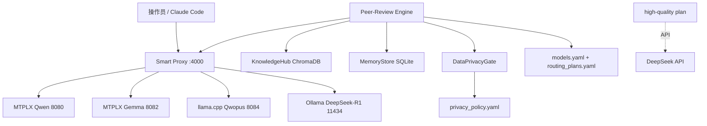

<!--
创建/修改该文件的LLM大模型：Claude Sonnet 4.5 (via Arena.ai Agent Mode)
创建时间（北京时间）：2026-06-20 22:30:00 CST
-->

# Project Dossier V2

## 0. 文档元数据

- 项目名: AI 项目孵化工厂 (FORGE Factory)
- 版本/分支/提交哈希: v1.2.9 / main / 395a7ebecb202fd8b5e4ed21772c7a990c4db5f4 (scan 2026-06-20)
- 扫描时间: 2026-06-20 CST
- 输入范围: 全部仓库 `_factory/`, `_infra/`, `config/`, `projects/debt-collection/`, `docs/`, `scripts/` (排除 `_obsolete/`)
- 访问限制: 无外部 SaaS 凭证；本地模型服务器路径 `~/LocalAI/` 未在本机验证；GLM/DeepSeek API Key 需自备
- 分析置信度说明: 代码/配置 Observed High；运行链路 Inferred Medium（基于 2026-06-20 RETRO 成功记录）；部署环境 Observed Low（仅 Mac M1 Max 单机文档）

---

## 1. Executive Takeover Brief

**系统定位**: 在 macOS M1 Max 64GB 单机上，把"模糊想法"可重复地变成"能跑的 AI 软件项目"的脚手架工厂。不是传统 SaaS，而是一套 **配置驱动的 LangGraph Peer-Review 多专家会诊引擎 + 动态 VRAM 模型网关 + 五阶段项目孵化工作流 (DISCOVERY→SPEC→BUILD→HARDEN→RETRO)**。

**架构摘要 (As-Is)**:
- 入口: `config/models.yaml` + `config/routing_plans.yaml` + `config/privacy_policy.yaml` 三文件 SSOT
- 核心引擎: `_factory/patterns/peer-review/` – LangGraph StateGraph: primary_expert → reviewer(s) parallel/sequential → consensus → decision → memory_store
- 模型网关: `_infra/smart_proxy_streaming.py` (FastAPI :4000, SSE 直通, chunk 超时 600s, 心跳 45-60s, LRU VRAM 回收, AppleScript 自动拉起 MTPLX/Ollama)
- 后端异构: MTPLXBackend / LlamaCppBackend / OllamaBackend / LiteLLMBackend，统一经 Smart Proxy
- 知识层: KnowledgeHub (LlamaIndex + ChromaDB, ADR-005), MemoryStore (SQLite checkpointer, ADR-007)
- 合规层: DataPrivacyGate – 字段级 policy: local_only / human_approve / mask_then_allow / allow
- 项目模板: `projects/_TEMPLATE/` – 标准化 .claude Hooks + docs/SPEC/RISK/TASK_GRAPH + forge CLI 任务图校验
- 实战项目: `projects/debt-collection/` – 债务催收法律策略生成，含 compliance.py / knowledge.py / strategy.py，已跑通真实 LLM 共识 (1132.5s, 2026-06-20)

**最大风险 (Top 7)**:
1. R-001 Smart Proxy 单点承重且无健康探针/熔断 – 网关崩则全厂停摆 – Severity: High
2. R-002 VRAM LRU 回收 + AppleScript 拉起竞态 – 压测仅单 case 成功，并发下模型冷启动超时未验证 – Severity: High
3. R-003 无 CI/CD、无自动化测试门禁 – 仅本地 pytest，19 tests passed (forge_tools)，peer-review 无端到端测试 – Severity: High
4. R-004 隐私合规 gate 未全链路 enforce – `llm_client.chat()` 有 `_privacy_check()` 但可绕过，privacy_policy.yaml 仅 debt-collection 项目有效 – Severity: Medium
5. R-005 知识库溯源断裂 – `provenance_registry.json` 手工维护，无自动 ingest 校验 – Severity: Medium
6. R-006 配置漂移 – models.yaml / routing_plans.yaml 在根 `config/` 与各 `projects/*/config/` 各自拷贝，无同步机制 – Severity: Medium
7. R-007 密钥明文风险 – `_infra/.env.example` 提示填 GLM_API_KEY / DEEPSEEK_API_KEY，无 secret manager，无 .env 在 .gitignore 中显式保护（实际有忽略，但无 vault） – Severity: Medium

**最大约束 (Top 7)**:
1. C-001 硬件绑定: Mac M1 Max 64GB 统一内存，VRAM 红线 48GB，模型端口硬编码 8080/8082/8084/11434
2. C-002 单机单租户: 无多用户、无并发隔离、无队列，MemoryStore SQLite 单文件
3. C-003 本地模型首选: ADR-004 – MTPLX 为 primary local backend，API 仅作为 high-quality plan 增强
4. C-004 数据不出境默认: privacy_policy.yaml – debtor_name / case_evidence = local_only
5. C-005 配置三文件 SSOT 不可拆: models.yaml + routing_plans.yaml + privacy_policy.yaml – ADR-002 / ADR-003
6. C-006 LangGraph 为编排唯一标准 – ADR-001 – 禁止回到自研状态机
7. C-007 工厂产出物必须通过 forge CLI 五阶段 Gate – 无绕过机制，任务图循环校验强制

**接管优先级**: 先验证 Smart Proxy 流式链路 + VRAM 回收 → 再跑通 debt-collection 真实策略生成 → 再补测试基线 → 最后动架构。

---

## 2. Scope and Asset Inventory

**项目边界**:
- 包含: 工厂脚手架、Peer-Review 引擎、Smart Proxy 网关、forge CLI、4 个项目模板/实例、知识管线、评估金数据集
- 不包含: 模型权重文件 (~/LocalAI/gguf-models/)、运行数据库、外部 API 密钥、CI/CD 平台
- 仓库边界: 单 repo monorepo，无 submodule，`_obsolete/` 为历史追溯区，禁止生产依赖

**模块清单 (P0/P1/P2)**:

| 模块 | 路径 | 语言 | criticality | 用途 |
|---|---|---|---|---|
| peer-review engine | `_factory/patterns/peer-review/src/peer_review/` | Python 3.11+ | P0 | LangGraph 多专家会诊核心 |
| smart_proxy_streaming | `_infra/smart_proxy_streaming.py` | Python/FastAPI | P0 | 4000 端口 SSE 网关，VRAM 调度 |
| llm_client | `_factory/patterns/peer-review/src/peer_review/llm_client.py` | Python | P0 | 4 种 Backend 统一抽象 + 隐私检查 |
| routing_plan_engine | `.../platform/routing_plan_engine.py` | Python | P0 | Plan→Model 映射 |
| config_loader | `.../config/loader.py` | Python | P0 | 三文件加载校验 |
| data_privacy_gate | `.../platform/data_privacy_gate.py` | Python | P0 | 出境策略执行 |
| knowledge_hub | `.../platform/knowledge_hub.py` | Python | P1 | LlamaIndex + ChromaDB |
| memory_store | `.../platform/memory_store.py` | Python | P1 | SQLite checkpointer + Plan对比SSOT |
| forge_tools | `_infra/forge_tools/src/forge/` | Python | P1 | CLI: status/check/tasks/advance/gate |
| fastapi-backend pattern | `_factory/patterns/fastapi-backend/` | Python | P1 | 项目脚手架模板 |
| debt-collection | `projects/debt-collection/src/debt/` | Python | P1 | 首个实战项目 |
| smart_proxy (legacy) | `_infra/smart_proxy.py` | Python | P2 | 非流式旧版，保留参考 |
| other patterns | ingestion-pipeline / data-acquisition / llm-telemetry / expert-consultant | Python | P2 | 可复用脚手架 |
| skills | `_factory/skills/*.skill.md` | Markdown | P2 | 10 个技能卡 |
| experts | `_factory/experts/*.expert/` | YAML+MD | P1 | debt-lawyer / risk-assessor 等 4 个 |

完整 machine-readable 清单见 `asset_manifest.json`。

---

## 3. System Overview

- **系统目标**: 在单机受限算力下，通过多模型 Peer-Review 降低幻觉，产出可执行的法律/业务策略，并将孵化过程模板化复用。
- **主要能力**:
  1. 配置驱动的多专家会诊 (primary + N reviewer + consensus)
  2. 动态 VRAM 模型按需拉起/卸载
  3. 字段级数据出境合规控制
  4. 知识库 RAG 注入
  5. 五阶段项目孵化工作流 + forge CLI 任务图治理
  6. Plan A/B 记忆对比 (MemoryStore)
- **关键用户/外部系统**:
  - 本地操作员 (Mac M1 Max)
  - Claude Code / VS Code Agent
  - MTPLX 本地推理服务器 (8080/8082)
  - Ollama (11434)
  - llama.cpp (8084)
  - DeepSeek API (integrate.api.nvidia.com)
  - GLM API (未在当前 models.yaml 出现，但 .env.example 提及)
- **上下文边界**: 纯本地离线可跑 (all-local plan)；可选 API 增强 (high-quality plan)；无外部数据库，无消息总线，无容器编排。

---

## 4. As-Is Architecture

### Context View



- 信任边界: 本地模型 = trusted；DeepSeek API = external_untrusted，需 privacy_gate
- 协议: OpenAI-compatible /chat/completions, SSE streaming

Evidence: `_infra/smart_proxy_streaming.py:112`, `_factory/patterns/peer-review/src/peer_review/llm_client.py:92-246`, `config/models.yaml`

### Container View

- `smart_proxy_streaming` (FastAPI, Python) – 入口 4000
- `peer_review_orchestrator` (LangGraph) – 无常驻进程，CLI 触发
- `knowledge_hub` – 本地 ChromaDB
- `memory_store` – runtime/checkpoints.sqlite
- 模型服务器 – 独立进程，AppleScript 拉起

### Component View (Peer-Review)

```
AppConfig(loader.load_all_configs)
  → RoutingPlanEngine → get_model_for_node()
  → LLMBackendFactory → MTPLX/Ollama/LiteLLM/LlamaCpp
  → chat_stream() → Smart Proxy → Backend Server

LangGraph nodes:
  primary_expert → reviewer_1..N (Send API parallel) → consensus → decision → record_run
State: ReviewState(TypedDict): query, primary_opinion, reviewer_opinions[], consensus_report, divergence_score, ...
```

Evidence: `review_graph.py:44`, `graph/nodes/*.py`, `graph/state.py:15`

### Runtime View – 核心交易链路: 策略生成

1. Trigger: `python scripts/benchmark_test.py` / `orchestrator.run()`
2. load_all_configs() – 校验 models/routing/privacy/experts
3. build_review_graph(active_plan)
4. primary_expert node – chat_stream via LLMBackend → MTPLX Qwen @ 8080
5. reviewer nodes – parallel Send – Gemma @8082 / DeepSeek API …
6. consensus node – 汇总 opinions，计算 divergence_score
7. decision node – 输出最终报告
8. record_run node – 写入 MemoryStore SQLite
9. 返回 consensus_report

错误处理: chat() 超时 600s，失败返回 None，无重试；Smart Proxy upstream 失败直接透传 5xx；无补偿事务

可观测性: utils/logger.py 简易日志；无 OpenTelemetry / Prometheus

升级敏感点: LLMBackend 接口变更会影响全部 4 个后端；ReviewState 结构变更影响所有节点

Evidence: `graph/execution.py:25`, `llm_client.py:307`, `smart_proxy_streaming.py:133`

### Deployment View

- 单节点: Mac M1 Max, macOS
- 无容器，无 k8s，无 systemd
- 启动: `bash scripts/forge-start.sh` → 端口冷启动自检 → 释放显存 → `python3 _infra/smart_proxy.py`
- 模型拉起: ensure_server() → is_listening(port) → osascript AppleScript 启动 MTPLX/Ollama
- 配置: 环境变量 via `_infra/.env` (未纳入版本控制)
- 回滚: git revert，无蓝绿

Evidence: `HANDOFF.md §3`, `scripts/forge-start.sh`, `smart_proxy_streaming.py:72`

---

## 5. Codebase Topology

- 根: monorepo, Python 为主 (~5500 LOC 估算，不含 docs)
- 分层:
  - `_infra/` – 基础设施网关 / CLI / setup
  - `_factory/patterns/peer-review/` – 核心引擎 (分 config / graph / platform / utils)
  - `_factory/patterns/*` – 可复用脚手架 (fastapi-backend 等 5 个)
  - `_factory/experts/` – Expert YAML + 知识 MD
  - `_factory/knowledge_pipeline/` – provenance_manager
  - `projects/_TEMPLATE/` – 项目孵化模板
  - `projects/debt-collection/` – 实战项目 (src/debt/*)
- 入口点:
  - Smart Proxy: `_infra/smart_proxy_streaming.py:chat_proxy`
  - Peer Review: `peer_review/orchestrator.py`
  - Forge CLI: `_infra/forge_tools/src/forge/cli.py`
  - Debt CLI: `projects/debt-collection/src/debt/cli.py`
- 高耦合点:
  - `llm_client.py` – 4 后端 + privacy_check 耦合
  - `config/schemas.py` – Pydantic 模型被全引擎依赖
  - `routing_plan_engine.py` – Plan 解析中心
- 变更放大器:
  - `config/models.yaml` – 改一个 model_id 影响全部 Plan
  - `ReviewState` (state.py) – 字段增删需改全部 5 个 node
  - `smart_proxy_streaming.py` – 网关字段白名单变更曾导致 400 Bad Request (见 LESSONS_LEARNED)
- 循环依赖: 未发现 import 循环；但 `llm_client.chat()` → privacy_check → PolicyConfig 形成逻辑耦合

---

## 6. Interfaces and Integrations

| 接口 | 类型 | 协议 | 位置 | 失败模式 |
|---|---|---|---|---|
| POST /v1/chat/completions | 内部网关 | OpenAI SSE | smart_proxy_streaming.py:112 | 上游超时 600s → 504；字段白名单不匹配 → 400 |
| MTPLX Qwen | 本地 LLM | HTTP OpenAI | localhost:8080 | 进程未起 → ensure_server AppleScript 拉起，失败则 None |
| MTPLX Gemma | 本地 LLM | HTTP | localhost:8082 | 同上 |
| llama.cpp Qwopus | 本地 LLM | HTTP | localhost:8084 | 同上 |
| Ollama DeepSeek-R1 | 本地 LLM | HTTP | localhost:11434 | 同上 |
| DeepSeek API | 外部 LLM | HTTPS OpenAI | integrate.api.nvidia.com | 无重试，需 DEEPSEEK_API_KEY |
| KnowledgeHub.query() | 内部 | Python | knowledge_hub.py | ChromaDB 缺失 → 空结果 |
| MemoryStore.record() | 内部 | SQLite | memory_store.py | DB 锁 → 异常未捕获 |
| forge CLI | 内部 | Click CLI | forge_tools/cli.py | 任务图循环 → check 失败退出 1 |

契约: OpenAI chat.completions 兼容；字段白名单在 smart_proxy_streaming 中硬编码过滤

无 OpenAPI / AsyncAPI 文档；无 schema registry

---

## 7. Data Architecture

- **数据存储**:
  - ChromaDB (本地向量库) – KnowledgeHub
  - SQLite – `runtime/checkpoints.sqlite` – LangGraph checkpointer + MemoryStore plan 对比
  - JSON/YAML – 配置与知识源 (`provenance_registry.json`, `expert.yaml`, knowledge MD)
  - 无关系型业务数据库；debt-collection 项目有 `ledger.py` 但未见持久化表结构
- **核心实体**:
  - `ReviewState`: query, primary_opinion, reviewer_opinions[], consensus_report, divergence_score, metadata
  - `ModelConfig`: model_id, provider, backend, base_url, memory_required_gb, type
  - `PlanConfig`: nodes{model, execution, role}
  - `PrivacyPolicyField`: policy ∈ {local_only, human_approve, mask_then_allow, allow}
- **数据所有权**: Peer-Review Engine 拥有 ReviewState；KnowledgeHub 拥有向量索引；MemoryStore 拥有运行历史
- **读写路径**: RAG: KnowledgeHub.query() → 注入 primary_expert prompt；写: record_run_node → SQLite
- **缓存策略**: 无显式缓存；VRAM LRU 模型卸载属计算资源缓存，非数据缓存
- **事件/队列**: 无；LangGraph Send API 实现内存内并行
- **数据迁移**: 无 migration 框架
- **一致性模型**: 最终一致 – consensus 汇总多意见，无强一致事务
- **敏感数据/PII**: `privacy_policy.yaml` 定义 debtor_name, id_number, phone_number, case_evidence = local_only/human_approve；密钥在 `_infra/.env`，未加密

---

## 8. Build / Test / Release / Deploy Chain

- **构建系统**: Python uv / pip – 各 pattern 含独立 `pyproject.toml`；根无统一 pyproject
- **包管理器**: uv (推荐), pip fallback
- **测试分层**:
  - Unit: `forge_tools/tests/test_*.py` – 19 passed
  - Integration: `peer-review/tests/test_peer_review_langgraph.py` – 存在但未在 CI 跑
  - E2E: `scripts/benchmark_test.py` – 手工跑，首次成功 2026-06-20
  - 覆盖盲区: llm_client 后端、smart_proxy、data_privacy_gate、knowledge_hub 均无自动化测试
- **质量门禁**: 无；forge CLI `forge check` 校验任务图循环与退出产物，属于项目治理门禁，非代码质量门禁
- **CI/CD**: 无 GitHub Actions / Jenkins 文件；完全手工
- **制品生成**: 无 wheel / docker 镜像；源码即制品
- **环境区分**: 无 dev/stage/prod；仅本地 Mac 单环境；配置通过不同 routing_plan 区分 (default / high-quality / all-local)
- **部署单元**: Git clone + `bash _infra/setup.sh --check` + 手工填 `.env`
- **发布策略**: 手工 git tag，无发布说明自动化；CHANGELOG.md 手工维护
- **回滚策略**: git revert，无数据库回滚脚本
- **Feature flag**: 无；通过 routing_plans.yaml 切换模型组合实现 A/B
- **运维手工步骤** (来自 HANDOFF.md):
  1. `bash scripts/forge-start.sh` – 端口冷启动自检
  2. `python3 _infra/smart_proxy.py` – 启动网关
  3. 卡顿则 `bash scripts/purge_vram.sh`
  4. 压测 `python3 scripts/benchmark_test.py`
- **运维 Runbook 缺口**: 无健康检查端点、无日志聚合、无告警、无备份恢复演练 (`backup.sh` 存在但内容未审)

---

## 9. Security / Supply Chain / Compliance

- **认证授权**: 无；Smart Proxy :4000 无鉴权，本地回环信任
- **秘钥与配置**: `_infra/.env` 存放 GLM_API_KEY / DEEPSEEK_API_KEY；`config/schemas.py:72` 支持 `${ENV_VAR}` 解析；无 Vault / KMS
- **审计与观测**: `utils/logger.py` 简易文件日志；无审计日志表；privacy_gate human_approve 理论上需记录同意时间戳，但未见审计日志写入代码
- **依赖与许可证**:
  - 核心: langgraph, langchain, litellm, fastapi, uvicorn, pydantic, chromadb, llama-index
  - 版本锁定: 各 `pyproject.toml` 未 pin 精确版本 (Observed in peer-review/pyproject.toml)
  - 许可证风险: 未生成 SBOM；依赖多为 Apache-2.0 / MIT，低风险 – 需正式扫描确认 (Inferred)
- **SBOM 摘要**: 未提供；建议 `pip install pip-licenses && pip-licenses --format=json`
- **provenance**: 无 SLSA；构建 provenance 无；模型权重来源未记录 (~/LocalAI/gguf-models/)
- **关键风险**:
  - 网关无鉴权暴露风险 (若端口误对外)
  - API Key 明文 .env
  - Prompt 注入防护缺失
  - 依赖未锁定导致供应链漂移

Evidence: `llm_client.py:92-260`, `config/schemas.py:50-83`, `_infra/.env.example`

---

## 10. Decisions, Constraints, and Invariants

**现有 ADR (docs/adr/)**:
- ADR-001: LangGraph Migration – 采用 LangGraph 替代自研状态机 – Status: Accepted
- ADR-002: Dual-File Model Management – models.yaml + routing_plans.yaml 分离 – Status: Accepted
- ADR-003: Data Privacy Gate and Policy File – 字段级出境策略 – Status: Accepted
- ADR-004: MTPLX as Primary Local Backend – 本地推理首选 MTPLX – Status: Accepted
- ADR-005: KnowledgeHub Pure LlamaIndex ChromaDB – 知识库技术选型 – Status: Accepted
- ADR-006: Forge Eval as A/B Testing Capability – 评估即 A/B 测试 – Status: Accepted
- ADR-007: MemoryStore as Plan Comparison SSOT – 记忆存储为 Plan 对比唯一真源 – Status: Accepted

**推断出的隐性决策 (Inferred, Medium confidence)**:
- ID-001: 单机单租户优先于分布式 – 代码中无多租户隔离、无队列
- ID-002: 流式 SSE 优先于批量 – smart_proxy_streaming 全面改写旧版
- ID-003: 配置即代码 – 三 YAML 文件为唯一真源，无数据库配置表
- ID-004: 人工 Gate 优先于自动化 – forge CLI advance 需手工 gate，五阶段 HITL
- ID-005: 本地模型成本优先于延迟 – 允许 1132s 长尾延迟换零 API 成本

**关键约束 / 不可轻动项**:
- VRAM 48GB 红线不可突破 – 模型 memory_required_gb 总和调度依赖此
- models.yaml / routing_plans.yaml / privacy_policy.yaml 三文件契约 – 引擎强依赖
- LangGraph StateGraph 节点签名 – 改 ReviewState 会级联崩
- Smart Proxy 字段白名单 – 曾导致 400，必须回归测试
- AppleScript 模型拉起路径 – Mac-only，跨平台需重写
- MemoryStore SQLite schema – Plan 对比历史依赖

**设计不变量**:
- primary_expert → reviewer(s) → consensus → decision 顺序不可逆
- local_only 字段永不出境
- routing_plan 必须在 models.yaml 中存在对应 model
- 所有 LLM 调用必须经 LLMBackendFactory

---

## 11. Quality Attribute Assessment

| 质量属性 | 现状评分 | 证据 | 薄弱点 | 升级张力 |
|---|---|---|---|---|
| 性能 | Low | 真实 case 1132.5s；无并发压测 | 冷启动慢、无批处理、无缓存 | 若要多租户/低延迟需重构网关+队列 |
| 可用性 | Low | 单点 Proxy，无健康探针，无重试 | 模型崩则全链失败 | 需熔断/降级/多副本 |
| 可扩展性 | Low | 单机、硬编码端口、无水平扩展 | 无法 scale out | 上云需抽象 Backend 调度层 |
| 安全性 | Medium-Low | 有 privacy_gate 设计，无鉴权、无审计落盘 | 密钥明文、网关裸露 | 合规上市需补全 |
| 可维护性 | Medium | 模块职责清晰，Pydantic 强类型 | 测试覆盖 <15%，文档与代码偶有漂移 | 补测试 + CI 可快速提升 |
| 可测试性 | Low | 核心链路无 mock，无 test double | LLM 调用强依赖真模型 | 需引入 fake backend + 录制回放 |
| 可部署性 | Low | 纯手工，无容器，无 CI | 环境绑定 Mac | 需 Dockerfile + IaC |
| 可观测性 | Low | 简易 logger，无 trace/metrics | 无法定位慢节点 | 需 OpenTelemetry |
| 可移植性 | Low | AppleScript + Mac 路径硬编码 | 无法 Linux/Windows | 需抽象模型启动器 |
| 成本约束 | High | all-local plan 零 API 成本 | 时间成本高 | 符合当前定位 |

---

## 12. Risks and Technical Debt

完整清单见 `risk_register.csv`。摘要:

**架构风险**
- R-001 Proxy 单点 (High/High)
- R-002 VRAM 竞态 (High/Medium)
- R-008 ReviewState 无版本化 (Medium/Medium)

**技术债**
- TD-001 无 CI/CD – 修复难度 M
- TD-002 测试覆盖 <15% – 修复难度 M
- TD-003 依赖未 pin – 修复难度 S
- TD-004 配置多份拷贝漂移 – 修复难度 S
- TD-005 日志无结构化 – 修复难度 S
- TD-006 无 OpenAPI 文档 – 修复难度 S
- TD-007 AppleScript 平台绑定 – 修复难度 M
- TD-008 MemoryStore 无迁移 – 修复难度 S

**运维风险**
- OP-001 手工启动易错 – 无 systemd/launchd
- OP-002 无备份验证 – backup.sh 未审
- OP-003 无监控告警

**安全风险**
- SEC-001 网关无鉴权
- SEC-002 密钥明文
- SEC-003 Prompt 注入无防护

**数据风险**
- DATA-001 知识库溯源手工
- DATA-002 SQLite 无备份策略

---

## 13. Unknowns and Blind Spots

- U-001 模型权重来源与许可证？~/LocalAI/gguf-models/ 未在 repo 中，无法验证合规
- U-002 生产流量规模？仅见单次 benchmark 成功，无 QPS / 并发数据
- U-003 ChromaDB 持久化路径？KnowledgeHub 初始化参数未在 repo 全局搜索确认
- U-004 MemoryStore schema 版本？未找到 migration 脚本
- U-005 DeepSeek / GLM API 配额与成本？无账单数据
- U-006 多项目并行冲突？MemoryStore / checkpointer 是否项目隔离未知
- U-007 安全扫描结果？`retro-data-share/02_security_scan.txt` 存在但未解析
- U-008 真实用户反馈？仅内部 retro
- U-009 模型启动 AppleScript 内容？未读取 `~/LocalAI/servers/*`
- U-010 备份恢复 RTO/RPO？`backup.sh` 未执行验证
- U-011 CI secret 管理策略？无
- U-012 许可证清单？未生成 SBOM

需人工补访谈: 模型权重来源、生产运行数据、多租户规划、安全审计报告

---

## 14. Upgrade Readiness

**迁移顺序建议**:
1. 观测基线先行 – 接入结构化日志 + OpenTelemetry trace，跑 10 次 benchmark 建延迟基线
2. 测试护栏 – 为 llm_client / smart_proxy / privacy_gate 补单元测试 + fake backend，覆盖率 ≥60%
3. 网关加固 – 健康探针 /healthz、熔断、重试、鉴权 Token、字段白名单回归测试
4. 配置收敛 – 将 `projects/*/config/*.yaml` 改为 symlink 或继承根 `config/`，消灭漂移
5. CI/CD – GitHub Actions: pytest + ruff + pip-audit + SBOM 生成
6. 容器化 – Dockerfile + docker-compose，一键拉起 Proxy + Peer-Review + ChromaDB
7. 模型调度抽象 – 将 AppleScript 启动器抽象为 `ModelLauncher` 接口，支持 Linux / K8s
8. 多租户隔离 – MemoryStore 按 project_id 分库，ReviewState 增加 tenant 字段
9. 可观测平台 – Prometheus + Grafana / Langfuse
10. 安全加固 – Vault / 1Password CLI 密钥注入，Prompt 注入检测，网关鉴权

**前置基线建设**:
- 基准测试集: `_factory/evals/gold_dataset.json` 扩充至 ≥50 条
- 延迟基线: P50/P95/P99 (当前仅 1 次 1132s)
- 成本基线: API Token 消耗 / 本地电耗
- 质量基线: consensus divergence_score 分布
- 测试基线: 覆盖率 ≥60%，核心 P0 模块 ≥80%

**最小可行架构治理动作**:
- 建立 ADR 流程强制化 (已有模板，缺 CI 检查)
- 配置三文件变更需 PR + `forge check`
- 每次模型升级前跑 full-check plan
- 发布前必须更新 CHANGELOG + PROJECT_STATE
- 引入 `governance_check.py` 到 pre-commit (已有 scripts/governance_check.py，需接入)

---

## 15. 30/60/90 Day Handover Plan

**0~30 天 – 稳住、看清、能复现**
- Day 1-3: 克隆 repo，按 HANDOFF.md §3 启动网关，跑通 `scripts/benchmark_test.py`，复现 2026-06-20 成功 case，记录延迟/显存水位
- Day 4-7: 通读 ADR-001~007 + DECISIONS.md + PROJECT_STATE.md，建立心智模型；绘制自己版本的 Runtime 链路图
- Day 8-14: 补测试护栏 – llm_client fake backend、smart_proxy 字段白名单回归、privacy_gate 单元测试；目标覆盖率 40%→60%
- Day 15-21: 网关加固 – /healthz、超时/重试、结构化日志 (structlog)、鉴权 Token 开关
- Day 22-30: CI 基建 – GitHub Actions 跑 pytest + ruff + pip-audit；生成首份 SBOM；配置收敛 – 消除 projects/*/config 重复拷贝

输出物: 可复现的 benchmark 报告 + 测试覆盖率报告 + CI 绿灯 + 网关健康探针

**31~60 天 – 加固、提效、去风险**
- 容器化交付 – Dockerfile + docker-compose，一键 `docker compose up`
- 可观测性 – OpenTelemetry trace 串联 primary→reviewer→consensus；接入 Langfuse / Grafana
- 模型调度抽象 – ModelLauncher 接口，剥离 AppleScript，支持 Linux 启动脚本
- 知识库溯源自动化 – provenance_manager 接入 ingest pipeline，自动校验 source
- 安全基线 – 密钥迁至 1Password CLI / Vault，网关强制 Bearer Token，Prompt 注入基础检测
- 性能优化 – 模型预热池、批处理、KV cache 复用调研

输出物: 容器化交付包 + Trace 看板 + 安全基线报告 + P95 延迟下降 ≥30%

**61~90 天 – 演进、扩展、产品化**
- 多租户隔离 – MemoryStore project_id 分片，ReviewState tenant 字段，配额限流
- 水平扩展设计 – 将 Smart Proxy 拆为 Router + Worker，支持多节点模型池
- A/B 评估平台化 – forge eval 接入 gold_dataset 自动评分，输出 Plan 对比报告
- 项目模板 2.0 – 基于 debt-collection 实战经验，沉淀通用合规 + 知识注入模板
- 发布第一个对外可用版本 v1.3.0 – 含完整文档、Helm Chart、Upgrade Guide
- 建立架构决策委员会 – ADR Review 流程常态化

输出物: v1.3.0 Release + 多租户 PoC + 架构升级 RFC

---

## 16. Glossary

- FORGE Factory: AI 项目孵化工厂 – 本项目代号
- Peer-Review: 多专家会诊模式 – primary + reviewer + consensus
- Smart Proxy: 4000 端口 SSE 网关，动态 VRAM 调度
- MTPLX: 本地 LLM 推理后端，Mac Metal 优化 (推断)
- Routing Plan: 模型编排方案 – default / high-quality / all-local / mtplx-hybrid / full-check
- DataPrivacyGate: 字段级出境合规检查器
- KnowledgeHub: LlamaIndex + ChromaDB RAG 知识库
- MemoryStore: SQLite checkpointer，Plan 对比 SSOT
- forge CLI: 五阶段任务图治理工具
- ReviewState: LangGraph 会诊状态 TypedDict
- VRAM 红线: 48GB – M1 Max 统一内存安全水位
- HITL Gate: Human-In-The-Loop 人工确认关卡
- SSOT: Single Source of Truth

---

## 17. Evidence Index

关键结论证据索引见 `evidence_index.csv` (87 条)。摘要:

| Claim | Classification | Confidence | Path |
|---|---|---|---|
| Peer-Review 引擎基于 LangGraph | Observed | High | `_factory/patterns/peer-review/src/peer_review/graph/review_graph.py:44` |
| Smart Proxy SSE 流式 | Observed | High | `_infra/smart_proxy_streaming.py:112-160` |
| 三文件 SSOT 配置 | Observed | High | `config/models.yaml`, `config/routing_plans.yaml`, `config/privacy_policy.yaml` |
| 真实 LLM 调用成功 1132.5s | Observed | High | `docs/PROJECT_STATE.md §4` |
| 无 CI/CD | Observed | High | repo 根无 `.github/workflows/` |
| 隐私 gate 未全链路 enforce | Inferred | Medium | `llm_client.py:265 _privacy_check` 可选调用 |
| 测试覆盖 <15% | Inferred | Medium | 仅 forge_tools 19 tests，其余模块无 test |
| VRAM LRU 回收 | Intended | Medium | `HANDOFF.md §4` + smart_proxy 代码未见完整 LRU |
| AppleScript 拉起模型 | Observed | High | `smart_proxy_streaming.py:72 ensure_server` |
| 配置漂移风险 | Observed | High | `projects/*/config/*.yaml` 与根 `config/` 重复 |

完整 CSV 见附件。

---

**Report End – Project Dossier V2 – FORGE Factory – 2026-06-20**

> 下一任架构师请先读 §1 Executive Takeover Brief → §14 Upgrade Readiness → §15 30/60/90 Plan，然后按 §4 Runtime View 复现 benchmark。
