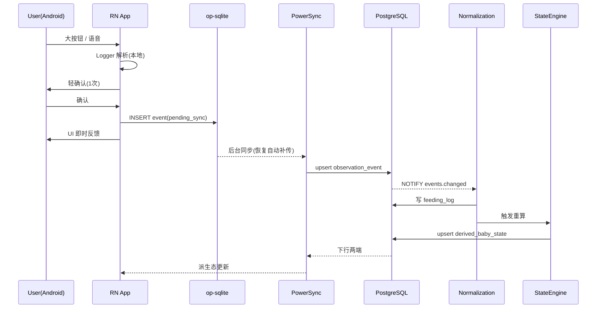
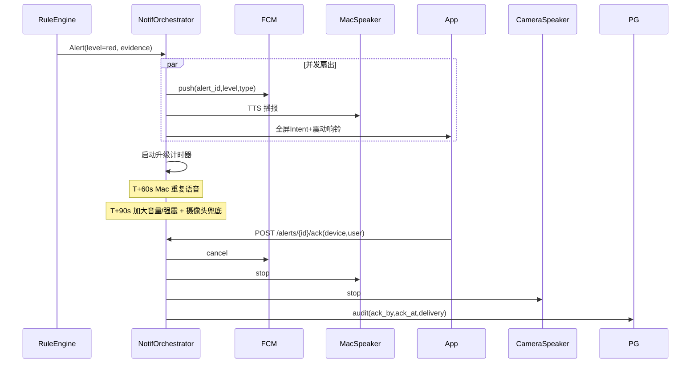
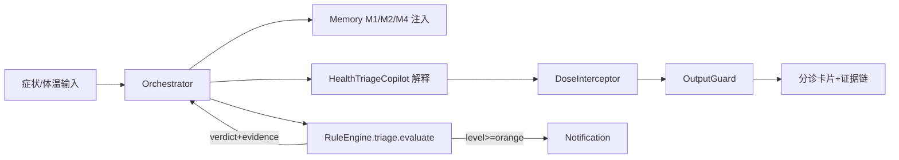
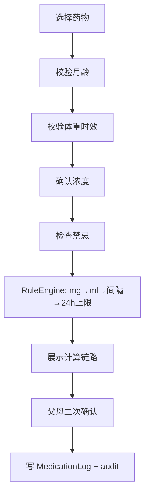
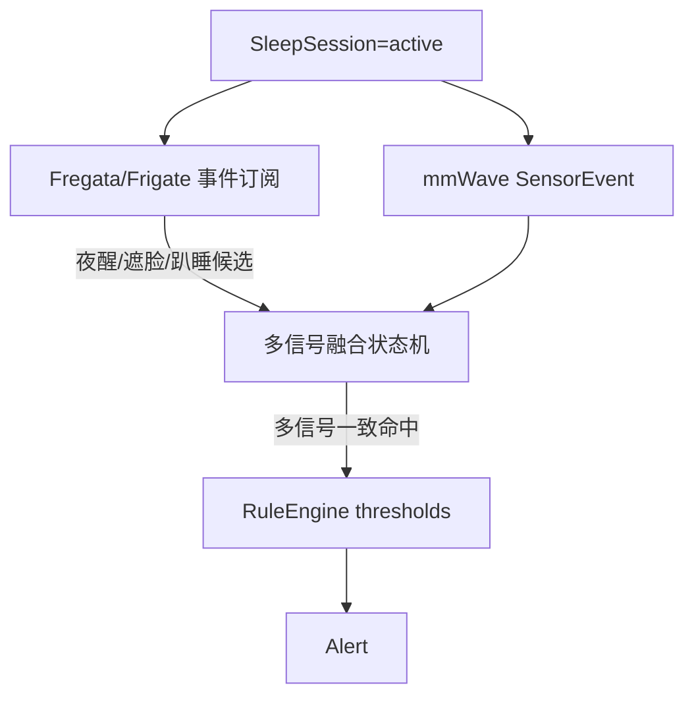

# ENGINEERING_DESIGN.md — AI Parenting Copilot

> 工程实现蓝图（Engineering Blueprint）。本文件仅回答"如何实现、如何组织、如何落地"，不重新设计架构。
> **唯一架构事实来源**：`docs/ARCHITECTURE_FINAL.md`。任何冲突，以架构文档为准，本文档不得修改架构决策、技术路线、模块职责、调用链或架构组件。
> **工厂能力来源**：`PROJECT_DOSSIER_V5.md`。凡工厂已有能力（模型路由、Privacy Gateway、Local RAG、Agent/Skill、治理、FEOS、诊断脚本）一律复用，禁止重复建设。
> **项目路径**：`projects/AI-Parenting-Copilot/`（独立项目，与工厂根文档隔离）。

---

## 目录

1. 工程设计概览
2. 模块划分
3. 推荐目录结构
4. 服务边界设计
5. 核心抽象与接口设计
6. 数据模型设计
7. 调用链设计
8. 配置体系设计
9. 错误处理体系
10. 日志与可观测性设计
11. 缓存设计
12. 测试策略
13. 扩展点设计
14. 给开发 Agent 的落地约束

---

## 1. 工程设计概览

### 1.1 工程原则

| 原则 | 说明 | 依据 |
|---|---|---|
| Factory-first | 工厂已有能力优先复用，通过适配层引用，不重造 | 架构 §28.8、DOSSIER §11 |
| Modular Monolith | 家庭尺度并发极低（<10 req/s），采用清晰边界的模块化单体，保留未来拆分能力 | 社区成熟实践（避免过早微服务化） |
| Local-first | 主控与权威数据不出局域网；离线可完整记录 | 架构 §1.2 |
| Rule/LLM 分离 | 剂量/阈值/医疗判定唯一由 Rule Engine 产出；LLM 输出经 Dose Interceptor 拦截 | 架构 §1.2、§11.3 |
| 契约驱动 | 模块间通过 Protocol/接口交互，边界稳定；事件模型为数据契约 SSOT | 社区 DDD-lite |
| 审计不可绕过 | 所有 mutating 操作留痕，审计日志不可删除 | 架构 §1.2、§22.2 |

### 1.2 技术栈（社区成熟选型，均不改变架构决策）

**服务端（Mac M1 Max）**

| 关注点 | 选型 | 理由 |
|---|---|---|
| 语言 | Python 3.11+ | 与工厂 `_infra/*` 一致，直接复用 |
| Web 框架 | FastAPI + Uvicorn | 类型化、异步、自动 OpenAPI |
| 数据校验 | Pydantic v2 | 与 FastAPI 集成；事件模型契约 |
| DB 访问 | SQLAlchemy 2.0 (async) + asyncpg | 事实标准 |
| 迁移 | Alembic | 版本化 schema |
| 权威库 | PostgreSQL 15+ | PowerSync 官方支持 |
| 同步 | PowerSync self-hosted（复用外部方案，不自研） | 架构 §9 |
| 消息总线 | Eclipse Mosquitto 2.x | 架构 §13 |
| MQTT 客户端 | aiomqtt | 官方 asyncio 客户端 |
| 视频栈 | Fregata（首选）/ Frigate（备）/ ffmpeg / PyAV | 架构 §12.2 |
| 定时任务 | APScheduler | 提醒/晨报/巡检；避免 Celery 过度复杂 |
| 缓存 | cachetools（进程内）+ 派生快照表；**不引入 Redis** | 家庭尺度不需要 |
| 结构化日志 | structlog | 与工厂一致 |
| 指标 | prometheus_client | 本地 Grafana |
| 追踪 | OpenTelemetry SDK | 行业标准 |
| 重试 | tenacity | 声明式重试 |
| 测试 | pytest + pytest-asyncio + hypothesis + testcontainers | 与工厂一致 |
| 质量 | ruff + mypy | 工厂约定 |

**模型/隐私/RAG/治理**：全部复用工厂（Smart Proxy 4000、LiteLLM 4001、本地模型后端、`_infra/network/privacy`、Local RAG、Skill、governance）。

**安卓端（Android-only）**

| 关注点 | 选型 |
|---|---|
| 框架 | React Native 0.74+ (Android-only) + Kotlin 原生模块 |
| 本地库 | `op-sqlite` + `@powersync/react-native` |
| 通知 | `@react-native-firebase/messaging` + `@notifee/react-native` + 原生 FullScreenIntent |
| 后台 | WorkManager（原生桥接） |
| E2E | Detox |

**固件**：ESP32C6 + PlatformIO + PubSubClient（架构 §13.1）。

### 1.3 进程拓扑

```text
┌────────────────────── Mac M1 Max ──────────────────────┐
│  Docker Compose:                                        │
│    postgres  mosquitto  powersync-service  frigate      │
│  launchd:                                               │
│    parenting-server (FastAPI + 内嵌 asyncio workers)    │
│    fregata (macOS ANE 推理)                             │
│    parenting-backup (定时)                              │
│  复用工厂进程:                                          │
│    smart-proxy:4000  litellm:4001  本地模型后端         │
└─────────────────────────────────────────────────────────┘
```

单进程 FastAPI + 内嵌 asyncio worker（`asyncio.TaskGroup`）：常驻消费者（MQTT、Camera、Scheduler、Normalization、Notification 升级计时）与 HTTP 服务共享事件循环。重推理（VLM/LLM）一律 HTTP 外发到工厂 Smart Proxy，不占本进程。

---

## 2. 模块划分

服务端采用 **Package-by-Bounded-Context**。每个模块位于 `server/app/<context>/`，内部分层 `api/`（路由）· `service/`（用例）· `domain/`（实体+接口）· `infra/`（DB/外部适配）· `tests/`。模块编号与架构 §3.1 一一对应。

| # | 模块 | 职责 | 输入 | 输出 | 关系 |
|---|---|---|---|---|---|
| M01 | `gateway` | FastAPI 装配、路由聚合、中间件（auth/限流/日志/trace）、全局异常处理 | HTTP | JSON | → 全部模块 |
| M02 | `auth` | 家庭/用户/角色、JWT、RBAC 判定、设备注册 | 凭证 | Principal | ← gateway；DB |
| M03 | `sync` | PowerSync 适配、写入契约校验、pending_sync 状态、冲突软提示 | 同步流 | 事件 | ← Android；→ events |
| M04 | `events` | ObservationEvent CRUD、幂等（event_id）、软删除、correction 链、派生表溯源 | 结构化事件 | 事件行 | ← sync/api；→ normalization |
| M05 | `normalization` | 语音/图片/OCR/表单 → ObservationEvent；置信度；去重 | raw_input | 归一事件 | ← events；→ state_engine |
| M06 | `state_engine` | Baby State Engine：事件驱动增量派生 DerivedBabyState；幂等重算 | 事件变更 | 派生快照 | ← events；→ orchestrator/notification |
| M07 | `rule_engine` | 疫苗/用药/生长/分诊/阈值规则；EvidencePolicy 版本化；唯一剂量/阈值产出者 | RuleInput | RuleResult(含 version+evidence) | ← orchestrator/copilots；→ audit |
| M08 | `orchestrator` | 意图路由、上下文注入、Copilot 调度、Dose Interceptor、输出拦截 | 用户意图 | 结构化建议 | ← gateway；→ copilots/rule_engine/memory/model_gateway |
| M09 | `copilots` | 10 个 Domain Copilot（架构 §11.4） | orchestrator ctx | 结构化 payload | ← orchestrator；→ rule_engine |
| M10 | `notification` | 告警分级、多通道扇出、升级状态机、确认聚合、本地兜底 | Alert | 送达凭证 | ← state_engine/rule_engine；→ FCM/Mac/App/Camera |
| M11 | `camera` | RTSP 拉流、ISAPI 订阅、抓帧、ROI、片段、VLM 调度（仅会话内） | 摄像头流 | CameraEvent/MediaAsset | → events/state_engine |
| M12 | `mmwave` | MQTT 订阅 `baby/radar/telemetry`、雷达帧解析 | MQTT | SensorEvent | → events；灰色告警 |
| M13 | `model_gateway` | 工厂 Smart Proxy 薄客户端；按 routing_plans 选路 | prompt+ctx | LLM/VLM 响应 | ← orchestrator/copilots/camera |
| M14 | `privacy` | 云端出站前脱敏；复用 `_infra/network/privacy` | 明文 | 脱敏文本+canary | ← model_gateway 云路径 |
| M15 | `memory` | M1–M5 五层记忆读写；FamilyKnowledge；复用工厂 Local RAG | 上下文查询 | memory 快照 | ← orchestrator |
| M16 | `media` | 加密存储、缩略图、asset 索引、导出（MD/PDF） | 文件流 | asset_id/路径 | ← camera/quick_record |
| M17 | `observability` | 日志/指标/追踪/审计写入 | 事件 | 持久化 | 全部模块 |
| M18 | `health` | 设备/服务健康巡检（60s SLA）、灰色告警 | 心跳/探测 | HealthStatus | → notification |
| M19 | `backup` | PG dump + 媒体归档到 NAS、恢复演练 | 定时 | 备份文件 | ← DB/FS |
| M20 | `scheduler` | 定时提醒、晨报、疫苗到期、补剂待办、巡检 | cron | Alert/事件 | → notification |
| M21 | `export` | 导出 MD/PDF、就诊摘要 | 时间范围 | 文件 | ← events/state_engine |

**安卓端模块**（`android/src/features/`，对应架构 §3.2）

| # | 模块 | 职责 |
|---|---|---|
| A01 | `auth` | 登录、家庭切换、设备注册 |
| A02 | `today` | 首页：状态/统计/待办/告警/同步态 |
| A03 | `quick_record` | 大按钮/计时器/语音/轻确认 |
| A04 | `sleep_session` | 会话起止、画面、ROI、片段 |
| A05 | `timeline` | 事件列表、记录人、编辑、撤销、合并 |
| A06 | `alert_center` | 告警列表、证据链、确认、反馈 |
| A07 | `sync` | op-sqlite + PowerSync 客户端、pending_sync |
| A08 | `notification` | FCM 接收 + Notifee 高优 + FullScreenIntent + 本地兜底 |
| A09 | `background` | WorkManager、电池/自启白名单引导 |
| A10 | `shell` | 导航、主题、夜间/暗色模式 |

---

## 3. 推荐目录结构

```text
projects/AI-parenting-copilot/
├── README.md
├── Makefile                              # docs-check / test / rules-validate / run
├── pyproject.toml                        # server 依赖 + ruff + mypy
├── .env.example
├── .gitignore
│
├── docs/
│   ├── ARCHITECTURE_FINAL.md
│   ├── ENGINEERING_DESIGN.md             # 本文件
│   ├── TASK_BACKLOG.md
│   ├── PROJECT_STATE.md
│   ├── DEV_LOG.md
│   ├── CHANGELOG.md
│   ├── HANDOFF.md
│   └── ADR/
│       └── ADR-001-project-bootstrap.md
│
├── server/
│   ├── app/
│   │   ├── main.py                       # FastAPI app + worker startup
│   │   ├── settings.py                   # pydantic-settings 分层加载
│   │   ├── di.py                         # 依赖装配
│   │   ├── common/
│   │   │   ├── errors.py                 # 异常层次
│   │   │   ├── ids.py                    # ULID
│   │   │   ├── clock.py                  # 时区/时间
│   │   │   ├── repository.py             # Repository Protocol
│   │   │   ├── event_bus.py              # PG LISTEN/NOTIFY 封装
│   │   │   └── audit_decorator.py
│   │   ├── gateway/
│   │   │   ├── routers/                  # 各领域 APIRouter
│   │   │   ├── middleware/
│   │   │   └── exception_handlers.py
│   │   ├── auth/            {api,service,domain,infra,tests}/
│   │   ├── sync/            {service,infra,tests}/
│   │   ├── events/
│   │   │   ├── domain/observation_event.py
│   │   │   ├── domain/derived_tables.py
│   │   │   ├── infra/repository.py
│   │   │   └── service/idempotency.py
│   │   ├── normalization/
│   │   │   ├── parsers/{voice.py,image.py,ocr.py,form.py}
│   │   │   ├── dedup.py
│   │   │   └── service.py
│   │   ├── state_engine/
│   │   │   ├── projections/{feeding.py,diaper.py,sleep.py,temperature.py,...}
│   │   │   ├── engine.py                 # 增量 + 幂等重算
│   │   │   └── snapshot_repo.py
│   │   ├── rule_engine/
│   │   │   ├── kernel.py                 # 执行内核
│   │   │   ├── loader.py                 # YAML → EvidencePolicy
│   │   │   ├── registry.py
│   │   │   ├── domains/{vaccine.py,medication.py,growth.py,triage.py,thresholds.py}
│   │   │   └── evidence_repo.py
│   │   ├── orchestrator/
│   │   │   ├── intent_router.py
│   │   │   ├── context_builder.py        # M1–M5 注入
│   │   │   ├── dose_interceptor.py
│   │   │   ├── output_guard.py
│   │   │   └── orchestrator.py
│   │   ├── copilots/
│   │   │   ├── base.py                   # DomainCopilot 抽象 + Registry
│   │   │   ├── logger_copilot.py
│   │   │   ├── proactive_copilot.py
│   │   │   ├── vaccine_planner.py
│   │   │   ├── growth_milestone.py
│   │   │   ├── family_memory.py
│   │   │   ├── sleep_session.py
│   │   │   ├── camera_safety.py
│   │   │   ├── jaundice_diary.py
│   │   │   ├── health_triage.py
│   │   │   └── medication_safety.py
│   │   ├── notification/
│   │   │   ├── orchestrator.py           # 分级 + 扇出
│   │   │   ├── escalation.py             # 升级状态机（APScheduler）
│   │   │   ├── ack_registry.py
│   │   │   └── channels/
│   │   │       ├── base.py
│   │   │       ├── fcm.py
│   │   │       ├── mac_speaker.py
│   │   │       ├── camera_speaker.py
│   │   │       └── app_fullscreen.py
│   │   ├── camera/
│   │   │   ├── rtsp_client.py            # PyAV
│   │   │   ├── isapi_client.py
│   │   │   ├── fregata_bridge.py
│   │   │   ├── roi.py
│   │   │   ├── clip_recorder.py          # 前15s/后30s
│   │   │   ├── fusion.py                 # 多信号融合状态机
│   │   │   └── vlm_dispatcher.py
│   │   ├── mmwave/
│   │   │   ├── mqtt_subscriber.py        # aiomqtt
│   │   │   ├── frame_parser.py
│   │   │   └── sensor_event_mapper.py
│   │   ├── model_gateway/
│   │   │   ├── client.py                 # → Smart Proxy 4000
│   │   │   └── routing.py                # 读 routing_plans.yaml
│   │   ├── privacy/adapter.py            # 复用 _infra/network/privacy
│   │   ├── memory/
│   │   │   ├── m1_hard_facts.py
│   │   │   ├── m2_family_prefs.py
│   │   │   ├── m3_baseline.py
│   │   │   ├── m4_short_context.py
│   │   │   ├── m5_correction.py          # 复用 Local RAG
│   │   │   └── injector.py
│   │   ├── media/
│   │   │   ├── storage.py                # AES-GCM 加密
│   │   │   ├── thumbnails.py
│   │   │   └── export/{markdown.py,pdf.py}
│   │   ├── observability/
│   │   │   ├── logger.py                 # structlog
│   │   │   ├── metrics.py                # prometheus_client
│   │   │   ├── tracing.py                # otel
│   │   │   └── audit.py                  # append-only
│   │   ├── health/
│   │   │   ├── probes/{camera.py,mmwave.py,db.py,fcm.py,nas.py}
│   │   │   └── monitor.py
│   │   ├── backup/{pg_dump_task.py,media_archive.py}
│   │   ├── scheduler/
│   │   │   ├── jobs/{morning_brief.py,vaccine_due.py,supplement.py,health_check.py}
│   │   │   └── runner.py
│   │   └── export/service.py
│   ├── migrations/                       # Alembic
│   │   ├── env.py
│   │   └── versions/
│   ├── scripts/{run_dev.sh,run_worker.sh,seed_family.py}
│   └── tests/{unit,integration,golden,security,e2e,conftest.py}
│
├── android/
│   ├── package.json  metro.config.js
│   ├── android/                          # Gradle 原生工程
│   ├── src/
│   │   ├── App.tsx  navigation/  theme/
│   │   ├── features/{auth,today,quick_record,sleep_session,timeline,alert_center}/
│   │   ├── sync/{powersync_client.ts,schema.ts}
│   │   ├── notification/{fcm.ts,notifee_channels.ts,fullscreen_intent.ts,fallback.ts}
│   │   ├── background/work_manager.ts
│   │   ├── native_modules/               # Kotlin bridges
│   │   └── api/client.ts
│   └── e2e/                              # Detox
│
├── firmware/esp32c6/
│   ├── platformio.ini
│   ├── src/main.cpp                      # 串口雷达帧 → MQTT
│   └── config.h.example
│
├── config/
│   ├── models.yaml                       # 引用工厂根 config/models.yaml
│   ├── routing_plans.yaml                # 项目专属路由
│   ├── model_runtime.yaml
│   ├── privacy_policy.yaml
│   ├── alert_thresholds.yaml
│   ├── notification.yaml
│   ├── devices.yaml
│   └── rules/
│       ├── vaccine/cn-nip-2024.yaml
│       ├── medication/base.yaml
│       ├── growth/who-0-5.yaml
│       └── triage/base.yaml
│
├── deploy/
│   ├── docker-compose.yml                # postgres/mosquitto/powersync/frigate
│   ├── .env.example
│   └── launchd/
│       ├── com.parenting.server.plist
│       ├── com.parenting.fregata.plist
│       └── com.parenting.backup.plist
│
├── tests/{e2e,fixtures}/                 # 顶层跨端 e2e + golden fixtures
│
└── runtime/                             # gitignored
    ├── media/  db/  logs/  secrets/
```

> 复用工厂能力位于工厂根 `_infra/`、`config/`，本项目通过 `server/app/privacy/adapter.py`、`server/app/memory/m5_correction.py`、`server/app/model_gateway/client.py` 等适配层引用，不复制实现。

---

## 4. 服务边界设计

**部署形态**：Modular Monolith（清晰内部边界）+ 少量 Docker 基础设施 + 复用工厂模型进程。

| 服务/进程 | 部署 | 负责 | 不负责 |
|---|---|---|---|
| `parenting-server` | launchd + uvicorn | HTTP API、Rule Engine、Orchestrator、Copilots、Notification、Camera/mmWave 消费、Scheduler、State Engine、Normalization | 视频编解码底层、LLM 推理、同步冲突合并、模型服务 |
| `postgres` | Docker | 权威关系数据 | 业务逻辑 |
| `powersync-service` | Docker (`journeyapps/powersync-service`) | 双端双向同步 | 业务级冲突裁决（写 PG 后由应用层判定） |
| `mosquitto` | Docker | MQTT 消息路由 | 帧解析 |
| `frigate` / `fregata` | Docker / launchd | NVR + ANE 视觉推理 | 业务告警裁决 |
| 工厂 `smart-proxy:4000` + `litellm:4001` + 本地模型 | 工厂现有 | LLM/VLM 推理 | 剂量/阈值/规则计算 |
| `parenting-android` ×2 | 手机 | 记录、告警接收、UI；本地 SQLite 仅缓存+pending | 权威数据 |

**职责不重叠约束（呼应架构分层规则）**：

- 剂量/阈值/医疗结论 **只能** 由 `rule_engine` 产出；`copilots`/`orchestrator`/LLM 一律不得计算。
- 告警等级 **只能** 由 `rule_engine`/`state_engine` 裁决；`notification` 只消费已裁决 Alert，不产生等级。
- 派生状态 **只能** 由 `state_engine` 产出；其它模块只读 `derived_baby_state`。
- LLM 调用 **只能** 经 `model_gateway`；云端出站 **只能** 经 `privacy` 脱敏。
- 同步冲突合并 **不在** 同步中间件层，由应用层监听 PG 变更后按架构 §9.2 规则处理。

**交互方式**：

- Server ↔ Postgres：SQLAlchemy async；Alembic 迁移；写入统一走 Repository。
- Server ↔ PowerSync：PG logical replication → PowerSync → Android SQLite；反向 upsert；应用层监听变更做冲突软提示。
- Server ↔ MQTT：aiomqtt 常驻订阅；topic 白名单在 `devices.yaml`。
- Server ↔ Camera：通过 Fregata/Frigate HTTP API（events/snapshot/clip），仅会话内订阅推理事件。
- Server ↔ Model Gateway：HTTP POST `http://127.0.0.1:4000/v1/messages`（Anthropic 兼容）。
- Server ↔ Android：REST（查询派生态/告警确认/导出）+ PowerSync（事件类记录）双通道。
- 模块间：进程内直接调用，通过 Protocol 接口 + DI；异步事件通过 PG `LISTEN/NOTIFY` 轻量总线。

---

## 5. 核心抽象与接口设计

所有抽象以 **Protocol（PEP 544）+ Pydantic 模型** 实现，测试可注入替身。

### 5.1 ObservationEvent（数据契约 SSOT，架构 §6.2/§6.3）

```python
Source = Literal["manual", "voice_text", "camera", "sensor", "ai", "system"]

class ObservationEvent(BaseModel):
    event_id: str; baby_id: str; family_id: str
    user_id: str | None; device_id: str | None
    event_type: str
    start_time: datetime; end_time: datetime | None
    client_created_at: datetime; server_received_at: datetime
    raw_input: dict | None
    normalized_payload: dict
    confidence: float = 1.0
    source: Source
    attachments: list[str] = []
    correction_of: str | None = None
    is_deleted: bool = False
```

### 5.2 Repository（数据访问）

```python
class Repository(Protocol, Generic[T]):
    async def get(self, id_: str) -> T | None: ...
    async def upsert(self, entity: T) -> T: ...
    async def query(self, **filters) -> list[T]: ...
```
生命周期：请求作用域（FastAPI Depends）；事务边界在 service 层。扩展：新实体 → 新 Repository。

### 5.3 RuleModule（唯一医疗/剂量/阈值裁决者，架构 §10.2/§11.3）

```python
class RuleResult(BaseModel):
    verdict: Literal["allow", "block", "warn", "info"]
    outputs: dict            # e.g. {"dose_mg":60,"dose_ml":2.5}
    evidence: list[EvidenceRef]   # rule_id + policy_version + text
    rule_version: str
    reason_code: str

class RuleModule(Protocol):
    domain: str              # medication/vaccine/growth/triage/thresholds
    async def evaluate(self, input_: RuleInput, ctx: RuleContext) -> RuleResult: ...
```
- 只有 RuleModule 可产出 dose/threshold/verdict。
- YAML → Pydantic → 冻结策略；变更走 `evidence_policy` 版本化。
- 扩展：新增 `config/rules/<domain>/<pack>.yaml` + `RuleRegistry.register`，不改内核。

### 5.4 DomainCopilot（架构 §11.4）

```python
class CopilotContext(BaseModel):
    intent: str; baby_state: DerivedBabyState
    memory: MemorySnapshot; user_input: str; attachments: list[str] = []

class CopilotOutput(BaseModel):
    kind: Literal["record_candidate","advice","triage_card","media_summary"]
    payload: dict; evidence: list[EvidenceRef]
    safety_level: Literal["low","medium","high"]
    requires_confirmation: bool

class DomainCopilot(Protocol):
    name: str; required_context_fields: list[str]
    safety_level: Literal["low","medium","high"]
    async def handle(self, ctx: CopilotContext) -> CopilotOutput: ...
```
生命周期：单例、无状态。中/高安全等级输出必经 Rule Engine 裁决 + Dose Interceptor。

### 5.5 Orchestrator（架构 §11.2）

```python
class Orchestrator:
    async def handle(self, req: CopilotRequest) -> CopilotResponse:
        intent   = self.intent_router.route(req)
        ctx      = await self.context_builder.build(req, intent)   # 注入 M1-M5
        copilot  = self.registry.select(intent)
        raw      = await copilot.handle(ctx)
        raw      = self.dose_interceptor.filter(raw)               # mg/ml/滴 拦截
        raw      = self.output_guard.validate(raw)                 # 结构+证据校验
        await self.audit.record(req, raw)
        return raw
```
Dose Interceptor 位于输出后置管线；任何 LLM 自由输出含 `mg/ml/滴` 数字一律替换为安全话术并写审计。

### 5.6 NotificationChannel（架构 §14）

```python
class NotificationChannel(Protocol):
    name: str; priority: int
    async def send(self, alert: Alert, target: Target) -> DeliveryReceipt: ...
    async def cancel(self, alert_id: str) -> None: ...
```
扩展：实现 Protocol + `config/notification.yaml` 注册；升级/兜底逻辑在 `escalation.py`，通道无需感知。

### 5.7 SensorAdapter（Camera/mmWave，架构 §17 collector 模式）

```python
class SensorAdapter(Protocol):
    device_type: str
    async def start(self) -> None: ...
    async def stop(self) -> None: ...
    def stream(self) -> AsyncIterator[SensorEvent]: ...
```
每个 adapter 独立 asyncio task；事件统一写 `events` 模块。

### 5.8 ModelClient（复用工厂，架构 §11.8）

```python
class ModelClient(Protocol):
    async def chat(self, plan: str, messages, tools=None) -> ModelResponse: ...
    async def vision(self, plan: str, image: bytes, prompt: str) -> ModelResponse: ...
```
`plan` 对应 `routing_plans.yaml`（如 `copilot.triage`、`vision.jaundice`）；单一入口 Smart Proxy 4000，禁止绕过。

### 5.9 MemoryStore（五层记忆，架构 §6.5）

```python
class MemoryStore(Protocol):
    async def m1(self, baby_id) -> HardFacts: ...        # PG 硬事实
    async def m2(self, family_id) -> FamilyPrefs: ...    # FamilyKnowledge
    async def m3(self, baby_id, window) -> Baseline: ...
    async def m4(self, baby_id) -> ShortContext: ...     # 近72h
    async def m5_search(self, query, k) -> list[Correction]: ...  # Local RAG
```

### 5.10 生命周期总览

| 抽象 | 生命周期 | 扩展方式 |
|---|---|---|
| Repository | 请求作用域 | 新实体新类 |
| RuleModule | 单例（冻结策略） | 新 YAML 包 + 注册 |
| DomainCopilot | 单例无状态 | 实现 Protocol + 注册 + skill |
| NotificationChannel | 单例 | 实现 + config 注册 |
| SensorAdapter | 长驻 task | 实现 + devices.yaml + startup 注册 |
| ModelClient | 单例 | 复用工厂，加 plan key |

---

## 6. 数据模型设计

### 6.1 核心实体与表（PostgreSQL，架构 §6）

| 表 | 关键字段 | 说明 |
|---|---|---|
| `family` | id, name, timezone | |
| `user` | id, family_id, role, display_name, auth_hash | |
| `device` | id, family_id, kind(`phone/camera/mmwave/mac`), fcm_token, meta jsonb | |
| `baby` | id, family_id, birth_date, gestational_age_weeks, is_preterm, birth_weight_g, current_weight_g, current_weight_at, sex, vaccine_region(默认CN), allergies jsonb | 预留多 baby |
| `observation_event` | 见 §5.1；PK event_id；idx(baby_id,event_type,start_time DESC) | 事件溯源核心 |
| `feeding_log`/`diaper_log`/`sleep_log`/`temperature_log`/`supplement_log`/`vaccine_record`/`medication_log`/`symptom_event`/`jaundice_photo`/`milestone_log`/`growth_log`/`media_asset` | 各含 event_id FK 溯源 | normalization 生成 |
| `solid_food_log`/`mother_health` | 结构预留（V2/V3/V4） | |
| `derived_baby_state` | baby_id PK, snapshot jsonb, computed_at | upsert 当前快照 |
| `alert` | id, baby_id, level(gray/blue/yellow/orange/red), type, evidence jsonb, status, ack_by, ack_at, feedback | |
| `alert_delivery` | id, alert_id, channel, target, status, sent_at, receipt | 送达审计 |
| `sleep_session` | id, baby_id, state, started_at, ended_at, roi_config jsonb | |
| `family_knowledge` | id, family_id, key, value jsonb, version | M2 |
| `evidence_policy` | id, policy_type, region, version, effective_from, effective_to, source, rule_text, display_text, hash | 规则版本化 |
| `sensor_event` | id, device_id, ts, signal_type, payload jsonb | mmWave |
| `camera_event` | id, camera_id, session_id, ts, kind, confidence, clip_path | |
| `audit_log` | id, ts, actor, action, resource, before jsonb, after jsonb, rule_version, llm_call_id | append-only |
| `sync_state` | client_id, last_seen_at, pending_count | |

### 6.2 约束与实现细节

- ID 统一 **ULID**（`python-ulid`），排序友好、避免冲突。
- 全表 `updated_at` trigger；软删除用 `is_deleted` + partial index，**不物理删除**（架构 §5.1）。
- `audit_log`：`REVOKE UPDATE, DELETE ON audit_log FROM app_user`，强制不可删除（架构 §22.2）。
- `evidence_policy`：`(policy_type, region, version)` UNIQUE；`effective_to IS NULL` 为当前生效。
- Event 分离两条状态字段：`sync_status(pending|synced)` 与 `processing_status(pending|normalized|projected)`，独立推进（架构 §5.1）。

### 6.3 数据生命周期与流转

```text
Event: created(pending_sync) → synced → normalized → derived-applied
                              ↘ corrected(correction_of) ↘ soft-deleted(is_deleted)
Alert: active → acknowledged → resolved | dismissed
Sleep: not_started → active → paused → active → ended
```

```text
[Android SQLite] --PowerSync--> [PG observation_event]
   --trigger NOTIFY events.changed--> [Normalization worker]
      --写派生表 + State Engine 重算--> [derived_baby_state]
         --NOTIFY state.changed--> [Rule Engine] --命中--> [Alert] --> [Notification]
```

采用 PG `LISTEN/NOTIFY` 作为进程内轻量事件总线（at-least-once + 幂等消费），避免额外消息中间件。

---

## 7. 调用链设计

### 7.1 记录路径（离线优先，最高优先级）


离线时写本地即完成；网络恢复自动补传，禁止丢记录（架构 §4.1）。

### 7.2 告警送达与升级（架构 §4.5/§14.4）


手机离线/进程被杀 → Mac 与摄像头扬声器强制兜底；红色告警未送达目标为 0。

### 7.3 健康分诊（规则优先，架构 §4.3）



### 7.4 用药安全（Rule Engine 为执行器，架构 §4.4）


硬拦截：未知体重不出剂量；未知浓度不出 ml；<6月龄布洛芬锁定；接近 24h 上限阻止重复；LLM 剂量输出一律拦截。

### 7.5 摄像头会话推理（仅 active 内，架构 §4.2）


mmWave 不单独触发红警；apnea 信号先请求视觉状态再分叉裁决。

---

## 8. 配置体系设计

### 8.1 分层加载（工厂 SSOT 模式，架构 §18）

```text
_infra/defaults/*.yaml (工厂)
  → config/*.yaml (项目)
  → runtime/*.yaml (运行覆盖)
  → .env → _infra/.env
  → 环境变量 PARENTING_*
  → CLI --overrides
```
`server/app/settings.py` 使用 **pydantic-settings**：`env_prefix="PARENTING_"`, `env_nested_delimiter="__"`。

### 8.2 配置文件清单（架构 §18）

| 文件 | 内容 | 来源 |
|---|---|---|
| `config/models.yaml` | 模型目录（引用工厂根同名文件） | 工厂复用 |
| `config/routing_plans.yaml` | 项目路由计划 | 工厂模式 |
| `config/model_runtime.yaml` | 本地运行参数 | 工厂复用 |
| `config/privacy_policy.yaml` | 脱敏/出站策略 | 工厂复用 |
| `config/alert_thresholds.yaml` | 红黄蓝阈值 + 双条件(连续N天/偏离X%) | 新增 |
| `config/notification.yaml` | 通道启停、升级时序、TTS 声音 | 新增 |
| `config/devices.yaml` | 摄像头 RTSP/ISAPI、mmWave topic、ROI 初值 | 新增 |
| `config/rules/**/*.yaml` | 疫苗/用药/生长/分诊规则包（版本化） | 新增 |

### 8.3 密钥管理

- `.env` / `_infra/.env`（gitignored）：DB 密码、FCM service account 路径、摄像头凭据、云 LLM key、Tailscale key。
- 敏感文件（FCM json）放 `runtime/secrets/`，权限 `600`。
- 提供完整 `.env.example`（工厂约定）。可选 `keyring`（macOS Keychain）作 P1 备选。

### 8.4 多环境

- `PARENTING_ENV=dev|staging|prod`，各自 `.env.<env>`。
- `dev`：mock camera（`fixtures/rtsp_loop.mp4`）、mock mmWave publisher、`FakeModelClient`。
- `prod`：全 Postgres + 真实设备。
- 规则库变更强制递增 `version` 并写 `effective_from/effective_to/source`（架构 §18）。

---

## 9. 错误处理体系

### 9.1 异常层次

```python
class ParentingError(Exception): code: str; http_status: int = 500
class ValidationError(ParentingError): ...       # 400
class AuthError(ParentingError): ...             # 401/403
class NotFoundError(ParentingError): ...         # 404
class ConflictError(ParentingError): ...         # 409 同步冲突
class RuleViolation(ParentingError): ...         # 422 规则拦截
class DoseInterceptError(RuleViolation): ...     # 剂量拦截
class UpstreamTimeout(ParentingError): ...       # 504
class UpstreamUnavailable(ParentingError): ...   # 503
```
FastAPI 统一异常处理器 → `{code,message,evidence,trace_id}`。

### 9.2 重试（tenacity）

| 场景 | 策略 |
|---|---|
| Android → PowerSync | SDK 内置指数退避，禁止丢记录 |
| Server → Model Gateway | ≤2 次，`retry_if_exception_type(UpstreamTimeout)` |
| MQTT | aiomqtt 自动重连，`on_reconnect` 恢复订阅 |
| Camera RTSP | 3s/6s/12s 指数退避 → 60s 灰色告警 |
| FCM | 1s/3s/9s 三次，失败即依赖兜底通道 |
| PG NOTIFY 消费 | 幂等 at-least-once，崩溃恢复用 processing_status |

> **告警送达不做无限重试**：以"多通道 + 升级 + 本地兜底"替代（架构 §23）。

### 9.3 超时

| 调用 | 超时 |
|---|---|
| HTTP inbound | 15s（`/export` 60s） |
| Model Gateway 文本 / 视觉 | 30s / 60s |
| Rule Engine 内部 | 500ms（超时视为异常） |
| ISAPI/RTSP snapshot | 5s |

### 9.4 降级（架构 §23）

| 触发 | 降级 |
|---|---|
| 云 LLM 不可达 | 切本地模型（routing fallback） |
| 本地 LLM 不可达 | Copilot 转"规则-only"（Rule Engine 结果 + 模板文本） |
| 摄像头离线 | 停会话内视觉分析 + 灰色告警；mmWave 单独不升级 |
| mmWave 离线 | 灰色告警，不影响其它 |
| PG 不可达 | 拒新写（Android 保持 pending_sync）；只读返回最近派生态 |

### 9.5 熔断

复用工厂 `EngineCircuitBreaker`（`_infra/network/search/circuit_breaker.py`）保护外部搜索/云端 LLM；家庭内部服务用降级而非熔断。

---

## 10. 日志与可观测性设计

### 10.1 Logging

- structlog JSON → stdout → launchd → `runtime/logs/`；logrotate 日切。
- 全局字段：`trace_id, span_id, request_id, family_id, baby_id, user_id, actor_kind, module`。
- PII 自动 mask（复用工厂 sanitizer）；`raw_input`/媒体路径脱敏。
- 必记录（架构 §22.1）：API、同步、告警、设备、AI 调用、剂量拦截、规则执行、用户操作、导出。

### 10.2 Metrics（`/metrics`，Prometheus，对应 PRD §20）

`parenting_record_latency_seconds` · `voice_normalization_success_ratio` · `sync_lag_seconds` · `offline_backfill_success_total/_failed_total` · `alert_delivery_total{level,channel,status}` · `red_alert_delivery_seconds` · `rule_engine_evaluations_total{domain,verdict}` · `dose_intercept_total{trigger}` · `device_online{device}` · `llm_calls_total{plan,route,status}`。

### 10.3 Tracing

OpenTelemetry SDK → 本地 Jaeger（Docker，可选）。强制 span 链：`gateway.request → orchestrator.handle → copilot.handle → rule_engine.evaluate → model_gateway.call → notification.send`。span attach `alert_id/event_id/case_id/rule_version/llm_call_id`。

### 10.4 Audit（不可删除，架构 §22.2）

`audit_log` 表 `REVOKE UPDATE, DELETE`；mutating API 通过 `@audit` 装饰器写 before/after。剂量拦截、规则版本变更、云 LLM 调用、导出、告警确认全部强制留痕。

### 10.5 Device Health（架构 §22.5）

监测 Mac 服务/PG/PowerSync/摄像头/mmWave/手机同步/NAS-SD/FCM/本地告警链路；摄像头离线 60s 内触发灰色告警；灰色不与医疗告警混淆；Today 首页与晨报汇总。

### 10.6 排查流程

1. 拿 alert_id/event_id → `parenting-cli audit trail <id>` 取审计 + trace_id。
2. Jaeger 查 trace，Grafana 查该时段 metrics。
3. 命中 rule → `parenting-cli rule show <rule_id>@<version>`。
4. 需强模型分析 → 走工厂 FEOS Case 人工升级闭环。

---

## 11. 缓存设计

**原则**：家庭尺度并发极低，缓存目标是响应延迟；**禁止引入 Redis**。

| 层 | 存储 | 内容 | TTL | 失效 |
|---|---|---|---|---|
| L1 进程内 | `cachetools.TTLCache` | 当前生效 EvidencePolicy、BabyProfile、FamilyKnowledge | 5 min | 写入显式 `invalidate(key)` |
| L2 派生快照 | `derived_baby_state` 表 | 当前 DerivedBabyState | 事件驱动 | State Engine 增量重算 upsert |
| L3 端本地 | Android op-sqlite | 事件+派生副本 | 常驻 | PowerSync 增量同步 |
| L4 媒体缩略图 | `runtime/media/thumbs/` | 缩略图 | 永久 | 原文件删除清理 |
| L5 LLM 缓存 | 工厂 model gateway 内置 | prompt+ctx hash | 24h | 手动 flush |

医疗规则缓存必须写入时立即失效，杜绝 stale rule。

---

## 12. 测试策略

### 12.1 覆盖矩阵

| 层级 | 工具 | 目标 | 范围 |
|---|---|---|---|
| Unit | pytest + hypothesis | ≥85%（rule_engine/notification/state_engine ≥95%） | 纯函数、规则、状态机、剂量拦截 |
| Integration | pytest + testcontainers(PG) + aiomqtt mock | 关键路径 | events→normalization→state→rule→alert |
| Golden | pytest + YAML fixture | 100% 规则场景 | 疫苗/用药/生长/分诊每条规则输入输出黄金对 |
| Security | 复用工厂 `_infra/network/tests/security/` | 关键 | Dose 绕过、Prompt Injection、PII、Canary |
| E2E server | pytest + docker-compose test stack | 主流程 | 记录→同步→告警→确认 |
| E2E mobile | Detox | 关键页 | Quick Record 离线、全屏告警、FCM |
| Shadow | 自建 harness | 摄像头/mmWave | 7 晚影子模式验证误报率（架构 §12.3） |
| Soak | Locust(1 req/s, 7d) | 稳定性 | 内存/句柄泄漏 |

### 12.2 Mock 策略

- **默认真实 Postgres**（testcontainers），不 mock DB。
- Camera：`ffmpeg -re -stream_loop -i fixtures/*.mp4`。
- mmWave：mock MQTT publisher 循环发 `fixtures/radar_frames.jsonl`。
- LLM：`FakeModelClient` 从 `tests/fixtures/model_responses/*.json` 返回；CI 禁调真实模型。
- FCM：`FakeFCMChannel` 收集消息供断言。
- 时间：`freezegun` 冻结验证升级时序。

### 12.3 CI（复用工厂 governance workflow）

1. `ruff check` + `ruff format --check`
2. `mypy server/app`
3. `pytest server/tests -m "not slow"`
4. `make docs-check` + `make governance-check`
5. Android `./gradlew testDebugUnitTest`
6. Nightly：`-m slow` + golden + shadow 报告

---

## 13. 扩展点设计

### 13.1 新增 Domain Copilot

```text
1. server/app/copilots/<name>_copilot.py 实现 DomainCopilot
2. CopilotRegistry.register(<name>)
3. _factory/skills/parenting/<name>.skill.md 编写 system prompt（含 rule_version/边界声明占位）
4. config/routing_plans.yaml 定义 plan key
5. 涉及规则 → 新增 config/rules/<domain>/... + evidence_policy
6. 加 unit + golden 测试
7. 安全等级 medium/high → 新增 ADR
```

### 13.2 新增 Rule Pack

```text
1. config/rules/<domain>/<pack>-<version>.yaml（policy_type/region/version/effective_from/rules[]）
2. 需新算子则扩展 kernel（否则不改内核）
3. tests/golden/rules/<domain>/<pack>.yaml 黄金用例
4. make rules-validate（Pydantic + hash 校验）
5. Admin API POST /api/v1/rules/policies/activate 激活（旧版本自动 effective_to）
6. 审计自动记录变更人/版本
```

### 13.3 新增 Notification Channel

```text
1. server/app/notification/channels/<name>.py 实现 NotificationChannel
2. config/notification.yaml channels 注册(priority/enabled/targets)
3. Orchestrator 自动扇出，升级/兜底无需改
4. health_monitor 加送达探针
```

### 13.4 新增 Sensor / Camera Adapter

```text
1. server/app/<name>/adapter.py 实现 SensorAdapter
2. config/devices.yaml 注册设备拓扑
3. main.py startup register_adapter()
4. 事件统一走 events（写 sensor_event + observation_event）
5. 补 health probe
```

### 13.5 新增 Rule Engine 域（如 V4 过敏原）

```text
1. server/app/rule_engine/domains/<domain>.py 实现 RuleModule
2. config/rules/<domain>/ 建规则包
3. Copilot 经 rule_engine.evaluate(domain=..., input=...) 调用
4. 需要则加 Alembic migration + 派生表
5. 若跨越现有边界 → 新增 ADR
```

### 13.6 新增 Skill / Prompt / Export 格式

- Skill：复用工厂 `_factory/skills/*.skill.md` 模板，文件名 `<copilot>-<capability>.skill.md`；强制含 `{{rule_version}}`/`{{context.baby_state}}`/`{{safety_disclaimer}}` 占位；变更递增 `version:`。
- Export：`server/app/media/export/<format>.py` 实现 `Exporter.render()`，`POST /api/v1/export` 白名单校验。

### 13.7 未来启用 MCP（默认 disabled）

复用工厂 `_infra/network/mcp_guard/*`；`mcp.enabled=false` 为默认。启用：新增 ADR → 更新 `config/mcp_lockfile.yaml` → 引入 PreToolUse hook → E2E 通过。

---

## 14. 给开发 Agent 的落地约束

1. **禁止改架构**：所有实现细节都在 ARCHITECTURE_FINAL 边界内；冲突以架构文件为准。
2. **优先复用工厂**：`_infra/network/privacy/`、`circuit_breaker`、Smart Proxy 4000、Local RAG、FEOS、Skill、governance 脚本一律引用，不复制。
3. **单一入口铁律**：LLM 只走 Model Gateway；剂量/阈值只走 Rule Engine；告警只走 Notification Orchestrator；云端出站只走 Privacy Gateway。
4. **测试先行**：Rule Engine 与 Notification 状态机必须先有 golden 用例才可实现。
5. **审计不可少**：任何 mutating 操作用 `@audit`；剂量拦截/规则变更/云调用/告警确认必须留痕。
6. **Bootstrap 顺序**：Docker Compose 起 postgres+mosquitto+powersync → `alembic upgrade head` → `seed_family.py` → 启动 FastAPI + workers → 启动 mmWave/Camera adapter → Android 配对。
7. **首个里程碑 P0-M0**：M01/M02/M03/M04/M05/M06 + A01/A03/A07，一条 feeding 记录端到端跑通离线记录→同步→派生态回传，作为后续所有能力地基。
8. **边界变更须 ADR**：任何模块职责或架构边界调整前，先写 ADR，不自行合并。

—— END ——
